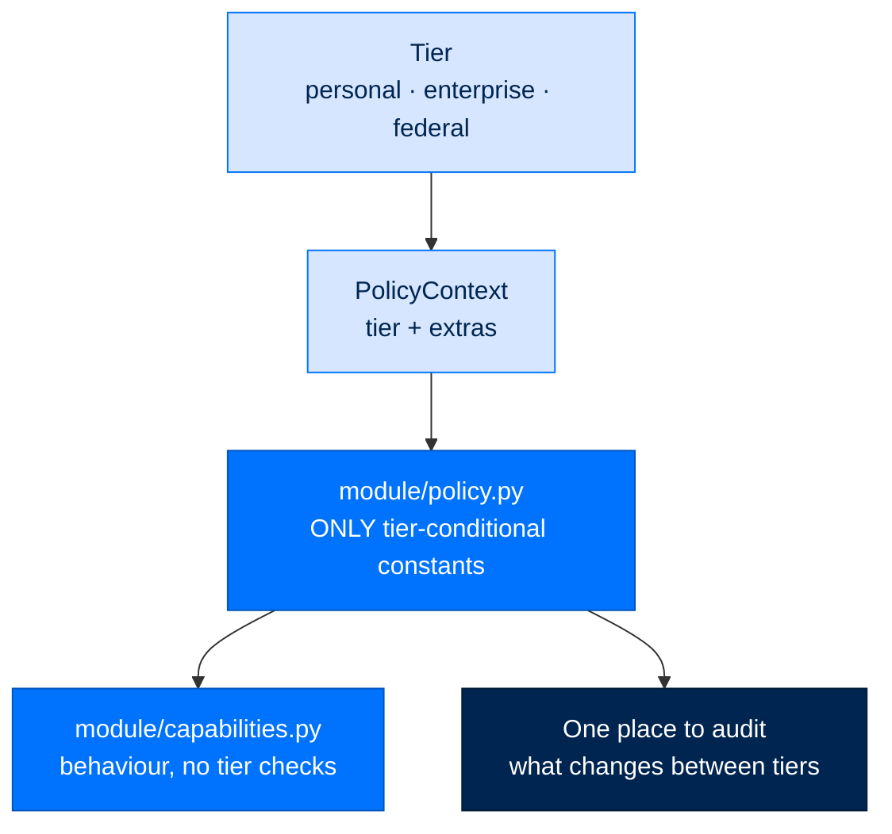

# Policy Modules — Uniform Tier Enforcement Pattern

> **Building with Arc**  ·  Build  ·  page 5 of 27  
> **For** Engineers writing code against Arc  
> [← Writing modules](modules.md)  ·  [Docs home](../README.md)  ·  [Testing →](testing.md)



## Rule

Every arcagent or arcrun module with tier-dependent behaviour MUST extract
a `policy.py` with pure functions. Business logic calls into policy;
it never branches on tier strings directly.

## Rationale

 found five different tier-enforcement idioms across six modules.
Scattered `if tier == "federal":` strings create:

- Untestable logic buried in business code
- Inconsistent enforcement (one module uses a bool, another a string, another
 an enum)
- Difficulty auditing what changes between tiers

The `policy.py` pattern solves all three.

## Shared Primitives

`arcagent.core.tier` provides the canonical type vocabulary:

```python
from arcagent.core.tier import PolicyContext, Tier

class Tier(StrEnum):
    FEDERAL = "federal"
    ENTERPRISE = "enterprise"
    PERSONAL = "personal"

@dataclass(frozen=True)
class PolicyContext:
    tier: Tier
    extras: dict[str, Any] = field(default_factory=dict)

    @property
    def is_federal(self) -> bool: ...
    @property
    def is_enterprise(self) -> bool: ...
    @property
    def is_personal(self) -> bool: ...
```

## What Goes in policy.py

A module's `policy.py` contains ONLY:

- Pure functions that return bool or a typed decision
- No I/O, no logging, no imports from business logic layers
- Full docstrings explaining federal vs. non-federal semantics

## Gold Standard: browser/policy.py

```python
# arcagent/modules/browser/policy.py

def effective_sandbox(tier: str, config: PlaywrightConfig) -> Literal["loose", "strict"]:
    if tier in _STRICT_BY_DEFAULT_TIERS:
        return "strict"
    return config.sandbox

def enforce_sandbox_policy(tier: str, config: PlaywrightConfig) -> None:
    sandbox = effective_sandbox(tier, config)
    if sandbox == "strict" and config.mode == "local":
        raise LocalBrowserNotAllowed(...)
```

- No strings scattered in the browser session code
- Policy tested independently of Playwright

## Applying the Pattern

### arcrun/backends/policy.py

```python
def allow_entry_points(tier: str) -> bool:
    return tier != "federal"

def require_manifest(tier: str) -> bool:
    return tier == "federal"
```

Loader calls these instead of `if tier == "federal":`.

### scheduler/nl_parser.py

```python
async def parse(text: str, user_tz: str, policy: PolicyContext) -> Schedule:
    ...
    if policy.tier == Tier.FEDERAL:
        raise ParseError("deterministic-only mode")
    ...
```

`PolicyContext` replaces the legacy `federal: bool` parameter.

## Modules That Must Follow This Pattern

| Module | Policy file | Status |
|--------|------------|--------|
| `browser` | `browser/policy.py` | Done (gold standard) |
| `scheduler/nl_parser` | uses `PolicyContext` | Done |
| `arcrun/backends/loader` | `backends/policy.py` | Done |

## What NOT to Do

```python
# BAD — string comparison buried in business logic
async def parse(text, user_tz, federal: bool):
    if federal:
        raise ParseError(...)

# BAD — same, with tier string
def load_backend(name, tier="personal"):
    if tier == "federal":
        ...
```

## Testing Policy Modules

Policy modules have zero external deps so they are trivially unit-testable:

```python
def test_federal_requires_manifest():
    assert policy.require_manifest("federal") is True
    assert policy.require_manifest("enterprise") is False
    assert policy.require_manifest("personal") is False
```
