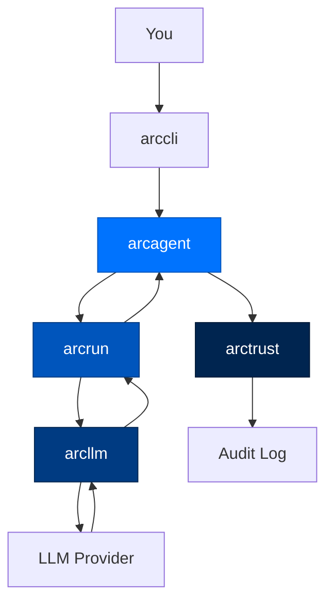

# Quickstart Guide

> **Building with Arc**  ·  Build  ·  page 1 of 27  
> **For** Engineers writing code against Arc  
> [Docs home](../README.md)  ·  [Setup →](setup.md)

---

## 🚀 Your First 30 Minutes

There are two supported starting points, and which one you want depends on whether you're evaluating Arc or developing on it.

### Fastest Path: Docker

Arc ships as a single container image that has already made the install decisions for you — `uv`, the NATS broker, the local embedding model, config wiring — baked in (`Dockerfile`, `deploy/entrypoint.sh`). This is the canonical single-node install path:

```bash
cp .env.example .env      # fill in ANTHROPIC_API_KEY at minimum
docker compose up -d
docker compose logs -f arc   # prints the dashboard URL with a viewer token
```

That's it — no separate `arc init`, no separate `arc agent create`. The container's entrypoint runs the wizard, scaffolds an agent, wires the gateway, mints viewer/operator tokens, and starts the dashboard on `:8420`, all against the persistent `/data` volume (`docker-compose.yml`). Restarting the container reuses the same agent, memory, and tokens instead of minting new ones.

### Developing on Arc: From Source

```bash
git clone https://github.com/joshuamschultz/Arc.git
cd Arc
uv sync --all-packages --all-groups          # installs every package in editable mode

arc init                        # tier wizard — pick personal/enterprise/federal
arc agent create my-agent --model anthropic/claude-sonnet-4-5-20250929
arc agent build my-agent --check   # validates config, workspace, DID, model reachability
arc agent chat my-agent            # talk to it
```

`arc agent build my-agent` (without `--check`) is destructive — it's the interactive scaffold and will rewrite `arcagent.toml`. Always pass `--check` to validate. To watch the agent run and message it from a browser instead of the terminal:

```bash
arc ui start --team-root ./team --show-tokens
```

Full command reference: [cli.md](../reference/cli.md). Full multi-node / production deploy path (systemd, secrets, remote chat platforms): [deploy/](../runbooks/deploy/docker.md).

---

## 🚀 5-Minute Agent Setup

This guide takes you from installation to your first agent conversation. For deeper understanding, read [Package Index](package-index.md) after completing this quickstart.

### Step 1: Install Arc

```bash
pip install arcmas
```

This installs the complete Arc stack as described in the [Package Index](package-index.md).

### Step 2: Configure (30 seconds)

```bash
# Interactive wizard
arc init

# Or non-interactive
arc init --tier personal --provider anthropic
```

Add your API key to `.env`:
```bash
echo 'ANTHROPIC_API_KEY=sk-ant-your-key-here' >> .env
```

### Step 3: Create Your First Agent

```bash
arc agent create my-agent --model anthropic/claude-sonnet-4-5-20250929
```

This creates the directory structure:
```
my-agent/
├── arcagent.toml            # Configuration
├── identity.md              # Agent identity card
├── capabilities/              # Tools and skills
└── workspace/
    ├── .capabilities/       # Agent-authored (untrusted)
    └── sessions/            # Conversation history
```

### Step 4: Validate the Setup

```bash
arc agent build my-agent --check
```

### Step 5: Chat with Your Agent

```bash
arc agent chat my-agent
```

Type your message and press Enter. Try:
```
> Summarize the files in the current directory.
```

---

## 🧠 What "Asking It Something" Actually Does

When you send a task to your agent, here's the sequence that unfolds:

```mermaid
sequenceDiagram
    participant You
    participant Loop as arcrun (loop)
    participant Model as arcllm (model)
    participant Tool as a tool
    participant Log as arctrust (audit log)

    You->>Loop: "Summarize workspace/reports/"
    Loop->>Model: turn 1 — here's the task
    Model-->>Loop: "I should read the files first"
    Loop->>Tool: read_file(...)
    Tool-->>Loop: file contents
    Loop->>Log: audit event — tool call + result
    Loop->>Model: turn 2 — here's what the tool returned
    Model-->>Loop: final answer
    Loop->>Log: audit event — turn complete
    Loop-->>You: answer
    Note over Log: every arrow above also left a durable,<br/>signed record — the "receipts"
```

Nothing about the answer you get back is special — it's the same question-and-answer experience as any chat tool. What's different is that every step that produced it left a receipt, on disk, the moment it happened, independent of the answer you eventually saw.

---

## 🏃 One-Shot Tasks

Run a single task without interactive chat:

```bash
arc agent run my-agent "Read the CSV files in workspace/data/ and summarize the trends"
```

With JSON output:
```bash
arc agent run my-agent "List all Python files" --json
```

---

## 📊 Watch It Run

### Start the Dashboard

```bash
arc ui start --show-tokens
```

Open the printed URL in your browser. You'll see:
- Live LLM calls in the Observe tab
- Memory and knowledge views
- Task management
- Agent capabilities

### Stream Events

```bash
arc ui tail --viewer-token <token> --layer llm
```

---

## 🧩 Create Capabilities

### Add a Tool

```bash
# Create a new capability file
arc ext create web-search

# Edit the file
code my-agent/capabilities/web_search.py
```

```python
from arcagent.tools._decorator import tool

@tool(
    name="web_search",
    description="Search the web for current information.",
    classification="read_only",
    version="1.0.0",
)
async def web_search(query: str) -> str:
    # Your implementation
    return f"Search results for: {query}"
```

### Add a Skill

```bash
arc skill create data-analysis
```

```markdown
---
name: data-analysis
version: 1.0.0
description: Analyze CSV files for trends and anomalies.
triggers: [csv, analysis, data]
required_tools: [read_file, bash]
---

# Data Analysis Skill

## When to Use
When the user needs to analyze tabular data...

## Steps
1. Read the CSV file
2. Identify column types
3. Calculate basic statistics
4. Report anomalies
```

---

## 👥 Stand Up a Team

### Create Multiple Agents

```bash
for name in analyst researcher writer; do
    arc agent create "$name" --model anthropic/claude-sonnet-4-5-20250929
done
```

### Initialize Team Messaging

```bash
arc team init
arc team create content-team --channel main --members "analyst,researcher,writer"
```

### Start Team Dashboard

```bash
arc ui start --team-root ./agents --show-tokens
```

---

## 📋 Common Commands Cheat Sheet

```bash
# Setup
arc init                           # Interactive setup
arc init --quick                   # Quick personal setup

# Agent lifecycle
arc agent create NAME                # Create new agent
arc agent build NAME --check         # Validate (always use --check)
arc agent chat NAME                  # Interactive chat
arc agent run NAME "task"            # One-shot task
arc agent serve NAME                 # Long-running daemon

# Inspection
arc agent status NAME                # DID, model, counts
arc agent tools NAME                 # Available tools
arc agent skills NAME                # Available skills
arc agent sessions NAME              # Past conversations

# LLM
arc llm providers                  # Configured providers
arc llm models --tools               # Models with tool support
arc llm validate                     # Test connectivity

# Skills & capabilities
arc skill list                       # All skills
arc skill create NAME                # Scaffold new skill
arc skill validate PATH                # Validate skill
arc ext list                         # All capabilities
arc ext create NAME                  # Scaffold new capability

# Dashboard
arc ui start                         # Start dashboard
arc ui tail --viewer-token TOKEN     # Stream events
```

---

## 📱 In-Chat Commands

While in `arc agent chat`:

| Command | Purpose |
|---------|---------|
| `/help` | Show available commands |
| `/tools` | List available tools |
| `/skills` | List available skills |
| `/sessions` | List past sessions |
| `/switch <id>` | Resume a session |
| `/cost` | Show running cost |
| `/reload` | Reload capabilities |
| `/quit` | Exit chat |

---

## 🐍 Python API Example

```python
import asyncio
from pathlib import Path

from arcagent.core.agent import ArcAgent
from arcagent.core.config import load_config

CONFIG = Path("my-agent/arcagent.toml")

async def main():
    # Load configuration
    config = load_config(CONFIG)

    # Create agent (requires valid DID)
    agent = ArcAgent(config, config_path=CONFIG)
    
    # Initialize
    await agent.startup()
    
    # Run a task
    result = await agent.run(
        "Analyze the sentiment of reviews in workspace/data/"
    )
    
    print(f"Answer: {result.content}")
    print(f"Turns: {result.turns}")
    print(f"Cost: ${result.cost_usd:.4f}")
    
    # Multi-turn chat
    reply = await agent.chat("Now extract the key themes.")
    print(reply.content)
    
    # Shutdown
    await agent.shutdown()

asyncio.run(main())
```

---

## 🚢 Production Deployment

### Single Node (Docker)

```bash
# Copy and edit environment
cp .env.example .env
# Edit .env with your keys

# Start everything
docker compose up -d

# View logs
docker compose logs -f arc
```

### Systemd Service

```bash
# Install
sudo cp deploy/arc-agent.service /etc/systemd/system/
sudo systemctl daemon-reload
sudo systemctl enable arc-agent
sudo systemctl start arc-agent
```

---

## 🔍 What Just Happened?

When you ran `arc agent run my-agent "task"`:



1. **You** send a task to the CLI
2. **arccli** loads the agent configuration
3. **arcagent** initializes with identity and capabilities
4. **arcrun** runs the think-act-observe loop
5. **arcllm** calls the LLM provider
6. **arctrust** writes the audit trail

Every step is logged and attributable.

---

## Next Steps

- [Blueprints](../blueprints/blueprints.md) - Use preset configurations
- [Security Model](../reference/security.md) - Learn about the security guarantees
- [Package Index](package-index.md) - Explore all packages
- [Data Flow](../walkthrough/data-flows.md) - Understand how data moves through Arc