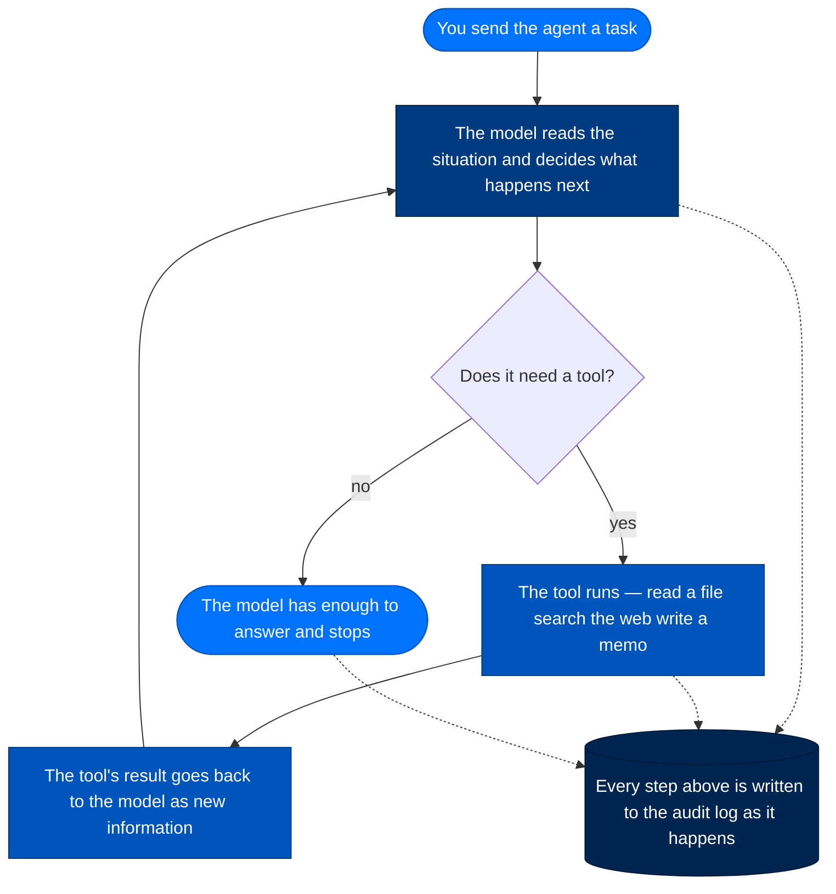
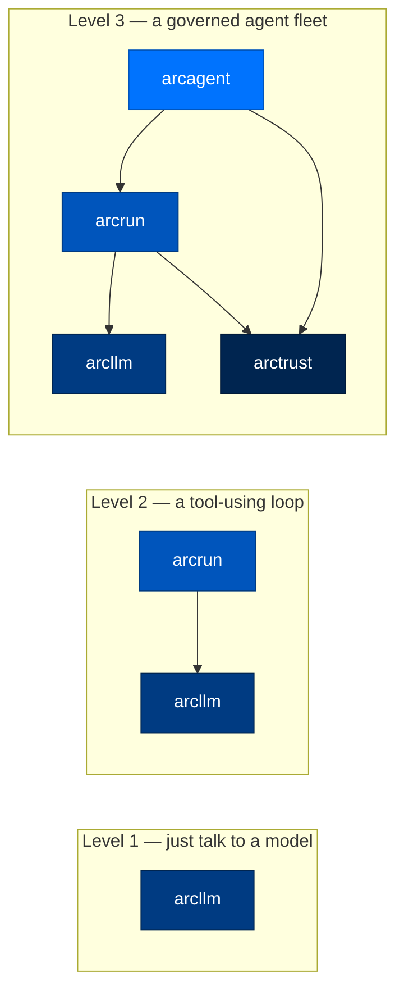

# Setup and Configuration Guide

> **Building with Arc**  ·  Build  ·  page 2 of 27  
> **For** Engineers writing code against Arc  
> [← Quickstart](quickstart.md)  ·  [Docs home](../README.md)  ·  [Implementation guides →](implementation-guides.md)

---

## In One Breath

Arc is a toolkit for building AI agents — programs that can read information, decide what to do, and take actions like a junior employee would — for places that cannot just take an AI vendor's word that everything is fine. A bank, a hospital, a national lab. Every agent gets its own cryptographic ID card, every tool it uses has to be explicitly permitted, and every action it takes is written to a tamper-evident logbook, the same way an accountant's ledger is built so that nobody — including the accountant — can quietly erase an entry. You do not have to take Arc's word for what an agent did; you can read the receipts. That is the entire pitch, and everything else in this repository is in service of it.

---

## What Arc Actually Is

Arc is a stack of small Python packages (`packages/arcllm`, `packages/arcrun`, `packages/arcagent`, `packages/arctrust`, and others) that compose into whatever you need: a plain LLM client, a tool-using agent loop, or a whole fleet of agents talking to each other under one identity-and-audit system. Nobody ships Arc as a hosted product you sign up for — you install the packages you need, into your own infrastructure, and you own everything it writes.

The "audit trail" analogy is worth sitting with, because it explains most of the design decisions elsewhere in this doc set: a bank doesn't just trust that a teller did the right thing, it keeps a signed transaction log so an auditor can reconstruct exactly what happened, when, and who authorized it, without needing to trust the teller's memory. Arc treats an AI agent the same way. The agent is not asked to self-report what it did — every tool call, every model call, every file it read is written to a durable, append-only, cryptographically signed record (packages/arctrust) *as it happens*, independent of whether anyone is watching. If the agent tries to lie about what it did, or something tries to tamper with the log after the fact, the record doesn't add up.

---

## What an "Agent" Actually Is Here

"Agent" gets used loosely across the industry. In Arc it is a concrete, five-part thing, built by `arc agent create` (packages/arccli):

| Part | What it is | Where it lives |
|---|---|---|
| Identity | An Ed25519 keypair and a DID string (`did:arc:{org}:{type}/{hash}`) — the agent's ID card | `packages/arctrust/src/arctrust/identity.py` |
| System prompt | An `identity.md` file describing who the agent is and what it's for — read-only to the agent itself | `<agent>/identity.md` |
| Tools | Functions the agent is explicitly allowed to call (read a file, run a search, send a message) | `<agent>/capabilities/`, `packages/arcagent/src/arcagent/core/tool_registry.py` |
| Skills | Bundled how-to instructions the agent loads when a task matches | `<agent>/capabilities/`, `packages/arcskill/` |
| Memory | What the agent remembers between conversations | `<agent>/workspace/memory/`, `packages/arcmemory/` (when configured as the agent's brain) |
| The loop | The thing that actually runs a turn — reads the situation, asks the model what to do next, carries out the answer | `packages/arcrun/` |

None of those five parts do anything by themselves. What makes an agent *run* is the loop, and the loop is boring on purpose:



In plain words: the model looks at what you asked and everything that has happened so far in the conversation, and decides either "I need to use a tool" or "I'm done, here's my answer." If it needs a tool, the tool runs, the result gets handed back to the model as new information, and the cycle repeats. This is sometimes called a "ReAct loop" (Reason, Act) in the literature; Arc's implementation of it is `packages/arcrun`. Nothing about this loop is agent-specific — `arcrun` doesn't know what a "skill" or "memory" is, it just calls the model and dispatches whatever tools it was handed (see Package Index for the layering rule this enforces).

---

## The Thesis: Four Security Guarantees

> 🛡️ Every LLM call attributable. Every tool call authorized. Every action audited. Every byte traceable.

Four clauses, four separate guarantees, four separate failure modes if you drop one:

| Guarantee | What it means | What goes wrong without it |
|---|---|---|
| **Every LLM call attributable** | Every request to a model carries the calling agent's identity and, optionally, a cryptographic signature | Without it, you can't tell *which* agent (or which compromised copy of an agent) made a given model call — every agent looks the same in the logs, so a rogue or hijacked agent is indistinguishable from a legitimate one |
| **Every tool call authorized** | A tool call is checked against a deny-by-default policy — not just "can this agent use this tool" but "with these exact arguments" | Without it, a prompt-injected agent that decides to "just call `delete_file`" simply... calls it. There's no gate between "the model wants to" and "it happens" |
| **Every action audited** | Every operation emits a structured, append-only event to a signed log, independent of whether the operation succeeded | Without it, you're relying on the agent (or its logs, which the agent could theoretically have touched) to accurately report its own behavior after the fact — exactly the "trust the teller's memory" problem the audit trail exists to solve |
| **Every byte traceable** | Every message, tool result, and memory write can be traced back to the specific call that produced it | Without it, an incident response team can see *that* something bad happened but not reconstruct the exact sequence that caused it — the difference between "we got breached" and "we got breached, and here's the transcript" |

These four are not a federal-only feature set. They are structural to every Arc agent, at every tier.

---

## Tiers: Stringency, Not a Gate

This is the single most common misreading of Arc, so it's worth being blunt: **the tier is not a switch that turns security on.** It's a dial that decides *how strict* security is. Every tier — personal included — identifies every agent, verifies every loaded artifact, authorizes every tool call through a policy pipeline, and audits every action. There is no tier where any of that is skipped.

What the tier *does* change is how much stringency is layered on top of that same floor — how many policy layers run, whether dynamic tool creation is allowed at all, what crypto is required, how hard the turn budget caps out:

| Knob | Personal | Enterprise | Federal |
|---|---|---|---|
| Policy layers that run | Identity + Global (2) | + Classification, Provider, Agent, Sandbox (6) | + Team (7, all layers) |
| Dynamic tool creation | allowed | approval-gated | denied |
| Signed artifacts | self-signed OK (audited) | operator-chain | operator-chain, FIPS |
| Code execution sandbox | Docker (opt down to bare subprocess) | Docker container floor | Firecracker microVM |
| OpenTelemetry export | off | off | on (OTLP) |

Every row is a "how strict," never a "whether." A personal-tier agent still has a DID, still has its tool calls checked against a policy, still writes an audit trail — it just runs fewer policy layers and accepts a self-signed skill bundle where federal would reject it outright.

---

## Pick How Much You Need

Each package is independently installable, and Arc is deliberately usable at three different depths depending on what you're building:



| Level | Install | You get | You don't get |
|---|---|---|---|
| 1 | `pip install arcllm` | One interface to 16 LLM providers over direct HTTP, no vendor SDKs, PII redaction, request signing | No agent, no tools, no loop — you drive the calls yourself |
| 2 | `pip install arcrun` (pulls in `arcllm`) | A model-decides-then-acts loop that dispatches tools you hand it | No identity, no persistent skills/memory, no policy pipeline — `arcrun` doesn't know what an "agent" is |
| 3 | `pip install arc-agent` or `pip install arcmas` | The full agent — identity, tools, skills, memory, the deny-by-default policy pipeline, the audit trail | Nothing — this is the whole stack |

---

## Installation

### Option 1: Full Stack (Recommended)

```bash
pip install arcmas
```

This installs the complete Arc stack:
- `arccli` - Command-line interface
- `arctui` - Terminal UI
- `arcagent` - Agent framework
- `arcrun` - Execution loop
- `arcllm` - LLM client
- `arctrust` - Security primitives
- `arcstore` - Storage backend
- `arcmemory` - Memory system
- `arcskill` - Skill hub

### Option 2: Individual Packages

Install only what you need based on the layered architecture:

| Layer | Package | Install Command |
|-------|---------|----------------|
| Foundation | `arctrust` | `pip install arctrust` |
| Foundation | `arcstore` | `pip install arcstore` |
| LLM | `arcllm` | `pip install arcllm` |
| Runtime | `arcrun` | `pip install arcrun` |
| Agent | `arcagent` | `pip install arc-agent` |
| Surface | `arcgateway` | `pip install arcgateway` |
| Surface | `arcui` | `pip install arcui` |
| Entry | `arccli` | `pip install arccli` |

### Option 3: Development from Source

```bash
git clone https://github.com/joshuamschultz/Arc.git
cd Arc
uv sync --all-packages --all-groups
```

`uv sync --all-packages` installs every package in editable mode plus the default dependency group, resolving them all against the single lockfile — a change in `packages/arcllm` is immediately visible to `packages/arcagent` without a reinstall. Add `--all-groups` to also pull in `dev` (ruff, mypy, pytest, pip-audit) and `test` extras.

---

## System Requirements

| Requirement | Minimum | Recommended |
|-------------|---------|-------------|
| Python | 3.11+ | 3.12+ |
| OS | Linux / macOS / Windows | Linux (for full sandbox support) |
| Memory | 512 MB | 2 GB+ |
| Docker | Optional | Required (for code execution sandbox) |
| KVM | Optional | Required (for Federal tier VM isolation) |

---

## Initial Configuration

### Step 1: Run the Setup Wizard

```bash
arc init
```

The wizard asks:
1. **Tier selection** - `personal`, `enterprise`, or `federal`
2. **Provider selection** - Which LLM provider(s) to configure
3. **API key configuration** - How to provide credentials

### Step 2: Configure API Keys

#### Option A: Environment Variables

Add to your `.env` file or shell environment:

```bash
# Required (at least one)
ANTHROPIC_API_KEY=sk-ant-...
OPENAI_API_KEY=sk-...
GOOGLE_API_KEY=...
COHERE_API_KEY=...
MISTRAL_API_KEY=...
GROQ_API_KEY=...
DEEPSEEK_API_KEY=...
TOGETHER_API_KEY=...
FIREWORKS_API_KEY=...
OPENROUTER_API_KEY=...
NVIDIA_API_KEY=...
XAI_API_KEY=...
MOONSHOT_API_KEY=...
HF_API_KEY=...

# Optional: Vault for secret management
VAULT_ADDR=https://vault.example.com
VAULT_TOKEN=...
```

#### Option B: Vault Integration

```toml
# ~/.arc/config/arcllm.toml
[vault]
backend = "https://vault.example.com"
token_path = "secret/arc/api-keys"
ttl_seconds = 300
```

#### Option C: Per-Provider Configuration

Create `~/.arc/config/providers/<provider>.toml`:

```toml
[provider]
name = "anthropic"
base_url = "https://api.anthropic.com/v1"
api_key_env = "ANTHROPIC_API_KEY"

[[models]]
id = "claude-sonnet-4-5-20250929"
context_window = 200000
max_output = 8192
supports_tools = true
supports_vision = true
input_price_per_1m = 3.00
output_price_per_1m = 15.00
```

---

## Tier Configuration

### Personal Tier

```bash
arc init --tier personal
```

**Features:**
- Basic telemetry off
- Audit logging optional
- Docker sandbox (can relax to local subprocess)
- Self-signed skill bundles allowed
- Dynamic tool creation allowed with `auto_run_agent_code = true`

**Configuration:**
```toml
[security]
tier = "personal"

[security.validators]
auto_run_agent_code = true
```

### Enterprise Tier

```bash
arc init --tier enterprise
```

**Features:**
- Telemetry enabled
- Audit logging enabled
- Docker sandbox required
- Sigstore signing required
- Operator approval for dynamic tools

**Configuration:**
```toml
[security]
tier = "enterprise"

[security.validators]
auto_run_agent_code = false
```

### Federal Tier

```bash
arc init --tier federal
```

**Features:**
- All enterprise features
- OpenTelemetry export enabled
- PII redaction enabled
- Firecracker microVM isolation (requires `/dev/kvm`)
- FIPS-validated cryptography (ECDSA-P256)
- Vault transit signing required

**Configuration:**
```toml
[security]
tier = "federal"
require_fips = true

[security.validators]
auto_run_agent_code = false

[vault]
backend = "https://vault.example.com"
```

---

## Configuration System

Arc's configuration system merges settings from three sources with this precedence (lowest to highest):

1. **Built-in defaults** (`packages/arccli/src/arccli/commands/agent/_common.py:319-367`)
2. **Tier templates** (`packages/arcagent/src/arcagent/tiers.py:13-29`) — keyed by `[vault].cache_ttl_seconds`
3. **Environment overrides** — `ARC_*` variables

### Three-File Configuration

An agent's configuration lives in three sibling TOML files:

```
my-agent/
├── arcagent.toml    # Agent identity, tools, skills, security
├── arcllm.toml      # Provider/model selection, rate limits, budgets
└── arcrun.toml      # Sandbox settings, turn limits, timeouts
```

These files are merged at runtime by `ArcAgentConfig` (`packages/arcagent/src/arcagent/core/config.py`) into a single configuration surface. The merge is deep — nested tables are combined, not replaced — so a tier can override only the security section while leaving the rest untouched.

### Vault Resolution

Two resolver classes handle secrets:

- **`arctrust.vault.VaultResolver`** resolves arbitrary secrets via `resolve(secret_path)`, keyed by `[vault].cache_ttl_seconds`.
- **`arcllm.vault.VaultResolver`** resolves *provider API keys* specifically, via `resolve_api_key(api_key_env, vault_path)`. Backend class references are restricted to an allowlist of module prefixes (`arcllm.`, `arcagent.`, `arcvault.`) so a TOML-supplied backend string can't import arbitrary code.

Both resolvers are TTL-cached (`cache_ttl_seconds`, default 300s) so a live vault isn't hit on every single secret read — a real availability concern given federal treats the vault as mandatory.

---

## CLI Commands for Configuration

| Command | Effect |
|---|---|
| `arc agent create <name> [--tier T] [--model M]` | Scaffolds all three sibling files + workspace + a signed calculator capability + mints the agent's DID + best-effort registers with arcteam |
| `arc agent build [path]` | Renders the full config surface. If `arcagent.toml` **doesn't exist yet**, writes it (nothing to lose). If it **already exists**, refuses and exits 1 unless `--force` is given |
| `arc agent build [path] --force` | ⚠️ **Regenerates `arcagent.toml` from the current template.** DID and agent name are preserved; every other hand-edited value is replaced with the template default. `arcllm.toml`/`arcrun.toml` are never touched either way |
| `arc agent build [path] --check` | **Validate only — writes nothing.** Confirms `arcagent.toml` parses, checks for an API key matching the configured provider, lists discovered tools and available strategies |

> **Always reach for `--check` first.** The safe way to "run build" on an agent you care about is `arc agent build <path> --check`. Only add `--force` when you deliberately want the full config surface regenerated from defaults — treat it the same as you would `git reset --hard`: a destructive operation you confirm, not one you run out of habit.

`arc agent create --tier` sets the tier for **every subsystem at once** — `[security]`, memory, policy, skills, web, voice, and browser all render from the same `tier` template variable. A config that's federal in `[security]` but personal in `[modules.web]` is treated as a hole, not a preference — the renderer refuses an unknown tier string outright (`ValueError`) rather than partially applying one.

---

## Directory Structure

After installation, Arc uses these directories:

```
~/.arc/
├── config/
│   ├── arcllm.toml              # LLM configuration
│   ├── arcagent.toml            # Agent defaults
│   └── providers/               # Provider configs
├── keys/                        # Agent keypairs (0600 permissions)
├── capabilities/                # Global capabilities
├── skills/                      # Installed skills
├── blueprints/                  # User blueprints
├── team/                        # Team data
└── trust/
    ├── operators/               # Operator public keys
    └── issuers/                 # Skill issuer public keys

workspace/
├── sessions/                    # Session transcripts
├── memory/                      # Memory index
├── tasks/                       # Task store
└── .capabilities/               # Agent-authored (untrusted)
```

---

## Docker Deployment

### Quick Start with Docker

```bash
cp .env.example .env      # Fill in API keys
docker compose up -d
docker compose logs -f arc
```

### Custom Docker Configuration

```yaml
# docker-compose.yml
services:
  arc:
    build: .
    volumes:
      - ./data:/data
      - ./.env:/app/.env:ro
    environment:
      - ANTHROPIC_API_KEY=${ANTHROPIC_API_KEY}
    ports:
      - "8420:8420"
```

### Building the Docker Image

```bash
docker build -t arc:latest .
```

---

## Air-Gapped / On-Premises Setup

### Ollama (Local Models)

```bash
# Install Ollama
curl -fsSL https://ollama.com/install.sh | sh

# Pull a model
ollama pull llama3.2:latest

# Configure Arc
arc init --tier personal --provider ollama
```

Configuration:
```toml
[provider]
name = "ollama"
base_url = "http://localhost:11434"
api_key_env = "OLLAMA_API_KEY"  # Optional for local

[[models]]
id = "llama3.2:latest"
context_window = 8192
supports_tools = true
```

### vLLM (GPU Serving)

```bash
# Start vLLM server
python -m vllm.entrypoints.openai.api_server \
  --model meta-llama/Llama-3.1-8B-Instruct \
  --port 8000

# Configure Arc
arc init --tier personal --provider vllm
```

Configuration:
```toml
[provider]
name = "vllm"
base_url = "http://localhost:8000/v1"

[[models]]
id = "meta-llama/Llama-3.1-8B-Instruct"
context_window = 8192
supports_tools = true
```

### HuggingFace TGI

```bash
# Start TGI server
docker run -p 8080:80 ghcr.io/huggingface/text-generation-inference:2.0 \
  --model-id meta-llama/Meta-Llama-3.1-8B-Instruct

# Configure Arc
arc init --tier personal --provider huggingface
```

---

## Verification

### Check Installation

```bash
arc version
arc llm providers
arc llm validate
```

### Validate Configuration

```bash
arc agent build --check /path/to/agent
```

---

## Troubleshooting

### Common Issues

| Issue | Solution |
|-------|----------|
| `ModuleNotFoundError` | Run `uv sync --all-packages` from repo root |
| `ANTHROPIC_API_KEY not found` | Set in `.env` or environment |
| `Permission denied` on key files | Ensure files have `0600` permissions |
| Docker sandbox fails | Ensure Docker is running |
| KVM not available | Federal tier requires `/dev/kvm` access |

### Debug Mode

```bash
export ARC_DEBUG=1
arc agent chat my-agent --verbose
```

---

## Next Steps

- [Quick Start Guide](quickstart.md) - Create your first agent
- [Blueprints](../blueprints/blueprints.md) - Use preset configurations
- [Security Model](../reference/security.md) - Understand security features
- [Package Index](package-index.md) - Explore all packages