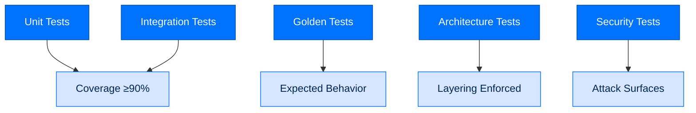

# Testing and Quality Assurance

> **Building with Arc**  ·  Build  ·  page 6 of 27  
> **For** Engineers writing code against Arc  
> [← Policy modules](policy-modules.md)  ·  [Docs home](../README.md)  ·  [Performance →](performance.md)

---

## Testing Philosophy

Arc follows these testing principles:
- **100% type coverage** - Strict mypy everywhere
- **90%+ code coverage** - Per-package minimum
- **Golden tests** - Expected behavior verification
- **Architecture tests** - Layering constraint enforcement
- **Security tests** - Attack surface validation



---

## Test Categories

### Unit Tests

```python
# packages/arctrust/tests/test_identity.py
from arctrust import generate_did, generate_keypair, sign, validate_did, verify

def test_did_generation():
    kp = generate_keypair()
    did = generate_did(kp.public_key)
    assert did.startswith("did:key:")
    assert validate_did(did)

def test_signature_verification():
    kp = generate_keypair()
    signature = sign(kp, b"test message")
    assert verify(kp.public_key, b"test message", signature)
    assert not verify(kp.public_key, b"wrong message", signature)
```

### Integration Tests

```python
# packages/arcagent/tests/test_integration.py
import pytest
from arcagent.core.agent import ArcAgent

@pytest.mark.asyncio
async def test_full_turn():
    config = load_test_config()
    agent = ArcAgent(config)
    await agent.startup()
    try:
        result = await agent.run_collected("Say hello")
        assert "hello" in result.lower()
    finally:
        await agent.shutdown()
```

### Golden Tests

```python
# packages/arcskill/tests/test_improvement.py
from arcskill.improver import evalgate

def test_skill_improvement():
    # Golden test - known input/output
    trace = load_golden_trace("failing_analysis_trace.json")
    proposal = improve(skill, [trace])

    # A proposal only lands if it clears the eval gate
    assert evalgate.passes(proposal)
```

### Architecture Tests

```python
# tests/architecture/test_layering.py
import ast
import pytest

def test_no_arcagent_imports_arcgateway():
    """arcagent must not import arcgateway."""
    for file in find_python_files("packages/arcagent"):
        tree = ast.parse(file.read_text())
        for node in ast.walk(tree):
            if isinstance(node, ast.ImportFrom):
                assert "arcgateway" not in node.module
```

---

## Running Tests

### All Tests

```bash
# Run everything
uv run pytest tests/

# With coverage
uv run pytest --cov=packages --cov-report=html tests/

# Parallel
uv run pytest -n auto tests/
```

### Package-Specific

```bash
# Single package
uv run pytest packages/arctrust/tests/

# With verbose output
uv run pytest packages/arctrust/tests/ -v

# With coverage
uv run pytest packages/arctrust/tests/ --cov=packages/arctrust
```

### Specific Tests

```bash
# By name
uv run pytest packages/arctrust/tests/test_did.py::test_did_generation

# By marker
uv run pytest -m "slow" tests/
uv run pytest -m "not slow" tests/
```

---

## Test Fixtures

### Agent Fixture

```python
# tests/conftest.py
import pytest
from pathlib import Path

@pytest.fixture
def test_agent(tmp_path: Path) -> Path:
    """Create test agent."""
    agent_path = tmp_path / "test-agent"
    agent_path.mkdir()
    
    (agent_path / "arcagent.toml").write_text("""
[model]
provider = "anthropic"
id = "claude-sonnet-4-5-20250929"

[security]
tier = "personal"
""")
    
    (agent_path / "identity.md").write_text("# Test Agent")
    
    return agent_path
```

### Mock LLM

```python
@pytest.fixture
def mock_llm():
    """Mock LLM for testing."""
    class MockLLM:
        async def chat(self, messages):
            return {
                "content": "Mock response",
                "tool_calls": [],
                "usage": {"total_tokens": 100}
            }
    return MockLLM()
```

---

## Quality Gates

### Fleet-boundary checks

For a change at the ArcTeam/ArcAgent/ArcMemory seam, run the relevant package
suite plus the architecture and adversarial checks named in
[Fleet layering and removable composition](../concepts/fleet-layering.md).
The checks must prove that an ArcAgent starts without ArcTeam, composition
attaches/reloads/removes only authorized member tools, and unavailable ArcMemory
collection mechanics return a typed degraded result instead of an import failure.
AgentMail transport tests do not prove production worker, UI, or CLI integration.

### Coverage Requirements

| Package | Minimum Coverage |
|---------|------------------|
| arctrust | 90% |
| arcstore | 85% |
| arcllm | 90% |
| arcagent | 85% |
| arcskill | 90% |
| arcteam | 85% |

### Type Checking

```bash
# Must pass strict mypy
uv run mypy --strict packages/arctrust
uv run mypy --strict packages/arcagent
```

### Linting

```bash
# Must pass ruff
uv run ruff check packages/
```

---

## Security Testing

### Capability Security

```python
def test_capability_sandbox():
    """Test capability runs in sandbox."""
    from arcrun.sandbox import Sandbox

    # The sandbox gates which tools a run may call at all.
    sandbox = Sandbox(allowed_tools=["read"])
    allowed, reason = await sandbox.check("bash", {"command": "curl example.com"})

    assert not allowed
    assert reason
```

### Signature Verification

```python
def test_skill_signature_verification():
    """Test skill signature verification."""
    from arcskill.hub import SignatureInvalid, dry_run

    with pytest.raises(SignatureInvalid):
        dry_run("unsigned_skill.zip")
```

### Lethal Trifecta Detection

```python
def test_lethal_trifecta_blocked():
    """Test trifecta detection."""
    from arctrust.policy import PolicyContext, ToolCall, build_pipeline

    pipeline = build_pipeline(tier="enterprise")

    # All three legs resolved on one call -> the gate must fire.
    ctx = PolicyContext(
        tier="enterprise",
        trifecta_legs={"private_data", "external_comms", "untrusted_input"},
    )
    decision = pipeline.evaluate(ToolCall(name="send_email", args={}), ctx)

    assert not decision.allowed
```

---

## Test Infrastructure

### Test Directories

```
tests/
├── architecture/          # Layering tests
│   ├── test_layering.py
│   └── test_dependencies.py
├── integration/           # Integration tests
│   ├── test_agent_flow.py
│   └── test_team_flow.py
├── security/              # Security tests
│   ├── test_capabilities.py
│   └── test_signatures.py
├── golden/                # Golden test fixtures
│   ├── traces/
│   └── skills/
└── conftest.py            # Shared fixtures
```

### CI Configuration

```yaml
# .github/workflows/test.yml
name: Tests
on: [push, pull_request]

jobs:
  test:
    runs-on: ubuntu-latest
    steps:
    - uses: actions/checkout@v4
    - uses: astral-sh/setup-uv@v3
    - run: uv sync --all-packages
    - run: uv run pytest --cov=packages
    - run: uv run mypy --strict packages/
    - run: uv run ruff check packages/
```

---

## Writing Good Tests

### Arrange-Act-Assert Pattern

```python
def test_my_feature():
    # Arrange
    config = create_test_config()
    input_data = {"key": "value"}
    
    # Act
    result = my_function(input_data, config)
    
    # Assert
    assert result.success
    assert result.value == "expected"
```

### Async Tests

```python
@pytest.mark.asyncio
async def test_async_operation():
    result = await async_function()
    assert result is not None
```

### Parametrized Tests

```python
@pytest.mark.parametrize("input,expected", [
    ("hello", "HELLO"),
    ("world", "WORLD"),
])
def test_transform(input, expected):
    assert transform(input) == expected
```

---

## Next Steps

- [PERFORMANCE](performance.md) - Performance testing
- [Package Index](package-index.md) - Package documentation
