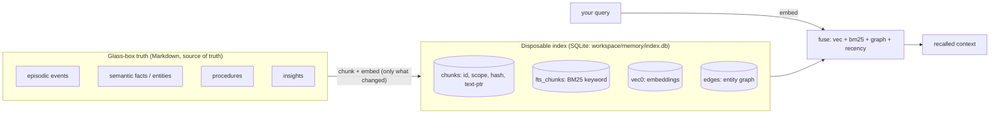
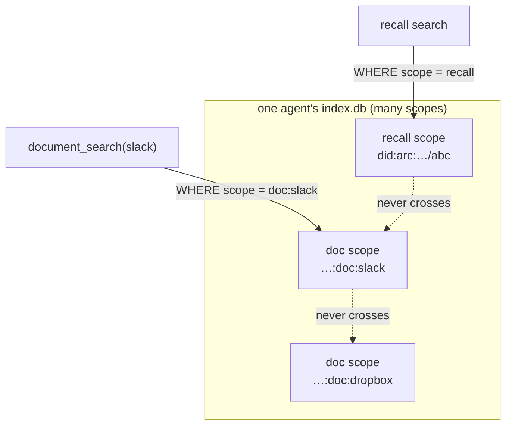

# Memory, the Index, and Scope — How an Agent Remembers

> **Concepts**  ·  Understand  ·  what the agent stores, how it searches, and what keeps one agent's memory out of another's
> [Docs home](../README.md)  ·  [7. The Memory Lifecycle](../walkthrough/07-memory-lifecycle.md)  ·  [arcmemory package](../building/packages/arcmemory.md)

---

## In one breath

An Arc agent's memory is **two layers that never disagree**: a pile of plain
Markdown files that are the *truth*, and a throwaway SQLite database that is a
fast *index* over them. You can read the truth with your eyes. The index can be
deleted at any time and rebuilt from the truth. Memory is never a black box —
every fact, every remembered turn, is a file you can open.

Search is the other half. When the agent needs context it turns your *query*
into a vector and looks for the past text closest to it, fused with keyword and
graph and recency signals. The thing that keeps this safe on a shared box is
**scope**: every stored chunk is stamped with whose memory it is, and every
search is filtered to exactly one scope, so one agent — or one connected
source — can never surface another's content.

This page explains the pieces, shows the data flow, and is honest about the
failure modes and the threat surface, because a memory you cannot inspect is a
memory you cannot trust.

---

## The two layers



**Layer 1 — the Markdown is the truth.** Under an agent's
`workspace/memory/` live human-readable files: an episodic event stream (what
happened), semantic entity files (facts, with `[[wiki-links]]` between them),
procedures, and distilled insights. These are what the agent actually knows.
They are additive — a changed fact leaves a `was:` trail rather than
overwriting — so the record is auditable.

**Layer 2 — the SQLite index is disposable.** `workspace/memory/index.db` is a
derived cache: it makes search fast, and it can be wiped and rebuilt from the
Markdown with no loss. If the index and the files ever disagree, the files win.
This is why memory can "degrade" gracefully (see below) instead of breaking.

---

## What lives in the index

One SQLite file per agent workspace — *hard shared-nothing isolation*, one agent
per database. Inside it, a handful of tables (`packages/arcmemory/src/arcmemory/index/backend.py`):

| Table | Holds | Scope column? |
|---|---|---|
| `chunks` | one row per indexed chunk: `chunk_id` (PK), **`scope`**, source path, mtime, classification, **`content_hash`**, text | yes |
| `fts_chunks` | FTS5 keyword (BM25) index of chunk text | yes |
| `vec0` | the embedding vector per chunk (`sqlite-vec`) | **no** — see isolation below |
| `edges` | the entity graph (spreading-activation links) | yes |
| `insight_trigger` | abstraction-space vectors that fire insights | yes |
| `episodic` | the raw event stream | yes |

The `content_hash` on `chunks` is load-bearing: it is how incremental indexing
knows a card has **not** changed and can skip re-embedding it. If `chunks` is
empty, every card looks new — which is exactly the failure that made an agent
re-embed its whole corpus on every lookup (see *Failure modes*).

---

## Scope — the one thing that keeps memory safe

A **scope** names whose memory a chunk belongs to. It is a small key
(`packages/arcmemory/src/arcmemory/types.py`, `Scope`):

- **Recall scope** — the bare agent DID, e.g. `did:arc:local:executor/abc123`.
  The agent's own memory (events, facts, insights) lives here.
- **Doc scope** — one per connected source, `…:doc:<source_id>`. A connected
  Slack workspace, a Dropbox, a Confluence space each gets its own isolated
  document pool, so a search bounded to one source can never surface another's
  chunks (this is the OWASP LLM08 "embedding / vector weakness" mitigation).

Every `chunks` row carries its scope. Every search is filtered `WHERE scope = ?`.
The one table with **no** scope column is `vec0` (the vector store) — so vector
search does not trust `vec0` alone; it **joins `vec0` to `chunks` on `chunk_id`
and filters by the chunks' scope**:

```sql
SELECT v.chunk_id, v.embedding
FROM vec0 v JOIN chunks c ON c.chunk_id = v.chunk_id
WHERE c.scope = ?
```

That join is the isolation boundary for semantic recall. Remove it and a search
scoped to one agent would score another agent's vectors.



---

## How a recall actually works

When the agent assembles a turn, recall runs (`retrieve.py` → `index/surface.py`):

1. **Incremental index first.** `index_if_needed()` reads the stored
   `content_hash` for every chunk in this scope and re-embeds *only the ones
   whose text changed*. A mostly-unchanged workspace is nearly free. This is the
   step that must stay cheap — it embeds new/changed cards, not the whole corpus.
2. **Embed the query.** Your query text (a few tokens) is turned into one vector.
3. **Search four ways, scoped:**
   - **vec** — cosine similarity over `vec0` (semantic; catches paraphrase),
   - **bm25** — FTS keyword match,
   - **graph** — spreading activation from the query's tagged entities,
   - **recency** — newer chunks weighted up.
4. **Fuse** the four ranked lists (reciprocal-rank fusion), gate by confidence
   and classification, and hand the top results back as boundary-marked context.

The distinction that matters for reading a trace: a **retrieve** embeds *one*
query (a few tokens); an **index/embed** turns *many* cards into vectors. Model
traces now label which is which (`retrieve:*` vs `embed:index-*` /
`embed:consolidate` / `embed:ingest`), so a big embed in a run's trace is
identifiable as maintenance, not the run's own step.

---

## Consolidation ("sleep") and rebuild

- **Consolidation** is the agent folding a finished session into long-term
  memory — a bounded, signed, audited agentic pass that mints insights, updates
  facts, and dedups entities (`consolidate.py` / `agent_consolidate.py`). It is
  a background maintainer, so it follows the management rule below.
- **Rebuild** wipes a scope's derived tables and re-derives them from the
  Markdown truth (`index/rebuild.py`). It is **scoped**: it clears and rebuilds
  only its own scope, never every scope in the database — a rebuild for one
  connected source must not empty the recall scope's cache.

### The management rule (ADR D-726)

> **Background self-wakes never drive maintenance cadence; only real turns do.**

The pulse tick, the proactive scheduler, consolidation itself, and the workpad's
own maintenance run are the agent talking to itself. They must not count as "new
context to manage." Every background maintainer gates its counters and its idle
clock on `turn_context.interactive()` — True only for a turn a person opened.
Idle cleanup is measured from the **last real turn**, so it fires once after the
person goes quiet, then stays quiet until they return. Counting background churn
instead is what produced a consolidation cost runaway and a context cockpit that
ran every ~10 minutes on nothing new.

---

## Degrade, don't crash

Memory never hard-fails on a missing dependency:

- **No embedder / `sqlite-vec` not loaded** → semantic (vector) recall is off;
  search falls back to BM25 + graph. The status readout says so *loudly* rather
  than silently returning keyword-only results.
- **No LLM for consolidation** → deterministic consolidation instead of the
  agentic pass.
- **Index corrupt or deleted** → rebuild from the Markdown truth.

The rule: the Markdown is the source of truth; the SQLite index is a disposable,
rebuildable convenience.

---

## Threat surface

Design every part of this against an attacker already inside, per the project's
threat model:

- **Cross-agent / cross-tenant leakage (LLM08).** One database per agent, and
  every search filtered by scope — including the `vec0`→`chunks` join that scopes
  vector search. Contract tests prove a search scoped to A never returns B's
  chunks.
- **Classification, no read-up.** Recall is gated by clearance; a chunk whose
  classification dominates the caller's is dropped, fail-closed on an unparseable
  label.
- **Untrusted retrieved content (LLM01).** Recalled text and connected-source
  documents are boundary-marked as inert DATA before they reach the model —
  never handed over as instructions it could follow.
- **Secrets are never indexed.** A password vault is `mode = "non_indexable"`
  by manifest — "indexing them would create a searchable exfiltration surface."
  Secrets are read at point-of-use through a tool call, never embedded. (A memory
  *card about* a secret-manager skill can appear in the corpus; the vault
  contents cannot.)
- **Memory-write poisoning (ASI-06).** Captures are sanitized and deduped on the
  fast path; consolidation is bounded, signed, and audited; a rebuild re-derives
  from the additive Markdown trail, so a poisoned index cannot outlive the
  rebuild meant to fix it.

---

## How to inspect it yourself

Because it is glass-box, you can check every claim above:

- **Read the truth:** open the files under `<agent>/workspace/memory/`.
- **Inspect the index:** `sqlite3 <agent>/workspace/memory/index.db` — count
  `chunks` per scope (`SELECT scope, count(*) FROM chunks GROUP BY scope`), and
  a healthy recall scope has a non-zero row count. Zero rows there means the
  cache was wiped and lookups will re-embed until it repopulates.
- **Watch the traces:** each embed model call carries an `operation` label
  (`retrieve:*` vs `embed:*`) and a count, so you can see cheap query recall
  apart from corpus maintenance.

---

## Known failure modes (documented so we learn from them)

Recorded in full in the project's problem log:

- **A rebuild emptied sibling scopes.** `rebuild()` deleted `chunks`/`vec`
  globally (no `WHERE scope`) while re-indexing only its own scope, so any
  connected-source reindex silently wiped the recall cache → every lookup
  re-embedded the whole corpus (4M tokens, seconds, several times per run). Fixed
  by scoping the wipe.
- **Background churn drove maintenance.** Consolidation and the workpad counted
  their own background runs, re-running expensive maintenance on nothing new.
  Fixed by the D-726 interactive gate.
- **The connector card read 0 / "Never".** A status field no writer sets, and a
  transfer counter read from a different database than the writer used — a
  reminder that a status must be written and read through the same path.

These are here on purpose: a system people can see the bugs of is a system they
can trust the fixes of.
