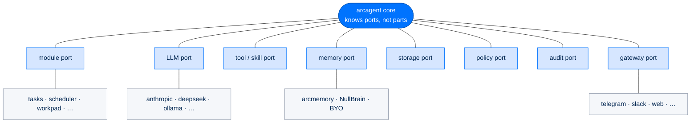

# The Seam Model — Why Everything Is a Plugin

> **Concepts**  ·  Understand  ·  the idea under the whole stack
> [Docs home](../README.md)  ·  [2. Architecture](../walkthrough/02-architecture.md)  ·  [11. Extension Points](../walkthrough/11-extension-points.md)

---

## In one breath

Arc is not one big program with settings. It is a **small core surrounded by
ports**, and almost everything you would call a "feature" is a part that plugs
into a port. A new chat app plugs into the gateway port. A new model plugs into
the LLM port. A new thing the agent can do plugs into the tool port. A new
place to store audit records plugs into the sink port.

The core does not know the *names* of the parts. It knows only the **shape** of
each port. You add a capability by adding a file and pointing config at it. You
remove one by deleting it. You upgrade one by swapping the part behind an
unchanged port. Nothing in the core moves.

That single design choice — a **seam** at every place a capability meets the
core — is what lets one codebase be a turnkey personal assistant, an
enterprise ops fleet, and a federally-hardened analyst, without a fork and
without a rewrite. This page is the *why* and the *rules*. The catalog of every
real port lives in [Extension Points](../walkthrough/11-extension-points.md);
the floor plan of packages lives in
[Architecture](../walkthrough/02-architecture.md); the how-to for the biggest
port lives in [Writing modules](../building/modules.md). This page is the idea
they all share.

---

## Why we build this way

Lead with the payoff, because the payoff is the whole point. Four different
people need four different things from Arc, and a seam is how one codebase says
yes to all four **at the same time**.

| Audience | What they want | What the seam gives them |
|---|---|---|
| **One-layer developer** | Just the LLM router, nothing above it | `pip install arcllm` alone — the port below never drags the ports above it in |
| **Non-technical user** | Everything, working, zero setup | Parts compose into a turnkey stack; ease comes from **unbreakable defaults**, never a required setup step |
| **Federal operator** | Personal today, hardened later | Same parts, stricter stringency — hardening is a **dial**, not a rewrite |
| **Maintainer** | Rewrite a part without fear | Change the part behind the port; if the contract holds, nothing else can break |

Everyday, that same choice buys five concrete properties:

- **Adaptable to each user.** Turn a capability on or off in one config line.
  Two agents on the same box can run entirely different capability sets.
- **Easy to specialize.** A [blueprint](../walkthrough/11-extension-points.md)
  is just a signed preset of which parts are on and how they are tuned — a
  sales agent and a trading agent are two presets, not two codebases.
- **Easy to upgrade and swap.** Replace one provider, one backend, one module.
  The contract is the only thing the rest of the system ever saw.
- **Federally hardenable by construction.** Every port carries identity,
  signing, authorization, and audit at every tier, so no seam ever needs those
  bolted on later.
- **Maintainable under isolation.** You can delete a part and the package still
  runs, minus that one capability. Absence is provable, not hopeful.

---

## The three shapes a seam can take

Every port in Arc is one of exactly three shapes. Learn these three and you can
read any seam in the codebase.

1. **A Protocol** — a Python shape your class must satisfy, with no base class
   to inherit. `Brain`, `StorageBackend`, `PolicyLayer`, `ExecutorBackend`,
   `BrowserBackend`, the gateway `BasePlatformAdapter`. You bring a class that
   has the right methods; the core type-checks the shape and never imports
   your type. This is **dependency inversion** — the core depends on the shape,
   never the thing.

2. **A signed file the loader finds on disk** — a capability file (`@tool` /
   `@hook` / `@background_task`), a `SKILL.md` folder, a module bundle, a
   blueprint. The loader scans known roots, verifies an Ed25519 `.arcsig`
   sidecar, and registers what it finds. Presence on disk plus a valid
   signature is the whole contract.

3. **A `[section]` in TOML that turns a shipped part on** — module activation.
   The code already ships; the config decides whether it loads. `[modules.NAME]
   enabled = true` and nothing else.

The catalog page maps all seventeen real ports onto these three shapes. This
page only names the shapes so the rest of it makes sense.

---

## The five invariants that keep a seam clean

A seam is only worth having if it stays clean. These five rules are the
doctrine — break any one and the plug-in story quietly collapses back into a
monolith with extra steps.

### 1. Dependencies point one way, never up

`arcrun → arcllm`. `arcagent → arcrun` only. `arcgateway` and `arcui` →
`arcagent`. `arctrust` is a leaf everything checks into. A lower layer never
imports a higher one, and no layer reaches *past* its neighbour — `arcagent`
talks to the LLM through the ArcRun facade, never `import arcllm`. Violate this
once and standalone installation dies, because the bottom port now needs the
top one to exist. Enforced by AST architecture tests, not by good intentions
(see [Architecture](../walkthrough/02-architecture.md)).

### 2. One contract per seam, and the default is correct with zero config

A port is a single typed contract. The base implementation behind it must be
correct with no configuration at all — `NullBrain` writes no memory and is a
true no-op; `invoke_stream` yields a single-event fallback so any provider
works; the base policy pipeline allows-through what it has no rule for. Ease of
use comes from a default that **cannot** be misconfigured, never from a setup
step the user has to get right. A native override is always opt-in on top of a
default that already works.

### 3. The core names no part

The core knows the port; it never hard-codes a part's name. Modules are found
by **presence and shape** (`discover_modules`) and switched on by **config**
(`active_modules`), not by a registry the core edits. Adding a chat platform is
a new `arcgateway-<name>` package discovered by entry point — you never open the
registry and add an `if name == "discord"` branch. When the core has to name a
part, the seam has already failed.

### 4. A part must survive its own absence

Every module, provider, backend, and sink is removable with **no loss of
function to the package beyond that one capability**. Nothing in the core
imports a part by name, so an uninstalled part is a missing directory an
operator can point at — not a broken import, not a crash. This is what makes
"turn it off" a safe operation and "swap it out" a local one.

### 5. Every seam carries the Four Pillars, at every tier

Identity (`caller_did`), Sign (verify before use), Authorize (policy on every
call), Audit (one emission point into the WORM chain) are wired into every port
at every tier — personal runs them at low stringency, federal at high. No port
ever ships a path that would need the pillars retrofitted for a harder tier.
Hardening is turning the dial up on machinery that is already there. See
[The Security Model](../walkthrough/10-security-model.md).

---

## Plug and unplug: what actually happens

Adding and removing a part is three separate decisions, kept separate on
purpose. Keeping them apart is what makes **absence provable**.

| Decision | Question it answers | What decides it |
|---|---|---|
| **Distribute** | Is the code even on the box? | A verified signed bundle |
| **Discover** | Which installed folders qualify? | Presence of the contract files on disk |
| **Activate** | Which discovered parts load? | An enabled `[section]` in config |

A part that was never installed is a missing folder. A part installed but not
enabled is inert, listable, and reversible by flipping one flag. A part that is
enabled loads and registers its effects. Full detail and the bundle format:
[Writing modules](../building/modules.md).

### Hot-swapping a live capability

Inside a running agent, the [Module Bus](../walkthrough/11-extension-points.md)
already treats a subscription as a **revertible effect**. Registering a handler
returns an opaque `SubscriptionToken`; `unsubscribe(token)` removes exactly that
one; and `replace_handlers(module_prefix=…)` atomically swaps every handler a
module owns with a new set inside a single synchronous step — an emitter sees
the old set or the complete new set, never a half-rebuilt bridge. That is how a
capability can be reloaded under a live agent without dropping an event.

!!! note "Where this is going"
    The bus proves the pattern for **event handlers**. The direction of travel
    is to make a whole part's activation a single revertible transaction — so
    enabling, disabling, or upgrading a module at runtime cleanly binds and
    unbinds *all* of its effects (tools, hooks, background loops) in one step,
    the same way `replace_handlers` does for hooks today. The goal is that
    "survive its own absence" holds not just across a restart, but live, mid-run.

---

## Why a seam beats a config flag

The tempting shortcut is a monolith with a lot of `if feature_enabled:`
branches. It looks similar from the outside and is worse in every way that
matters.

| A config flag… | A seam… |
|---|---|
| Branches **inside** the core, so the core carries every feature's code forever | Keeps the feature's code **outside** the core, discovered and loaded on demand |
| Grows the core with every capability | Keeps the core small and constant — the LOC budget is a design signal, not a chore |
| Couples features through shared internal state | Isolates features behind a typed contract; shared-nothing by default |
| Makes specialization a fork | Makes specialization a **preset** of which parts are on |
| Ships one product to everyone | Ships one codebase that becomes many products by configuration |

The core staying ignorant is the entire benefit. A flag makes the core know
about the feature; a seam makes sure it never has to.

---

## See also

- [2. Architecture — The Layered Package Stack](../walkthrough/02-architecture.md) — the floor plan and the layering law this doctrine rests on
- [11. Extension Points — Every Seam You Can Hook Into](../walkthrough/11-extension-points.md) — the full catalog of real ports and the file to copy for each
- [Writing modules](../building/modules.md) — the builder how-to for the biggest port
- [10. The Security Model](../walkthrough/10-security-model.md) — how the Four Pillars ride every seam
