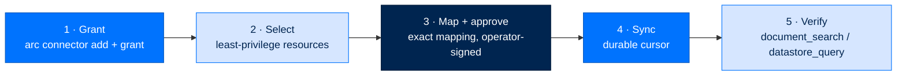

# Connect a Data Source — Grant to Retrieval, End to End

> **Get Started**  ·  Set up  ·  connect one source all the way through
> **For** operators turning an external account into searchable agent knowledge
> [Docs home](../README.md)  ·  [Per-provider cookbook →](source-cookbook.md)  ·  [How it works (data flow) →](../walkthrough/flow-connected-source.md)

---

## In one breath

Connecting an account has two independent halves. **One** grant gives the agent
the account's *interactive tools* (read a channel, query a table, list a folder).
The **other** half — the one people forget — is the governed **Knowledge
journey**: select the least-privilege resources, approve an exact mapping, sync,
and verify retrieval. A connection isn't done when its tools work; it's done when
its data is searchable knowledge and its Knowledge status shows healthy for the
agent. This page walks one source all the way through.

## The five steps



### 1 — Grant the account

Connections are deployment-wide credentials with **deny-by-default**, per-agent
grants. ArcUI and ArcCLI call the same typed connector service. The CLI verbs
(`packages/arccli/src/arccli/commands/connector.py`):

```bash
arc connector available                 # bundles this deployment can connect
arc connector add <connector> --name <id>   # connect an account: prompt secrets, probe, persist
arc connector grant <agent> <id>        # let an agent use it
arc connector auth <id>                 # authorise by hidden secret prompt (Arc holds the credential)
arc connector authorize <id>            # sign in when the connector's own OAuth/binary holds the token
arc connector probe <id>                # prove it's reachable right now
```

`add` validates the bundle and prompts for secrets through the connector's secret
boundary — secrets stay vault-backed and never land in manifests, logs, or agent
workspaces. Which of `auth` vs `authorize` you use depends on the provider (see
the [cookbook](source-cookbook.md)).

!!! note "Existing agents created before connected-data enrollment"
    If a connection works as a tool but does not appear under
    **Knowledge → Connections**, install the removable sync layer and restart the
    agent:

    ```bash
    arc module install --from-source connected_data --agent <agent-id>
    ```

    Enterprise/federal installs stage the signed `connected_data` bundle and omit
    `--from-source`. If the agent's `arcagent.toml` has no
    `[modules.connected_data]` block at all, bring the file to the current
    scaffold first (see [Agent config drift](../runbooks/operate/agent-config-drift.md)).

### 2 — Select the least-privilege resources

Open **Knowledge → Connections** for the target agent and pick exactly what the
agent may read: folders, labels, buckets, prefixes, schemas, or tables. A
resource you don't select cannot be read — selection *is* the reach boundary, not
a display preference.

### 3 — Map and approve

Choose one or more compatible destinations (document, datastore, blob, memory,
profile). Arc stages an **exact mapping proposal**; approve it with operator
controls. This runs through the same mechanical approval subsystem as every other
grant — a `PendingApproval` bound by `call_hash`, signed by the operator key (see
[An approval](../walkthrough/flow-approval.md)). A **changed** proposal needs a
**new** approval; you can never silently re-map fields under an old one. Sync
stays fail-closed in `awaiting_mapping` until you approve.

### 4 — Sync

Start synchronization. The source cursor, selected resources, and object versions
are durable, so restart and redelivery don't duplicate records. Connected sources
sync continuously while their agent runs; the schedule is owned by ArcAgent's
removable module, not ArcMemory:

```toml
# in that agent's arcagent.toml
[modules.connected_data]
enabled = true
interval_seconds = 60          # default; use "Sync now" for an immediate run
```

Provider rate limits and temporary failures back off **without** advancing the
durable cursor, so the next successful run resumes rather than skipping data.
Unsupported media, expired credentials, and rate limits surface as source errors
rather than being silently skipped.

### 5 — Verify retrieval

Check **Documents**, **Datastore**, **Blob folders**, **Profile review**, and
**Index health**. The three governed retrieval paths an agent receives:

- `document_search(query, source?, top_k?)` — classified chunks with source
  provenance, over synchronized document sources.
- `datastore_query(source, operation, table, parameters)` — routes only to a
  live, approved datastore; bounded `get_record` / `find` / `list` operations, no
  raw SQL.
- **Approved profile facts** are injected into context automatically; pending,
  declined, and undone facts are never recalled.

When no embedder is configured, keyword and graph retrieval remain available and
**Index health** reports the degraded semantic channel explicitly (never a silent
failure).

## Datastores vs documents — the one shape difference

Most sources ingest content into the **document** pipeline (extract, chunk,
embed, `document_search`). Datastore sources (SQLite, PostgreSQL/Supabase) are
different: Arc introspects only the tables you selected and exposes bounded, typed
read operations live — it does **not** copy a transactional database into the
document index. For those, tell the agent what the data *means* through the
editable semantic file:

```
~/arc/config/semantic/<connection>.toml
```

```toml
[table.inv_hdr]
entity = "invoice"              # what ONE ROW is; agents search by this
description = "One row per invoice we billed."
```

An edit reaches agents on their next call — no restart, no re-sync. The file is
never overwritten; a later scan only appends newly-appeared tables.

---

**Next:** the [per-provider cookbook](source-cookbook.md) for the exact grant and
auth of each connector. **Why it works this way:** the
[connected-source data flow](../walkthrough/flow-connected-source.md) traces the
lifecycle in code, and the operator-facing runbook is
[Connections — setup and durable activation](../runbooks/operate/connections.md).
