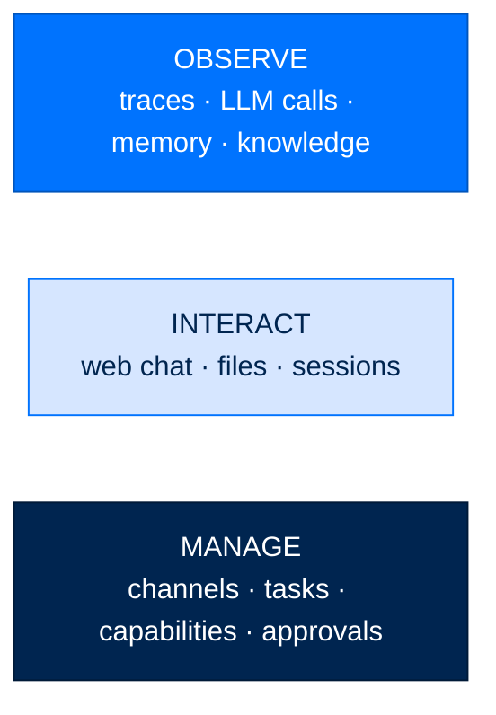
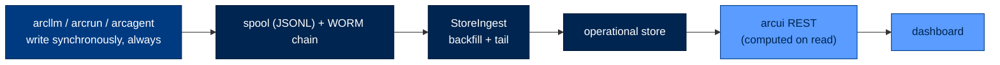

# The ArcUI Dashboard Tour

> **Get Started**  ·  Set up & tune  
> **You'll finish with:** the dashboard running, the viewer link in hand, and a map of its three planes — observe, interact, manage — plus which parts are live and which are read on demand.  
> **Before this:** [Your First Agent](first-agent.md)  
> [Docs home](../README.md)

---

## What you'll achieve

The dashboard (`arcui`) is the control plane: one browser window over your whole
deployment. This page starts it, gets you the access link, and tours what each
pane is for. The key mental model — and the reason the dashboard is safe to start,
stop, and restart at will — is that **arcui is a pure reader of the durable
record.** It never receives a live push from an agent; it tails the same
always-on files every layer already writes.

---

## Start the dashboard

```bash
arc ui start --show-tokens
```

The startup log prints the dashboard URL with the viewer token in the fragment:

```
Dashboard: http://127.0.0.1:8420/#auth=<VIEWER_TOKEN>
```

Open that link. Useful flags:

| Flag | Effect |
|---|---|
| `--team-root <dir>` | Serve every agent under a team directory (default `./team` if present). |
| `--show-tokens` | Print the viewer (and operator) tokens instead of masking them. |
| `--gateway-config <file>` | Wire in Slack/Telegram or a non-personal tier. |
| `--port` / `--host` | Bind address (default `127.0.0.1:8420`). |

One process serves the dashboard, the web-chat WebSocket, the always-on fleet,
and every enabled chat platform. There is no separate "start the UI" and "start
the agents" step.

> **Two roles, one link.** A **viewer** token can watch everything; an
> **operator** token can *act* — create channels, approve capabilities, steer
> tasks. Mutating controls are unavailable to a viewer by design.

---

## The three planes



**Observe** — the read plane. Every LLM call, loop event, memory write, and
knowledge chunk shows here, whether or not the dashboard was running when it
happened. The Observe tab streams live turns; the memory and knowledge views page
through what each agent has captured.

**Interact** — the do plane. Chat with any agent in the browser instead of the
terminal, browse an agent's files (read-only, through a single guarded API), and
resume past sessions.

**Manage** — the operator plane (operator token required). The Channels view lists
every team channel live and lets you add or remove members without a CLI round
trip. The Tasks board is Mission Control — the same task rows the `arc task` CLI
and the agents read and write. The Capabilities view shows each agent's real
loader verdict per tool and skill — the fastest way to confirm least-privilege.
The Approvals panel is where trifecta approvals land (the same store `arc approve`
resolves).

---

## Live vs. read-on-demand

This is worth understanding, because it explains why the dashboard is disposable
and never a single point of failure.



- **Everything durable is written by the layer that did the work**, synchronously,
  in-process, with no dependence on arcui being up. Run `arc llm "…"` from a cold
  shell with nothing else running and the call is still fully recorded.
- **arcui backfills, then tails.** When it starts, it does one full pass over the
  spool and audit chains, then follows each file from its last offset. A call made
  while the dashboard was down appears the moment it comes back — nothing is lost.
- **The one live push is `/ws/chat`.** That carries a running turn's tokens to the
  browser as they stream. Everything else on the page is read on demand from the
  durable store, so there's no rolling aggregate that can drift out of sync.

Stream events into your terminal instead of the browser:

```bash
arc ui tail --viewer-token <token> --layer llm    # llm | run | agent | team
```

---

## The one gotcha: restart after a rebuild

arcui reads its frontend bundle **once** at process startup and caches it.
Rebuilding the `web/` bundle has no effect on a running server — you must restart:

```bash
arc ui start ...   # a rebuilt frontend is only served after a restart
```

Note there is no `arc ui stop`; stop the process (Ctrl-C, or your service
manager) and start it again.

---

## Next

- **Stand up a fleet to watch** → [Build a Fleet](fleet.md), or connect a chat
  surface in [Gateways](gateways.md).
- **How the read path stays honest** → [The Workflows](../walkthrough/09-workflows.md)
  (§ Observe) explains the always-on spool, the tailer, and why arcui is a pure
  reader of the durable record.
