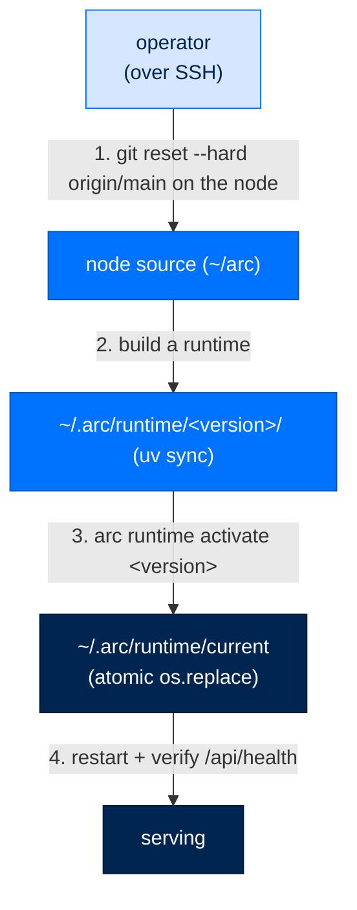

# Deploy

> **Get Started**  ·  Set up & tune  
> **You'll finish with:** your stack running the right way for your target — `arc up` on a box, Docker for a single node, or a versioned host runtime for a production node — and the ability to roll a runtime back in one command.  
> **Before this:** [Provision the operational store](../runbooks/deploy/arcstore-postgres.md) (the required PostgreSQL step)  
> [Docs home](../README.md)

---

## What you'll achieve

Deployment is where the two homes pay off. This page shows the deployment
methods — supervised bring-up on a box, a single-node Docker image, and a
versioned host runtime for production nodes — plus the techniques and gotchas
that keep a deploy safe. The one guarantee that makes upgrades safe: a runtime is
**built fresh and swapped atomically**, so activating a new version, or rolling
back, is a single flip that a reader never sees half-done.

> **Golden rule: deploy from `main`.** A production node should always run an
> `origin/main` commit. Merge every change to `main` before deploying, and reset
> the node's source to `origin/main` as the first build step. Deploying a feature
> branch is throwaway-test only; it puts code in production that isn't the source
> of truth.

---

## Method 1 — supervised bring-up (`arc up`)

`arc up` brings the whole stack up on a box *and proves it came up whole* — the
agents, their modules, NATS, the gateway, and the dashboard. It exists because
modules are separately signed bundles that don't ship inside the wheel: an
ordinary `git pull && uv sync && restart` can leave every agent with **zero**
modules and still boot green. `arc up` closes that gap.

```bash
arc up                      # preflight → modules → verify → start
arc up --check              # validate only; start nothing; non-zero on any problem
arc up --team-root ~/arc/team
arc up --no-install         # inspect first; write no modules
arc up --no-browser         # headless box
```

The four stages:

| Stage | What it does |
|---|---|
| **Preflight** | Checks `nats-server` on PATH, the operator key, the team root, and the data dir. Every failure produces a *silently* degraded agent, so it stops the bring-up. It never mints an operator key — `arc init` does that. |
| **Modules** | Installs the difference between what each agent's config enables and what's materialized, through the same verify → materialize → copy → enable path (verification is never bypassed). |
| **Verify** | Prints a per-agent module table. A `MISSING` module fails the command with exit 1 — **the server is never started**, because a started process is what makes a degraded deployment look healthy. |
| **Start** | Hands off to `arc ui start` in-process. |

`arc up --check` is what you run before a deploy and what CI runs against a node.
When you want the *install* half without starting — an upgrade, a provisioning
script, a systemd `ExecStartPre` — that verb is `arc install`:

```bash
arc install                       # same preflight + bundles + modules, then exit
arc install --team-root ~/arc/team
```

---

## Method 2 — single-node Docker

Arc ships as one container image with the install decisions already made (uv, the
NATS broker, the local embedding model, config wiring). It's the canonical
single-node path:

```bash
cp .env.example .env      # fill in ANTHROPIC_API_KEY at minimum
docker compose up -d
docker compose logs -f arc   # prints the dashboard URL with a viewer token
```

The entrypoint runs the wizard, scaffolds an agent, wires the gateway, mints
tokens, and starts the dashboard on `:8420` against the persistent `/data`
volume. Restarting reuses the same agent, memory, and tokens instead of minting
new ones.

For a registry-based rollout (build once, deploy many), build the image in your
container registry, pin the tag to the commit SHA so a node can't drift, pull it
on the target, and `docker compose up -d`. Keep agent state in a Docker **named
volume** so it survives every redeploy.

---

## Method 3 — versioned host runtime (production nodes)

The production technique on a plain host is a **versioned runtime with an atomic
flip**. It works over SSH against any systemd-user node and is the same four
steps whether you run them by hand or wrap them in your own deploy script.



The four steps:

1. **Reset the node's source to `origin/main`.** Nothing is ever run from the
   source checkout itself — it is only the input to a build.
2. **Build a versioned runtime.** Compute a version (a good scheme is
   `<pyproject version>-<source fingerprint>`), rsync the source into
   `~/.arc/runtime/<version>/`, and run `uv sync` **there**. The live install is
   never mutated in place.
3. **Flip atomically.** `arc runtime activate <version>` stages a new symlink and
   `os.replace`s it onto `~/.arc/runtime/current`, so a reader sees the old
   version or the new one, never a missing one. Prune old runtimes afterward.
4. **Restart and verify.** Restart the systemd-user service, then health-poll
   `:8420`, confirm the adapter imports, and check the UI bundle hash.

Because step 2 builds a self-contained directory and step 3 is a single atomic
flip, an upgrade and a rollback are the *same* operation pointed at a different
version.

---

## Activate and roll back a runtime

Because a runtime is a self-contained directory and `current` is an atomic
symlink, switching versions is instant and reversible:

```bash
arc runtime list                 # every installed version, active one marked
arc runtime activate <version>   # point current at a version — upgrade OR rollback
```

The flip stages a new symlink and `os.replace`s it onto `current`, so a reader
sees the old version or the new one, never a missing one. A bad deploy is a
one-command rollback to the prior version.

---

## Gotchas

Deployment failures cluster around a few things. Check these first.

| Gotcha | What bites, and the fix |
|---|---|
| **NATS not on PATH** | The message bus must be reachable or agents come up silently degraded. Ensure `nats-server` is installed and on PATH before bring-up (`scripts/install-nats.sh` sets up a local broker). `arc up` preflight catches this and stops. |
| **PostgreSQL store missing** | The operational store is a required step, not optional. Provision it first — see [Provision the operational store](../runbooks/deploy/arcstore-postgres.md) (`scripts/install-postgres.sh`). |
| **Modules silently empty** | Modules are separately signed bundles that are **not** in the wheel. A plain `git pull && uv sync && restart` can leave every agent with zero modules and still boot green. Always bring a node up with `arc up` (or `arc install`), which materializes and verifies modules before starting. |
| **Headless node hangs on the keyring** | On a box with no desktop session, CLIs that touch the OS keyring can block forever waiting on a D-Bus prompt. Export `DBUS_SESSION_BUS_ADDRESS=/dev/null` for the service and for deploy commands so keyring lookups fail fast instead of hanging. |
| **Deploying a non-`main` commit** | Production runs `origin/main`. Reset the node to `origin/main` as step 1; a feature-branch deploy is throwaway-test only. |
| **In-place upgrades** | Never `uv sync` over the live install. Build a new versioned runtime directory and flip — that is what makes rollback a single command. |

---

## Verify

```bash
arc up --check                          # the node would come up whole
curl -s http://127.0.0.1:8420/api/health   # 200 once serving
arc runtime list                        # the version you expect is active
```

---

## Next

- You've completed the setup spine. Fill in the deeper tuning guides:
  **connect a data source** → [Connections and connected data](../runbooks/operate/connections.md),
  **tune knowledge & memory** → [Memory, the Index, and Scope](../concepts/memory-index-and-scope.md),
  **the full config catalog** → [Configuration keys](../reference/config.md).
- **Why the two-home lifecycle and atomic flip work this way** → [Configuration](../walkthrough/12-configuration.md)
  and the [Deploy overview](../runbooks/deploy/overview.md) cover the arc-home
  split and the runtime lifecycle in full.
