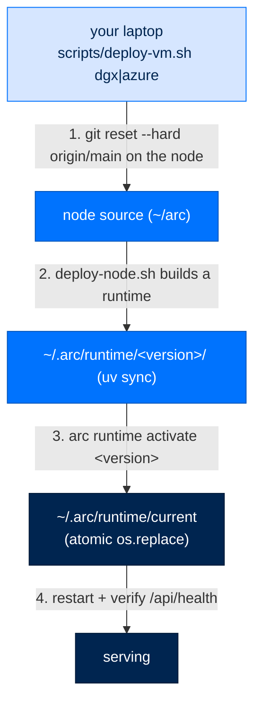

# Deploy

> **Get Started**  ·  Set up & tune  
> **You'll finish with:** your stack running the right way for your target — `arc up` on a box, Docker for a single node, or the VM scripts for DGX/Azure — and the ability to roll a runtime back in one command.  
> **Before this:** [Provision the operational store](../runbooks/deploy/arcstore-postgres.md) (the required PostgreSQL step)  
> [Docs home](../README.md)

---

## What you'll achieve

Deployment is where the two homes pay off. This page shows the three real paths —
supervised bring-up on a box, a single-node Docker image, and the VM scripts for
production nodes — and the one guarantee that makes upgrades safe: a runtime is
**built fresh and swapped atomically**, so activating a new version, or rolling
back, is a single flip that a reader never sees half-done.

> **Golden rule: deploy from `main`.** Production nodes always run an `origin/main`
> commit. Merge every change to `main` before deploying — the VM scripts hard-reset
> the node's source to `origin/main`. Deploying a feature branch is throwaway-test
> only; it puts code in production that isn't the source of truth.

---

## Path 1 — supervised bring-up (`arc up`)

`arc up` brings the whole stack up on a box *and proves it came up whole* — the
agents, their modules, NATS, the gateway, and the dashboard. It exists because
modules are separately signed bundles that don't ship inside the wheel: an
ordinary `git pull && uv sync && restart` can leave every agent with **zero**
modules and still boot green. `arc up` closes that gap.

```bash
arc up                      # preflight → modules → verify → start
arc up --check              # validate only; start nothing; non-zero on any problem
arc up --team-root ~/arc/team
arc up --no-install         # inspect first; write no modules
arc up --no-browser         # headless box
```

The four stages:

| Stage | What it does |
|---|---|
| **Preflight** | Checks `nats-server` on PATH, the operator key, the team root, and the data dir. Every failure produces a *silently* degraded agent, so it stops the bring-up. It never mints an operator key — `arc init` does that. |
| **Modules** | Installs the difference between what each agent's config enables and what's materialized, through the same verify → materialize → copy → enable path (verification is never bypassed). |
| **Verify** | Prints a per-agent module table. A `MISSING` module fails the command with exit 1 — **the server is never started**, because a started process is what makes a degraded deployment look healthy. |
| **Start** | Hands off to `arc ui start` in-process. |

`arc up --check` is what you run before a deploy and what CI runs against a node.
When you want the *install* half without starting — an upgrade, a provisioning
script, a systemd `ExecStartPre` — that verb is `arc install`:

```bash
arc install                       # same preflight + bundles + modules, then exit
arc install --team-root ~/arc/team
```

---

## Path 2 — single-node Docker

Arc ships as one container image with the install decisions already made (uv, the
NATS broker, the local embedding model, config wiring). It's the canonical
single-node path:

```bash
cp .env.example .env      # fill in ANTHROPIC_API_KEY at minimum
docker compose up -d
docker compose logs -f arc   # prints the dashboard URL with a viewer token
```

The entrypoint runs the wizard, scaffolds an agent, wires the gateway, mints
tokens, and starts the dashboard on `:8420` against the persistent `/data`
volume. Restarting reuses the same agent, memory, and tokens instead of minting
new ones.

---

## Path 3 — production VMs (DGX / Azure)

There are two production lanes. Pick by target.



**Host-runtime lane** (`scripts/deploy-vm.sh dgx|azure`) — runs from your laptop
over SSH against a systemd-user node:

```bash
scripts/deploy-vm.sh dgx                 # sync main → build runtime → restart → verify
scripts/deploy-vm.sh azure               # same against the Azure VM
scripts/deploy-vm.sh --host user@ip      # any bootstrapped systemd-user node
```

It hard-resets the node to `origin/main`, discovers the fleet roster from
`team/*/`, then runs `scripts/deploy-node.sh <roster>` on the box. `deploy-node.sh`
computes a runtime version (`<pyproject version>-<source fingerprint>`), rsyncs
the source into `~/.arc/runtime/<version>/`, runs `uv sync` there, and then does
the atomic flip — `arc runtime activate <version>` — before pruning old runtimes.
Finally it health-polls `:8420` and checks the adapter import and UI bundle hash.

**Docker/ACR lane** (`scripts/deploy-azure.sh`) — the container path for the Azure
VM: builds the image in Azure Container Registry (`az acr build`), pins the image
to the commit SHA, mints a short-lived registry token, and `docker compose up -d`
on the box. Agent state persists in a Docker named volume across every redeploy.

```bash
scripts/deploy-azure.sh              # build, push, deploy, health-check
scripts/deploy-azure.sh --skip-build # redeploy the tag already in ACR
```

---

## Activate and roll back a runtime

Because a runtime is a self-contained directory and `current` is an atomic
symlink, switching versions is instant and reversible:

```bash
arc runtime list                 # every installed version, active one marked
arc runtime activate <version>   # point current at a version — upgrade OR rollback
```

The flip stages a new symlink and `os.replace`s it onto `current`, so a reader
sees the old version or the new one, never a missing one. A bad deploy is a
one-command rollback to the prior version.

---

## Verify

```bash
arc up --check                          # the node would come up whole
curl -s http://127.0.0.1:8420/api/health   # 200 once serving
arc runtime list                        # the version you expect is active
```

---

## Next

- You've completed the setup spine. Fill in the deeper tuning guides:
  **connect a data source** → [Connections and connected data](../runbooks/operate/connections.md),
  **tune knowledge & memory** → [Memory, the Index, and Scope](../concepts/memory-index-and-scope.md),
  **the full config catalog** → [Configuration keys](../reference/config.md).
- **Why the two-home lifecycle and atomic flip work this way** → [Configuration](../walkthrough/12-configuration.md)
  and the [Deploy overview](../runbooks/deploy/overview.md) cover the arc-home
  split and the runtime lifecycle in full.
