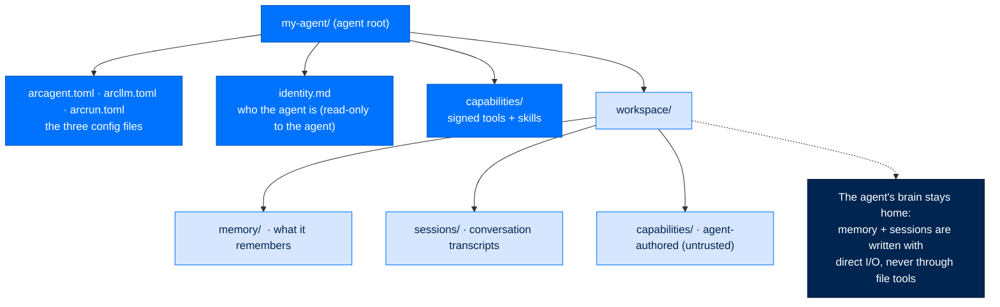

# Your First Agent

> **Get Started**  ·  Set up & tune  
> **You'll finish with:** a working agent you can chat with, and a clear picture of what a *workspace* is.  
> **Before this:** [Identity & Keys](identity-and-keys.md)  
> [Docs home](../README.md)

---

## What you'll achieve

Three commands take you from nothing to a running conversation: create the agent,
validate it, chat with it. Along the way you'll see the directory an agent lives
in — its **workspace** — and why that directory, not the model, is where the
agent's memory and identity persist.

---

## Create the agent

```bash
arc agent create my-agent --model anthropic/claude-sonnet-4-5-20250929
```

`arc agent create` does everything needed to make a real agent: it scaffolds the
three config files, mints the agent's DID, drops in a signed starter capability
(a `calculate` tool), and — if the NATS broker is reachable — registers the agent
with the team registry. Useful flags:

| Flag | Effect |
|---|---|
| `--model <provider/model>` | The model this agent uses. Default: `anthropic/claude-sonnet-4-5-20250929`. |
| `--tier <personal\|enterprise\|federal>` | Stringency for *every* subsystem at once. Default: `personal`. |
| `--dir <parent>` | Where to create the agent directory. Default: the current directory. Use `--dir team` for a fleet. |
| `--no-register` | Skip the team auto-registration. |
| `--with-code-exec` | Include the code-execution tool in the scaffold. |

---

## What a workspace is

An agent is a directory. The **agent root** holds what defines the agent; the
**workspace** underneath it holds what the agent produces and remembers.



Two rules this layout encodes:

- **`identity.md` is read-only to the agent.** It is the system prompt that says
  who the agent is and what it's for. The agent reads it every turn; it cannot
  rewrite its own goals.
- **Agent state stays in the workspace.** Memory, sessions, and identity are
  written with direct filesystem I/O to the agent's own home — never through the
  LLM's `write`/`bash`/`edit` tools. An agent can work in any project directory,
  but its brain stays home.

The three config files are siblings, each owning one concern: `arcagent.toml`
(identity, tools, skills, security), `arcllm.toml` (provider, model, budgets),
`arcrun.toml` (sandbox, turn limits, timeouts). They merge at runtime into one
surface — the full catalog is in the [Configuration keys reference](../reference/config.md).

---

## Validate before you run

```bash
arc agent build my-agent --check
```

`arc agent build --check` **validates and writes nothing**: it confirms
`arcagent.toml` parses, checks that a key exists for the configured provider, and
lists the discovered tools and available strategies. Always reach for `--check`
first.

`arc agent build` *without* `--check` renders the config surface, and with
`--force` it **regenerates `arcagent.toml` from the template** — DID and name are
preserved, but every hand-edited value is replaced. Treat `--force` like
`git reset --hard`: a deliberate, destructive act, never a habit.

---

## Chat with it

```bash
arc agent chat my-agent
```

Type a message and press Enter. Try:

```
> Summarize the files in the current directory.
```

Useful flags: `--task "…"` runs one message and exits (no REPL), `--model` overrides
the model for the session, `--max-turns` caps the loop, and `--session-id`
resumes a specific past conversation.

While in chat, slash commands drive the session:

| Command | Purpose |
|---|---|
| `/help` | Show available commands |
| `/tools` · `/skills` | List what the agent can do |
| `/sessions` · `/switch <id>` | List / resume past conversations |
| `/cost` | Running cost of this session |
| `/reload` | Reload capabilities after editing one |
| `/quit` | Exit |

---

## Run a one-shot task

No REPL needed for a single job:

```bash
arc agent run my-agent "Read the CSV files in workspace/data/ and summarize the trends"
arc agent run my-agent "List all Python files" --json
```

Inspect the agent without chatting:

```bash
arc agent status my-agent      # DID, model, counts
arc agent tools my-agent       # discovered tools
arc agent skills my-agent      # discovered skills
arc agent sessions my-agent    # past conversations
```

---

## Next

- **Configure providers and endpoints** → [Configure Providers](providers.md), or
  tune the security dial in [Policy & Tiers](policy-and-tiers.md).
- **What actually happens on a turn?** → [Anatomy of a Turn](../walkthrough/03-anatomy-of-a-turn.md)
  walks one request end to end — the run_id pinning and frozen tool-set behind
  every `arc agent chat`.
