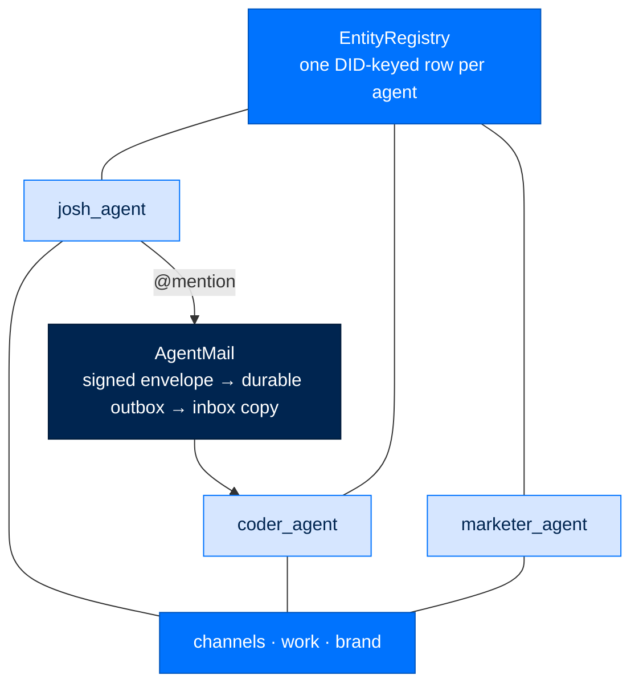

# Build a Fleet

> **Get Started**  ·  Set up & tune  
> **You'll finish with:** several agents registered as a team, organized into channels, talking to each other over signed agent mail — served by one process.  
> **Before this:** [Your First Agent](first-agent.md)  
> [Docs home](../README.md)

---

## What you'll achieve

One agent is the base case; a fleet is several agents under one identity-and-audit
system, coordinating through channels and durable mail. This page stands up a
small team on a single node: create the agents, register them, wire channels, and
serve them all from one `arc ui start`. Every message between agents is signed,
verified, and replay-checked — a teammate's message opens a *sender-scoped*
session, never a shared operator one.

---

## The shape of a fleet



Two boundaries to hold onto:

- **Composition points one way.** `arcteam` composes standalone `arcagent`
  instances; neither `arcagent` nor `arcmemory` imports `arcteam`. A solo agent
  works with no team service at all — the fleet functionality is simply absent.
- **Agent mail is not chat.** The NATS-backed mailboxes carry *signed agent mail*,
  a separate plane from the operator/external sessions a gateway owns. A message
  must verify and pass a replay check before it enters an inbox.

---

## 1. Create the agents

Put each agent under a shared `team/` directory:

```bash
for name in josh coder marketer; do
  arc agent create "${name}_agent" --dir team --model anthropic/claude-sonnet-5
done
```

Each mints its own DID and auto-registers with the team registry **if the NATS
broker is reachable** (it will be once `arc ui start` has run once, or if you
start `nats-server -js` by hand first).

---

## 2. Give each a persona

Persona lives in `team/<agent>/workspace/identity.md`, under its "About Me"
section — `arcagent.toml`'s `[agent]` table has no persona field. Keep it to a
name and a one-line role; the agent reads it every turn, so length costs tokens
for no benefit:

```markdown
## About Me

**My Name:** Coder Agent

**My Role:** Software engineer agent. Writes, reviews, and refactors code; runs
tests; follows TDD. Works from specs and reports diffs + test evidence.
```

Least privilege is the default: a new agent gets only the built-in scaffold
(`calculate`, file ops) until you deliberately add tools under
`team/<agent>/capabilities/`. Model every consequential-action agent this way —
grant a tool only as a reviewed decision, never as a default.

---

## 3. Register (if not auto-registered)

`arc team create` needs an existing registry entry for every member. Auto-
registration handles this when NATS is up; otherwise register by hand.
Registration is a strict create — it refuses a duplicate DID rather than
silently clobbering an entity:

```bash
arc team --root ~/.arc/team register coder_agent \
  --name coder_agent --type agent --roles executor \
  --workspace team/coder_agent/workspace
```

`arc team --root <dir>` sets the team data root; `--json` is available on the
listing verbs.

---

## 4. Create the team and its channels

```bash
arc team --root ~/.arc/team create josh-team \
  --name "Josh's Team" \
  --channel work \
  --members agent://josh_agent,agent://coder_agent,agent://marketer_agent
```

Member refs are `agent://<agent_name>` — the same string shown in the `ID` column
of `arc team entities`. Comma-separated, no spaces. This creates the team and its
first channel (`work`) in one call. Add more channels:

```bash
arc team --root ~/.arc/team create-channel brand --team josh-team
```

Two ways to set membership: pass `--members` explicitly, or pass `--team <id>` and
let it default to that team's members (explicit `--members` wins). The CLI refuses
to create a channel whose name already exists.

Auto-registration always sets `roles=["executor"]`; set richer roles afterward
(DID and handle never change, omitted fields are left untouched):

```bash
arc team --root ~/.arc/team update-entity coder_agent \
  --name "Coder Agent" --roles coder,executor
```

---

## 5. Serve the whole roster

One process — no separate "start the team" step:

```bash
arc ui start --team-root team --gateway-config ~/arc/config/gateway.toml
```

It loads every agent under `team/` on demand and serves the whole roster over the
dashboard and API.

---

## 6. Verify

```bash
arc team --root ~/.arc/team status      # Entities: N, Channels: M, Teams: 1
arc team --root ~/.arc/team entities    # every agent, name, roles  (there is no "team list")
arc team --root ~/.arc/team channels    # every channel + its members
```

You can also manage channels and inspect each agent's Knowledge and Capabilities
live from the dashboard's Manage plane (operator role) — see
[The ArcUI Dashboard Tour](dashboard-tour.md).

---

## How agents talk — AgentMail

Agent-to-agent messages ride a durable path, not a fire-and-forget bus. The
ArcStore transaction writes the recipient's inbox copy and the signed transport
outbox **together**; a supervised worker delivers with bounded backoff and
dead-letters after the attempt limit. A `pending` send means the durable commit
succeeded but transport acknowledgement is still outstanding — safe to retry with
the same idempotency key. `arc team send`, `arc team inbox --search`, and
`arc team thread` all use this same service; the message's canonical conversation
id is stable across every participant's copy.

An `@handle` in a message body resolves against the registry and raises the
message's priority — the signal that decides whether an idle agent wakes for it.

---

## Next

- **Automate the fleet** → [Workflows & Schedules](workflows.md), or connect a
  chat surface in [Gateways](gateways.md).
- **Why the fleet layers this way** → [Fleet layering and removable composition](../concepts/fleet-layering.md)
  covers the `arcteam → arcagent` direction, AgentMail durability, and the
  zero-trust rules behind signed inter-agent mail.
