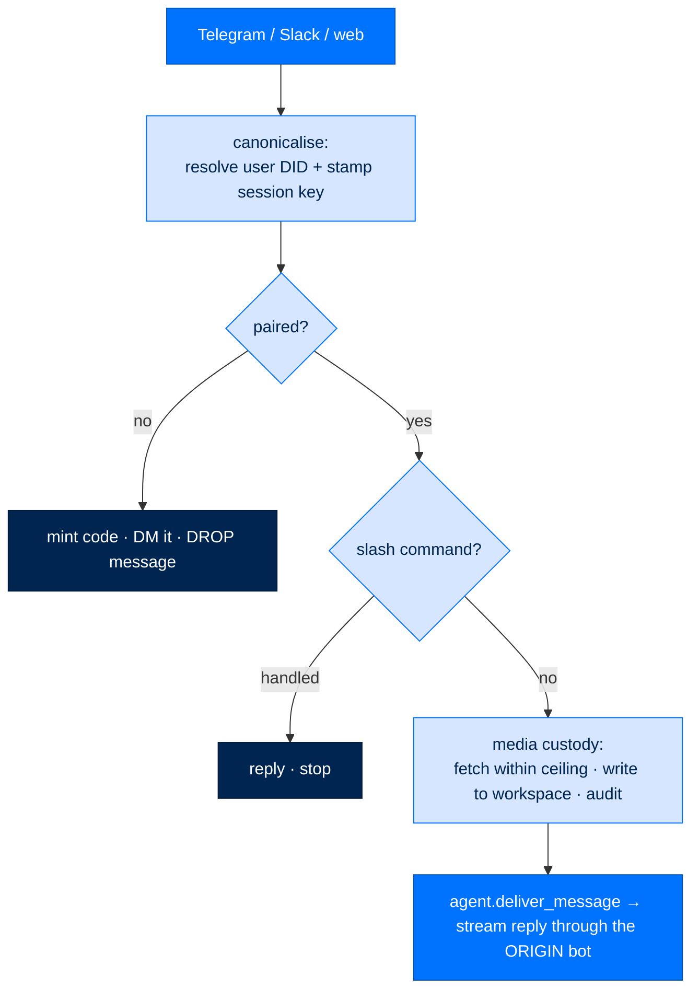

# Gateways (Chat)

> **Get Started**  ·  Set up & tune  
> **You'll finish with:** an agent reachable from a chat platform — one bot per agent, its token held safely, and unapproved users kept out by pairing.  
> **Before this:** [Your First Agent](first-agent.md)  
> [Docs home](../README.md)

---

## What you'll achieve

A gateway makes an agent reachable from Telegram, Slack, Mattermost, or the
browser. This page connects a Telegram bot to one agent, shows where its token is
stored (never in config, never through the LLM), and explains pairing — the gate
that stops a stranger who finds your bot from ever reaching the agent.

The core rule: the gateway **funnels every message into the agent** and never
calls the model directly. It owns pairing, session identity, and inbound media
custody; the agent owns the loop.

---

## The inbound path



The order is load-bearing: **pairing runs before everything**, so an unapproved
sender's message (and any file it carries) never reaches the agent's disk.

---

## One bot per agent

`web` is the only always-on adapter (the browser chat, gated by the dashboard
token). The chat platforms ship as optional extras — install the one you want:

```bash
arc gateway adapter list
arc gateway adapter install telegram      # installs arcgateway[telegram]
```

A gateway can run **one bot per agent**: each agent gets its own
`[platforms.<name>_telegram]` block with its own token and bound `agent_did`, so a
reply always returns through the right bot. A single-token deployment answers on
one agent only.

---

## Connect a Telegram bot

The guided command binds one bot to one agent and stores the token safely:

```bash
arc gateway connect-telegram --agent team/josh_agent
```

`--agent` (the agent directory) is required; you're prompted for the bot token
(hidden) and, optionally, `--user-id` to seed the allowlist. It resolves the
agent's DID from `arcagent.toml`, then:

- validates the token format (nothing is written on a bad token),
- stores the token in the gateway's **env file** under a per-agent variable at
  `0600` — **never** in `gateway.toml`, and **never** through the LLM,
- writes a `[platforms.<slug>_telegram]` block bound to that agent's DID, and
  turns pairing on.

It ends by telling you to restart the service (`systemctl --user restart
arc.service`) so the new bot is picked up.

> **Token custody is the whole point.** A bot token is a secret. It lives in the
> `0600` env file under a per-agent var, never in config, never echoed, never
> routed through an agent chat (LLM07). The config file stores only the variable
> *name*.

Slack and Mattermost are wired the same way through `gateway.toml` blocks
(`bot_token_env` / `app_token_env`) plus `arc gateway adapter install slack`.
There is no `connect-slack` guided command today — configure the block directly.

---

## Pairing — how a remote user gets authorized

An unknown user's first message never reaches an agent. The gateway mints an
8-character one-time code, DMs it back, and drops the message. The user shares the
code with you; you approve it:

```bash
arc gateway pair list             # pending codes
arc gateway pair approve <code>   # approve + consume it
arc gateway pair revoke <code>    # revoke a code
```

Approval writes an `approved` row into the same SQLite file the running gateway
reads, so it takes effect on the very next message — no restart, no in-memory
allowlist to go stale. **Approval carries an Ed25519 operator signature at every
tier** — the tier only picks how strict the trust anchor is, never whether the
signature is checked. Five failed approval attempts lock the platform out for an
hour.

The `web` platform is exempt from pairing: every browser chat connection is
already gated by the dashboard's viewer/operator token, so a second pairing dance
would lock you out of your own dashboard.

---

## Serve it

The gateway runs **embedded** in the dashboard process — that's the canonical
path at every tier:

```bash
arc ui start --team-root team --gateway-config ~/arc/config/gateway.toml
```

(The standalone `arcgateway start` refuses to start by design — it has no working
agent-execution path.) A `gateway.toml` sketch:

```toml
[gateway]
tier = "personal"
agent_did = "did:arc:agent:default"

[security]
require_pairing = true

[platforms.web]
enabled = true

[platforms.telegram]
enabled = true
token_env = "TELEGRAM_BOT_TOKEN"
allowed_user_ids = [123456789]
```

---

## Verify

```bash
arc gateway pair list        # pending pairings, if any
arc gateway adapter list     # which platforms are installed
```

Then DM your bot. If the agent never replies, the sender is almost always
unpaired — check `arc gateway pair list` and the DM the user received.

---

## Next

- **Automate replies on a schedule** → [Workflows & Schedules](workflows.md)
  (`deliver_to` pins a workflow's summary to a channel), then **ship it** →
  [Deploy](deploy.md).
- **The inbound path and media trust in full** → [Extension Points](../walkthrough/11-extension-points.md)
  and the [arcgateway package guide](../building/packages/arcgateway.md) cover the
  adapter contract, session ownership, and untrusted-media custody.
