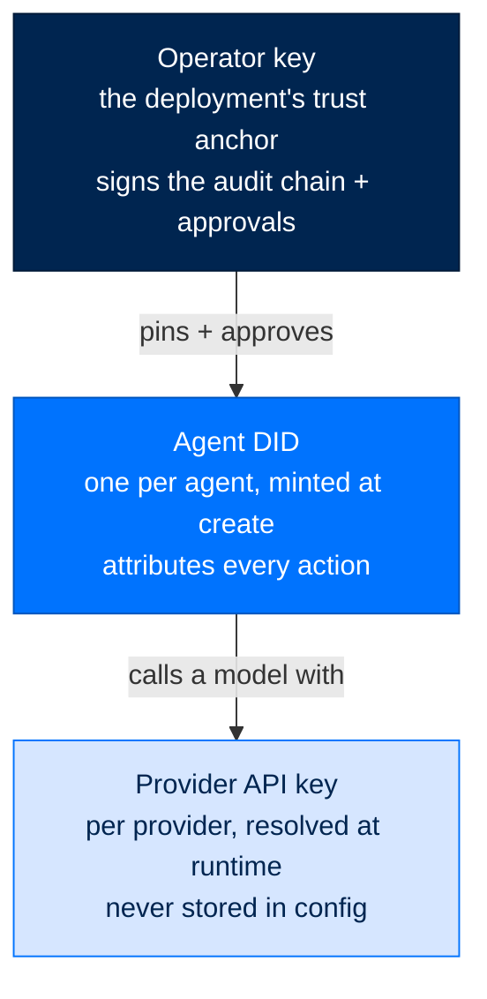
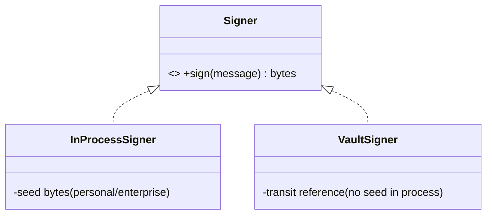

# Identity & Keys

> **Get Started**  ·  Set up & tune  
> **You'll finish with:** an operator key that anchors trust for the whole deployment, and an understanding of the per-agent DID and where private keys are (and are not) allowed to live.  
> **Before this:** [Install & the Two Homes](install.md)  
> [Docs home](../README.md)

---

## What you'll achieve

Arc's whole security story rests on three kinds of key. This page sets up the
one you own — the **operator key** — and explains the two the harness manages
for you: each agent's **DID** and each provider's **API key**. When you finish,
`arc identity show` names your signing authority and `arc keys list` shows a key
present for your provider.

The rule to carry: **a private key never travels through a config file, a
prompt, or a log.** Code receives a *capability to sign*, not raw key material.

---

## The three keys, at a glance



| Key | Who mints it | Where it lives | What it proves |
|---|---|---|---|
| **Operator key** | you, via `arc init` | `~/arc/state/operator` (or vault) | The deployment's root of trust — it signs the audit chain and every operator approval. |
| **Agent DID** | the harness, via `arc agent create` | the agent's own tree | *This* agent took an action — every tool call carries its DID. |
| **Provider API key** | you, via `arc keys set` | an env file (`0600`), never config | Authenticates you to the LLM provider. |

---

## The operator key — the trust anchor

Every Arc deployment has one operator key. It is the authority that signs the
tamper-evident audit chain and every human approval, and it is the key artifacts
are pinned to. **Create it once, with the setup wizard:**

```bash
arc init
```

`arc init` mints the operator key and writes the tier-based config. Nothing else
mints it — a bring-up that minted its own anchor would have verified nothing, so
`arc up` refuses to start without one (see [Deploy](deploy.md)). Back this key
up: without it, every audit chain it ever signed becomes unverifiable.

For direct, agent-less runs (`arc run …`, `arc llm …`), the signing authority is
managed separately:

```bash
arc identity init        # create the signing authority for direct arcrun/arcllm runs
arc identity show        # print its DID
```

`arc identity init` generates an Ed25519 keypair and DID under the install home,
writes `active.did`, and registers the DID as a trusted operator. Use it when
you drive `arcrun`/`arcllm` directly rather than through a full agent.

---

## The agent DID — minted for you

You never hand-write an agent's identity. `arc agent create` mints it:

```bash
arc agent create my-agent --model anthropic/claude-sonnet-4-5-20250929
```

The DID format is `did:arc:{org}:{type}/{hash}`, where `hash` is the first 8 hex
characters of `sha256(public_key)` — deterministic, so a presented key can be
checked against a claimed DID. `ArcAgent` refuses to start without one. Key
files must be `0600`; the loader rejects a group- or world-readable key outright.

Sub-agents don't get independent keys. A child identity is **derived** from the
parent (HKDF over the parent's seed and a per-spawn nonce), and its clearance can
only narrow — a child can never out-clear its parent.

---

## Key custody — non-exportable by design

The security boundary is not "the key file has the right permissions." It is
that **code holds a signing capability, never the raw seed.**



- **`InProcessSigner`** holds the seed in memory (Ed25519, or ECDSA-P256 under
  FIPS) — the personal/enterprise default.
- **`VaultSigner`** signs *by reference* through a vault-transit boundary (Vault
  Transit, a PKCS#11 HSM, or cloud KMS). The seed never enters the process. This
  is the enterprise-recommended and federal-required custody mode.

One consequence to know early: under `custody = "vault_transit"`, capability
signing needs the seed in-process to derive the key it pins, so the operator
surfaces **refuse and sign nothing** rather than reach for another key. That is
the custody rule doing its job, not a bug.

---

## Provider API keys — never in config

A provider key is resolved at runtime from an environment variable or a vault
backend. It is **never** written into a TOML file. Store one with the hidden
prompt:

```bash
arc keys set anthropic        # prompts for the key, writes it to the 0600 env file
arc keys list                 # shows each provider and whether its key is set
arc keys remove anthropic     # forget a stored key
```

Or set it directly in your environment / `.env`:

```bash
ANTHROPIC_API_KEY=sk-ant-...
```

Provider TOML records only the **name** of the env var (`api_key_env`) and an
optional `vault_path` — the secret itself is resolved later. This is why a leaked
config file leaks no credentials.

---

## Verify

```bash
arc identity show        # names your signing authority DID
arc keys list            # a key present for your provider
arc llm validate         # confirms the key actually resolves and reaches the provider
```

---

## Next

- **Create your first agent** → [Your First Agent](first-agent.md) — now that the
  trust anchor exists, mint an agent and talk to it.
- **Why identity, signing, and custody work this way** → [The Security Model](../walkthrough/10-security-model.md)
  and the [Security reference](../reference/security.md) cover the Four Pillars
  and the verify-before-load ordering behind these keys.
