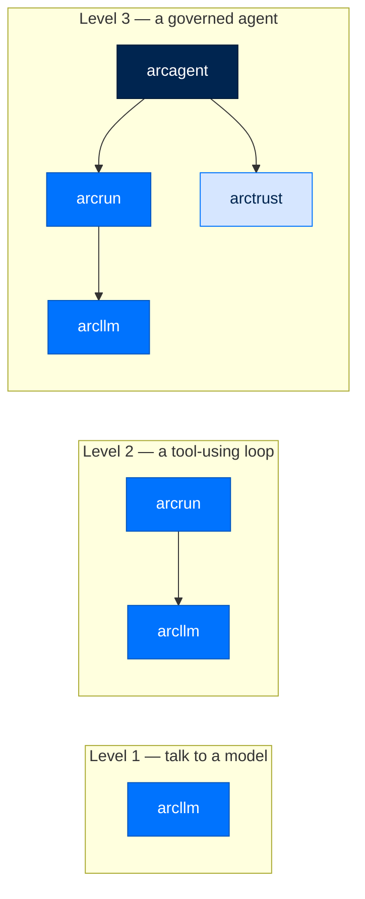
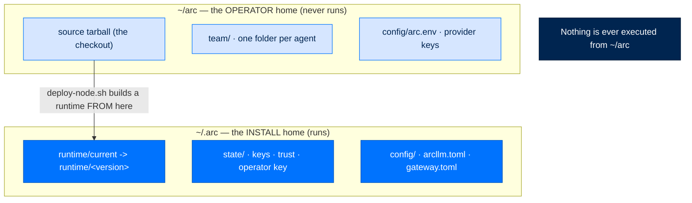

# Install & the Two Homes

> **Get Started**  ·  Set up & tune  
> **You'll finish with:** Arc installed, and a clear picture of *where* it lives on disk — the install home vs. the operator home.  
> **Before this:** [Stand up your stack](../README.md) (the setup map)  
> [Docs home](../README.md)

---

## What you'll achieve

By the end of this page you can run `arc version` and `arc llm validate`, and
you know the difference between the two directories Arc uses — which one holds
the running install, and which one is yours to edit. Get this distinction right
now and every later step (config, keys, deploy, rollback) reads cleanly.

You do **not** have to install the whole stack. Arc is a set of small Python
packages that compose. Pick the depth that matches what you're building.

---

## Pick how much you need



| Level | Install | You get | You don't get |
|---|---|---|---|
| 1 | `pip install arcllm` | One interface to every supported provider over plain HTTP, PII redaction, request signing | No agent, no tools, no loop — you drive the calls |
| 2 | `pip install arcrun` (pulls `arcllm`) | A model-decides-then-acts loop that dispatches tools you hand it | No identity, no persistent memory, no policy pipeline |
| 3 | `pip install arcmas` | The whole stack — identity, tools, skills, memory, the deny-by-default policy pipeline, the audit trail | Nothing — this is everything |

`arcmas` is the meta-package: it pulls `arccli`, `arctui`, `arcagent`, `arcrun`,
`arcllm`, `arctrust`, `arcstore`, `arcmemory`, and `arcskill` in one line. It is
the recommended start for anyone who wants a working agent.

Dependencies point one way and never up: `arcrun → arcllm`; `arcagent → arcrun`;
`arctrust` is a leaf. That is why each level installs cleanly on its own. The
[Seam Model](../concepts/seam-model.md) explains *why* the layers are ordered
this way.

---

## Install

### Full stack (recommended)

```bash
pip install arcmas
```

### From source (developing on Arc)

```bash
git clone https://github.com/joshuamschultz/Arc.git
cd Arc
uv sync --all-packages --all-groups
```

`uv sync --all-packages` installs every package in editable mode against one
lockfile — a change in `arcllm` is immediately visible to `arcagent` with no
reinstall. Add `--all-groups` to also pull the `dev` tools (ruff, mypy, pytest,
pip-audit).

### System requirements

| Requirement | Minimum | Recommended |
|---|---|---|
| Python | 3.11+ | 3.12+ |
| OS | Linux / macOS / Windows | Linux (for full sandbox support) |
| Memory | 512 MB | 2 GB+ |
| Docker | Optional | Required for the code-execution sandbox |
| KVM | Optional | Required for federal-tier VM isolation (`/dev/kvm`) |

---

## The two homes

Arc uses **two** directories, and they do different jobs. Keeping them straight
is the difference between a clean upgrade and a confusing one.



| Home | What it is | What lives there |
|---|---|---|
| **`~/.arc`** (the install) | The **running** install. Resolved by one accessor, `arctrust.paths` — the single resolver for this path. | `runtime/<version>/` (the built venv), `runtime/current` (the active symlink), `state/` (keys, trust store, the operator signing key, the store DB), `config/` (the merged config files). |
| **`~/arc`** (the operator's) | The operator's own working copy: the source checkout plus the fleet beside it. **Nothing runs from here.** | The source tarball, `team/` (one directory per agent), `config/arc.env` (the provider keys, `0600`). |

On a dev laptop you often only touch `~/.arc` and your project directory. On a
deployed node the split matters: `scripts/deploy-node.sh` reads the source in
`~/arc`, builds a **new** runtime under `~/.arc/runtime/<version>/`, then flips
`~/.arc/runtime/current` to point at it. The source you edited in `~/arc` never
executes directly — that is what makes an upgrade a clean, atomic swap and a
rollback a one-command flip (see [Deploy](deploy.md)).

> **The one override you'll meet:** `ARC_CONFIG_DIR` points the install home
> somewhere other than `~/.arc` (containers set it to `/data/.arc`). Everything
> above still holds — only the base path changes, and it changes in exactly one
> place because there is exactly one resolver.

---

## Verify the install

```bash
arc version              # prints the arccli version
arc llm providers        # every provider Arc knows about
arc llm validate         # checks configs and that at least one API key resolves
```

`arc llm validate` is the one to trust — it confirms a provider is reachable and
a key is present, so you find a missing `ANTHROPIC_API_KEY` here rather than on
your first agent turn. Setting keys comes next.

---

## Next

- **Set up identity and keys** → [Identity & Keys](identity-and-keys.md) — the
  operator key and per-agent DID that make the rest of the stack trustworthy.
- **Why two homes, and why one resolver?** → [The Seam Model](../concepts/seam-model.md)
  and [Configuration](../walkthrough/12-configuration.md) explain the arc-home
  lifecycle and the single-resolver rule behind this split.
