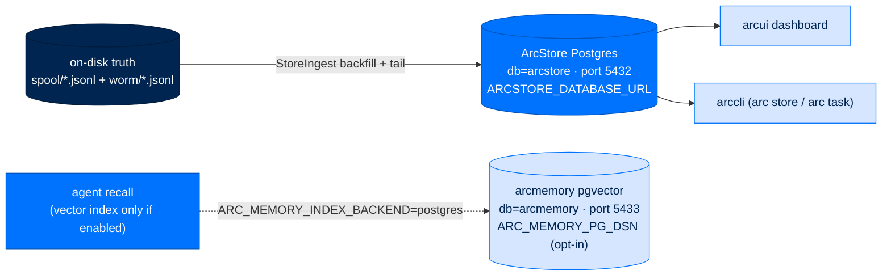

# Provision the Operational Store

> **Get Started**  ·  Set up  ·  step 3 — a prerequisite, not an afterthought
> **For** operators standing up a node who need a durable place for telemetry and audit
> [Docs home](../README.md)  ·  [Where data lives (why) →](../walkthrough/08-data-and-storage.md)  ·  [ArcStore PostgreSQL runbook →](../runbooks/deploy/arcstore-postgres.md)

---

## In one breath

Arc writes its durable truth to plain files on disk — an always-on telemetry
**spool** and a signed **WORM audit chain**. But the dashboard, the CLI's query
surface, and Mission Control read from an **external PostgreSQL operational
store** that ingests those files. That PostgreSQL is a real prerequisite: a fresh
node with no operational DB comes up with no queryable history. There can be up
to **two** Postgres databases per box: ArcStore's operational store (port `5432`,
required), and — only if you opt into the pgvector memory index — a *separate*
arcmemory database (port `5433`). They never share a container or a connection
string.

## The two-DB topology



- **ArcStore operational store — required.** `PostgresBackend` serves agents,
  arcui, and the CLI from one shared store. It ingests both durable files
  idempotently, so at-least-once backfill-then-tail never duplicates a row. The
  local path and the Supabase path use the same backend; only the URL changes.
- **arcmemory pgvector — optional.** Off by default (memory uses per-agent
  SQLite). Turn it on only when you want a shared vector index; it runs as a
  wholly separate database and DSN.

## Provisioning ArcStore Postgres

`scripts/install-postgres.sh` provisions a dedicated `arcstore-postgres` container
with the `arcstore-pg-data` named volume, binds PostgreSQL to loopback, waits for
`pg_isready`, and starts the backend once to apply and verify the packaged
schema. The database and role are both named `arcstore` by default. It is safe to
re-run: it reuses the container, volume, environment file, and migrated schema.

Your deploy automation should write the complete `ARCSTORE_DATABASE_URL` **only**
to `~/arc/config/arc.env` (mode `0600`) and pass it to the runtime through its
environment. It is never put in TOML, command output, or the repository.

```dotenv
# ~/arc/config/arc.env  (0600)
ANTHROPIC_API_KEY=...
# Optional; the deploy automation generates one when omitted.
ARCSTORE_DATABASE_PASSWORD=...
```

```bash
scripts/install-postgres.sh
```

The `[arcstore]` config block never holds the secret URL — only non-secret pool
settings (`pool_min_size`, `pool_max_size`, `command_timeout`, `connect_timeout`)
and, for vault deployments, a `database_credential_ref` coordinate. See the
[full config catalog](../reference/config-catalog.md#arcstore) for every key.

### Supabase (direct or pooler)

Put one URL in the protected source environment file before running the deploy;
it is copied to `arc.env` at `0600`:

```dotenv
# Direct connection — session features available
ARCSTORE_DATABASE_URL=postgresql://postgres:<password>@db.<project-ref>.supabase.co:5432/postgres?sslmode=require

# Transaction pooler — Supavisor host, port 6543
ARCSTORE_DATABASE_URL=postgresql://postgres.<project-ref>:<password>@aws-0-us-east-1.pooler.supabase.com:6543/postgres?sslmode=require
```

External hosts **require TLS**. ArcStore rejects `sslmode` values that weaken or
disable TLS, and the adapter sets `statement_cache_size=0` for port `6543`
because prepared statements don't survive transaction pooling. Direct connections
keep the normal statement cache. URL-encode reserved characters in the password.

For a vault-backed deployment, provide a coordinate instead of a URL — the
non-secret `[arcstore]` block holds only this, and the vault resolver supplies
the URL at runtime:

```dotenv
ARCSTORE_DATABASE_CREDENTIAL_REF=vault://arcstore/database
```

## Enabling the optional pgvector memory index

This is a *separate* database. Deployment uses
`scripts/install-memory-postgres.sh` (port `5433`, database `arcmemory`, volume
`arc-memory-pg-data`); it never reuses the ArcStore container or DSN. Two things
switch it on:

- `ARC_MEMORY_INDEX_BACKEND=postgres` in `~/arc/.env` — written by your deploy
  automation; it selects the postgres index backend (config field `index_backend`,
  default `sqlite`).
- `ARC_MEMORY_PG_DSN` — the arcmemory DSN, read at
  `packages/arcmemory/src/arcmemory/index/backend.py:614` inside
  `open_index_backend`, which requires the `asyncpg`/`pgvector` extra.

Leave both unset for the default: per-agent SQLite, shared-nothing, no server.
See [Tune knowledge & memory](tune-knowledge-and-memory.md) for when this is
worth it.

## Verify

```bash
# Deterministic checks (no live DB needed)
bash -n scripts/install-postgres.sh scripts/install-memory-postgres.sh
uv run pytest packages/arcstore/tests/unit/test_provisioning.py

# Against a live DB: proves connectivity + migration, then checks the schema
ARCSTORE_PYTHON="$HOME/.arc/runtime/current/.venv/bin/python" \
  "$HOME/.arc/runtime/current/scripts/install-postgres.sh"
```

The command output carries health and schema status only — never a DSN or a
password. **Do not** run `docker compose down -v` on these volumes unless you
intend to destroy ArcStore (or memory) data permanently.

---

**Why this is a prerequisite, not optional.** The dashboard and `arc store` /
`arc task` read exclusively from the operational store; without it, telemetry and
audit still land on disk (fail-open), but nothing is queryable and Mission
Control has no home. The full rationale — why the durable truth is files and the
store is a disposable read plane — is in
[Where data lives](../walkthrough/08-data-and-storage.md). Provisioning details
and release smoke checks are in the
[ArcStore PostgreSQL runbook](../runbooks/deploy/arcstore-postgres.md).
