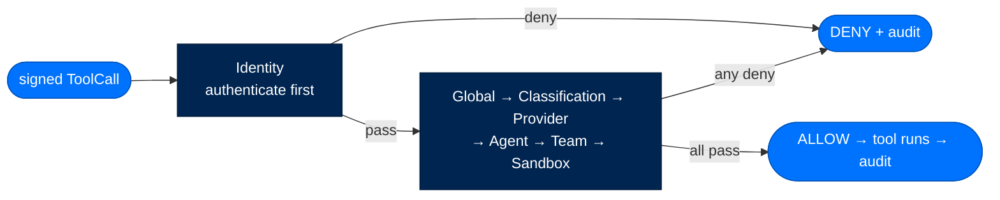
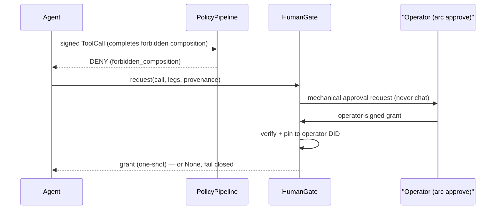

# Policy & Tiers

> **Get Started**  ·  Set up & tune  
> **You'll finish with:** the right tier for your deployment, an understanding of the policy pipeline that gates every tool call, and the two approval paths — one-shot for a human, scenario grants for unattended automation.  
> **Before this:** [Your First Agent](first-agent.md)  
> [Docs home](../README.md)

---

## What you'll achieve

Arc's security is a **dial, not a switch**. Every tier — personal included —
identifies every agent, verifies every loaded artifact, authorizes every tool
call, and audits every action. The tier only decides *how strict* that floor is.
This page shows how to set the tier, what the policy pipeline does on each call,
and how a human (or a signed standing grant) approves the calls it blocks.

---

## Tier is stringency, not a gate

The single most common misreading of Arc: the tier does **not** turn security
on. It layers stringency on top of a floor that never moves.

| Knob | Personal | Enterprise | Federal |
|---|---|---|---|
| Policy layers that run | Identity + Global (2) | + Classification, Provider, Agent, Sandbox (6) | + Team (7, all layers) |
| Trusted signers | self-signed OK (audit warn) | operator-chain | operator-chain, FIPS |
| Dynamic tool creation | allowed | approval-gated | denied |
| Signing algorithm | Ed25519 | Ed25519 | ECDSA-P256 (FIPS floor) |
| Code-execution sandbox | host subprocess → Docker | Docker container floor | Firecracker microVM |
| Approval-required tools | opt-in only | every plain tool | every tool and skill |

Every row is a *how strict*, never a *whether*. Set the tier once, at creation or
in the wizard — it applies to **every** subsystem at once (security, memory,
policy, skills, sandbox), so a config that's federal in one section and personal
in another is treated as a hole, not a preference:

```bash
arc init --tier enterprise                 # the setup wizard
arc agent create my-agent --tier federal   # per agent at creation
```

The tier lives in `[security].tier` in the agent's `arcagent.toml`:

```toml
[security]
tier = "enterprise"

[security.validators]
auto_run_agent_code = false   # personal-only escape hatch; enterprise/federal keep false
```

---

## The policy pipeline — what runs on every tool call

Before a tool runs, its call is signed and evaluated by the policy pipeline.
**First DENY wins. A layer that raises becomes a DENY, never a skip** — the guard's
answer to "something went wrong while deciding" is always *no*.



| Layer | What it checks |
|---|---|
| **Identity** | The call is signed by the DID's own key holder. Runs first, unconditionally. |
| **Global** | Tenant-wide denylist + the forbidden-composition check (the lethal trifecta, below). |
| **Classification** | No read-up — a call can't pull data above its clearance. |
| **Provider** | LLM token / cost / rate budget ceiling. |
| **Agent** | The per-agent tool allowlist. |
| **Team** *(federal)* | A delegation never exceeds its grant. |
| **Sandbox** | Required vs. available isolation (`host < container < vm`). |

Personal runs 2 layers, enterprise 6, federal all 7 — the same pipeline, tightened.

### The lethal trifecta

Private data + external comms + untrusted input, together on one call chain, is
an exfiltration primitive. The Global layer blocks that exact composition and
routes it to a human. The three legs accumulate across a session:

| Leg | Resolved by |
|---|---|
| `private_data` | any on-machine read — `file_read`, `memory`, `recall`, `user_profile` |
| `external_comms` | pushing agent-chosen content to an agent-chosen sink — `network_egress`, messaging, notify |
| `untrusted_input` | unvetted content ingested this session — `web`, `browser`, `extract`, `subprocess` |

---

## Approvals — the human gate

When the Global layer blocks a trifecta composition, the agent asks a human. The
request is **never a chat message** — it's an operator-authenticated write to a
shared store, so a prompt-injected message can't forge an approval. You resolve it
out of band:

```bash
arc approve list             # pending approvals + triage context
arc approve <id>             # mint an operator-signed grant (approve)
arc approve <id> --deny      # refuse
```

The grant is trusted only after it **both** verifies against the exact call it was
requested for **and** is pinned to *this* deployment's operator DID — that pin is
what stops a foreign keypair from self-minting an approval. A denial or a timeout
both fail closed: the blocked call never proceeds.



---

## Scenario grants — approving unattended automation

A one-shot grant binds to a **call hash**, so it's spent the instant the arguments
change. That's right for a human at a keyboard and fatal for a nightly workflow —
every night is a different call, so it would re-prompt an operator who's asleep.

A **scenario grant** fixes this without widening the gate. It binds to the five
facts that make an action *the same scenario* each time it recurs:

| Field | Meaning |
|---|---|
| `agent_did` | which agent acts |
| `tool_name` | which tool it calls |
| `composition` | which forbidden combination is waived — and only that one |
| `origin` | the non-interactive driver, e.g. `workflow:nightly-meeting-ingest` |
| `connection` | which external connection is reached, e.g. `jira` |

Arguments, session id, and run id may vary; everything above must match exactly.
**`origin` is what keeps this safe.** Only a *named automated driver* can match a
grant, so a waiver earned by a workflow never covers a free-form chat request —
interactive work carries no origin and matches nothing. A scenario-granted allow
is still an ordinary, audited policy decision: a standing grant removes the prompt,
never the record.

```python
from arctrust import sign_scenario_grant

grant = sign_scenario_grant(
    operator=operator_identity,          # never the agent's own key
    agent_did=agent.did,
    tool_name="jira_create_issue",
    composition=frozenset({"external_comms", "private_data"}),
    origin="workflow:nightly-meeting-ingest",
    connection="jira",
)
```

---

## Approving a gated capability

Above personal tier, an agent's own tool won't *load* until an operator approves
it. Approval is one action with three effects — sign the artifact, pin the key,
pin the source hash:

```bash
arc trust list --agent my-agent          # gated (non-loaded) capabilities
arc trust approve <name> --agent my-agent # sign + pin key + pin hash
arc trust disapprove <name> --agent my-agent
```

A signature proves *who wrote it and that it's unchanged* — never that it's
authorized. Authorization is the operator's recorded decision.

---

## Verify

```bash
arc agent build my-agent --check   # confirms the tier renders and the config is whole
arc agent status my-agent          # tier, DID, model
```

---

## Next

- **Automate with workflows** → [Workflows & Schedules](workflows.md) (where
  scenario grants earn their keep), or connect a chat surface in [Gateways](gateways.md).
- **How a tool call moves through the guard chain** → [The Security Model](../walkthrough/10-security-model.md)
  and the [Security reference](../reference/security.md) walk the 7-layer pipeline,
  first-DENY-wins, and fail-closed in full.
