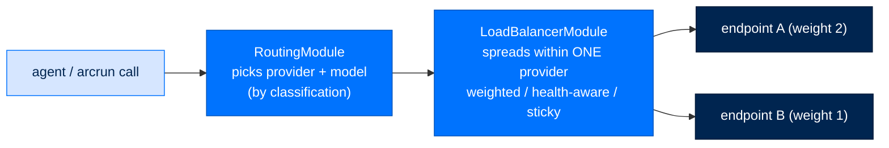

# Configure Providers

> **Get Started**  ·  Set up & tune  
> **You'll finish with:** your model provider configured, an override pointing at your own endpoint if you need one, and — optionally — a load-balanced pool across several endpoints.  
> **Before this:** [Install & the Two Homes](install.md)  
> [Docs home](../README.md)

---

## What you'll achieve

Arc talks to every LLM vendor through one interface (`arcllm`), so nothing above
it knows a vendor's HTTP dialect. This page shows the three things you'll actually
configure: **which provider and model** an agent uses, **a base-URL override**
when you run a private or Azure endpoint, and **an endpoint pool** when one URL
isn't enough throughput.

You won't hand-write vendor SDK code. Every provider is a plain HTTP adapter, so
the bytes on the wire stay readable and auditable.

---

## See what's available

```bash
arc llm providers            # every provider Arc knows
arc llm provider anthropic   # one provider's details and models
arc llm models --tools       # only models that support tool calls
arc llm validate             # configs parse and a key resolves
arc llm prompt "hello"       # a single-turn smoke test
```

`arc llm models --tools` matters before you build an agent: a tool-using agent on
a model that can't carry tool calls fails loudly at invoke time. Check first.

---

## Point an agent at a provider

An agent's model lives in its `arcllm.toml` (or is set at creation with
`--model provider/model`). The provider's connection settings and per-model
metadata come from a provider descriptor — pure data, no code:

```toml
# a provider descriptor: [provider] connection + [models.*] metadata
[provider]
base_url = "https://api.anthropic.com"
api_key_env = "ANTHROPIC_API_KEY"
api_key_required = true
default_model = "claude-sonnet-5"

[models.claude-sonnet-5]
context_window = 1000000
max_output_tokens = 128000
supports_tools = true
supports_vision = true
cost_input_per_1m = 3.00
cost_output_per_1m = 15.00
```

The **descriptor knows which model, at what price, with what limits**; the
**adapter knows how to speak the wire format**. Adding a model to an existing
provider is a data edit, never a code change.

The API key is resolved at runtime from `api_key_env` (or a vault path) — the
descriptor stores the variable *name*, never the secret. Set the key with
[`arc keys set`](identity-and-keys.md#provider-api-keys-never-in-config).

---

## Override a provider's endpoint

The most common real-world need: point a provider at *your* endpoint — a private
Azure OpenAI resource, an internal gateway, or an on-prem server. You do **not**
edit the installed package. You add a `[providers.<name>]` table to your
`~/.arc/arcllm.toml`, and it deep-merges over the packaged descriptor:

```toml
# ~/.arc/arcllm.toml
[providers.azure_openai]
base_url = "https://my-resource.openai.azure.com"
api_key_env = "AZURE_OPENAI_API_KEY"
```

The packaged default can't know your private host, and editing the installed
package would put one machine's address in every copy. The merged result is
validated like any other config, so an override can't buy itself a rule the
package would refuse — a remote `base_url` must still be HTTPS, for example.

Some providers differ by more than a URL — Azure OpenAI sends an `api-key`
header instead of `Authorization: Bearer`, and its path omits `?api-version`.
That behavior is the adapter's, chosen by which provider you name; you don't
configure it. The broader **provider inheritance model** — remapping auth headers
or model names per provider beyond `base_url`/key — is **needs confirmation** for
this guide; today, set the endpoint and key as above and the adapter handles the
dialect.

### Running fully on-box (air-gap)

Three providers require no key and default to `localhost`: **ollama**, **vllm**,
and **huggingface_tgi**. `arcllm` allows plain HTTP for `localhost`/`127.0.0.1`
while enforcing HTTPS on every remote host, so a federal deployment with no
outbound internet can serve any of these three entirely on-box.

```toml
[providers.ollama]
base_url = "http://localhost:11434"
```

---

## Load-balance across a pool

When one endpoint isn't enough — throughput, or redundancy across several
identical backends of the same provider — declare an endpoint pool. Each
endpoint is a variant `base_url`/key of the *same* provider, so it reuses the
identical HTTPS and key-resolution rules (there is no second, less-audited path
for endpoint credentials):

```toml
# in the provider descriptor / override
[[endpoints]]
base_url = "https://gpu-a.internal.example"
api_key_env = "POOL_KEY_A"
weight = 2

[[endpoints]]
base_url = "https://gpu-b.internal.example"
api_key_env = "POOL_KEY_B"
weight = 1
```

The load-balancer module spreads calls across the pool. Pick a strategy:

| `strategy` | Behavior |
|---|---|
| `weighted_round_robin` (default) | A shared cursor over the pool, biased by each endpoint's `weight`. |
| `health_aware` | Skips endpoints whose per-endpoint circuit is currently tripped. |
| `sticky` | Routes related calls to the same endpoint by a sticky key. |



Two ideas sit next to each other and shouldn't be confused. **Routing** chooses
*which provider and model* answers a call (an outer decision). **Load-balancing**
spreads calls *within one already-chosen provider* (an inner decision) — so a
pool never spreads your data across vendors, only across your own backends of the
same one. Both live inside `arcllm`; nothing above it sees an endpoint.

---

## Verify

```bash
arc llm validate                 # every configured provider parses and resolves a key
arc agent build my-agent --check # confirms the agent's provider + model are reachable
```

---

## Next

- **Tune the security dial** → [Policy & Tiers](policy-and-tiers.md), or
  **stand up more agents** → [Build a Fleet](fleet.md).
- **How 20+ vendors become one contract** → [The Unified Adapter](../walkthrough/04-unified-adapter.md)
  covers the adapter/descriptor split, the module stack, and where routing and
  load-balancing sit in the call path.
