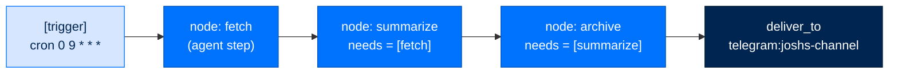

# Workflows & Schedules

> **Get Started**  ·  Set up & tune  
> **You'll finish with:** an understanding of the two ways Arc does work over time — the task board an agent runs on its own, and signed ArcFlow workflows that fire on a schedule and deliver their results to a fixed channel.  
> **Before this:** [Your First Agent](first-agent.md)  
> [Docs home](../README.md)

---

## What you'll achieve

Not everything is a chat turn. Some work is a list an agent grinds through; some
work fires at 9am whether or not anyone's watching. This page covers both: the
**tasks** module (Mission Control) and **ArcFlow** (signed, multi-step workflow
DAGs with cron triggers). By the end you can enable autonomous task dispatch and
create a workflow that runs on a schedule and posts its summary to a channel you
pin.

---

## Two kinds of "does work over time"

| | Tasks (Mission Control) | ArcFlow workflows |
|---|---|---|
| Unit | a single task row (`backlog → todo → in_progress → done`) | a signed DAG of nodes (`workflow.toml`) |
| Who drives it | one agent's own dispatch loop | the `WorkflowRunner` ticking a frontier |
| Fires on | assignment / claim | a `cron` / `interval` / `manual` trigger |
| Best for | a queue of independent jobs, retries, hand-offs | a fixed multi-step process (ingest → summarize → deliver) |

---

## Tasks — Mission Control

The tasks module gives an agent a durable task list — its own, plus the team
backlog. A task created by an agent tool, the `arc task` CLI, or the dashboard
kanban is the **same row** all three read and write.

> **It's off by default, and autonomy is a second opt-in.** Loading the module
> exposes the tools; it does **not** make an agent run work on its own. Running
> assigned work autonomously is agency the operator grants deliberately.

```toml
[modules.tasks]
enabled = true

[modules.tasks.config]
dispatch = false            # opt into autonomously running the agent's own ready tasks
default_max_attempts = 3    # retry ceiling on tasks this agent creates
retry_backoff_seconds = 30.0
task_timeout_seconds = 0.0  # 0 = unbounded
routing = true              # auto-route ownerless tasks to the best eligible agent
notify = true               # operator alerts on key transitions
```

With `dispatch = true`, a background loop claims the agent's highest-priority
ready task (dependencies met, backoff elapsed), pins a `run_id`, and runs it
under a reliability wrapper — retry with exponential backoff, wall-clock timeout,
stuck-task reclaim on restart, and dead-letter after `max_attempts`. One task in
progress at a time, per agent.

Operate the board from the CLI (writes are operator-gated by `--actor` and
audited):

```bash
arc task create "Draft the Q3 report" --actor @lead --priority high   # unowned → team backlog
arc task create "Ship it" --actor @lead --owner @analyst-1            # assigned at creation
arc task list --scope mine --actor @analyst-1                        # omit --scope for the team view
arc task assign <id> @analyst-1 --actor @lead
arc task complete <id> --actor @analyst-1 --resolution "done"
arc task talk <id> "any update?" --actor @lead                       # steer an in-progress owner
```

Edit an *at-rest* task with `arc task edit`; it refuses an `in_progress` task
(steer it with `arc task talk`, don't edit it underneath the run). The same rows
are on the dashboard's Tasks board (operator role).

---

## ArcFlow — signed workflows on a schedule

An ArcFlow workflow is a `workflow.toml` document: a small DAG of nodes, each a
bounded step, run in dependency order by a single runner. The document is
**signed** — the DAG the runner advances is exactly the DAG the operator approved,
and a model can't rewrite it mid-run.



A workflow document, in outline:

```toml
id = "nightly-meeting-ingest"
version = 1
owner = "agent://josh_agent"
channel = "work"

[trigger]
type = "cron"
expression = "0 9 * * *"      # every day at 09:00

[[node]]
id = "fetch"
kind = "agent"
agent = "josh_agent"
prompt = "prompts/fetch.md"   # a file-referenced prompt

[[node]]
id = "summarize"
kind = "agent"
agent = "josh_agent"
needs = ["fetch"]             # dependency edge; runs after fetch reaches done
prompt = "prompts/summarize.md"
deliver_to = "telegram:joshs-channel"   # pin this node's summary to a channel
```

Key fields:

- **`[trigger]`** — `type = "cron"` with a cron `expression`, `"interval"` with
  `interval_s`, or `"manual"`. A cron trigger materializes an **owner-scoped
  schedule**; the runner ticks the frontier and narrates progress to the team
  channel.
- **`needs`** — a node's dependency list. A node runs once every named upstream
  reaches `done` (or `skipped`). `join = "all"` (default) or `"any"` sets fan-in.
- **Node kinds** — `agent` (a bounded agent run with a file-referenced `prompt`),
  `tool`, `script`, `router`, `gate`.
- **`deliver_to`** — the important one for scheduled work. A cron run arrives on
  **no** channel, so a node's `notify_user` would fall back to whatever chat the
  operator last used — often the wrong one. Pinning `deliver_to =
  "platform:chat_id"` in the *signed* document makes the summary land on the same
  channel every time, and a model cannot redirect it. It's a gateway target like
  `telegram:12345`.

### Create, sign, run

```bash
arc workflow create ./nightly-meeting-ingest/         # validate + register a document
arc workflow sign   ./nightly-meeting-ingest/         # sign the bundle
arc workflow list                                     # registered workflows
arc workflow show nightly-meeting-ingest              # one workflow's detail
arc workflow run nightly-meeting-ingest --input in.json --detach   # run it now
arc workflow serve                                    # tick schedules continuously
arc workflow cancel <run_id>
arc workflow verify ./nightly-meeting-ingest/         # check the signature
```

Every `arc workflow` verb takes `--dir` to point at a config directory other than
the default. Validation runs inside `create`/`edit`, so there's no separate
`validate` verb.

> **A workflow that reaches out to an external system on a schedule** will trip
> the trifecta gate — and no human is awake to approve it. That's exactly what a
> **scenario grant** is for: pre-approve the recurring composition, keyed by the
> workflow's `origin`. See [Policy & Tiers](policy-and-tiers.md#scenario-grants-approving-unattended-automation).

---

## Verify

```bash
arc workflow list                # your workflow is registered
arc task list --actor @lead      # the board is reachable
```

---

## Next

- **Deliver results to a chat platform** → [Gateways](gateways.md), then
  **ship it** → [Deploy](deploy.md).
- **The substrate under both** → [The Workflows](../walkthrough/09-workflows.md)
  covers the task state machine, the three timer engines, and the monotonic-progress
  rule ArcFlow runs on.
