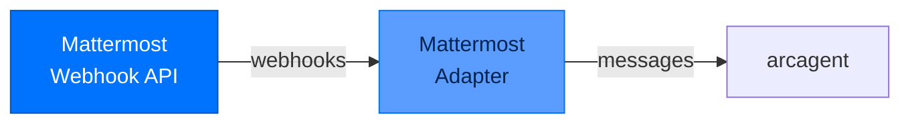

# arcgateway-mattermost - Mattermost Integration

> **Layer:** Surface  
> **Dependencies:** arcgateway  
> **Install:** `pip install arcgateway-mattermost`
> **See also:** [arcgateway.md](arcgateway.md), [DATA_FLOW.md](../DATA_FLOW.md)

---

## Overview

`arcgateway-mattermost` provides **Mattermost integration** for Arc agents.



---

## Setup

### Create Mattermost Integration

1. Go to **System Console** → **Integrations** → **Outgoing Webhooks**
2. Create new webhook:
   - **Trigger Words**: `@arc`, `arc`
   - **Callback URLs**: `https://your-domain.com/webhook/mattermost`
   - **Token**: Generate secure token

### Configure Environment

```bash
# Add to .env
MATTERMOST_TOKEN=your-webhook-token
MATTERMOST_SIGNING_SECRET=your-signing-secret
MATTERMOST_BOT_TOKEN=your-bot-token

# Or in arcagent.toml
[gateway.mattermost]
token_env = "MATTERMOST_TOKEN"
signing_secret_env = "MATTERMOST_SIGNING_SECRET"
```

### Start Gateway

```bash
arc gateway start --platform mattermost
```

---

## Features

### Supported Events

| Event | Handled |
|-------|---------|
| `posted` | ✅ |
| `edited_post` | ✅ |
| `direct_posted` | ✅ |

### Message Format

```python
{
    "token": "your-webhook-token",
    "team_id": "team-id",
    "team_domain": "your-team",
    "channel_id": "channel-id",
    "channel_name": "town-square",
    "timestamp": 1234567890,
    "user_id": "user-id",
    "user_name": "username",
    "post_id": "post-id",
    "text": "@arc help",
    "trigger_word": "@arc"
}
```

---

## Slash Commands

### Built-in Commands

| Command | Purpose |
|---------|---------|
| `/arc help` | Show help |
| `/arc status` | Agent status |
| `/arc pair` | Get pairing code |

---

## Configuration

```toml
[gateway.mattermost]
enabled = true
token_env = "MATTERMOST_TOKEN"
signing_secret_env = "MATTERMOST_SIGNING_SECRET"
allowed_teams = ["team-id"]
```

---

## API Reference

### Classes

```python
class MattermostAdapter:
    def __init__(
        self,
        token: str,
        signing_secret: str = None
    ): ...
    
    async def handle_posted(self, payload: dict) -> None:
        """Handle Mattermost webhook."""

def verify_mattermost_signature(
    body: str,
    signature: str,
    secret: str
) -> bool:
    """Verify Mattermost webhook signature."""
```

---

## Next Steps

- [arcgateway](arcgateway.md) - Base gateway documentation
- [Package Index](PACKAGE_INDEX.md) - All Arc packages