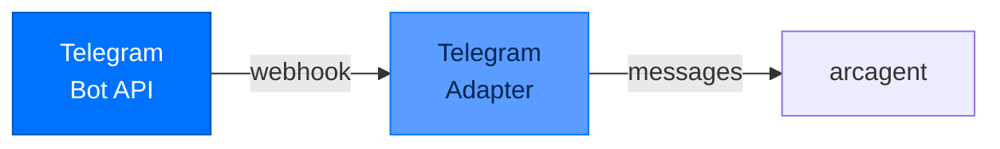

# arcgateway-telegram - Telegram Integration

> **Layer:** Surface  
> **Dependencies:** arcgateway  
> **Install:** `pip install arcgateway-telegram`
> **See also:** [arcgateway.md](arcgateway.md), [DATA_FLOW.md](../DATA_FLOW.md)

---

## Overview

`arcgateway-telegram` provides **Telegram bot integration** for Arc agents.



---

## Setup

### Create Bot

1. Talk to [@BotFather](https://t.me/BotFather) on Telegram
2. Send `/newbot`
3. Follow instructions to get bot token

### Configure Environment

```bash
# Add to .env
TELEGRAM_BOT_TOKEN=123456789:ABCdefGHIjklMNOpqrsTUVwxyz

# Or in arcagent.toml
[gateway.telegram]
bot_token_env = "TELEGRAM_BOT_TOKEN"
```

### Start Gateway

```bash
arc gateway start --platform telegram
```

---

## Features

### Supported Updates

| Update Type | Handled |
|-------------|---------|
| Message | ✅ |
| Edited Message | ✅ |
| Channel Post | ✅ |
| Edited Channel Post | ✅ |
| Inline Query | ❌ |
| Callback Query | ✅ (for buttons) |

### Message Types

```python
# Text messages
{"message": {"text": "Hello agent"}}

# Commands
{"message": {"text": "/start"}}
{"message": {"text": "/help"}}

# Photos
{"message": {"photo": [...], "caption": "Analyze this"}}

# Documents
{"message": {"document": {...}}}
```

---

## Commands

### Built-in Commands

| Command | Purpose |
|---------|---------|
| `/start` | Begin interaction |
| `/help` | Show help |
| `/pair` | Get pairing code |
| `/status` | Agent status |
| `/sessions` | List sessions |
| `/switch` | Switch session |

### Custom Commands

```python
# Define in agent
@tool(name="telegram_command", classification="network")
async def handle_custom_command(command: str, args: str) -> str:
    """Handle custom Telegram commands."""
    if command == "/analyze":
        return await analyze_data(args)
```

---

## Configuration

```toml
[gateway.telegram]
enabled = true
bot_token_env = "TELEGRAM_BOT_TOKEN"
allowed_chat_ids = [
    "123456789",  # Your user ID
    "-1001234567890"  # Your channel ID (negative)
]
webhook_url = "https://your-domain.com/webhook/telegram"
```

### Finding Chat IDs

```bash
# Private chat - use your user ID
# Get from @userinfobot

# Channel - negative channel ID
# Add bot as admin, send message, check logs
```

---

## Webhook Setup

### With ngrok

```bash
# Start ngrok
ngrok http 8000

# Set webhook
curl "https://api.telegram.org/bot$BOT_TOKEN/setWebhook" \
     -d "url=https://your-ngrok-url/webhook/telegram"
```

### With Reverse Proxy

```nginx
# nginx config
location /webhook/telegram {
    proxy_pass http://localhost:8000/webhook/telegram;
    proxy_set_header Host $host;
    proxy_set_header X-Real-IP $remote_addr;
}
```

---

## API Reference

### Classes

```python
class TelegramAdapter:
    def __init__(
        self,
        bot_token: str,
        allowed_chat_ids: list[str] = None
    ): ...
    
    async def handle_update(self, update: dict) -> None:
        """Handle Telegram webhook update."""
    
    def verify_signature(self, update: dict, signature: str) -> bool:
        """Verify update signature."""
```

### Functions

```python
def parse_telegram_message(update: dict) -> GatewayMessage:
    """Parse Telegram update to GatewayMessage."""

def format_telegram_response(reply: str) -> dict:
    """Format response for Telegram."""
```

---

## Security

### Signature Verification

```python
def verify_telegram_update(update: dict, bot_token: str) -> bool:
    """
    Verify update came from Telegram.
    Uses HMAC-SHA256 with bot token.
    """
    secret = hashlib.sha256(bot_token.encode()).digest()
    # Verify signature in headers
```

### Allowed Chat IDs

```python
def is_allowed_chat(chat_id: str, allowed: list[str]) -> bool:
    """Check if chat ID is in allowlist."""
    return chat_id in allowed
```

---

## Next Steps

- [arcgateway](arcgateway.md) - Base gateway documentation
- [Package Index](PACKAGE_INDEX.md) - All Arc packages