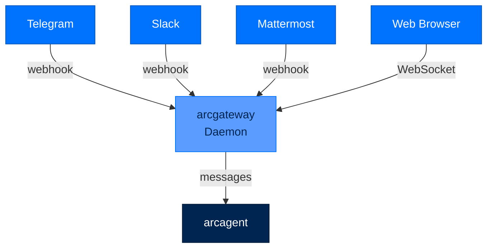
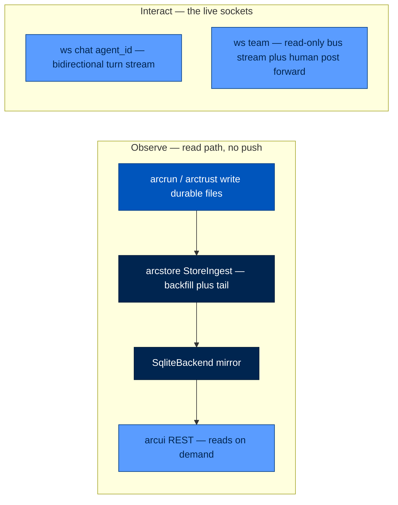
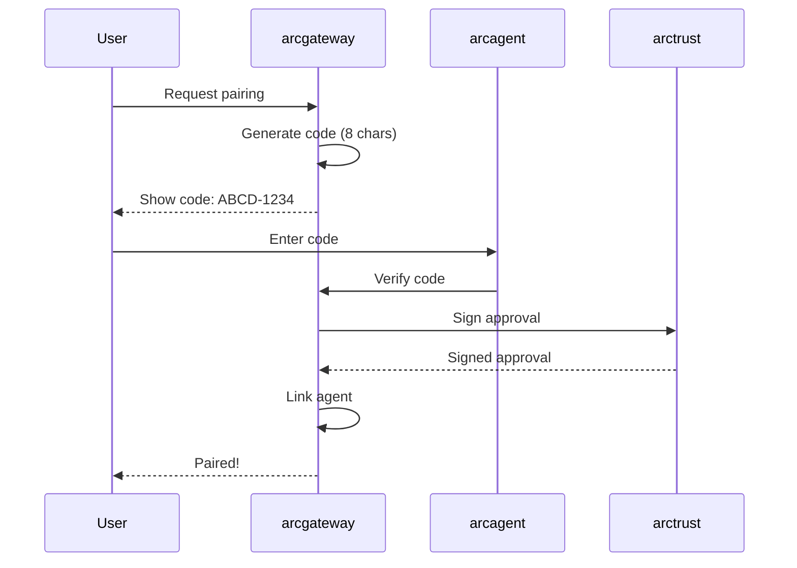
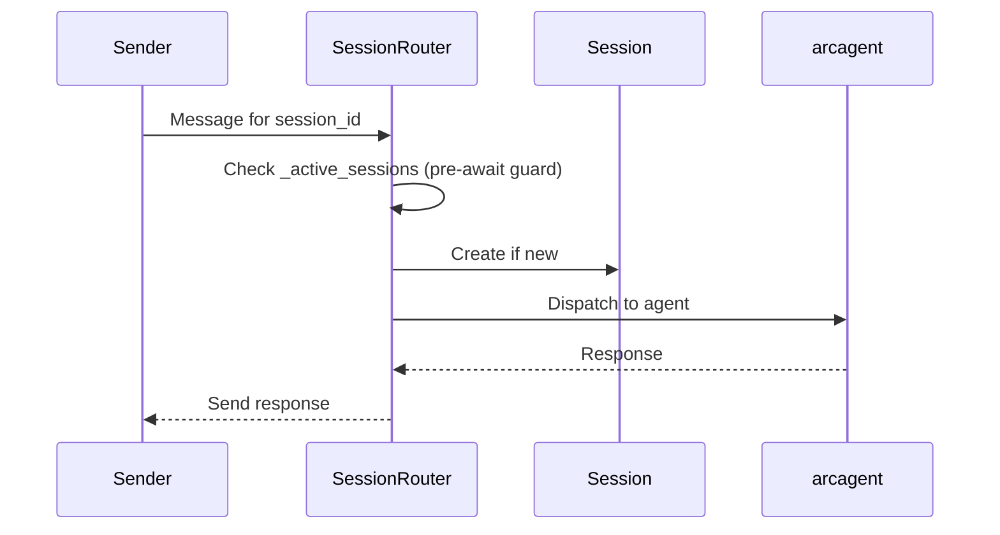

# arcgateway - Chat Platform Daemon

> **Layer:** Surface  
> **Dependencies:** arcagent  
> **Install:** `pip install arcgateway`  
> **See also:** [DATA_FLOW.md](../DATA_FLOW.md), [IMPLEMENTATION_GUIDES.md](../IMPLEMENTATION_GUIDES.md), [DEPLOYMENT.md](../DEPLOYMENT.md)

---

## Overview

`arcgateway` provides **chat platform integration** for Arc agents:
- **Platform adapters** - Telegram, Slack, Mattermost, Web
- **Pairing system** - Secure agent-device linking with Ed25519 signatures
- **Message routing** - Unified message format with session management
- **Webhook handling** - Platform-specific endpoints with verification



---

## Architecture

### Embedded Gateway Pattern

**The embedded gateway is canonical at every tier.** `arc ui start` embeds the gateway inside a single process that serves:
- The dashboard UI (Observe plane)
- Web chat WebSocket (Interact plane)
- Every enabled remote platform adapter



**Important:** The standalone `arcgateway start` daemon unconditionally refuses to start at every tier because it has no working agent-execution path. Use the embedded path instead:

```bash
arc ui start --team-root team --gateway-config ~/.arc/gateway.toml
```

### Two Planes Architecture

- **Observe Plane**: Read-only access to agent history via REST endpoints. Every write lands in durable files immediately; `arcui` reads on demand.
- **Interact Plane**: Live bidirectional communication. Two WebSockets exist:
  - `/ws/chat/{agent_id}` - Turn stream for live chat
  - `/ws/team` - Team messaging bus (read-only view + human post forward)

---

## Installation

### From PyPI

```bash
pip install arcgateway arccli
```

### Development Workspace

```bash
uv pip install -e packages/arcgateway -e packages/arccli -e packages/arcagent -e packages/arcllm -e packages/arcrun
```

Platform adapters (Telegram, Slack, Mattermost) are discovered via the `arcgateway.adapters` entry-point group. `arcgateway-telegram` is a root dependency alongside `arcmemory`/`arcskill` — a bare `uv sync` installs it automatically.

---

## Configuration

### gateway.toml

```toml
[gateway]
tier = "personal"                     # personal | enterprise | federal
agent_did = "did:arc:local:executor/..."   # filled after agent create

[security]
require_pairing = false               # DM pairing gate

[platforms.web]
enabled = true                        # required for --gateway-config path

[platforms.telegram]
enabled = true
token_env = "TELEGRAM_BOT_TOKEN"
allowed_user_ids = ["123456789"]

[platforms.slack]
enabled = true
bot_token_env = "SLACK_BOT_TOKEN"
signing_secret_env = "SLACK_SIGNING_SECRET"
app_token_env = "SLACK_APP_TOKEN"
allowed_user_ids = ["U0ABC123"]

[platforms.mattermost]
enabled = true
token_env = "MATTERMOST_TOKEN"
signing_secret_env = "MATTERMOST_SIGNING_SECRET"
```

### Secrets File

Create `~/.arc/arc.env` (0600 permissions):

```bash
# Required
ANTHROPIC_API_KEY=sk-ant-...
TELEGRAM_BOT_TOKEN=...
VIEWER_TOKEN=$(openssl rand -hex 32)
OPERATOR_TOKEN=$(openssl rand -hex 32)
```

---

## Platform Adapters

### Telegram Adapter

```python
from arcgateway.adapters.telegram import TelegramAdapter

adapter = TelegramAdapter(
    bot_token="123456:ABC-DEF...",
    allowed_chat_ids=["123456789"]
)

await adapter.handle_update(update)
```

**Setup:**
1. Create bot via [@BotFather](https://t.me/BotFather) → `/newbot`
2. Set `TELEGRAM_BOT_TOKEN` in environment
3. Add user IDs to `allowed_user_ids` in config
4. Send `/start` to the bot once to register

### Slack Adapter

```python
from arcgateway.adapters.slack import SlackAdapter

adapter = SlackAdapter(
    bot_token="xoxb-...",
    signing_secret="...",
    app_token="xapp-...",
    allowed_channels=["C1234567890"]
)

await adapter.handle_event(event)
```

**Setup:**
1. Create app at [api.slack.com/apps](https://api.slack.com/apps)
2. Enable Socket Mode
3. Add bot scopes: `chat:write`, `im:history`, `im:read`
4. Generate app-level token with `connections:write` scope
5. Install app and copy tokens to environment

### Mattermost Adapter

```python
from arcgateway.adapters.mattermost import MattermostAdapter

adapter = MattermostAdapter(
    token="...",
    signing_secret="...",
    allowed_teams=["team-id"]
)

await adapter.handle_posted(post)
```

**Setup:**
1. Create bot account in Mattermost
2. Generate token with appropriate permissions
3. Configure in `gateway.toml`

### Web Adapter

The web adapter is built into the embedded gateway and requires no additional configuration.

---

## Pairing System

### Device Pairing Flow



### Pairing Commands

```bash
# Initialize operator identity (run once)
arc identity init

# Approve a pending pairing
arc gateway pair approve X7K2MQJP

# List pending pairings
arc gateway pair list

# Revoke a pairing
arc gateway pair revoke X7K2MQJP
```

### Pairing Security

| Feature | Implementation |
|---------|----------------|
| Code format | 8 chars from `ABCDEFGHJKLMNPQRSTUVWXYZ23456789` (no ambiguous chars) |
| TTL | 1 hour |
| Rate limit | 1 request per user per 10 min |
| Lockout | 5 failed approvals → 1 hour platform lockout |
| Storage | SHA-256-16 hash of user ID (raw ID never stored) |
| Federal tier | Ed25519 signature required |

---

## Message Format

### Unified Format

```python
class GatewayMessage(TypedDict):
    id: str              # Unique message ID
    platform: str        # "telegram" | "slack" | "mattermost" | "web"
    platform_id: str     # Platform-specific message ID
    sender: str          # Platform user ID
    sender_name: str     # Display name
    channel: str         # Channel/thread ID
    text: str            # Message content
    timestamp: str       # ISO timestamp
    attachments: list[dict]  # File attachments
```

### Message Handling

```python
async def handle_message(message: GatewayMessage) -> None:
    """Handle incoming message from any platform."""
    
    # Normalize to Arc format
    arc_message = {
        "from": message.sender,
        "to": [agent_id],
        "body": message.text,
        "timestamp": message.timestamp
    }
    
    # Enqueue for agent
    await agent.enqueue(arc_message)
```

---

## Session Management

### Session Router



The session router uses a **pre-await race guard** to prevent concurrent messages to the same session from spawning multiple agent tasks:

```python
# arcgateway/session.py::SessionRouter.handle()
if session_key in self._active_sessions:
    self._queue_for_session(session_key, event)
    return
self._active_sessions[session_key] = asyncio.Event()   # synchronous
asyncio.create_task(self._process_event(session_key, event))
```

---

## Security

### Tier Matrix

| Aspect | personal | enterprise | federal |
|--------|----------|------------|---------|
| Executor | AsyncioExecutor (in-process) | AsyncioExecutor | SubprocessExecutor (subprocess per chat) |
| Credentials | file or env | vault preferred, env fallback w/ warn | vault required; hard error on unreachable |
| DM pairing approver | CLI | CLI | CLI + DID signature |
| Cross-session reads | N/A | per-session ACL | per-session ACL, default `private` |
| Audit events | optional | required | required (all `gateway.*` events) |
| Subprocess limits | n/a | n/a | RLIMIT_AS/CPU/NOFILE |

### SubprocessExecutor (Federal)

Each `(user, agent)` session runs in its own OS subprocess via `arc-agent-worker`:

| Limit | Default | Syscall |
|-------|---------|---------|
| `memory_mb` | 512 | `RLIMIT_AS` |
| `cpu_seconds` | 60 | `RLIMIT_CPU` |
| `file_descriptors` | 256 | `RLIMIT_NOFILE` |

Applied via `preexec_fn` on `asyncio.create_subprocess_exec`.

### Vault Resolver

```python
# arcagent.modules.vault.resolver.resolve_secret(name, tier, backend, env_fallback_var)
```

| Tier | Missing vault | Vault unreachable | Env fallback |
|------|---------------|-----------------|------------|
| federal | hard error at startup | hard error, no fallback | not attempted |
| enterprise | vault required, graceful degrade | warn + audit + env | permitted |
| personal | env → file (0600) → error | env | always |

### Audit Events

All events emitted via `arcagent.core.telemetry`:

| Event | Emitted by | Fields |
|-------|------------|--------|
| `gateway.runner.{started,stopping,stopped}` | `GatewayRunner` | adapter_count |
| `gateway.adapter.{connected,disconnected,fail}` | `BasePlatformAdapter` | platform, adapter_id, reason |
| `gateway.adapter.auth_rejected` | Adapters | platform, user_id_hash |
| `gateway.session.{create,executor_choice}` | `SessionRouter` | session_id, executor_type |
| `gateway.pairing.{minted,approved,denied,expired,locked_out}` | `PairingStore` | platform, code_id (hash), expires_at |
| `gateway.identity.{link,unlink}` | `IdentityGraph` | user_did, platform, user_hash |

---

## Multi-Instance Considerations

Single-instance is the default and the only fully supported deployment today.

### Problems When Scaling

| Subsystem | Problem | Mitigation |
|-----------|---------|------------|
| **Telegram polling** | One process per bot token; races silently | Webhook mode + consistent hash routing |
| **`SessionRouter._active_sessions`** | In-memory dict diverges | Sticky routing OR shared SessionIndex via NFS |
| **`PairingStore`** | SQLite local disk | Postgres backend (M3) |
| **Typing indicators** | Double-fire without sticky routing | Sticky routing |
| **Streaming edits** | Two instances edit same message | Per-message claim token |

### Capacity Estimates

| Isolation mode | RSS per session | Cold start |
|----------------|-----------------|------------|
| asyncio task (personal/enterprise) | 2–8 MB | 10–50 ms |
| subprocess (federal) | 35–60 MB | 150–400 ms |
| Firecracker microVM (future) | 128 MB | 125 ms |

A federal-tier instance with 8 GB RAM sustains roughly 100 concurrent sessions.

---

## CLI Commands

```bash
# Start gateway (embedded)
arc ui start --team-root team --gateway-config ~/.arc/gateway.toml

# Pairing
arc gateway pair approve <CODE>   # Approve pending pairing
arc gateway pair list             # List pending
arc gateway pair revoke <CODE>    # Revoke

# Status
arc gateway status                # Gateway health
arc agent status <name>           # Agent status

# Deprecated (refuses at every tier)
arcgateway start                # Always refuses with explanation
```

---

## API Reference

### Classes

```python
class GatewayDaemon:
    def start(self) -> None: ...
    async def handle_webhook(self, payload: dict) -> None: ...

class TelegramAdapter:
    def __init__(self, bot_token: str, allowed_chat_ids: list[str]): ...
    async def handle_update(self, update: dict) -> None: ...

class SlackAdapter:
    def __init__(self, bot_token: str, signing_secret: str, app_token: str): ...
    async def handle_event(self, event: dict) -> None: ...

class MattermostAdapter:
    def __init__(self, token: str, signing_secret: str): ...
    async def handle_posted(self, post: dict) -> None: ...

class PairingStore:
    def mint(self, platform: str, user_hash: str) -> str: ...
    def verify_and_consume(self, code: str, approver_did: str) -> bool: ...
```

### Security Functions

```python
def verify_telegram(update: dict, bot_token: str) -> bool: ...
def verify_slack(event: dict, signing_secret: str) -> bool: ...
def verify_mattermost(post: dict, signing_secret: str) -> bool: ...
```

---

## NIST Control Mapping

| Control | Implementation |
|---------|---------------|
| **AU-2** Audit events | Every state-changing op emits gateway.* events |
| **AU-3** Audit content | Fields + timestamp + session/agent DIDs |
| **AU-9** Tamper-evident | JSONL append-only session store |
| **AU-10** Non-repudiation | DID-signed audit entries |
| **AC-3** Access enforcement | `allowed_user_ids` + pairing gate + ACL |
| **AC-4** Information flow | Tier-gated ACL; per-tenant httpx pool |
| **IA-3** Device identity | Ed25519 DIDs per agent + per subprocess |
| **IA-5** Authenticator | Vault resolver; 0600 file fallback |
| **SC-3** Isolation | SubprocessExecutor per session |
| **SC-8** Encryption | TLS 1.2+ to platform APIs |

---

## Threat Surface Covered

| Threat | Mitigation |
|--------|------------|
| **LLM01 Prompt Injection** | Caller DID bound at transport; skill scan |
| **LLM02 Sensitive Disclosure** | ACL filter; PII-safe audit (hashed IDs) |
| **LLM06 Excessive Agency** | Tool allowlist; cron strips dangerous tools |
| **ASI01 Goal Hijack** | identity.md immutable |
| **ASI02 Tool Misuse** | DELEGATE_BLOCKED_TOOLS; disabled_toolsets |
| **ASI03 Identity Abuse** | Per-child DID via HKDF (M3) |
| **ASI06 Memory Poisoning** | memory_acl bus veto; skills hub blocks covert writes |
| **ASI08 Cascading Failures** | TaskGroup isolation; spawn timeout + budget |

---

## Next Steps

- [DEPLOYMENT.md](../DEPLOYMENT.md) - Production deployment guides
- [SECURITY.md](../SECURITY.md) - Security model
- [IMPLEMENTATION_GUIDES.md](../IMPLEMENTATION_GUIDES.md) - Custom adapters