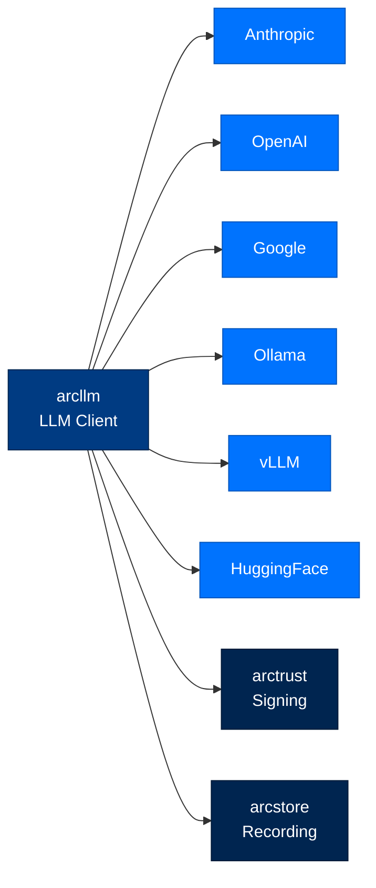
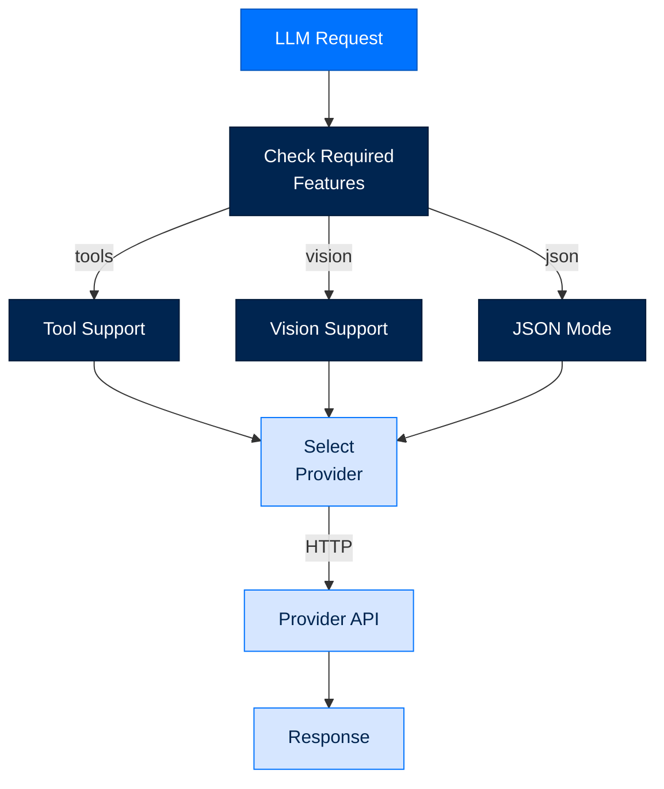

# arcllm - LLM Client

> **Layer:** LLM  
> **Dependencies:** arctrust, arcstore  
> **Install:** `pip install arcllm`
> **See also:** [DATA_FLOW.md](../DATA_FLOW.md), [API_REFERENCE.md](../API_REFERENCE.md), [PACKAGE_INDEX.md](../PACKAGE_INDEX.md)

---

## Overview

`arcllm` is a **zero-SDK HTTP client** for 16+ LLM providers. It provides:
- **Unified interface** across all providers
- **Direct HTTP calls** - no vendor SDK dependencies
- **Tool support** - function calling across providers
- **Streaming** - real-time token streaming
- **Cost tracking** - automatic token usage



---

## Supported Providers

### Cloud Providers

| Provider | Models | Tool Support | Notes |
|----------|--------|--------------|-------|
| **anthropic** | Claude 3/4 family | ✅ Native | Recommended default |
| **openai** | GPT-4/4o family | ✅ Native | |
| **azure** | Azure OpenAI | ✅ Native | Enterprise deployment |
| **google** | Gemini 1.5/2.0 | ✅ Native | Vertex AI |
| **cohere** | Command R+ | ✅ Native | |
| **mistral** | Mistral/Large | ✅ Native | |
| **groq** | Llama 3/Mixtral | ✅ Native | Fast inference |
| **deepseek** | DeepSeek models | ✅ Native | |
| **together** | Open models | ✅ Native | |
| **fireworks** | FireLLaVA, etc. | ✅ Native | |
| **openrouter** | Aggregation | ✅ Native | |
| **nvidia** | NVIDIA models | ✅ Native | |
| **xai** | Grok models | ✅ Native | |
| **moonshot** | Moonshot models | ✅ Native | |

### Self-Hosted Providers

| Provider | Models | Tool Support | Notes |
|----------|--------|--------------|-------|
| **huggingface** | HF models | ✅ Native | TGI recommended |
| **ollama** | Local models | ✅ Native | No API key needed |
| **vllm** | Any OpenAI-compatible | ✅ Native | GPU required |
| **tgi** | HuggingFace TGI | ✅ Native | Text Generation Inference |

---

## Basic Usage

### Simple Chat

```python
from arcllm import arcllm

# Create client
client = arcllm(
    provider="anthropic",
    model="claude-sonnet-4-5-20250929"
)

# Chat completion
response = client.chat([
    {"role": "user", "content": "Hello, who are you?"}
])

print(response.content)  # "I'm Claude, an AI assistant..."
print(response.usage.total_tokens)  # Token count
```

### With Tools

```python
from arcllm import arcllm, Tool

client = arcllm(
    provider="anthropic",
    model="claude-sonnet-4-5-20250929",
    tools=[
        Tool(
            name="get_weather",
            description="Get current weather",
            parameters={
                "type: object": {
                    "properties": {
                        "location": {"type": "string"}
                    }
                }
            }
        )
    ]
)

response = client.chat([{"role": "user", "content": "What's the weather in SF?"}])

if response.tool_calls:
    for call in response.tool_calls:
        print(f"Tool: {call.name}")
        print(f"Args: {call.arguments}")
```

### Streaming

```python
from arcllm import arcllm

client = arcllm(provider="anthropic", model="claude-sonnet-4-5-20250929")

# Stream tokens
for token in client.stream([{"role": "user", "content": "Tell me a story"}]):
    print(token, end="", flush=True)
```

---

## Provider Configuration

### Configuration File

```toml
# ~/.arc/config/providers/anthropic.toml
[provider]
name = "anthropic"
base_url = "https://api.anthropic.com/v1"
api_key_env = "ANTHROPIC_API_KEY"

[[models]]
id = "claude-sonnet-4-5-20250929"
context_window = 200000
max_output = 8192
supports_tools = true
supports_vision = true
input_price_per_1m = 3.00
output_price_per_1m = 15.00

[[models]]
id = "claude-opus-4-20250929"
context_window = 200000
max_output = 8192
supports_tools = true
input_price_per_1m = 15.00
output_price_per_1m = 75.00
```

### Environment Variables

```bash
# Required per provider
ANTHROPIC_API_KEY=sk-ant-...
OPENAI_API_KEY=sk-...
GOOGLE_API_KEY=...
COHERE_API_KEY=...
MISTRAL_API_KEY=...
GROQ_API_KEY=...
DEEPSEEK_API_KEY=...
TOGETHER_API_KEY=...
FIREWORKS_API_KEY=...
OPENROUTER_API_KEY=...
NVIDIA_API_KEY=...
XAI_API_KEY=...
MOONSHOT_API_KEY=...
HF_API_KEY=...
```

---

## Embeddings

```python
from arcllm import arcllm

client = arcllm(provider="openai", model="text-embedding-3-small")

# Generate embeddings
embeddings = client.embed([
    "Hello world",
    "Goodbye world"
])

# embeddings is list[list[float]]
print(len(embeddings))  # 2
print(len(embeddings[0]))  # 1536 (for small model)
```

### Embedding Providers

| Provider | Models | Dimensions |
|----------|--------|------------|
| openai | text-embedding-3-* | 256-3072 |
| anthropic | (via OpenAI compatible) | |
| voyage | voyage-* | 1024 |
| cohere | embed-english-v3.0 | 1024 |

---

## Cost Tracking

```python
from arcllm import arcllm

client = arcllm(provider="anthropic", model="claude-sonnet-4-5-20250929")

response = client.chat(messages)

# Usage tracking
print(f"Input tokens: {response.usage.prompt_tokens}")
print(f"Output tokens: {response.usage.completion_tokens}")
print(f"Total tokens: {response.usage.total_tokens}")

# Cost estimation
cost = client.estimate_cost(
    prompt_tokens=response.usage.prompt_tokens,
    completion_tokens=response.usage.completion_tokens
)
print(f"Cost: ${cost:.4f}")
```

### Pricing Configuration

```python
# Model pricing (per 1M tokens)
PRICING = {
    "anthropic/claude-sonnet-4-5-20250929": {
        "input": 3.00,
        "output": 15.00
    },
    "openai/gpt-4o": {
        "input": 5.00,
        "output": 15.00
    }
}
```

---

## Error Handling

```python
from arcllm import arcllm, LLMError, RateLimitError, ContextWindowError

client = arcllm(provider="anthropic", model="claude-sonnet-4-5-20250929")

try:
    response = client.chat(messages)
except RateLimitError as e:
    print(f"Rate limited: {e.retry_after}s")
except ContextWindowError as e:
    print(f"Context overflow: {e.tokens_used}/{e.context_limit}")
except LLMError as e:
    print(f"LLM error: {e}")
```

### Error Types

| Error | When | Recovery |
|-------|------|----------|
| `RateLimitError` | 429 response | Exponential backoff |
| `ContextWindowError` | Tokens exceed limit | Truncate context |
| `AuthenticationError` | Invalid API key | Check credentials |
| `LLMError` | General error | Log and retry |

---

## API Reference

### Functions

```python
def arcllm(
    provider: str = None,
    model: str = None,
    tools: list[Tool] = None,
    temperature: float = 0.7,
    max_tokens: int = None,
    **kwargs
) -> LLMClient:
    """Create LLM client for provider."""

def estimate_cost(
    provider: str,
    model: str,
    prompt_tokens: int,
    completion_tokens: int
) -> float:
    """Estimate cost for token usage."""
```

### Classes

```python
class LLMClient:
    def chat(
        self,
        messages: list[dict],
        tools: list[Tool] = None,
        temperature: float = 0.7,
        max_tokens: int = None,
        json_mode: bool = False
    ) -> LLMResponse: ...
    
    def stream(
        self,
        messages: list[dict],
        **kwargs
    ) -> Iterator[str]: ...
    
    def embed(self, texts: list[str]) -> list[list[float]]: ...
    
    def count_tokens(self, text: str) -> int: ...
    
    def estimate_cost(
        self,
        prompt_tokens: int,
        completion_tokens: int
    ) -> float: ...

class Tool(TypedDict):
    name: str
    description: str
    parameters: dict

class LLMResponse(TypedDict):
    content: str
    tool_calls: list[ToolCall]
    usage: Usage
    model: str
    provider: str

class Usage(TypedDict):
    prompt_tokens: int
    completion_tokens: int
    total_tokens: int
```

---

## Provider Selection Logic



---

## Next Steps

- [Data Flow](DATA_FLOW.md) - LLM in the execution loop
- [API Reference](API_REFERENCE.md) - Complete API documentation
- [Package Index](PACKAGE_INDEX.md) - All Arc packages