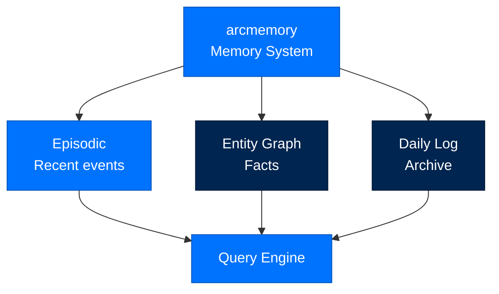
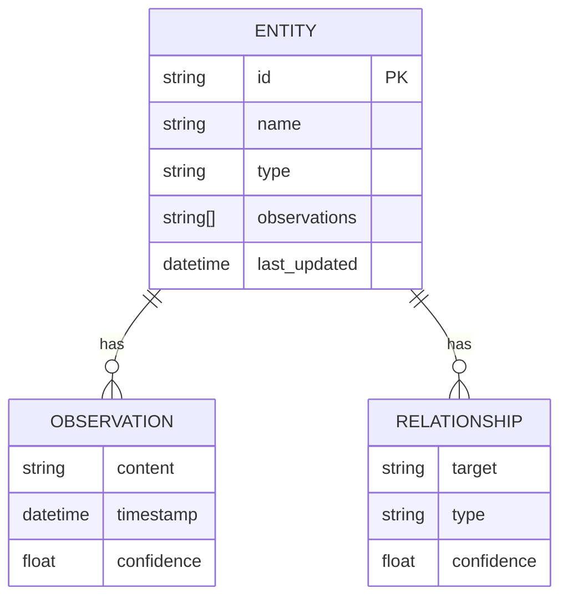
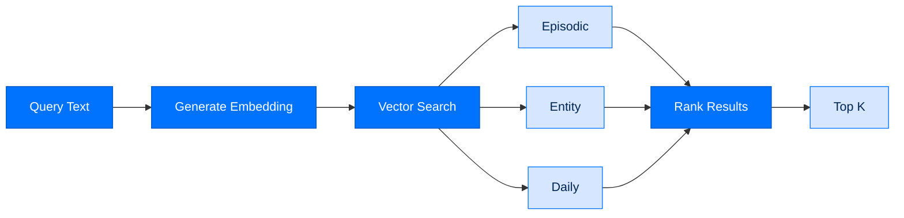

# arcmemory - Memory System

> **Layer:** Agent  
> **Dependencies:** arcstore  
> **Install:** `pip install arcmemory`
> **See also:** [DATA_FLOW.md](../DATA_FLOW.md#memory-lifecycle), [DATA_FLOW.md](../DATA_FLOW.md), [API_REFERENCE.md](../API_REFERENCE.md)

---

## Overview

`arcmemory` provides **dual-speed memory** for agents:
- **Episodic memory** - Recent events, high recall
- **Entity graph** - Persistent facts about people/things
- **Daily log** - Long-term archival storage
- **Memory queries** - Semantic search over memory



---

## Memory Types

### Episodic Memory

High-recall storage for recent events:

```python
from arcmemory import MemoryService

memory = MemoryService(store)

# Index an episode
episode_id = await memory.index(
    content="User asked about Q4 sales trends",
    metadata={
        "session_id": "sess_123",
        "turn": 5,
        "type": "user_query"
   }
)

# Search episodes
results = await memory.search("sales trends", k=10)
for hit in results:
    print(f"Episode: {hit.content}")
    print(f"Score: {hit.score}")
```

### Entity Graph

Persistent facts about entities:

```python
from arcmemory import Entity

# Create entity
entity = Entity(
    id="acme-corp",
    name="Acme Corporation",
    type="organization",
    observations=[
        "Founded in 1948",
        "Headquarters in New York",
        "Revenue: $1.2B in 2023"
    ]
)

await memory.upsert_entity(entity)

# Query entity
acme = await memory.get_entity("acme-corp")
for obs in acme.observations:
    print(f"Observation: {obs}")

# Entity relationships
entity.relationships.append(
    Relationship(
        target="alice",
        type="employs",
        confidence=0.9
    )
)
```

### Daily Log

Long-term archival storage:

```python
# Daily entries are written automatically
# Format: YYYY-MM-DD.jsonl

daily = await memory.get_daily("2026-07-31")
for entry in daily:
    print(f"{entry.timestamp}: {entry.content}")
```

---

## Memory Operations

### Indexing

```python
# Index with embedding
entry_id = await memory.index(
    content="Important finding about customer churn",
    metadata={
        "session_id": "sess_123",
        "importance": "high",
        "tags": ["churn", "customer", "analysis"]
    },
    embed=True  # Generate embedding
)
```

### Searching

```python
# Semantic search
results = await memory.search(
    query="customer retention strategies",
    k=5,
    min_score=0.7
)

# Filter by metadata
results = await memory.search(
    query="sales",
    filter={"tags": ["q4", "forecast"]}
)
```

### Memory Hit

```python
class MemoryHit(TypedDict):
    id: str
    content: str
    score: float
    metadata: dict
    timestamp: str
```

---

## Entity Operations

### Entity Structure



### Entity Types

| Type | Description |
|------|-------------|
| `person` | Human individual |
| `organization` | Company, team, group |
| `concept` | Abstract idea |
| `location` | Geographic place |
| `event` | Occurrence |

---

## Query Engine

### Search Pipeline



### Query Options

```python
results = await memory.search(
    query="project timeline",
    k=10,                    # Top 10 results
    min_score=0.6,           # Minimum similarity
    include_episodic=True,   # Search episodic
    include_entities=True,    # Search entities
    include_daily=True,      # Search daily log
    filter={                 # Metadata filter
        "session_id": "sess_123"
    }
)
```

---

## Memory Configuration

```toml
[modules.memory]
enabled = true
episodic_ttl_days = 30
daily_retention_days = 365

[memory.embedding]
provider = "openai"
model = "text-embedding-3-small"
cache_enabled = true
```

---

## API Reference

### Classes

```python
class MemoryService:
    def __init__(self, store: MemoryStore): ...
    
    async def index(
        self,
        content: str,
        metadata: dict = None,
        embed: bool = True
    ) -> str: ...
    
    async def search(
        self,
        query: str,
        k: int = 5,
        min_score: float = 0.0,
        **filters
    ) -> list[MemoryHit]: ...
    
    async def get_entity(self, name: str) -> Entity: ...
    async def upsert_entity(self, entity: Entity) -> None: ...
    async def get_daily(self, date: str) -> list[DailyEntry]: ...

class Entity(TypedDict):
    id: str
    name: str
    type: str
    observations: list[str]
    last_updated: str

class MemoryHit(TypedDict):
    id: str
    content: str
    score: float
    metadata: dict
    timestamp: str
```

---

## Memory Lifecycle

```mermaid
flowchart LR
    classDef phase fill:#0073FE,stroke:#0055BC,color:#FFFFFF

    Create[Create<br/>index()]:::phase --> Store[Store<br/>arcstore]:::phase
    Store --> Query[Query<br/>search()]:::phase
    Query --> Retrieve[Retrieve<br/>get_entity()]:::phase
    Retrieve --> Update[Update<br/>upsert_entity()]:::phase
    Update --> Store
```

---

## Next Steps

- [Data Flow](DATA_FLOW.md) - Memory in the system
- [API Reference](API_REFERENCE.md) - Complete API documentation
- [Package Index](PACKAGE_INDEX.md) - All Arc packages