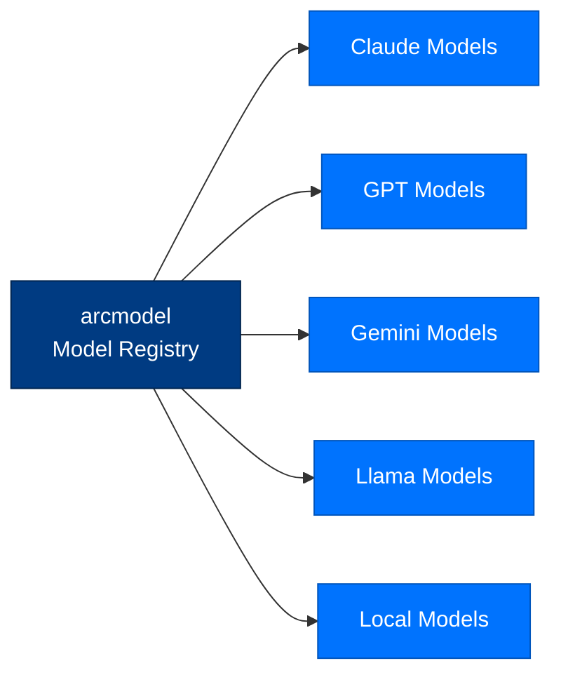

# arcmodel - Model Registry

> **Layer:** LLM  
> **Dependencies:** arctrust, arcstore  
> **Install:** `pip install arcmodel`
> **See also:** [API_REFERENCE.md](../API_REFERENCE.md)

---

## Overview

`arcmodel` provides **model metadata and registry**:
- **Model catalog** - All supported models with metadata
- **Pricing data** - Token costs per model
- **Capability matrix** - Tool, vision, JSON support
- **Selection logic** - Choose best model for task



---

## Model Catalog

### Model Metadata

```python
from arcmodel import ModelRegistry

registry = ModelRegistry()

# Get model info
info = registry.get("anthropic/claude-sonnet-4-5-20250929")

print(info.context_window)  # 200000
print(info.max_output)      # 8192
print(info.supports_tools)  # True
print(info.supports_vision) # True
print(info.input_price)     # 3.00 per 1M tokens
print(info.output_price)    # 15.00 per 1M tokens
```

### Model Entry Structure

```json
{
  "id": "anthropic/claude-sonnet-4-5-20250929",
  "provider": "anthropic",
  "context_window": 200000,
  "max_output": 8192,
  "supports_tools": true,
  "supports_vision": true,
  "supports_json": true,
  "input_price_per_1m": 3.00,
  "output_price_per_1m": 15.00,
  "recommended_for": ["general", "analysis", "coding"]
}
```

---

## Model Selection

### By Requirements

```python
from arcmodel import ModelRegistry

registry = ModelRegistry()

# Find models with specific features
models = registry.find(
    supports_tools=True,
    supports_vision=True,
    max_context=100000,
    max_cost=0.01  # per 1K tokens
)

for model in models:
    print(f"{model.id}: ${model.estimated_cost(1000):.4f}")
```

### By Task Type

```python
# Recommended models by task
TASK_MODELS = {
    "analysis": ["anthropic/claude-sonnet-4-5-20250929"],
    "coding": ["anthropic/claude-sonnet-4-5-20250929", "openai/gpt-4o"],
    "creative": ["anthropic/claude-opus-4-20250929"],
    "fast": ["groq/llama-3.1-70b"]
}
```

---

## Pricing

### Cost Calculation

```python
from arcmodel import ModelRegistry

registry = ModelRegistry()
model = registry.get("anthropic/claude-sonnet-4-5-20250929")

# Estimate cost
cost = model.estimate_cost(
    prompt_tokens=5000,
    completion_tokens=2000
)
# cost = (5000/1000000) * 3.00 + (2000/1000000) * 15.00 = $0.019

# Batch estimation
total_cost = registry.estimate_total(
    model_id="anthropic/claude-sonnet-4-5-20250929",
    prompt_tokens=50000,
    completion_tokens=20000
)
```

### Provider Pricing

```python
# Per-provider pricing tables
PRICING = {
    "anthropic": {
        "claude-sonnet-4-5-20250929": {
            "input": 3.00,
            "output": 15.00
        },
        "claude-opus-4-20250929": {
            "input": 15.00,
            "output": 75.00
        }
    },
    "openai": {
        "gpt-4o": {
            "input": 5.00,
            "output": 15.00
        }
    }
}
```

---

## API Reference

### Classes

```python
class ModelRegistry:
    def get(self, model_id: str) -> ModelInfo: ...
    def list(self) -> list[ModelInfo]: ...
    def find(self, **criteria) -> list[ModelInfo]: ...
    def estimate_total(
        self,
        model_id: str,
        prompt_tokens: int,
        completion_tokens: int
    ) -> float: ...

class ModelInfo(TypedDict):
    id: str
    provider: str
    context_window: int
    max_output: int
    supports_tools: bool
    supports_vision: bool
    supports_json: bool
    input_price_per_1m: float
    output_price_per_1m: float
    recommended_for: list[str]
    
    def estimate_cost(
        self,
        prompt_tokens: int,
        completion_tokens: int
    ) -> float: ...
```

---

## Next Steps

- [API Reference](API_REFERENCE.md) - Complete API documentation
- [Package Index](PACKAGE_INDEX.md) - All Arc packages