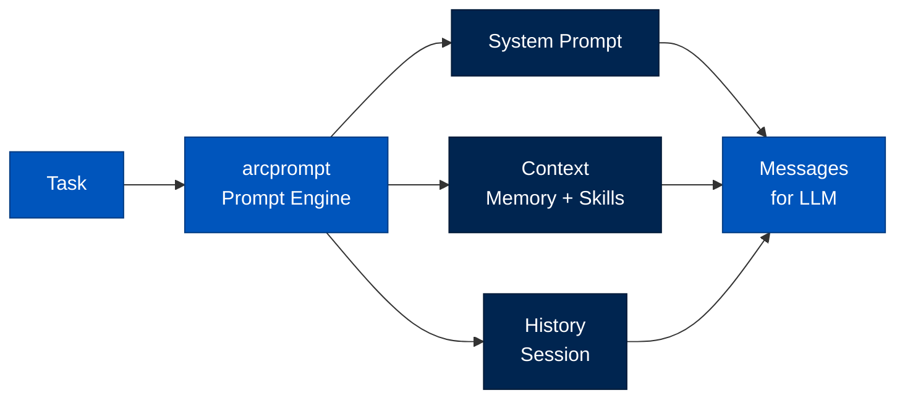

# arcprompt - Prompt Engine

> **Layer:** Runtime  
> **Dependencies:** None  
> **Install:** `pip install arcprompt`
> **See also:** [BLUEPRINTS.md](../BLUEPRINTS.md#prompts-assembly), [API_REFERENCE.md](../API_REFERENCE.md)

---

## Overview

`arcprompt` provides **prompt building and management**:
- **Prompt templates** - Reusable prompt structures
- **Context injection** - Skills, memory, history
- **Dynamic building** - Runtime prompt construction
- **Template catalog** - Pre-built templates



---

## Prompt Building

### Basic Builder

```python
from arcprompt import build_prompt

messages = build_prompt(
    task="Analyze the sales data",
    system_prompt="You are a helpful analyst.",
    context=[
        {"role": "user", "content": "Previous query"},
        {"role": "assistant", "content": "Previous response"}
    ],
    skills=["data-analysis", "chart-generation"]
)

# Returns list of message dicts
# [
#   {"role": "system", "content": "..."},
#   {"role": "user", "content": "..."},
#   ...
# ]
```

### Template System

```python
from arcprompt import PromptTemplate

template = PromptTemplate.from_file("templates/analyst.md")

messages = template.render(
    task="Analyze Q4 data",
    data_files=["sales.csv", "customers.csv"],
    skills=["data-analysis"]
)
```

---

## Prompt Templates

### Default Templates

| Template | Purpose |
|----------|---------|
| `default` | General assistant |
| `researcher` | Research-oriented |
| `coder` | Code-focused |
| `analyst` | Data analysis |
| `assistant` | Chat assistant |

### Custom Templates

```markdown
---
name: custom-analyst
version: 1.0.0
variables: [task, data_context, skills]
---

# Custom Analyst

{{ system_prompt }}

## Task
{{ task }}

## Data Context

- {{ file.name }}: {{ file.description }}


## Available Skills

- {{ skill.name }}: {{ skill.description }}


## Instructions
Follow these steps:
1. Load the data
2. Analyze for trends
3. Report findings
```

---

## Context Injection

### Skill Context

```python
def inject_skill_context(skills: list[Skill]) -> str:
    """Inject skill instructions into prompt."""
    context = ""
    for skill in skills:
        context += f"\n## {skill.name}\n{skill.frontmatter.steps}"
    return context
```

### Memory Context

```python
def inject_memory_context(memory_hits: list[MemoryHit]) -> str:
    """Inject relevant memories into prompt."""
    context = "\n## Relevant Context\n"
    for hit in memory_hits[:5]:  # Top 5
        context += f"- {hit.content}\n"
    return context
```

---

## API Reference

### Functions

```python
def build_prompt(
    task: str,
    system_prompt: str = None,
    context: list[dict] = None,
    skills: list[Skill] = None,
    memory: list[MemoryHit] = None
) -> list[dict]:
    """Build prompt messages for LLM."""

def inject_context(
    prompt: list[dict],
    context_type: str,
    content: str
) -> list[dict]:
    """Inject context into prompt."""

def truncate_prompt(
    prompt: list[dict],
    max_tokens: int,
    model: str
) -> list[dict]:
    """Truncate prompt to fit context window."""
```

### Classes

```python
class PromptTemplate:
    def __init__(self, template: str): ...
    
    @classmethod
    def from_file(cls, path: Path) -> PromptTemplate: ...
    
    def render(self, **variables) -> str: ...
    
    def to_messages(self, content: str) -> list[dict]: ...

class PromptBuilder:
    def __init__(self, config: dict): ...
    
    def add_system(self, content: str) -> PromptBuilder: ...
    def add_context(self, content: str) -> PromptBuilder: ...
    def add_history(self, messages: list[dict]) -> PromptBuilder: ...
    def build(self) -> list[dict]: ...
```

---

## Token Management

### Counting

```python
def count_tokens(text: str, model: str) -> int:
    """Count tokens in text."""
    # Uses provider-specific tokenizer
    ...

def count_prompt_tokens(prompt: list[dict], model: str) -> int:
    """Count tokens in prompt."""
    ...
```

### Truncation

```python
def truncate_to_fit(
    prompt: list[dict],
    max_tokens: int,
    model: str
) -> list[dict]:
    """Truncate prompt to fit context window."""
    
    # Remove oldest context first
    # Then truncate oldest messages
    # Never remove system prompt
    ...
```

---

## Next Steps

- [API Reference](API_REFERENCE.md) - Complete API documentation
- [Package Index](PACKAGE_INDEX.md) - All Arc packages