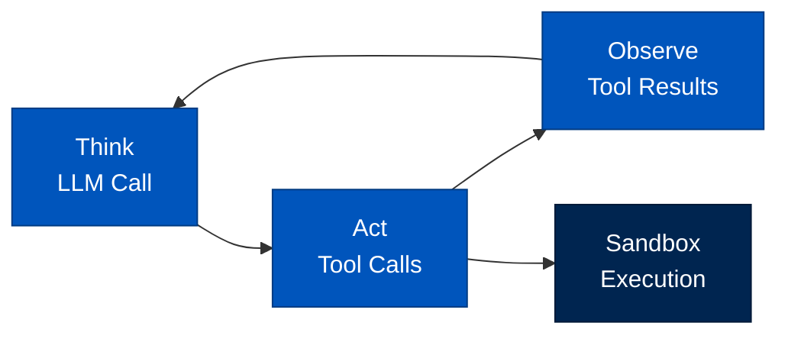
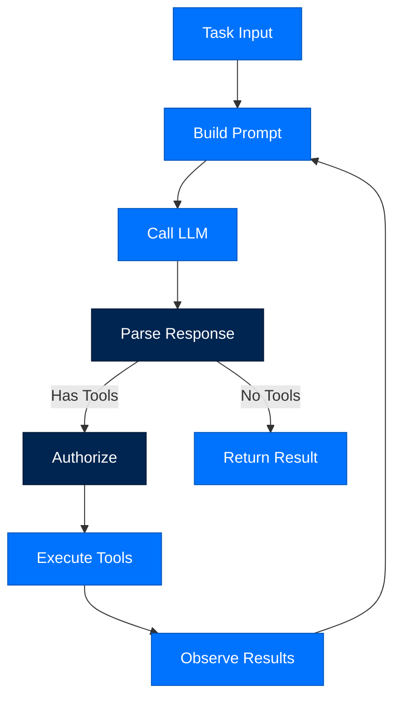

# arcrun - Execution Loop

> **Layer:** Runtime  
> **Dependencies:** arcllm, arctrust, arcstore  
> **Install:** `pip install arcrun`
> **See also:** [05-steering-and-strategies.md](../05-steering-and-strategies.md), [DATA_FLOW.md](../DATA_FLOW.md), [API_REFERENCE.md](../API_REFERENCE.md)

---

## Overview

`arcrun` implements the **think-act-observe loop** for Arc agents:
- **Turn execution** - Think, act, observe cycle
- **Sandbox management** - Secure code execution
- **Parallel dispatch** - Multiple tool calls concurrently
- **Budget management** - Token and turn limits



---

## Think-Act-Observe Loop

### Loop Diagram



### Implementation

```python
from arcrun import run_turn
from arcagent import ArcAgent

async def run_turn(agent: ArcAgent, task: str, session_id: str = None) -> Result:
    """Execute a single turn of the agent loop."""
    
    # Build prompt
    prompt = agent.build_prompt(task, session_id)
    
    # Call LLM
    response = await agent.llm.chat(prompt)
    
    # Check for tool calls
    if not response.tool_calls:
        return Result(content=response.content, turns=1, ...)
    
    # Authorize and execute
    results = []
    for call in response.tool_calls:
        if await agent.authorize(call):
            result = await agent.execute_tool(call)
            results.append(result)
    
    # Continue loop with observations
    return await run_turn(agent, task, session_id, observations=results)
```

---

## Sandbox Execution

### Sandbox Types

```mermaid
flowchart TB
    classDef sandbox fill:#002550,stroke:#001A38,color:#FFFFFF
    classDef tier fill:#0073FE,stroke:#0055BC,color:#FFFFFF

    Personal[Personal<br/>Docker<br/>(relax to local)]:::tier
    Enterprise[Enterprise<br/>Docker]:::tier
    Federal[Federal<br/>Firecracker VM]:::tier
    
    Personal --> Sandbox[arcrun Sandbox]:::sandbox
    Enterprise --> Sandbox
    Federal --> Sandbox
```

### Docker Sandbox

```python
from arcrun.sandbox.docker import DockerSandbox

sandbox = DockerSandbox(
    memory_limit="512m",
    cpus=1.0,
    timeout_seconds=60,
    network_disabled=True
)

result = sandbox.execute("""
import pandas as pd
df = pd.read_csv('data.csv')
print(df.describe())
""")

print(result.stdout)
print(result.exit_code)
```

### Firecracker Sandbox

```python
from arcrun.sandbox.firecracker import FirecrackerSandbox

sandbox = FirecrackerSandbox(
    vcpu_count=2,
    mem_size_mib=1024,
    timeout_seconds=300
)

result = sandbox.execute(code)
```

### Sandbox Configuration

```toml
[security.sandbox]
backend = "docker"  # docker | firecracker
memory_limit = "512m"
cpus = 1.0
timeout_seconds = 60
network_enabled = false
```

---

## Parallel Dispatch

### Concurrent Tool Execution

```python
from arcrun.dispatch import parallel_dispatch

# Execute multiple tools concurrently
results = await parallel_dispatch(
    agent,
    [
        ToolCall(name="read_file", arguments={"path": "a.csv"}),
        ToolCall(name="read_file", arguments={"path": "b.csv"}),
        ToolCall(name="read_file", arguments={"path": "c.csv"}),
    ],
    max_concurrency=3
)
```

### Dispatch Strategies

| Strategy | Use Case |
|----------|----------|
| `sequential` | Single tool, ordered |
| `parallel` | Multiple independent tools |
| `batch` | Similar tools batched |
| `priority` | High-priority first |

---

## Budget Management

### Turn Budget

```python
from arcrun.budget import TurnBudget

budget = TurnBudget(max_turns=50, max_tokens=50000)

# Check budget
if budget.remaining_turns() > 0:
    result = await run_turn(agent, task)
    budget.consume(response.usage.total_tokens)
```

### Token Budget

```python
budget = TokenBudget(
    input_limit=100000,
    output_limit=20000,
    total_limit=120000
)

# Truncate context if needed
if budget.would_exceed(new_messages):
    messages = budget.truncate(messages)
```

---

## API Reference

### Functions

```python
async def run_turn(
    agent: ArcAgent,
    task: str,
    session_id: str = None,
    max_turns: int = 50,
    observations: list = None
) -> Result:
    """Execute a single turn of the agent loop."""

def parse_tool_calls(response: LLMResponse) -> list[ToolCall]:
    """Parse tool calls from LLM response."""

async def execute_tool(agent: ArcAgent, call: ToolCall) -> ToolResult:
    """Execute a single tool call."""
```

### Classes

```python
class Sandbox(Protocol):
    def execute(
        self,
        code: str,
        timeout: int = 60,
        memory_limit: str = "512m"
    ) -> ExecutionResult: ...

class DockerSandbox(Sandbox):
    def __init__(
        self,
        memory_limit: str = "512m",
        cpus: float = 1.0,
        timeout_seconds: int = 60,
        network_disabled: bool = True
    ): ...

class FirecrackerSandbox(Sandbox):
    def __init__(
        self,
        vcpu_count: int = 2,
        mem_size_mib: int = 1024,
        timeout_seconds: int = 300
    ): ...

class ExecutionResult(TypedDict):
    stdout: str
    stderr: str
    exit_code: int
    duration_ms: int
```

---

## Error Handling

```python
from arcrun.errors import (
    TurnBudgetExceeded,
    SandboxError,
    ToolExecutionError
)

try:
    result = await run_turn(agent, task)
except TurnBudgetExceeded:
    # Handle budget exceeded
    pass
except SandboxError as e:
    # Handle sandbox failure
    pass
```

---

## Next Steps

- [API Reference](API_REFERENCE.md) - Complete API documentation
- [Package Index](PACKAGE_INDEX.md) - All Arc packages