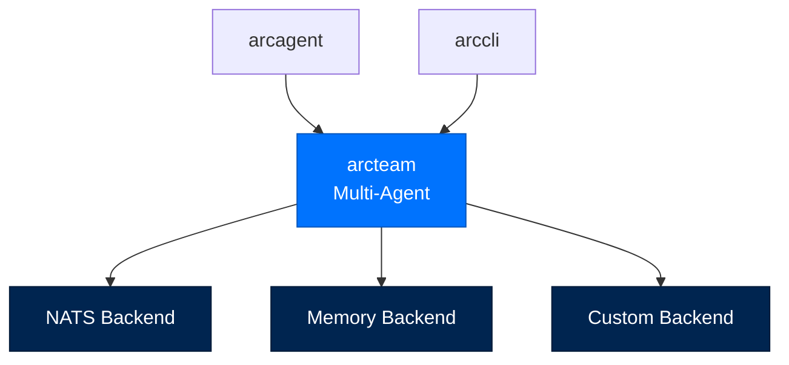
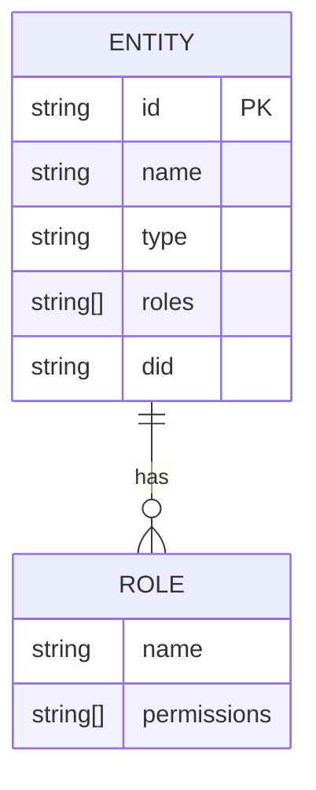
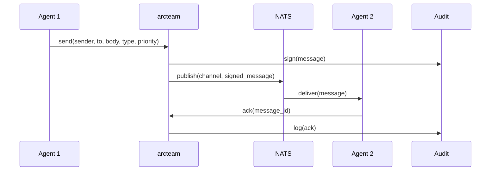
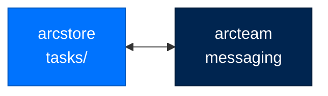

# arcteam - Multi-Agent Coordination

> **Layer:** Agent  
> **Dependencies:** arctrust, arcstore  
> **Install:** `pip install arcteam`
> **See also:** [DATA_FLOW.md](../DATA_FLOW.md), [API_REFERENCE.md](../API_REFERENCE.md)

---

## Overview

`arcteam` enables **multi-agent coordination** through:
- **Entity registry** - Agents and humans with roles
- **Messaging service** - Signed, audited messages
- **Task distribution** - Durable task coordination
- **Pluggable backends** - NATS, in-memory, custom



---

## Entity Registry

### Entity Types



### Entity Registration

```python
from arcteam import EntityRegistry, Entity, EntityType

registry = EntityRegistry(backend, audit)

# Register an agent
await registry.register(Entity(
    id="analyst-1",
    name="Senior Analyst",
    type=EntityType.AGENT,
    roles=["analyst", "reviewer"],
    did="did:key:z6Mk..."
))

# Register a human
await registry.register(Entity(
    id="alice",
    name="Alice Smith",
    type=EntityType.USER,
    roles=["operator"]
))
```

### Entity Types

| Type | Description |
|------|-------------|
| `EntityType.AGENT` | Arc agent with DID |
| `EntityType.USER` | Human operator |
| `EntityType.SYSTEM` | System service |

---

## Messaging Service

### Message Flow



### Sending Messages

```python
from arcteam import MessagingService, MsgType, Priority

svc = MessagingService(backend, registry, audit)

# Send direct message
await svc.send(
    sender="analyst-1",
    to=["executor-1"],
    body="Please analyze the Q4 data",
    msg_type=MsgType.TASK,
    priority=Priority.HIGH
)

# Broadcast to channel
await svc.send(
    sender="coordinator-1",
    to=["channel:general"],
    body="System maintenance at 5PM",
    msg_type=MsgType.INFO,
    priority=Priority.NORMAL
)
```

### Message Types

| Type | Purpose | Expected Response |
|------|---------|-------------------|
| `info` | Information | None |
| `request` | Request requiring reply | `reply` |
| `task` | Work assignment | `result` |
| `task_assigned` | Durable task assigned | `ack` |
| `result` | Task completion | None |
| `alert` | Urgent notification | `ack` |
| `ack` | Acknowledgement | None |

### Priorities

| Priority | Behavior |
|----------|----------|
| `low` | Background, can wait |
| `normal` | Default priority |
| `high` | Time-sensitive |
| `critical` | Interrupt current work |

---

## Task Coordination

### Task Store Integration



### Task Assignment

```python
from arcteam import MessagingService

# Assign task
task = store.assign("task_123", "executor-1")

# Notify owner
await svc.send(
    sender="coordinator-1",
    to=["executor-1"],
    body=f"New task assigned: {task.description}",
    msg_type=MsgType.TASK_ASSIGNED,
    priority=Priority.HIGH
)
```

### Auto-Routing

```python
from arcteam import MessagingService

# Route to best agent
task = store.route(task, capability_registry)

# Notify assigned agent
await svc.send(
    sender="coordinator-1",
    to=[task.owner],
    body=f"Task routed to you: {task.description}",
    msg_type=MsgType.TASK_ASSIGNED
)
```

---

## Storage Backends

### NATS Backend

```python
from arcteam.backends.nats import NatsBackend

backend = await NatsBackend.connect("nats://127.0.0.1:4222")
await backend.initialize()

# Features
# - Durable streams
# - KV records
# - Durable consumers
# - JetStream persistence
```

### Memory Backend

```python
from arcteam.storage import MemoryBackend

backend = MemoryBackend()

# Features
# - In-memory only
# - No persistence
# - For testing only
```

### Custom Backend

```python
from arcteam.storage import StorageBackend

class MyBackend(StorageBackend):
    async def publish(self, channel: str, message: dict) -> None:
        # Custom publish logic
        ...
    
    async def subscribe(self, channel: str) -> list[dict]:
        # Custom subscribe logic
        ...
    
    async def ack(self, message_id: str) -> None:
        # Custom ack logic
        ...
```

---

## Team Memory

```python
from arcteam.memory import TeamMemoryService

memory = TeamMemoryService(backend, audit)

# Per-entity memory
await memory.index(
    entity_id="analyst-1",
    content="Analyzed Q4 sales data",
    metadata={"task_id": "task_123"}
)

# Query entity memory
results = await memory.search(
    entity_id="analyst-1",
    query="sales data"
)
```

---

## CLI Commands

```bash
# Team initialization
arc team init [--root PATH]
arc team init --root /var/arc/team

# Entity management
arc team register ID [--name NAME] [--type TYPE] [--roles role1,role2]
arc team entities [--role ROLE]
arc team channels

# Status
arc team status
arc team config --json
arc team memory-status
```

---

## API Reference

### Classes

```python
class EntityRegistry:
    async def register(self, entity: Entity) -> None: ...
    async def lookup(self, entity_id: str) -> Entity: ...
    async def list_entities(self) -> list[Entity]: ...
    async def update_roles(self, entity_id: str, roles: list[str]) -> Entity: ...

class MessagingService:
    async def send(
        self,
        sender: str,
        to: list[str],
        body: str,
        msg_type: MsgType,
        priority: Priority = "normal"
    ) -> Message: ...
    
    async def receive(
        self,
        recipient: str,
        cursor: Cursor = None
    ) -> list[Message]: ...
    
    async def ack(self, message_id: str) -> None: ...

class TeamMemoryService:
    async def index(
        self,
        entity_id: str,
        content: str,
        metadata: dict = None
    ) -> str: ...
    
    async def search(
        self,
        entity_id: str,
        query: str,
        k: int = 5
    ) -> list[MemoryHit]: ...
```

### Types

```python
class Entity(TypedDict):
    id: str
    name: str
    type: EntityType  # "agent" | "user" | "system"
    roles: list[str]
    did: str = None

class Message(TypedDict):
    id: str
    timestamp: str
    sender: str
    recipients: list[str]
    body: str
    msg_type: MsgType
    priority: Priority
    signature: str

class MsgType(Enum):
    info = "info"
    request = "request"
    task = "task"
    task_assigned = "task_assigned"
    result = "result"
    alert = "alert"
    ack = "ack"

class Priority(Enum):
    low = "low"
    normal = "normal"
    high = "high"
    critical = "critical"
```

---

## Security Architecture

### Operator-Signed Audit Chain


Every operation is signed by the **operator's key**, not the agent's, ensuring non-repudiation.

---

## Next Steps

- [API Reference](API_REFERENCE.md) - Complete API documentation
- [Package Index](PACKAGE_INDEX.md) - All Arc packages