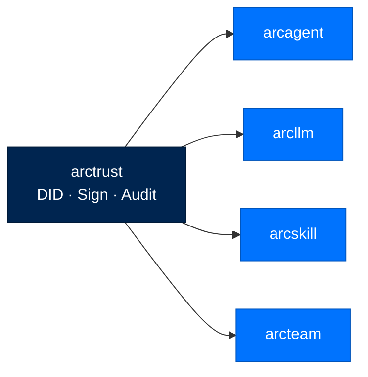
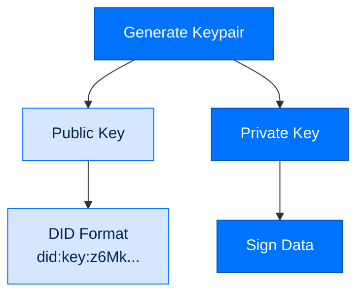

# arctrust - Security Primitives

> **Layer:** Foundation  
> **Dependencies:** None  
> **Install:** `pip install arctrust`
> **See also:** [SECURITY.md](../SECURITY.md), [PACKAGE_INDEX.md](../PACKAGE_INDEX.md)

---

## Overview

`arctrust` is the cryptographic foundation of Arc, providing:
- **Ed25519 Decentralized Identifiers (DIDs)** for agent identity
- **Sigstore signature verification** for artifact integrity
- **Operator-signed audit trails** for non-repudiable logging
- **FIPS-compliant cryptography** for federal deployments

This is the only package with **zero Arc dependencies** — it is the root of trust.



---

## Core Concepts

### Decentralized Identifiers (DID)



Every agent gets a DID at creation time:

```python
from arctrust.did import DID

# Generate a new identity
did = DID.generate()
# did.did = "did:key:z6Mk..."  (public verification)
# did.key = "z6Mk..."          (base58 public key)

# Sign a message
signature = did.sign(b"Hello, world!")

# Verify (anyone can do this with the public DID)
is_valid = did.verify(b"Hello, world!", signature)  # True
```

### Key Storage

Keys are stored with strict permissions:

```
~/.arc/keys/
├── agent_did.key      # 0600 permissions
├── operator.key       # 0600 permissions
└── skill_issuer.key   # 0600 permissions
```

```python
from arctrust.keys import KeyStore

store = KeyStore(Path("~/.arc/keys"))
did = store.load_agent_did()  # Loads and validates permissions
```

---

## Audit System

### Operator-Signed Chain

```mermaid
flowchart LR
    classDef record fill:#0073FE,stroke:#0055BC,color:#FFFFFF
    classDef link fill:#002550,stroke:#001A38,color:#FFFFFF

    R1[Record 1<br/>sig1]:::record --> R2[Record 2<br/>sig2]:::record
    R2 --> R3[Record 3<br/>sig3]:::record
    sig1[sign(prev_sig + record1)]:::link --> R1
    sig2[sign(prev_sig + record2)]:::link --> R2
    sig3[sign(prev_sig + record3)]:::link --> R3
```

Every audit record chains to the previous:

```python
from arctrust.audit import AuditLogger, AuditRecord

# Initialize with operator's signing key
audit = AuditLogger(operator_signer)

# Log an action
record: AuditRecord = audit.log(
    action="tool_execution",
    actor="did:key:z6Mk...",  # Agent's DID
    resource="web_search",
    outcome="success",
    metadata={"query": "quantum computing", "duration_ms": 1250}
)

# Verify chain integrity
assert audit.verify_chain()  # True if chain is valid
```

### Audit Record Structure

```json
{
  "id": "audit_01H7XQ2K3M4N5P6Q7R8S9T0",
  "timestamp": "2026-07-31T10:30:00Z",
  "prev_signature": "ed25519:6Mk...previous...",
  "action": "tool_execution",
  "actor": "did:key:z6MkAgent...",
  "resource": "web_search",
  "outcome": "success",
  "metadata": {
    "query": "quantum computing",
    "duration_ms": 1250,
    "cost_usd": 0.003
  },
  "operator_signature": "ed25519:6Mk...operator..."
}
```

---

## Signature Verification

### Sigstore Integration

```python
from arctrust.sigstore import verify_bundle

# Verify a signed artifact
result = verify_bundle(
    bundle_path="skill-1.0.0.bundle",
    issuer_did="did:key:z6MkIssuer..."
)

if result.valid:
    print(f"SLSA Level: {result.slsa_level}")
    print(f"Rekor UUID: {result.rekor_uuid}")
else:
    raise SecurityError(f"Invalid signature: {result.error}")
```

### Rekor Inclusion Proof

```python
from arctrust.rekor import verify_inclusion

# Verify signature is in transparency log
inclusion = verify_inclusion(
    signature=result.signature,
    rekor_uuid=result.rekor_uuid
)

assert inclusion.verified  # True if in public log
```

---

## FIPS Compliance

### Federal Tier Cryptography

```python
from arctrust.fips import FIPSSigner, is_fips_available

# Check FIPS availability
if is_fips_available():
    signer = FIPSSigner(vault_client)
    signature = signer.sign(data)  # Uses ECDSA-P256
```

### FIPS Requirements

| Requirement | Personal/Enterprise | Federal |
|-------------|---------------------|---------|
| Algorithm | Ed25519 | ECDSA-P256 |
| Key Size | 256-bit | 256-bit |
| Hash | SHA-256 | SHA-256 |
| Validation | Self-signed OK | FIPS-validated only |

---

## API Reference

### Classes

```python
class DID:
    did: str              # Full DID string
    key: str              # Base58 public key
    
    @classmethod
    def generate() -> DID: ...
    
    def sign(self, data: bytes) -> str: ...
    def verify(self, data: bytes, signature: str) -> bool: ...

class AuditLogger:
    def __init__(self, signer: Signer): ...
    
    def log(
        self,
        action: str,
        actor: str,
        resource: str,
        outcome: str,
        metadata: dict = None
    ) -> AuditRecord: ...
    
    def verify_chain(self) -> bool: ...

class Signer(Protocol):
    def sign(self, data: bytes) -> str: ...
    def public_key(self) -> str: ...

class FIPSSigner(Signer):
    def __init__(self, vault_client): ...
```

### Types

```python
class AuditRecord(TypedDict):
    id: str
    timestamp: str
    prev_signature: str
    action: str
    actor: str
    resource: str
    outcome: str
    metadata: dict
    operator_signature: str

class SignatureResult(TypedDict):
    valid: bool
    slsa_level: int
    rekor_uuid: str
    error: str = None
```

### Functions

```python
def load_operator_key(path: Path) -> Signer: ...
def load_agent_did(path: Path) -> DID: ...
def verify_bundle(bundle_path: Path, issuer_did: str) -> SignatureResult: ...
def verify_inclusion(signature: str, rekor_uuid: str) -> InclusionProof: ...
def compute_content_hash(data: bytes) -> str: ...
```

---

## Security Considerations

### Key Protection

- Keys stored with `0600` permissions
- Never logged or serialized
- Operator key separate from agent keys
- FIPS mode requires hardware-backed keys

### Chain Integrity

```python
def verify_chain_integrity(log_path: Path) -> bool:
    """
    Verify audit chain has not been tampered with.
    Returns False if any record has been modified.
    """
    records = load_audit_records(log_path)
    for i, record in enumerate(records[1:], 1):
        expected_prev = records[i-1].operator_signature
        if record.prev_signature != expected_prev:
            return False
    return True
```

---

## Testing

```python
# tests/test_did.py
def test_did_generation():
    did = DID.generate()
    assert did.did.startswith("did:key:")

def test_signature_verification():
    did = DID.generate()
    signature = did.sign(b"test")
    assert did.verify(b"test", signature)
    assert not did.verify(b"wrong", signature)

# tests/test_audit.py
def test_audit_chain():
    signer = TestSigner()
    audit = AuditLogger(signer)
    
    r1 = audit.log("action1", "actor1", "res1", "success")
    r2 = audit.log("action2", "actor2", "res2", "success")
    
    assert audit.verify_chain()
```

---

## Next Steps

- [Security Model](SECURITY.md) - Full security architecture
- [API Reference](API_REFERENCE.md) - Complete API documentation
- [Package Index](PACKAGE_INDEX.md) - All Arc packages