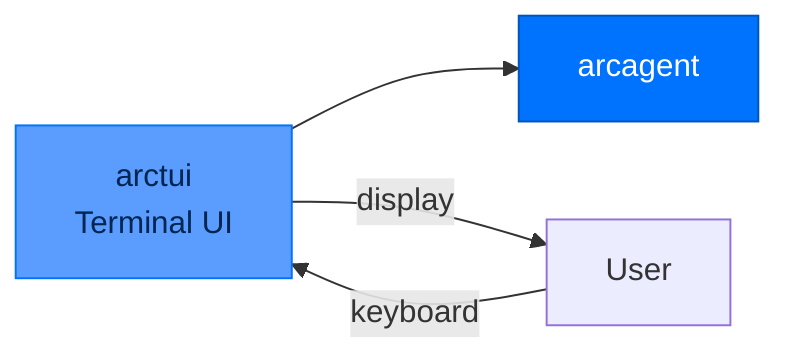

# arctui - Terminal UI

> **Layer:** Entry  
> **Dependencies:** arcagent  
> **Install:** `pip install arctui`
> **See also:** [QUICKSTART.md](../QUICKSTART.md)

---

## Overview

`arctui` provides the **terminal interface** for Arc:
- **Chat interface** - Interactive agent chat
- **Session browsing** - View past sessions
- **Tool display** - Show tool calls and results
- **Key bindings** - Vim-style navigation



---

## Key Bindings

| Key | Action |
|-----|--------|
| `i` | Enter insert mode (typing) |
| `Esc` | Enter normal mode |
| `Up/Down` | Navigate history |
| `Ctrl+L` | Clear screen |
| `Ctrl+C` | Quit |
| `/` | Search in session |
| `t` | Show tool calls |
| `s` | Show sessions |
| `r` | Reload capabilities |
| `c` | Show cost |

---

## Modes

### Insert Mode

```
┌─────────────────────────────────────────┐
│ > Hello, agent!                         │
│                                         │
│ [Insert mode - Esc to exit]              │
└─────────────────────────────────────────┘
```

- Type messages
- Enter sends message
- Shift+Enter for multiline

### Normal Mode

```
┌─────────────────────────────────────────┐
│ Agent: Hello! How can I help?            │
│                                         │
│ [Normal mode - i to insert]              │
│ Commands: /help /tools /sessions         │
└─────────────────────────────────────────┘
```

- Navigate with vim keys
- Execute commands
- View history

---

## Commands

### In-TUI Commands

| Command | Purpose |
|---------|---------|
| `/help` | Show help |
| `/tools` | List tools |
| `/skills` | List skills |
| `/sessions` | List sessions |
| `/switch <id>` | Resume session |
| `/cost` | Show cost |
| `/reload` | Reload capabilities |
| `/quit` | Exit |

### Slash Commands

```bash
# In TUI
/switch sess_01H7XQ2K3M4N5P6Q7R8S9T0
/tools
/skills
/cost
```

---

## Session View

```
┌─────────────────────────────────────────┐
│ Session: sess_01H7XQ...                 │
├─────────────────────────────────────────┤
│ [10:30:01] You: Analyze the data       │
│ [10:30:05] Agent: I'll analyze...       │
│   ├─ Tool: read_file(data.csv)           │
│   └─ Result: 100 rows loaded           │
│ [10:30:10] Agent: Here are the trends... │
└─────────────────────────────────────────┘
```

---

## API Reference

### Classes

```python
class TuiApp:
    def __init__(self, agent: ArcAgent): ...
    
    def run(self) -> None:
        """Start the TUI application."""
    
    def handle_key(self, key: str) -> None: ...
    def render(self) -> None: ...
    def update_display(self) -> None: ...

class ChatView:
    def __init__(self): ...
    
    def add_message(self, role: str, content: str) -> None: ...
    def add_tool_call(self, call: ToolCall, result: str) -> None: ...
    def render(self) -> str: ...
```

---

## Next Steps

- [Quickstart](QUICKSTART.md) - Using the TUI
- [Package Index](PACKAGE_INDEX.md) - All Arc packages