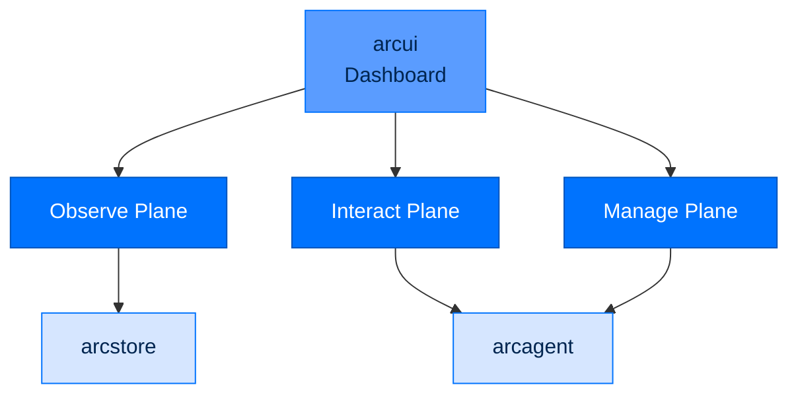
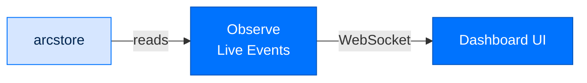
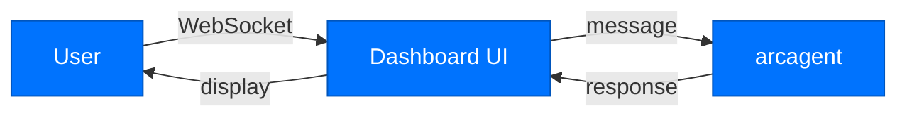
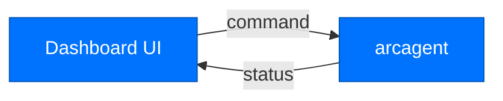

# arcui - Dashboard

> **Layer:** Surface  
> **Dependencies:** arcagent, arcstore  
> **Install:** `pip install arcui`
> **See also:** [QUICKSTART.md](../QUICKSTART.md), [DATA_FLOW.md](../DATA_FLOW.md)

---

## Overview

`arcui` provides the **web dashboard** for Arc:
- **Observe plane** - Live LLM calls, memory view
- **Interact plane** - Live chat via WebSocket
- **Manage plane** - Control agents, view sessions



---

## Planes

### Observe Plane

Live monitoring of agent activity:



**Features:**
- LLM call stream
- Token usage tracking
- Memory queries
- Session monitoring

### Interact Plane

Live chat with agents:



**Features:**
- Real-time chat
- Message history
- Tool call display
- Cost tracking

### Manage Plane

Agent and session control:



**Features:**
- Agent status
- Session management
- Capability reload
- Configuration view

---

## Starting the Dashboard

### Basic Start

```bash
arc ui start
```

Output:
```
Dashboard running at http://localhost:8420
Viewer token: viewer_abc123...
```

### With Options

```bash
# Show tokens in output
arc ui start --show-tokens

# Custom port
arc ui start --port 9000

# Custom team root (for multi-agent view)
arc ui start --team-root ./agents

# Read-only mode
arc ui start --readonly
```

---

## Viewer Tokens

### Generating Tokens

```bash
# Generate token
arc ui token --generate

# List tokens
arc ui token --list

# Revoke token
arc ui token --revoke TOKEN_ID
```

### Token Permissions

| Scope | Permissions |
|-------|-------------|
| `observe` | View events, memory |
| `interact` | Chat with agents |
| `manage` | Control agents |
| `admin` | Full access + tokens |

---

## Event Streaming

### Tail Events

```bash
# Stream all events
arc ui tail

# With authentication
arc ui tail --viewer-token viewer_abc123

# Filter by layer
arc ui tail --layer llm
arc ui tail --layer tool
arc ui tail --layer security

# Filter by agent
arc ui tail --agent my-agent
```

### Event Format

```json
{
  "id": "evt_01H...",
  "timestamp": "2026-07-31T10:30:00Z",
  "layer": "llm",
  "event": "chat_completion",
  "agent_id": "my-agent",
  "data": {
    "model": "claude-sonnet-4-5-20250929",
    "tokens": 1250,
    "duration_ms": 2500
  }
}
```

---

## API Reference

### Classes

```python
class DashboardServer:
    def start(
        self,
        port: int = 8420,
        show_tokens: bool = False,
        team_root: Path = None,
        readonly: bool = False
    ) -> None:
        """Start the dashboard server."""

class ViewerToken:
    def __init__(self, scope: str, expires_at: datetime): ...
    
    def encode(self) -> str:
        """Encode token for use."""
    
    @classmethod
    def decode(cls, token: str) -> ViewerToken: ...
```

### Functions

```python
def start_dashboard(**kwargs) -> None: ...
def tail_events(**kwargs) -> None: ...
def generate_token(scope: str, ttl: int) -> ViewerToken: ...
```

---

## Security

### Token Validation

```python
def validate_token(token: str) -> bool:
    """Validate viewer token signature and scope."""
    try:
        decoded = ViewerToken.decode(token)
        return decoded.expires_at > datetime.now()
    except:
        return False
```

### CORS Configuration

```python
# Dashboard runs with restricted CORS
# Only localhost and configured origins allowed

CORS_ORIGINS = [
    "http://localhost:8420",
    "http://127.0.0.1:8420"
]
```

---

## Next Steps

- [Data Flow](DATA_FLOW.md) - Dashboard data pathways
- [Package Index](PACKAGE_INDEX.md) - All Arc packages