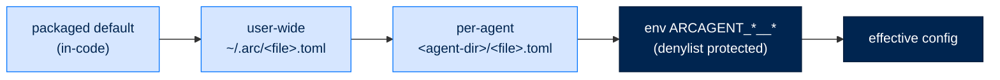

# Config Catalog — Every Knob, One Place

> **Reference**  ·  Look up  ·  the full configuration surface
> **For** anyone tuning an agent who needs the exact key, type, and default
> [← Config (recently-shipped delta)](config.md)  ·  [Docs home](../README.md)  ·  [Config load & tiers (why) →](../walkthrough/12-configuration.md)

---

## In one breath

Arc reads three sibling TOML files per concern — `arcagent.toml`, `arcllm.toml`,
`arcrun.toml` — deep-merged across three layers (packaged default → user-wide
`~/.arc/<file>.toml` → per-agent `<agent-dir>/<file>.toml`), later layer wins.
Dicts deep-merge; **lists and scalars are replaced**. Environment variables
override last, using the `ARCAGENT_` prefix and `__` as the nesting delimiter
(e.g. `ARCAGENT_LLM__MODEL`, `ARCAGENT_ARCRUN__MAX_TURNS`) — but a denylist of
security-sensitive keys refuses env override (`vault__backend`,
`tools__process`, `tools__preamble`, `tools__policy__allowed_paths`,
`identity__key_dir`). Every default below is verified against the Pydantic model
at the cited `path:line`.

Anchor legend: `key` (type, default). *Required* = no default.

Merge: `packages/arcagent/src/arcagent/core/config_loading.py:80`
(`compose_raw_config`), `:48` (`deep_merge`), `:30` (`apply_env_overrides`). Root
model: `core/config.py:688` (`ArcAgentConfig`).

---

## `arcagent.toml`

### `[agent]` — `config.py:90`
`name` (str, *required*) · `org` (str, `"default"`) · `type` (str,
`"executor"`) · `workspace` (str, `"./workspace"`)

### `[llm]` — `config.py:114` *(physically in `arcllm.toml`, validated by arcagent)*
`model` (str, *required*; packaged fallback `anthropic/claude-sonnet-4-5-20250929`)
· `routes` (dict[str, route], `{}`; each route: `model` *req*, `phrases`
list `[]`) · `max_tokens` (int > 0, `4096`) · `temperature` (float, `0.7`) ·
`modules` (dict, `{}` — per-agent arcllm module overrides)

### `[identity]` — `config.py:171`
`did` (str, `""`) · `key_dir` (str, `"~/.arcagent/keys"`) · `vault_path` (str,
`""`)

### `[vault]` — `config.py:179`
`backend` (str, `""`) · `cache_ttl_seconds` (int, `300`)

### `[tools]` — `config.py:259`
`mcp_servers` (dict, `{}`; entry: `command` *req*, `args` `[]`, `env` `{}`,
`timeout_seconds` `30`) · `http` (dict, `{}`; entry: `url` *req*, `method`
`"POST"`, `headers` `{}`, `timeout_seconds` `30`) · `process` (dict, `{}`; entry:
`command` *req*, `args` `[]`, `timeout_seconds` `30`) · `preamble` (str, `""`) ·
`allowed_module_prefixes` (list, `["arcagent."]`) · `operate_in_launch_dir`
(bool, `False`)

**`[tools.policy]`** — `config.py:186` — `allow` `[]` · `deny` `[]` ·
`timeout_seconds` (int 1–300, `30`) · `allowed_paths` `[]` · `protected_paths`
`[]` · `egress_allowlist` `[]` · `egress_allow` `[]` · `classifications` `{}` ·
`egress_clearances` `{}`

**`[tools.human_gate]`** — `config.py:241` — `timeout_seconds` (float, `300.0`) ·
`auto_approve` (list[list[str]], `[]`) · `auto_approve_tools` (list, `[]`)

### `[team]` — `config.py:355`
`root` (str, `""` — the shared team root; not a per-module `team_root`)

### `[telemetry]` — `config.py:286`
`enabled` (bool, `True`) · `service_name` (str, `"arcagent"`) · `log_level`
(str, `"INFO"`) · `export_traces` (bool, `False`) · `exporter_endpoint` (str,
`""`) · `capture_tool_io` (bool, tier-derived: personal→True, else False, via
`_resolve_tier_capture_tool_io`, `config.py:716`)

### `[context]` — `config.py:308`
`max_tokens` (int > 0, `128000`) · `prune_threshold` (float, `0.70`) ·
`compact_threshold` (float, `0.85`) · `emergency_threshold` (float, `0.95`) ·
`estimate_multiplier` (float, `1.1`)

### `[eval]` — `config.py:318` *(in `arcllm.toml`)*
`provider` `""` · `model` `""` · `max_tokens` `1024` · `max_input_tokens`
`100000` · `temperature` `0.2` · `timeout_seconds` `30` · `fallback_behavior`
`"skip"` · `max_concurrent` `2` · `background_queue_size` `10` ·
`background_task_timeout` `120`

### `[session]` — `config.py:342`
`retention_count` (int, `50`) · `retention_days` (int, `30`) ·
`compaction_summary_max_chars` (int, `2000`) · `compaction_timeout_seconds`
(float > 0, `30.0`)

### `[security]` — `config.py:421`
`tier` (str, `"personal"` — `personal`/`enterprise`/`federal`) · `clearance`
(str, `"UNCLASSIFIED"`) · `classification_enforced` (bool, `False`) ·
`runaway_max_repeat` (int | None, `None`) · `error_cascade_max` (int | None,
`None`) · `loop_max_parallel` (int, `10`) · `policy_audit_log` (str | None,
`None`) · `operator_key_dir` (str, `""`) · `operator_vault_path` (str, `""`) ·
`signing_algorithm` (str, `"ed25519"` — or `ecdsa-p256`) · `custody` (str,
`"in_process"` — or `vault_transit`) · `notary_keystore` (str, `""`) ·
`require_fips` (bool, `False`) · `witness_medium_path` (str, `""`) ·
`witness_mode` (str, `"offline"` — or `transparency_log`) · `witness_log_url`
(str, `""`)

### `[capabilities]` — `config.py:588`
`allow_all_imports` (bool, `False`) · `allow_imports` (list, `[]`)

### `[spawn]` — `config.py:366`
`enabled` (bool, `True`) · `max_depth` (int ≥ 0, `3`) · `max_concurrent`
(int ≥ 1, `5`) · `max_turns` (int > 0, `50`) · `timeout_seconds` (int ≥ 1,
`300`) · `max_total_tokens` (int | None, `None`)

### `[ui]` — `config.py:149` *(metadata read by arcui)*
`display_name` `""` · `role_label` `""` · `color` `""` · `hidden` (bool, `False`)

### `[budget]` — `config.py:138` *(in `arcllm.toml`)*
`max_tokens` (int | None, `None`) · `max_cost_usd` (float | None, `None`) ·
`max_requests` (int | None, `None`)

### `[arcstore]` — `arcstore/config.py:43` { #arcstore }
`enabled` (bool, `True`) · `data_dir` (str, `""`) · `database_credential_ref`
(str, `""`) · `pool_min_size` (int 1–100, `1`) · `pool_max_size` (int 1–100,
`10`) · `command_timeout` (float 0–300, `30.0`) · `connect_timeout` (float
0–120, `10.0`) · `store_raw_bodies` (bool, `False`) · `rotation` (str,
`"daily"`) · `retention` (str, `""`) · `sample_rate` (float 0–1, `1.0`)

The secret `ARCSTORE_DATABASE_URL` is **never** in this block — see
[Provision the operational store](../get-started/operational-store.md).

---

## Tier and the crypto floor

`[security].tier` drives `_enforce_tier_crypto_floor` (`config.py:563` →
`arcagent/tiers.py:86` `resolve_tier_floor`). Federal floors, over
`SECURITY_CONFIG_KNOBS` (`tiers.py:67`):

| Knob | Federal floor | Rule |
|---|---|---|
| `require_fips` | `True` | forced exact |
| `custody` | `vault_transit` | forced exact |
| `signing_algorithm` | `ecdsa-p256` | forced exact |
| `runaway_max_repeat` | `8` | smaller-is-stricter; `None`/larger rejected |
| `error_cascade_max` | `5` | smaller-is-stricter |

**Federal** pins the floor when a knob is unset and rejects any explicit weaker
value fail-closed (`tiers.py:117`). **Enterprise** defaults `custody =
vault_transit` (`config.py:583`) and may relax the rest. **Personal** is
`in_process` with breakers off. A tier floor can refuse below but **cannot
raise** above what a manifest permits.

---

## `arcrun.toml` — `[arcrun]` — `config.py:642`
`max_turns` (int > 0, `120`) · `tool_timeout` (float | None, `None`) ·
`allowed_strategies` (list | None, `None`; federal floors to `["react"]`) ·
`approval_opt_in` (list, `[]`)

**`[arcrun.sandbox]`** — `config.py:630` — `allowed_tools` (list | None, `None`
= all tools)

---

## `arcllm.toml` (read by arcllm itself)

Packaged base at `<arcllm>/config.toml`; user `~/.arc/arcllm.toml` deep-merges.

### `[defaults]` — `arcllm/config.py:243`
`provider` (str, `"anthropic"`) · `temperature` (float, `0.7`) · `max_tokens`
(int, `4096`)

### `[vault]` — `arcllm/config.py:294`
`backend` `""` · `cache_ttl_seconds` `300` · `url` `""` · `region` `""`

### `[providers.<name>]` — `arcllm/config.py:144`
Overlays a packaged `providers/<name>.toml` (anthropic, openai, google,
azure_openai, cohere, deepseek, fireworks, groq, huggingface, huggingface_tgi,
litellm, mistral, moonshot, ollama, together, vllm, xai). Fields: `api_format`
*req* · `base_url` *req* (HTTPS enforced for remote hosts, `:83`) · `api_key_env`
*req* · `api_key_required` (bool, `True`) · `default_model` *req* ·
`default_temperature` *req* · `vault_path` (`""`) · `enable_prompt_caching`
(bool, `True`) · `cache_ttl` (`"1h"`; only `"5m"`/`"1h"`). Nested
`[providers.<name>.models.<model>]` — `arcllm/config.py:65`: `context_window`,
`max_output_tokens`, `supports_tools`, `supports_vision`, `supports_thinking`,
`supports_temperature` (`True`), `input_modalities`, and four `cost_*_per_1m`
fields.

### `[[endpoints]]` — `arcllm/config.py:178`
`base_url` *req* (HTTPS enforced) · `api_key_env` (`""`) · `vault_path` (`""`) ·
`weight` (int ≥ 0, `1`). One of `api_key_env`/`vault_path` required when the
provider needs auth. See [LLM routing & load-balancing](../walkthrough/flow-llm-routing.md).

### `[modules.<name>]` (arcllm) — base `ModuleConfig` `arcllm/config.py:251` (`extra="allow"`)
Packaged defaults from `config.toml`:

| Module | Key defaults |
|---|---|
| `routing` | `enforcement="warn"`, `default_route="default"`, `threshold=0.45`, `embedding_backend="local"`, `embedding_model="all-MiniLM-L6-v2"`, `on_embedder_error="raise"` |
| `telemetry` | `enabled=true`, `log_level="INFO"`, `store_raw_bodies=true`, `classification="unclassified"` (+ optional budget keys) |
| `telemetry.encryption` | `enabled=false`, `backend=""`, `key_ref=""`, `key_env="ARCLLM_TRACE_WRAP_KEY"`, `cache_ttl_seconds=300`, `require_fips=false` |
| `telemetry.retention` | `max_age_days=None`, `max_bytes=None` |
| `audit` | `enabled=false` |
| `retry` | `enabled=true`, `max_retries=3`, `backoff_base_seconds=1.0` |
| `fallback` | `enabled=false`, `chain=["anthropic","openai"]` |
| `rate_limit` | `enabled=false`, `requests_per_minute=60`, `burst_capacity=60` |
| `circuit_breaker` | `enabled=false`, `failure_threshold=5`, `cooldown_seconds=30.0`, `half_open_max_calls=1` |
| `load_balance` | `enabled=false`, `strategy="weighted_round_robin"`, `sticky_key="session_id"`, `failure_threshold=5`, `cooldown_seconds=30.0`, `half_open_max_calls=1` |
| `queue` | `enabled=true`, `max_concurrent=2`, `call_timeout=180.0`, `max_queued=10` |
| `otel` | `enabled=false`, `exporter="otlp"`, `endpoint="http://localhost:4317"`, `protocol="grpc"`, `service_name="arcllm"`, `sample_rate=1.0` (+ TLS/batch keys) |
| `security` | `enabled=true`, `pii_enabled=true`, `pii_detector="regex"`, `signing_enabled=false`, `signing_algorithm="ed25519"`, `signing_key_env="ARCLLM_SIGNING_KEY"` |
| `injection` | `enabled=false`, `enforcement="warn"`, `tier="pattern"`, `scan_user=true`, `scan_tool_results=true` |
| `guardrails` | `enabled=false`, `enforcement="block"`, `max_length=0`, `banned_content=[]` |

---

## arcagent `[modules.<name>]` blocks

Wrapper `ModuleEntry` (`config.py:278`): `enabled` (bool, `True`), `priority`
(int, `100`), `config` (dict). Sub-keys live under `[modules.<name>.config]` and
validate against each module's `<Name>Config` (base `ModuleConfig`,
`extra="forbid"` — a typo raises). Verified per module:

| Module | Key defaults (`config`) |
|---|---|
| **tasks** | `enabled=F`, `dispatch=F`, `nats_url=""`, `default_max_attempts=3`, `retry_backoff_seconds=30.0`, `task_timeout_seconds=0.0`, `stuck_reclaim_seconds=300.0`, `routing=T`, `notify=T`, `max_run_capability_legs=16` |
| **workflows** | `enabled=F`, `workflows_dir="workflows"`, `max_workflows=50`, `max_nodes=200`, `max_inline_text_length=2000`, `max_repair_attempts=3`, `max_file_bytes=32768` |
| **connectors** | `arc_dir=""`, `extensions_root=""`, `data_dir=""` |
| **connected_data** | `interval_seconds=3600.0`, `global_concurrency=4`, `limits`: `max_pages=1000`, `max_bytes=67108864`, `max_seconds=900.0`, `max_concurrency=8`, `page_size=200`, `retries=2`, `retry_backoff_seconds=0.25` |
| **memory** | `brain="none"`, `tier="personal"`, `curated_knowledge_enabled=F`, `top_k=5`, `budget=1024`, `proactive_enabled=T`, `working_set_enabled=T`, `consolidate_event_threshold=20`, `consolidate_idle_seconds=900.0`, `consolidate_interval_seconds=3600.0`, `embed_backend=""`, `embed_model=""`, `distill_provider=""`, `distill_model=""`, `dynamics={}` (deeper arcmemory knobs — see [tune memory](../get-started/tune-knowledge-and-memory.md)) |
| **scheduler** | `enabled=F`, `min_interval_seconds=60`, `max_schedules=50`, `max_prompt_length=500`, `default_timeout_seconds=300`, `max_timeout_seconds=3600`, `circuit_breaker_threshold=3`, `check_interval_seconds=30`, `store_path="schedules.json"`, `timezone=""` |
| **proactive** | `enabled=T`, `leader="noop"`, `redis_key="arcagent:proactive:leader"` |
| **planning** | `enabled=F`, `max_replans=3`, `concurrent=F`, `max_parallel=8` |
| **policy** | `eval_interval_turns=50`, `daily_notes_every_turns=20`, `max_bullets=200`, `max_bullet_text_length=500`, `flush_idle_seconds=900`, `tier="personal"` |
| **messaging** | `enabled=F`, `nats_url=""`, `auto_ack=T`, `max_messages_per_poll=20`, `channel_route=T`, `route_top_k=2`, `sweep_enabled=T`, `sweep_after_seconds=180.0`, `channel_answer_cap=2`, `channel_cooldown_seconds=60.0` |
| **browser** | `provider="cdp"` (or `browserbase`), `tier="personal"`, `accessibility_tree_depth=10`, `chrome_memory_limit_mb=512`; nested `security` (`blocked_schemes=["file","chrome","chrome-extension","javascript","data","blob","ftp"]`, `allow_js_execution=F`, `allow_downloads=F`), `browser_use.enabled=F` (federal-forbidden) |
| **web** | `search_provider=None` (`parallel`/`firecrawl`/`tavily`), `extract_provider="http"`, `tier="personal"`, `url_allowlist=[]`, `max_content_bytes=1000000`, `pii_redaction_enabled=F`, `request_timeout_s=30.0` |
| **voice** | `enabled=T`, `tier="personal"`, `stt_provider="whisper_cpp"`, `tts_provider="piper"`, `air_gap=F`, `redact_pii=F` (federal forces `air_gap` + `redact_pii`) |
| **session** | `enabled=T`, `poll_interval=30.0` |
| **user_profile** | `profile_dir="user_profile"`, `body_cap_bytes=2048`, `tombstone_dir="tombstone_events"`, `schema_version=1` |
| **workpad** | `every_n_runs=20`, `max_transcript_chars=24000`, `max_context_chars=8000`, `flush_idle_seconds=900` |
| **progress** | `coalesce_seconds=1.5`, `min_gap_seconds=10.0`, `max_lines_per_run=12`, `max_step_chars=90`, `heartbeat_after_seconds=45.0` (presence is the switch — no `enabled`) |
| **runcontrol** | `enabled=F`, `data_dir=""`, `stale_ttl_seconds=300` |
| **pulse** | `enabled=T`, `interval_seconds=600`, `pulse_file="pulse.md"`, `state_file="pulse-state.json"`, `timeout_seconds=300.0` |
| **skills** | `adapter="none"`, `tier="personal"`, `classify_outcomes=F`, `sweep_poll_seconds=3600.0`, `adapter_allowlist=[]`, `improver={}` (forwarded to arcskill) |

---

## Notes and gaps

- The `enabled` defaults above are each module's **config-model field** default.
  Whether a module is *loaded* out of the box also depends on
  `BUILTIN_MODULE_DEFAULTS` (`core/module_config.py:34`) — that table's exact
  loaded/not-loaded map was **not** read here; treat "loaded by default" as
  **needs confirmation** per module.
- `[llm]`, `[eval]`, `[budget]` physically live in `arcllm.toml` but are
  validated by **arcagent's** models. Everything else in `arcllm.toml`
  (`[defaults]`, `[providers.*]`, `[[endpoints]]`, `[modules.*]`, `[vault]`) is
  validated by **arcllm's** models and ignored by the arcagent loader.
- The narrower "recently-shipped knobs" delta with prose descriptions is
  [config.md](config.md); this page is the exhaustive catalog. The *why* behind
  the merge and tier resolution is [Configuration](../walkthrough/12-configuration.md).
