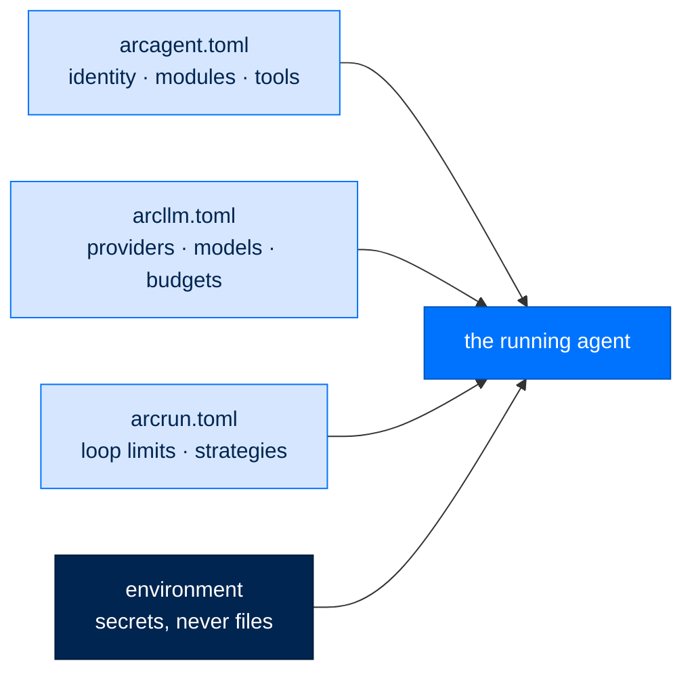

# Config Reference — Recently Shipped Knobs

> **Reference**  ·  Look up  ·  page 3 of 8  
> **For** Anyone looking something up  
> [← CLI](cli.md)  ·  [Docs home](../README.md)  ·  [Tiers and presets →](tiers-and-presets.md)

A consolidated reference for the configuration added or changed in the / wave
(multi-agent task system, memory curation, background-job cadence, gateway slash-commands). Each
table gives the default and what the knob does. Module config lives under
`[modules.<name>.config]` in an agent's `arcagent.toml`; core sections (`[eval]`, `[session]`) are
top-level.

Full per-feature detail lives with each package:
`docs/tasks-module.md`, `packages/arcmemory/`, `packages/arcgateway/`.

**See also:** [SETUP.md](../building/setup.md), [TIERS_AND_PRESETS.md](tiers-and-presets.md)

---

## `[modules.tasks.config]` — the task system

Owned by the arcagent `tasks` module. `[modules.tasks] enabled = true` loads the tools;
`dispatch` is a separate opt-in that turns on autonomous execution.

| Key | Default | Meaning |
|---|---|---|
| `enabled` | `false` | Config-level enable mirror (the real load gate is `[modules.tasks].enabled`) |
| `dispatch` | `false` | **Opt-in**: autonomously run the agent's ready owned tasks. Off = tools work, nothing self-runs |
| `default_max_attempts` | `3` | Retry ceiling stamped on created tasks (`1` = no retry); per-task `max_attempts` is authoritative once set |
| `retry_backoff_seconds` | `30.0` | Base backoff before a retried task re-dispatches; grows exponentially (`base * 2^(attempts-1)`) |
| `task_timeout_seconds` | `0.0` | Wall-clock cap per dispatched run; `0` = unbounded. Per-task `timeout_seconds` overrides. A timeout is a failed attempt |
| `stuck_reclaim_seconds` | `300.0` | An `in_progress` task with no live run older than this is reclaimed as a failed attempt (startup reclaim ignores the threshold) |
| `routing` | `true` | Auto-route ownerless tasks to the least-loaded, capability-matched agent. No-op without a live registry |
| `notify` | `true` | Operator alerts on done/needs-review/fail/dead-letter/stuck; assignee notify on assign/route |
| `nats_url` | `""` | JetStream url for the shared arcteam registry + messenger (`@handle` resolve + notify). Empty = no live registry |
| `data_dir` | `""` | Root for the append-only spool and WORM source files; empty defers to `resolve_data_dir()` |

See `docs/tasks-module.md` for the lifecycle and reliability engine.

---

## `[modules.memory.config]` — the Brain wiring (arcagent)

The arcagent memory module is wiring only — it selects a Brain and bounds recall/consolidation
scheduling. (The FERNme dynamics constants below live in the arcmemory Brain, not here.)

| Key | Default | Meaning |
|---|---|---|
| `brain` | `"none"` | Brain selector: `none` (off), `arcmemory`/`auto`, or a `module:Class` path |
| `distill_provider` | `""` | Distiller model provider for consolidation (fact extraction + insight minting). Empty = distillation off |
| `consolidate_interval_seconds` | `3600.0` | Consolidate at least this often while events are pending (fires on any of event-count / idle / interval) |
| `consolidate_event_threshold` | `20` | Consolidate after this many pending events |
| `consolidate_idle_seconds` | `900.0` | Consolidate after this idle gap |
| `top_k` / `budget` | `5` / `1024` | Recall depth + token budget |
| `working_set_enabled` | `true` | Forward the per-session working-set toggle to the backend (folded into `backend.dynamics`) — see arcmemory `MemoryConfig.working_set_enabled` below |
| `proactive_decision_point` | `false` | **Opt-in** (SPEC-072): honor `decision_point` moments at all — a recall staged mid-loop for the next model call via `transform_context`, not at prompt assembly |
| `decision_point_pre_tool` | `false` | **Opt-in**, on top of `proactive_decision_point`: also fire the finer, costlier `pre_tool` decision point (tool name + args on every tool call), not just the default `pre_plan` site |

## arcmemory `MemoryConfig` — dynamics + curation

The arcmemory Brain's own config (tiered dynamics constants, distillation budget, and the new
input-curation knobs). These govern *what* gets consolidated and *how fast* memory writes/decays.

| Key | Default | Meaning |
|---|---|---|
| `consolidate_interval_minutes` | `60.0` | Minimum minutes between the slow "sleep" consolidation runs (an interval gate on a persisted stamp) — never once per turn |
| `distill_max_input_tokens` | `100000` | Max estimated tokens of raw events fed to one distill call; over-budget windows are split into sequential chunks. `None` = no chunking |
| `curate_input` | `true` | Drop mechanical tool plumbing (e.g. `tool:read -> ok`) before distillation, keeping substantive content (user turns, agent conclusions, gathered/created knowledge). Pure/deterministic, no extra LLM |
| `curate_keep_tools` | knowledge-tool set | Tool names whose output is always kept regardless of length (web_search, research, write, edit, create_skill, …); extensible |
| `curate_min_substantive_chars` | `200` | A tool result at/above this length is kept as real content |
| `curate_tool_requires_entity` | `true` | Drop a tool event that clears none of the keep gates (no entity ref, not a keep-tool, sub-threshold length/salience) |
| `curate_tool_keep_salience` | `0.0` | Keep a tool event at/above this salience; `0` disables the salience escape |
| `working_set_enabled` | `true` | Accumulate a bounded, decaying, per-session working set of cues so `on_moment` detectors key off an entity named a prior turn, not only the latest message (SPEC-072). `false` returns proactive recall to its exact SPEC-071 behavior |
| `working_set_max` | `32` | Max salient cues retained in the working set (newest kept) |
| `working_set_decay_turns` | `5` | Turns a cue survives in the working set without being refreshed |
| `temporal_enabled` | `true` | Surface `established` (WHEN a memory was written) on recall cards, break same-score RRF ties by recency, and weigh `TimeWindow`/timeline reads. `false` restores pre-temporal ranking order (SPEC-072) |

Tiered dynamics (`alpha`, `lambda_fast`, `gamma`, `entity_merge_threshold`, …) vary by tier via
`MemoryConfig.for_tier(...)` — federal writes slower, decays slower, demands more corroboration.
Tier is stringency metadata, not a gate.

---

## `[modules.policy.config]` — the self-learning policy engine (arcagent)

| Key | Default | Meaning |
|---|---|---|
| `eval_interval_turns` | `50` | Turn cadence for the periodic Reflector over the live transcript. A "turn" is one eval-eligible `agent:post_respond` cycle |
| `daily_notes_every_turns` | `20` | Turn cadence for the grounded daily-notes reflection (rides on `memory.consolidated`, throttled so it stops firing on every consolidation) |
| `max_bullets` | `200` | Policy bullet cap |
| `max_bullet_text_length` | `500` | Per-bullet text cap |
| `tier` | `"personal"` | Federal stages curated bullets to `policy.pending` for human review; personal/enterprise auto-apply to `policy.md` |

---

## `[eval]` — the background/evaluation model (arcagent core)

The separate, cheaper model used for entity extraction, policy evaluation, and compaction
summarization.

| Key | Default | Meaning |
|---|---|---|
| `max_input_tokens` | `100000` | Approximate input budget (~4 chars/token) for one eval request; over-budget input is split into sequential runs instead of overflowing the context. `0` = unlimited |
| `provider` / `model` | `""` / `""` | Empty = use the agent's own provider/model |
| `max_tokens` | `1024` | Output cap per eval request |
| `temperature` | `0.2` | Low for evaluation consistency |
| `max_concurrent` | `2` | Semaphore limit on concurrent eval calls |

---

## Gateway — session epoch + slash-commands

The gateway (Slack / Telegram / web chat surfaces) gained a **cross-surface slash-command
framework** and a **session-epoch** mechanism for resettable conversations. These are code
features rather than config knobs, but operators should know them:

| Slash command | Effect |
|---|---|
| `/new` | Rotate the session — start a fresh conversation. Bumps a per-session **generation** folded into the deterministic session key, so a new generation hashes to a new (empty) session. No file is reset; minting a new key *is* the reset, and the old conversation stays resumable |
| `/reset` | Alias for `/new` |
| `/help` | List the registered slash commands (generated from the live registry — no hardcoded list to drift) |

The **session epoch** is a per-session generation counter (`SessionEpochStore`). It persists
across gateway restarts when backed by a db path (otherwise "New session" would silently
un-rotate on the next bounce). The command registry is the single source of truth shared by the
gateway and its platform adapters; Slack subscribes the registered command names as native slash
commands and re-injects them as inbound events.

## arcui — editable schedules

Agent schedules are editable and rendered human-readable in the dashboard, backed by an
operator-gated route:

| Method + path | Purpose |
|---|---|
| `PATCH /api/agents/{id}/schedules/{sid}` | Edit a schedule (operator only). Editable: `enabled`, `prompt` (≤500 chars), `timeout_seconds` (≤3600), plus exactly one timing field by type — `cron` → `expression` (validated with `croniter`), `interval` → `every_seconds` (floor 60), `once` → `at`. `id`/`type`/`metadata` are never writable |

Writes are atomic (temp-file swap) and audited, same posture as the workspace file editor. The
scheduler reloads the schedule store each tick, so an edit takes effect on the next tick with no
restart. The dashboard renders each schedule **human-readable** rather than as a raw cron string —
e.g. `40 10 * * *` → "Daily at 10:40", intervals → "Every N minutes/hours", `once` → "Once,
&lt;datetime&gt;" — and titles a schedule by the first line of its prompt, never the `sched_…` id.
