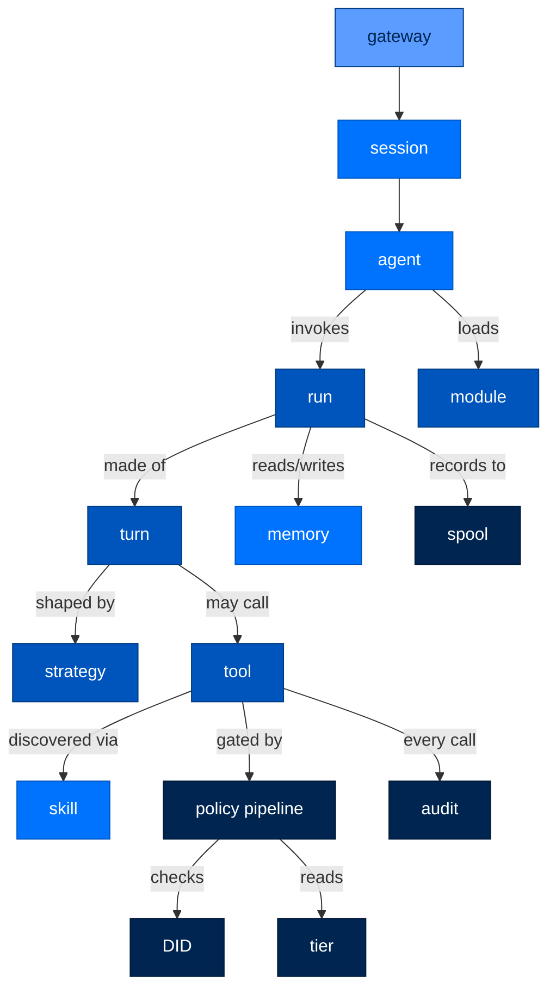

# GLOSSARY — Every Arc Term, Plainly Defined

> **Reference**  ·  Look up  ·  page 8 of 8  
> **For** Anyone looking something up  
> [← Troubleshooting](troubleshooting.md)  ·  [Docs home](../README.md)

---

## In one breath

Arc is built from about twenty small Python packages, each with one job, that
hand work to each other in a fixed order. This file is the dictionary for
that vocabulary: every package name, every piece of the security machinery,
every memory and LLM concept, defined once, in plain words first and precise
words second, with a pointer to the real code so nothing here is a guess.
Keep it open in a second tab while reading the other thirteen docs — when a
term stops you, look here instead of context-guessing. Every entry was
checked against the code that exists today, not the code that was planned;
where something is built but not yet wired up, the entry says so.

---

## How to use this glossary

Each entry is one row: the **term**, a plain-language sentence anyone can
follow, a technical sentence for contributors, and the file where it lives.
Entries marked `> ⚠️ **Unverified**` name something referenced in `CLAUDE.md`
or team memory that could not be confirmed in the current code — treat those
as design intent, not shipped behavior, until a human checks.

---

## 1. The packages

Eighteen directories live under `packages/`. Sixteen are real, shipping code
with tests; two (`arcmas`, `arcmodel`) are near-empty placeholders. Full
dependency table: [`docs/PACKAGE_INDEX.md`](../building/package-index.md#the-package-inventory).

| Package | Plain language | Technical precision | Code |
|---|---|---|---|
| **arcagent** | The "agent" itself — identity, tools, skills, memory-as-tools, extensions, all wired together. | Orchestrates `arcrun` to execute; never makes an LLM call or runs a loop itself (`CLAUDE.md`'s "don't mix concerns" rule). | `packages/arcagent/src/arcagent/core/agent.py` |
| **arccli** | The `arc …` command you type in a terminal. | Click-based CLI: create/serve/run agents, `arc ui`, `arc store`, `arc team`, `arc trust approve`. | `packages/arccli/src/arccli/` |
| **arcgateway** | The front door — how a chat platform reaches an agent. | Channel sessions, the executor, the built-in `web` adapter; owns agent data-plane reads (`fs_reader`, `fs_watcher`). | `packages/arcgateway/src/arcgateway/` |
| **arcgateway-mattermost** | The Mattermost plug-in for the front door. | Platform adapter plugin, built for air-gapped DOE/lab chat surfaces; imported by nothing in gateway core. | `packages/arcgateway-mattermost/src/arcgateway_mattermost/` |
| **arcgateway-slack** | The Slack plug-in for the front door. | Socket Mode adapter plugin. | `packages/arcgateway-slack/src/arcgateway_slack/` |
| **arcgateway-telegram** | The Telegram plug-in for the front door. | Adapter plugin; also the one place NATS shows up outside `arcteam`. | `packages/arcgateway-telegram/src/arcgateway_telegram/` |
| **arcllm** | The one place Arc talks to an AI model provider. | Unified adapter over 16 providers, telemetry, budgets, circuit breakers; the *only* sanctioned caller is `arcrun` (plus the standalone `arc llm` CLI escape hatch). | `packages/arcllm/src/arcllm/` |
| **arcmas** | ⚠️ **Not real code — an install shortcut.** `pip install arcmas` pulls in the CLI + memory for a one-command full stack. | `src/arcmas/__init__.py` is a 14-line docstring; verified — no second source file exists. | `packages/arcmas/src/arcmas/__init__.py` |
| **arcmemory** | Arc's memory system — what an agent remembers between conversations. | Dual-speed, four-store, analogical memory package; markdown source of truth + disposable SQLite index + an agentic "sleep" consolidation pass. Never imports `arcagent` (hard DAG boundary). | `packages/arcmemory/src/arcmemory/` |
| **arcmodel** | ⚠️ **Placeholder — "coming soon."** | `pyproject.toml` reads `Development Status :: 1 - Planning`; source is a two-line `__init__.py` with a version string. Verified — nothing else exists. | `packages/arcmodel/src/arcmodel/__init__.py` |
| **arcprompt** | Where the agent's system prompt actually lives, as an editable file, not a string buried in code. | Signed, overlay-able prompt store; a leaf package everything above it imports, imports nothing above itself. | `packages/arcprompt/src/arcprompt/` |
| **arcrun** | The engine that decides "call the model again," "run this tool," or "stop." | The execution loop; the *only* runtime path into `arcllm`; owns no tool/skill/memory logic of its own. | `packages/arcrun/src/arcrun/loop.py` |
| **arcskill** | The vetting pipeline for skills an agent can learn. | Signed install (Sigstore/Rekor), static + sandboxed scanning, lock file, CRL revocation lifecycle, plus the self-improvement loop. | `packages/arcskill/src/arcskill/` |
| **arcstore** | The filing cabinet for everything an agent did. | Always-on append-only spool + a pluggable `StorageBackend` query layer (SQLite by default); pure reader/writer, no policy logic. | `packages/arcstore/src/arcstore/` |
| **arcteam** | How multiple agents talk to each other. | NATS-backed message bus, DID-addressed mailboxes, mention extraction. | `packages/arcteam/src/arcteam/` |
| **arctrust** | The security nucleus — identity, signing, policy, audit. | Leaf shared library: DID identity, Ed25519 keypairs, `PolicyPipeline`, WORM audit chain. Imports no other Arc package. | `packages/arctrust/src/arctrust/` |
| **arctui** | The terminal chat interface. | Textual-based TUI; newest package, no dedicated architecture test yet. | `packages/arctui/src/arctui/` |
| **arcui** | The web dashboard for watching agents run. | Read-only **Observe** plane over `arcstore` plus a narrow **Interact** plane (`/ws/chat`, `/ws/team`); the one exception to "never import arcagent" is a single inventory read seam. | `packages/arcui/src/arcui/` |

---

## 2. Agent concepts

| Term | Plain language | Technical precision | Code |
|---|---|---|---|
| **agent** | An AI worker with a fixed identity, a set of tools, and a job to do. | An `ArcAgent` instance: identity + config + tool registry + module bus, wired to invoke `arcrun` for execution. | `packages/arcagent/src/arcagent/core/agent.py` |
| **turn** | One back-and-forth: the model is asked something, it answers or asks for a tool, the result comes back. | One iteration of the ReAct loop body (`react_loop`) — cancel check, breaker check, drain a steer, `transform_context`, call the model, act on the response. | `packages/arcrun/src/arcrun/strategies/react.py` |
| **run** | One whole job from start to finish — many turns, one outcome. | The lifetime of a `RunState`, identified by one `run_id`, bounded by `max_turns` and the circuit breaker. | `packages/arcrun/src/arcrun/loop.py` |
| **run_id** | The tracking number for one run. | Minted (or accepted, if pinned by the caller) in `_build_state`; every emitted event and every store record shares it so a run can be replayed or joined across tables. | `packages/arcrun/src/arcrun/loop.py:25` |
| **session** | A saved, resumable conversation — what survives between runs. | Owned by `SessionManager`: persists messages, drives compaction, writes checkpoints. | `packages/arcagent/src/arcagent/core/session_internal/manager.py:39` |
| **strategy** | The shape of the loop — how the model is allowed to work through a job. | A pluggable loop function (`react_loop`, code-as-action); ReAct is the only fully-general one shipped today. | `packages/arcrun/src/arcrun/strategies/react.py`, `packages/arcrun/src/arcrun/context/strategy_*.md` |
| **ReAct** | "Think, then act, then look at the result, repeat." | The default strategy: reason → tool call → observe → repeat, one turn at a time. | `packages/arcrun/src/arcrun/strategies/react.py` |
| **code-as-action** | The model writes code instead of calling discrete tools one at a time. | An alternate strategy prompt shape alongside ReAct. | `packages/arcrun/src/arcrun/context/strategy_code.md` |
| **steering** | Sending a live message into a run that's already in progress. | A message queued via the run's `RunHandle`, drained as a `user`-role message at the top of the next turn (or after tool results, if mid-turn). | `packages/arcrun/src/arcrun/state.py:38`, [`docs/API_REFERENCE.md`](../walkthrough/05-steering-and-strategies.md) |
| **interjection** | Informal name people use for a steering message. | Not a distinct code construct — see **steering**; no `interject`/`interjection` symbol exists in the codebase. | — |
| **compaction** | Trimming a conversation so it still fits in the model's memory, without losing what matters. | `SessionManager`-driven summarization pass with boundary masking; the sole compactor (`ADR-026`: append-only with an emergency valve). | `packages/arcagent/src/arcagent/core/session_internal/context.py` |
| **context window** | How much conversation the model can "see" at once. | The token budget a provider enforces per call; what compaction manages against. | `packages/arcagent/src/arcagent/core/session_internal/context.py` |
| **transform_context** | A hook that lets the caller edit what the model sees before each turn, without touching stored history. | Runs every turn, append-only per `ADR-026`; caller-supplied, not part of arcrun's own state. | `packages/arcagent/src/arcagent/core/session_internal/context.py:225` |
| **checkpoint** | A save-point a run can resume from later. | `LoopCheckpoint`, emitted by arcrun at each turn boundary through an injected hook; arcrun never persists it — the caller (arcagent) writes it durably. | `packages/arcrun/src/arcrun/checkpoint.py` |
| **max_turns** | The hard cap on how many turns one run can take. | `RunState.max_turns`, default 25; enforced by the top-of-turn circuit breaker check. | `packages/arcrun/src/arcrun/loop.py:129` |
| **tool** | Something an agent can actually do — run a command, read a file, search the web. | A `RegisteredTool` in `ToolRegistry`, built via the `@tool` decorator from a Python function's signature. | `packages/arcagent/src/arcagent/core/tool_registry.py:91` |
| **tool set freeze** | The list of tools available to a run is locked before the run starts and can't change mid-run. | `ToolRegistry.freeze()`, called before turn 0; a documented security invariant (`ADR-027`) — mutation after freeze invalidates the prompt cache and is disallowed. | `packages/arcrun/src/arcrun/loop.py:69`, `packages/arcrun/src/arcrun/registry.py:32` |
| **transport** | How a tool call is actually carried out. | `ToolTransport` enum, four members. Only `NATIVE` (in-process Python) is wired; `MCP`, `HTTP`, and `PROCESS` are enum-and-config-only — see [§7, producers-unwired](#7-process-project). | `packages/arcagent/src/arcagent/tools/_transport.py:29` |
| **skill** | A packaged how-to an agent can learn and call on, like a recipe. | A signed `SKILL.md` capability folder, discovered by `CapabilityLoader`, loaded lazily only when the model calls it. | `packages/arcskill/src/arcskill/`, [`docs/BLUEPRINTS.md`](../blueprints/blueprints.md) |
| **capability** | The umbrella term for anything discoverable an agent can use — a tool or a skill, before it's wired into the registry. | Resolved by `CapabilityLoader` from four precedence-ordered roots (package-internal, global, agent-declared, agent-authored); held by `CapabilityRegistry`. | `packages/arcagent/src/arcagent/capabilities/capability_loader.py` |
| **module** | An official, event-driven piece of agent behavior — messaging, memory, tasks, browser, and so on — not a Python `.py` file. | A directory under `arcagent/modules/` wired onto the `ModuleBus` with a priority (10=policy … 200=logging); see [false friends](#false-friends) for the "not a Python module" distinction. | `packages/arcagent/src/arcagent/modules/`, `packages/arcagent/src/arcagent/core/module_bus.py:1` |
| **extension** | A named seam where Arc lets you swap in your own implementation without forking — e.g. which memory backend, which skill adapter. | An `ExtensionPoint` descriptor; "select-one" (config picks one implementation, e.g. `brain`) or "scan-many" (a filtered view over the capability registry, e.g. `tools`). | `packages/arcagent/src/arcagent/extension/point.py`, `families.py` |
| **blueprint** | A reusable agent template — the starting config for a new agent. | Loaded by `arcagent.blueprints.loader`; merges tier stringency (federal floors always win) when composing a new agent's config. | `packages/arcagent/src/arcagent/blueprints/` |
| **brain / brain port** | The plug where memory attaches to an agent — arcagent itself has no memory logic. | A structural `Brain` Protocol (capture/retrieve/consolidate, primitives only); default is `NullBrain` (silent no-op, zero files written). `ArcMemoryBrain` in `arcmemory` is the real implementation. | `packages/arcagent/src/arcagent/brain/protocol.py`, `packages/arcmemory/src/arcmemory/brain.py` |
| **workpad** | The mechanism that keeps `context.md` an up-to-date "open loops" cockpit for the agent, on its own. | A module that rewrites `context.md` every `every_n_runs` real runs via an eval call, mirroring how the policy module self-evaluates. | `packages/arcagent/src/arcagent/modules/workpad/` |
| **identity.md** | The agent's immutable mission statement — it can read it, but never edit it. | A read-only workspace file; the policy engine has no code path that lets an agent write it (`ASI01` mitigation). | `packages/arccli/src/arccli/commands/agent/_common.py:896` |
| **context.md** | The agent's running scratchpad of open threads — the one memory file it *is* allowed to rewrite. | Sole writer is the workpad module; compaction no longer flushes to it (that path was removed). | `packages/arccli/src/arccli/commands/agent/_common.py:274` |
| **agent fleet** | All the agents registered and running together, that a UI or CLI can see and pick from. | Discovery walks `team_root/*/arcagent.toml` (`arcgateway.team_roster`); `arctui`'s roster module reuses the same discovery. | `packages/arcgateway/src/arcgateway/team_roster.py`, `packages/arctui/src/arctui/roster.py` |
| **mention triage** | Deciding which of an agent's incoming `@mentions` are actually worth its attention. | Extraction and attention-flag raising exist (`extract_mentions`, `apply_mentions`). An explicit mention resolves deterministically and bypasses scoring entirely; who answers an *un-addressed* channel post is decided by routing over published digests, not by asking each agent about itself (ADR-032). | `packages/arcteam/src/arcteam/mentions.py`, `packages/arcagent/src/arcagent/modules/messaging/activation.py` |

---

## 3. Security & trust

The Four Pillars — Identity, Sign, Authorize, Audit — are universal at every
tier, not a federal-only feature. Full model: [`docs/SECURITY.md`](security.md).

| Term | Plain language | Technical precision | Code |
|---|---|---|---|
| **DID** | An agent's permanent, cryptographic name — like a username that can't be faked. | Decentralized Identifier derived from an Ed25519 public key; carried as `caller_did` on every tool dispatch. | `packages/arctrust/src/arctrust/identity.py` |
| **Ed25519** | The specific signature algorithm Arc uses to prove "this really came from this agent." | A modern elliptic-curve signature scheme via PyNaCl; backs every `Signer`. | `packages/arctrust/src/arctrust/keypair.py` |
| **keypair** | The public/private key pair that gives an agent its identity. | Generated and held per-agent; the private half never leaves the signer. | `packages/arctrust/src/arctrust/keypair.py`, `packages/arctrust/src/arctrust/operator.py:90` |
| **signing** | Cryptographically stamping something so tampering is detectable. | `Signer` Protocol implementations: `InProcessSigner`, `VaultSigner`, `FileNotaryTransit`. | `packages/arctrust/src/arctrust/signer.py:55` |
| **Sigstore** | A public, free code-signing system Arc uses to verify skills came from who they claim. | Certificate-chain (Fulcio) verification used at skill-install time. | `packages/arcskill/src/arcskill/hub/verify.py` |
| **Rekor** | The public tamper-evident log that proves a Sigstore signature was actually published, not forged after the fact. | Transparency-log inclusion-proof check, part of the same install-verify stage. | `packages/arcskill/src/arcskill/hub/verify.py` |
| **TOFU** | "Trust On First Use" — the first time you see a new source, you decide whether to trust it; after that, it has to keep matching. | `TofuLayer` / `TofuDecision` (`NEW_SIGHTING`, etc.); tier-dependent (personal pins-and-trusts, federal requires a valid signature as the floor). | `packages/arctrust/src/arctrust/tofu.py:41` |
| **trust store** | The record of "which sources this agent has decided to trust." | The TOFU persistence surface, held at agent root, updated only via `arc trust approve`. | `packages/arctrust/src/arctrust/validators.py`, CLI: `arc trust approve` |
| **operator key** | The one human-controlled key that can approve exceptional actions no agent can approve for itself. | `OperatorKey`, loaded from a secured seed file; integrity-checked against a recorded public key on every read. | `packages/arctrust/src/arctrust/operator.py:90` |
| **operator grant** | A human's one-time, signed "yes" to a specific blocked action. | Signed by the operator's key, pinned to that deployment's operator DID so it can't be spoofed; resolved via `arc approve` / the arcui approvals panel. | `packages/arcstore/src/arcstore/approvals.py:33` |
| **HumanGate** | The code path that pauses a tool call and waits for a human's yes/no. | Presents a `PendingApproval`, blocks until an operator-signed grant (or denial/timeout) arrives. | `packages/arcagent/src/arcagent/tools/human_gate.py` |
| **policy pipeline** | The ordered set of rules that decides whether a tool call is allowed. | `PolicyPipeline`: a list of `PolicyLayer`s, evaluated in order. | `packages/arctrust/src/arctrust/policy.py` |
| **first-DENY-wins** | The moment any rule says "no," evaluation stops — nothing later can override it. | Documented invariant (R-011/R-012); an exception in a layer is also treated as DENY. | `packages/arctrust/src/arctrust/policy.py:1` |
| **fail-closed** | When something can't be verified, the safe answer is "block it," not "allow it." | Applied throughout `arctrust` — e.g. `Sigstore` unreachable at federal aborts install rather than skipping verification. | `packages/arctrust/src/arctrust/policy.py`, `packages/arcskill/src/arcskill/hub/installer.py` |
| **configured-gate fail-closed** | A policy layer that has no config yet is a harmless no-op; a policy layer that *has* config but hits an error is a hard deny. | The actual rule enforced: no configured policy → ALLOW (pass-through); configured-but-broken → DENY. Blanket fail-closed on *missing* state would brick default enterprise/federal setups. | `packages/arctrust/src/arctrust/policy.py` |
| **the Lethal Trifecta** | The three ingredients that, together, make an AI agent dangerous: private data, a way to talk to the outside world, and untrusted instructions. | Formalized as three legs — private (any on-machine read), external (comms to a non-owner), untrusted (unvetted input) — resolved contextually per call, not globally. A forbidden composition of all three pauses for a `HumanGate` approval instead of executing. | `packages/arcagent/src/arcagent/tools/approval_policy.py`, `packages/arcagent/src/arcagent/core/tool_policy.py` |
| **tier** | How strict an agent's security posture is: personal, enterprise, or federal. | Stringency **metadata**, not a feature switch — see [false friends](#false-friends). Ranked `personal < enterprise < federal`. | `packages/arcagent/src/arcagent/core/tier.py`, `packages/arcagent/src/arcagent/tiers.py:28` |
| **stringency metadata** | The idea that tier changes *how strict* a rule is enforced, never *whether* the Four Pillars apply at all. | Every tier still identifies, signs, authorizes, and audits; only the floors and defaults move. | `packages/arcagent/src/arcagent/tiers.py` |
| **relaxable knob** | A security setting personal/enterprise deployments may loosen, but federal is pinned to its floor and can't. | `RelaxableKnob` dataclass: name, federal floor, whether personal/enterprise may relax it, and where the floor is actually enforced. | `packages/arcagent/src/arcagent/tiers.py:42` |
| **federal floor** | The strictest allowed value for a given setting — federal deployments are pinned to it and cannot go weaker. | `federal_floor` field on every `RelaxableKnob`; an explicit weaker value at a tier that forbids relaxing it fails closed. | `packages/arcagent/src/arcagent/tiers.py` |
| **FIPS** | The US federal standard for which cryptographic algorithms are approved for government use. | `assert_fips_if_required` checks the active crypto backend and algorithm against the FIPS-approved list when required. | `packages/arctrust/src/arctrust/fips.py` |
| **classification** | A label on data (unclassified, CUI, secret, top secret) that governs how it can be handled. | `Classification` IntEnum, ordered; compared throughout audit and policy to gate what an agent may see or send. | `packages/arctrust/src/arctrust/classification.py:23` |
| **WORM** | "Write Once, Read Many" — an audit log that can be appended to but never edited or deleted. | The audit chain's storage discipline; enforced by `WormSink` writing append-only JSONL. | `packages/arctrust/src/arctrust/audit.py:176` |
| **hash chain** | Each audit entry cryptographically links to the one before it, so deleting or editing an entry breaks the chain and is detectable. | Implemented inside the WORM audit writer; verified by trace-integrity tests. | `packages/arctrust/src/arctrust/audit.py`, `packages/arcllm/src/arcllm/_trace_crypto.py` |
| **tamper-evident** | Not "impossible to tamper with" — "any tampering leaves visible proof." | The property the hash chain + WORM storage together provide. | `packages/arctrust/src/arctrust/audit.py` |
| **audit event** | One structured record of "this happened." | `AuditEvent` Pydantic model; emitted through `arctrust.audit.emit()`, the single emission point for every sink. | `packages/arctrust/src/arctrust/audit.py:65` |
| **audit sink** | Where an audit event actually gets written — a file, a chain, a live dashboard. | `AuditSink` Protocol; `NullSink` (discard, used when auditing is off) and `WormSink` (durable hash-chained JSONL) are the two implementations in `arctrust`; `arcui` adds a UI-facing sink for live observability. | `packages/arctrust/src/arctrust/audit.py:122,137,176` |
| **canonical serialization** | Turning a Python object into bytes the exact same way every time, so a signature over it is verifiable later. | `arctrust.canonical` — deterministic JSON encoding used before every sign/verify. | `packages/arctrust/src/arctrust/canonical.py` |
| **sandbox** | An isolated environment where untrusted code runs without touching the real machine. | `arcrun` backends (`DockerBackend`, `VmBackend`) and `arcskill`'s dry-run sandbox both provide this, at different strengths. | `packages/arcrun/src/arcrun/backends/docker.py:53`, `packages/arcrun/src/arcrun/backends/vm.py:154` |
| **Firecracker microVM** | A lightweight, hardware-isolated virtual machine — stronger isolation than a container. | `FirecrackerEngine`, the strongest sandbox tier for both `arcrun` execution and `arcskill` dry-run install verification; required (not optional) at federal tier. | `packages/arcrun/src/arcrun/backends/vm.py:104`, `packages/arcskill/src/arcskill/hub/_firecracker.py` |
| **AST scan** | Reading a skill's code structurally (as a parse tree) before running it, to catch dangerous patterns without executing anything. | Part of the install scan stage — regex bank + AST + semgrep + bandit. | `packages/arcskill/src/arcskill/hub/scanner.py`, `packages/arcskill/src/arcskill/hub/_ast_scanner.py` |
| **SBOM** | ⚠️ **Unverified.** A "Software Bill of Materials" — a manifest of every dependency in a build. `CLAUDE.md` names it as an LLM03 supply-chain mitigation ("SBOM generation"); no `sbom` symbol or tool was found in the codebase. | Dependency auditing exists via `pip-audit` (a quality-gate command); SBOM generation itself was not located. | — |
| **PII redaction** | Automatically finding and masking personal information before it leaves the agent. | Regex-based detection with a pluggable override in `arcllm`; separate PII/redaction logic also exists in `arcagent`'s user-profile and voice modules. | `packages/arcllm/src/arcllm/_pii.py` |
| **the Four Pillars** | Identity, Sign, Authorize, Audit — the four guarantees every Arc deployment enforces, at every tier. | Codified in `ADR-019`: every entity has a DID; every artifact is verified before use; every tool call goes through `PolicyPipeline`; every operation emits an `AuditEvent`. | `docs/architecture/decisions/ADR-019-four-pillars-universal.md` |

---

## 4. Data & storage

Full picture: [`docs/DATA_FLOW.md`](../walkthrough/data-flows.md#data-storage-layout).

| Term | Plain language | Technical precision | Code |
|---|---|---|---|
| **spool** | The one durable, append-only place everything gets written first, so nothing is lost if the database is down. | A directory of segment files that `arcstore.spool.record()` appends `SpoolRecord`s to; the store tails it, never the other way around. | `packages/arcstore/src/arcstore/spool.py` |
| **SpoolRecord** | One entry in the spool — one thing that happened. | Pydantic model written by `record()` and read back by `read`/`read_from_offset`. | `packages/arcstore/src/arcstore/records.py:20` |
| **request_id** | The ID that ties every event inside one call (LLM call, tool event, run event) together. | A `ContextVar` (`arcstore_request_id`) set by `request_context()`; records emitted inside inherit it unless given an explicit id. | `packages/arcstore/src/arcstore/spool.py:46` |
| **StoreIngest** | The process that reads the durable spool + WORM files into arcstore's queryable database. | Runs `backfill()` (catch up from offline files) then `_tail_loop()` (follow live appends); a pure file-tailer, owns no write sink of its own. | `packages/arcstore/src/arcstore/ingest.py:51` |
| **backfill** | Catching the database up on everything that was written while it was down. | `StoreIngest.backfill()` — one full scan from each file's persisted cursor. | `packages/arcstore/src/arcstore/ingest.py:77` |
| **tail** | Continuously following new writes as they happen, live. | `StoreIngest._tail_loop()`. | `packages/arcstore/src/arcstore/ingest.py:98` |
| **StorageBackend** | The interface any database engine plugs into to serve arcstore's queries. | A `Protocol`; `SqliteBackend` is the shipped default. | `packages/arcstore/src/arcstore/backends/base.py:57` |
| **SQLite mirror** | arcui's own private, read-only copy of the store data — rebuilt from the durable files, not pushed to. | `arcui`'s `Observe` plane runs its own `StoreIngest` into its own SQLite backend, shared-nothing from any other reader. | `packages/arcui/src/arcui/observe.py:1` |
| **WAL** | "Write-Ahead Log" — a SQLite mode that lets reads and writes happen concurrently without locking each other out. | `PRAGMA journal_mode=WAL`, set on every connection in `SqliteBackend`. | `packages/arcstore/src/arcstore/backends/sqlite.py:392` |
| **shared-nothing** | Each component keeps its own copy of data instead of contending over one shared instance. | Design principle behind `SqliteBackend` (per-instance WAL) and arcui's private mirror. | `packages/arcstore/src/arcstore/backends/sqlite.py:1` |
| **Observe plane** | The read-only side of arcui — watching what agents have done. | arcui's own `StoreIngest` + SQLite mirror, served read-on-demand over REST; no live push wire. | `packages/arcui/src/arcui/observe.py:1` |
| **Interact plane** | The narrow, write-capable side of arcui — actually talking to an agent live. | Not a named code symbol like Observe plane, but the real counterpart: the `/ws/chat` and `/ws/team` WebSocket routes, the only two-way wires arcui keeps. | `packages/arcui/src/arcui/server.py:10` |
| **dead-letter** | Where a task lands after it's failed retries too many times to keep retrying automatically. | A terminal task status in the reliability watcher's state machine. | `packages/arcstore/src/arcstore/tasks.py` |
| **pending approval** | A blocked action, waiting on a human's operator-signed grant. | `PendingApproval` model held by `ApprovalStore`. | `packages/arcstore/src/arcstore/approvals.py:33` |
| **cancellation signal** | A way to tell an in-flight run or task to stop. | Persisted through `arcstore.cancellations`; a run also checks a local `cancel_event` each turn. | `packages/arcstore/src/arcstore/cancellations.py` |

---

## 5. Memory

Full picture: [`docs/DATA_FLOW.md`](../walkthrough/data-flows.md#memory-lifecycle).

| Term | Plain language | Technical precision | Code |
|---|---|---|---|
| **dual-speed memory** | Memory that writes fast without an LLM, and separately consolidates slowly with one. | `Brain`'s three speeds: zero-LLM `capture`, gated `retrieve`, and an LLM-backed `consolidate` sleep pass. | `packages/arcmemory/src/arcmemory/brain.py:8` |
| **daily store** | The raw, per-day journal of what happened. | `stores/daily.py`. | `packages/arcmemory/src/arcmemory/stores/daily.py` |
| **episodic store** | Specific remembered events — "what happened, when." | `stores/episodic.py`. | `packages/arcmemory/src/arcmemory/stores/episodic.py` |
| **insight store** | Distilled conclusions drawn from events, not the raw events themselves. | `stores/insight.py`; `enrich()` expands an insight with graph-linked context. | `packages/arcmemory/src/arcmemory/stores/insight.py`, `packages/arcmemory/src/arcmemory/index/structural.py:242` |
| **procedural store** | Remembered *methods* — how to do something, learned from repetition, not a literal recorded tool sequence. | `stores/procedural.py`. | `packages/arcmemory/src/arcmemory/stores/procedural.py` |
| **semantic store** | General facts and entities — people, places, things the agent knows about. | `stores/semantic.py`. | `packages/arcmemory/src/arcmemory/stores/semantic.py` |
| **capture** | Writing something to memory instantly, with no LLM call. | `FastCapture` — the fast half of the three speeds. | `packages/arcmemory/src/arcmemory/capture.py` |
| **curate** | Filtering raw events down to what's actually worth distilling. | `curate_for_distillation()`. | `packages/arcmemory/src/arcmemory/curate.py:26` |
| **distill** | Turning curated raw events into structured memory using an LLM. | `Distiller` Protocol; `ArcLLMDistiller` is the production implementation, injected — never imported directly by the brain. | `packages/arcmemory/src/arcmemory/distill.py:145`, `packages/arcmemory/src/arcmemory/arcllm_seam.py:86` |
| **consolidate** | The slow "sleep" pass that turns the day's memory into durable, cross-referenced knowledge. | `Consolidator`, run as a bounded agentic loop (ReAct, via `react_adapter.py`), not a fixed pipeline. | `packages/arcmemory/src/arcmemory/consolidate.py:100` |
| **sleep pass** | Informal name for the consolidation run. | `Brain.consolidate()`'s underlying mechanism, referenced in `provider.py`. | `packages/arcmemory/src/arcmemory/provider.py` |
| **hygiene** | Nightly cleanup of memory quality — mainly deduplication. | `merge_entities()`, a non-lossy fold of same-type entity clusters plus alias tracking. | `packages/arcmemory/src/arcmemory/consolidate.py:473` |
| **merge_entities** | The specific function that de-duplicates entities that were split by naming drift (e.g. "Josh Schultz" vs "Joshua Shubbie"). | Same-type embedding-cluster merge; kept apart unless the embedder positively confirms a match. | `packages/arcmemory/src/arcmemory/consolidate.py:473` |
| **embedder** | The component that turns text into a vector for similarity search. | `Embedder` Protocol, an injected seam — absent, semantic recall silently degrades to BM25 + graph rather than failing. | `packages/arcmemory/src/arcmemory/index/rebuild.py:50` |
| **surface channel** | The keyword/vector search half of retrieval — fast, literal matching. | `SurfaceIndex` — cosine similarity + full-text search over chunks. | `packages/arcmemory/src/arcmemory/index/surface.py:73` |
| **structural channel** | The graph-based half of retrieval — finding things connected to what you asked about, not just textually similar. | `index/structural.py`; backs `enrich()` and analogical retrieval. | `packages/arcmemory/src/arcmemory/index/structural.py` |
| **analogical retrieval** | Finding memories that are *relevantly similar* to the current situation, not just keyword matches. | The combined surface + structural retrieval strategy the brain's `retrieve()` uses. | `packages/arcmemory/src/arcmemory/retrieve.py` |
| **enrich** | Pulling in graph-connected context around one specific memory. | `StructuralIndex.enrich(insight_id, hops=...)` returns an `InsightBundle`. | `packages/arcmemory/src/arcmemory/index/structural.py:242` |
| **fusion** | Combining surface-channel and structural-channel results into one ranked answer. | `arcmemory/fusion.py`. | `packages/arcmemory/src/arcmemory/fusion.py` |
| **retrieval-as-a-fast-tool** | Recall itself is not the slow LLM path — asking memory a question is fast and synchronous, unlike consolidation. | Design principle: `retrieve()` is the fast, gated, bounded call path; only `consolidate()` is the slow LLM sleep path. | `packages/arcmemory/src/arcmemory/brain.py:8` |

---

## 6. LLM layer

Full picture: [`docs/API_REFERENCE.md`](../walkthrough/04-unified-adapter.md).

| Term | Plain language | Technical precision | Code |
|---|---|---|---|
| **unified adapter** | One way of calling a model, no matter which company made it. | `LLMProvider` ABC + `BaseAdapter`; `load_model()` in `registry.py` picks and constructs the right one from config. | `packages/arcllm/src/arcllm/types.py:181`, `packages/arcllm/src/arcllm/adapters/base.py:16` |
| **adapter** | The specific code that speaks one provider's dialect (OpenAI, Anthropic, Ollama, ...). | One `BaseAdapter` subclass per provider under `adapters/`. | `packages/arcllm/src/arcllm/adapters/` |
| **module pipeline** | The stack of cross-cutting behaviors (retry, rate limiting, budgets, ...) wrapped around every adapter call. | Composable modules under `arcllm/modules/`, applied in `registry.py`'s `_apply_telemetry`/`_wrap_generic`. | `packages/arcllm/src/arcllm/modules/`, `packages/arcllm/src/arcllm/registry.py:279` |
| **tool_choice** | Telling the model "you must/may/must-not call a tool this turn." | A typed field on the unified call signature, owned by `arcllm`, not redefined per layer. | `packages/arcllm/src/arcllm/types.py` |
| **response_format** | Asking the model to return structured output (e.g. JSON matching a schema) instead of free text. | Optional field on the call signature; forwarded to providers that support it. | `packages/arcllm/src/arcllm/types.py:198` |
| **streaming** | Getting the model's answer token-by-token as it's generated, instead of waiting for the whole thing. | Adapter-level streaming support, surfaced through the unified call path. | `packages/arcllm/src/arcllm/adapters/base.py` |
| **cache control** | Telling the provider "this part of the prompt is reused — cache it" to cut cost and latency. | Confined to the Anthropic adapter only (`ADR-025`), never leaked into the generic pipeline. | `packages/arcllm/src/arcllm/adapters/anthropic.py` |
| **circuit breaker** | Stop calling a provider that's currently failing, instead of hammering it. | `CircuitBreakerModule`, a `CLOSED → OPEN → HALF_OPEN` state machine per provider. | `packages/arcllm/src/arcllm/modules/circuit_breaker.py:1` |
| **fallback** | If the preferred model/provider fails, automatically try a backup. | `FallbackModule`. | `packages/arcllm/src/arcllm/modules/fallback.py` |
| **load balancer** | Spreading calls across multiple endpoints instead of hammering one. | `LoadBalancerModule`. | `packages/arcllm/src/arcllm/modules/load_balancer.py` |
| **rate limit** | Capping how many calls (or how much spend) can happen in a window. | `RateLimitModule`. | `packages/arcllm/src/arcllm/modules/rate_limit.py` |
| **guardrails** | Automated checks on prompts/outputs before they're allowed through. | `GuardrailsModule`. | `packages/arcllm/src/arcllm/modules/guardrails.py` |
| **token budget** | A ceiling on spend or size so nothing runs away unbounded. | No single "TokenBudget" class exists; the concrete enforcement is a dollar-based spend budget with monthly/daily calendar reset (`telemetry_budget.py`), plus `max_turns` in `arcrun` and `distill_max_input_tokens` in `arcmemory` chunking untruncated input. | `packages/arcllm/src/arcllm/modules/telemetry_budget.py:1` |
| **trace store** | Where every LLM call's inputs/outputs/cost get durably recorded for later query. | `trace_store.py` + `trace_query.py`, hash-chained via `_trace_crypto.py`; retention rules in `trace_retention.py`. | `packages/arcllm/src/arcllm/trace_store.py` |

---

## 7. Process & project

| Term | Plain language | Technical precision | Code |
|---|---|---|---|
| **ADR** | "Architecture Decision Record" — a short doc explaining one design choice and why. | `docs/architecture/decisions/ADR-0NN-*.md`; 28 exist as of this codebase. | `docs/architecture/decisions/` |
| **spec (PRD / SDD / PLAN)** | The three-document trail from "what should this do" to "how will it work" to "what tasks build it." | Product Requirements Doc → Solution Design Doc → task Plan, each under `.claude/specs/<feature>/`. | `.claude/specs/` (gitignored per team memory) |
| **producers-unwired** | A pattern where the *shape* for a feature exists in code (an enum, a config field) but nothing actually drives it yet. | Named in `CLAUDE.md`; the clearest live example is `ToolTransport.MCP/HTTP/PROCESS` — declared, never dispatched. | `packages/arcagent/src/arcagent/tools/_transport.py:29` |
| **LOC budget** | A hard ceiling on how big the security-critical core is allowed to get, to keep it reviewable. | `< 3,500` lines for `arcagent/core/`, enforced as a quality gate. | `CLAUDE.md` |
| **architecture test** | An automated test that fails the build if a layering rule is broken (e.g. "arcrun must never import arcagent"). | Live under each package's `tests/architecture/` directory. | `packages/arcagent/tests/architecture/test_no_module_global_agent_state.py` |
| **quality gate** | The set of thresholds a change must clear before it's considered done (coverage, lint, types, complexity). | Line coverage ≥ 80%, branch ≥ 75%, core ≥ 90%, ruff/mypy 0 errors. | `CLAUDE.md` |
| **walkthrough notebook** | A runnable Jupyter notebook that demonstrates one real workflow end-to-end. | Per-package notebooks under `walkthroughs/<package>/`. | `walkthroughs/arcagent/`, `walkthroughs/arcllm/`, etc. |
| **knowledge graph / code-review-graph** | A structural map of the codebase (who calls what, who tests what) used to answer review questions without reading every file. | The `code-review-graph` MCP server; queried via tools like `query_graph_tool`, `get_impact_radius_tool`. | MCP server, not an in-repo package |
| **Mission Control** | The in-progress task-coordination system for multi-agent work. | Referenced in scaffolding/tests; the broader system is a roadmap item, partially landed as the task reliability engine. | `packages/arccli/src/arccli/commands/agent/_common.py`, `packages/arcstore/src/arcstore/tasks.py` |
| **UC-1** | Shorthand used in `arcstore` tests/docstrings for "a record written while the store was down is still recovered on startup." | One of the numbered use cases `StoreIngest`'s backfill+tail design satisfies (, UC-1/2/3). | `packages/arcstore/src/arcstore/ingest.py:78` |
| **skillvault** | The public hub/website for browsing and publishing skills — a separate product, not part of this repo. | Lives in a standalone `~/Projects/skillvault` repo; Arc only ships the connector that talks to it. | `packages/arcskill/src/arcskill/hub/` (connector only) |

---

## 8. Compliance acronyms

| Term | Plain language | Technical precision | Code |
|---|---|---|---|
| **NIST 800-53** | The US federal catalog of security and privacy controls agencies must implement. | Referenced compliance target; the **IA** (Identification & Authentication), **AU** (Audit & Accountability), and **AC** (Access Control) families map most directly onto arctrust's identity/audit/policy layers. | `CLAUDE.md` |
| **FedRAMP** | The US federal program that authorizes cloud services for government use. | A named compliance target for Arc's eventual authorization. | `CLAUDE.md` |
| **CMMC** | The Cybersecurity Maturity Model Certification — a DoD contractor security standard. | A named compliance target. | `CLAUDE.md` |
| **SCIF** | A "Sensitive Compartmented Information Facility" — a room built to prevent electronic eavesdropping. | Cited as a deployment environment Arc must run in (`CLAUDE.md`: "DOE machines, in labs, in SCIFs"). | `CLAUDE.md` |
| **air-gapped** | A machine or network with no physical connection to the internet. | The deployment context `arcgateway-mattermost` is explicitly built for. | `docs/deploy/single-node.md` |
| **OWASP LLM Top 10 (LLM01–LLM10)** | The industry-standard list of the ten biggest risks specific to LLM-powered applications. | Each code mapped to a concrete mitigation in `CLAUDE.md`'s threat-surface table (e.g. LLM06 Excessive Agency → tool allowlists + `HumanGate`). | `CLAUDE.md` |
| **OWASP Agentic Top 10 (ASI01–ASI10)** | The equivalent list for autonomous *agents* specifically, not just chat LLMs. | Same table format; e.g. ASI05 (Unexpected Code Execution) → Firecracker microVM isolation. | `CLAUDE.md` |
| **CUI** | "Controlled Unclassified Information" — sensitive-but-not-classified US government data. | A `Classification` enum value, ranked above `UNCLASSIFIED`. | `packages/arctrust/src/arctrust/classification.py:27` |
| **mTLS** | Mutual TLS — both sides of a connection prove their identity, not just the server. | ⚠️ **Unverified.** Named as a design requirement for all internal comms (`CLAUDE.md`), including NATS channels (ASI07 mitigation); no `mtls`/`mTLS` symbol was found in the current code. | — |
| **NATS** | The message bus Arc uses for agent-to-agent communication. | `arcteam`'s transport backend. | `packages/arcteam/src/arcteam/backends/nats.py` |
| **OpenTelemetry** | The open standard Arc uses for traces, metrics, and structured logs. | Wired through `arcllm`'s telemetry module and the audit/OTel hooks in `arcskill`'s install pipeline. | `packages/arcllm/src/arcllm/modules/otel.py` |

---

## Concept map

The fifteen most central terms and how they relate:

---

## False friends

Terms that mean something specific in Arc and are easy to misread if you
bring assumptions from elsewhere:

| Term | Don't read it as | Read it as |
|---|---|---|
| **tier** | A feature gate — "federal gets extra capabilities personal doesn't." | Stringency metadata. Every tier gets the full Four Pillars; tier only changes how strict the floors are. See [§3](#3-security-trust). |
| **module** | A Python `.py` file, or a generic "module" in the programming sense. | A specific arcagent concept: an official, event-driven behavior wired onto the `ModuleBus` with a priority (`packages/arcagent/src/arcagent/modules/`). |
| **run** vs **turn** | Interchangeable. | A **run** is the whole job (one `run_id`, bounded by `max_turns`); a **turn** is one iteration inside it (one model call + one action). |
| **strategy** | A high-level business plan. | The specific shape of arcrun's loop — ReAct, code-as-action. An implementation detail of how a turn is structured, not a product strategy. |
| **brain** | The memory implementation itself. | A **port** — a Protocol arcagent defines and depends on structurally, satisfied by `NullBrain` (default, does nothing) or `ArcMemoryBrain` (the real thing, in a separate package). arcagent never imports memory code. |
| **extension** vs **module** vs **skill** vs **capability** | Four names for the same idea. | Four distinct layers: a **capability** is anything discoverable (tool or skill); a **skill** is a signed `SKILL.md` folder; a **module** is an official built-in behavior on the event bus; an **extension** is a named seam (like `brain`) where you swap the *implementation* via config, independent of the module system. |
| **spool** vs **WORM** | The same durable log. | The **spool** is arcstore's own append-only operational log (run/tool/LLM events). **WORM** is the broader tamper-evident audit-chain storage discipline used by `arctrust`'s audit sink — a different, security-focused write path with its own hash chain. |
| **JsonlSink / SignedChainSink** | Real class names. | `CLAUDE.md` uses these as descriptive labels; the actual classes are `NullSink` and `WormSink` (`packages/arctrust/src/arctrust/audit.py`). Same behavior, different names — use the code names when reading source. |
