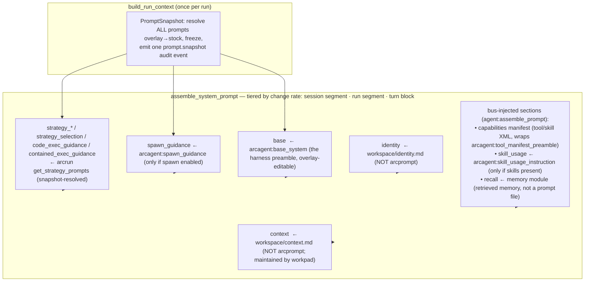

# Arc Prompts & Context — Master Compilation Reference

> **Reference**  ·  Look up  ·  page 5 of 8  
> **For** Anyone looking something up  
> [← Tiers and presets](tiers-and-presets.md)  ·  [Docs home](../README.md)  ·  [Security →](security.md)

## 1. The mental model

There are **two independent context mechanisms** in Arc. Don't confuse them:

| | Managed prompts (arcprompt) | Workspace files |
|---|---|---|
| **What** | The ~31 harness/system prompts that drive model behavior | The agent's own `identity.md` and `context.md` |
| **Where (stock)** | `packages/<pkg>/src/<pkg>/context/<name>.md` (ships in the wheel) | authored per agent |
| **Where (live)** | overlay `<agent_root>/context/<package>/<name>.md` (signed) | `<agent_root>/workspace/identity.md`, `.../context.md` |
| **Edited via** | repo (stock) · arcui Prompts tab / `arc prompt` CLI (overlay) | repo/arcui file editor (identity.md); auto-written by workpad (context.md) |
| **Signed?** | overlays are Ed25519-signed with the operator key, verified before use | identity.md is *not* signed (a known gap, tracked separately) |
| **Owner** | `arcprompt` (resolution, signing, snapshot, provenance) | `arcagent` session/workspace |

This doc is mostly about the first column. The second column matters only in §4 (they stack together in the agent's system prompt).

## 2. How a managed prompt resolves (every access)

```
resolve(package, name):
  1. validate package/name are safe path components   (SEC-04 guard, else refuse)
  2. overlay  <agent_root>/context/<package>/<name>.md exists?
        yes → verify its .arcsig against the pinned OPERATOR key
                valid   → USE overlay        (source = "overlay")
                invalid → RAISE (never silently fall back to stock)
        no  → USE stock  <pkg>/context/<name>.md   (source = "stock")
  3. identity of the resolved bytes = sha256(raw file)
```

- **Two layers, first match wins.** Overlay over stock. No third layer.
- **Fail-loud.** A present-but-broken overlay (bad frontmatter, empty body, missing/invalid/wrong-key signature) raises — it is never silently replaced by stock, so a deliberate override can't vanish unnoticed.
- **Overlays are signed with the deployment operator key** (arcui / `arc prompt` sign with it; the agent's resolver pins the operator public key). Editing stock in the repo needs no signature — the file *is* the trusted baseline.
- **Frozen per run.** At run start the agent resolves the *whole set* once into an immutable `PromptSnapshot`; every turn of that run sees identical bytes, and one `prompt.snapshot` audit event records package/name/source/sha256/signer for each. The next run picks up any change.

## 3. Stock vs overlay — where you edit

- **Change the default for the whole fleet** → edit the stock `.md` in `packages/<pkg>/src/<pkg>/context/`, commit, redeploy (`uv sync`). Keep the `---` frontmatter; the body is the prompt.
- **Override one deployed agent, no redeploy** → write an overlay:
 - arcui: the agent's **Prompts** tab → drawer (edit / save / reset); the rubric has a dedicated form editor.
 - CLI: `arc prompt edit <package> <name> --agent <dir> --file body.md` · `arc prompt reset <package> <name> --agent <dir>`.
 - Inspect: `arc prompt list --agent <dir>` · `arc prompt show <pkg> <name> [--stock|--effective]` · `arc prompt diff <pkg> <name> --agent <dir>`.

## 4. What stacks into the LIVE AGENT TURN

Only **some** prompts compose into the system prompt the model sees each turn. That
assembly happens in `arcagent.core.session_internal.context.assemble_system_prompt`,
fed by `arcagent.core.agent_dispatch.build_run_context` at run start.



**Ordering rule: tiered by change rate, most stable first.** A provider caches the
longest stable prefix, and the conversation sits behind the whole system prompt — so
one volatile byte in the system prompt re-bills the entire history every turn. The
assembly therefore returns three parts:

| Tier | Contents | Changes when | Cached as |
|------|----------|--------------|-----------|
| **session** | `base`, `identity`, capabilities manifest, `skill_usage`, `policy`, strategy + spawn guidance | a tool/skill is added, or identity.md is edited | segment 1 |
| **run** | `context` (workspace/context.md), plus any section the assembler does not recognize | the workpad rewrites context.md | segment 2 |
| **turn** | `recall`, `planning`, `teams` | every turn | not in the system prompt at all — see below |

So the model sees, top to bottom:

```
# cache segment 1 — session-stable
<base>                      (harness preamble)                        [arcagent:base_system]
<identity>                  (workspace/identity.md)
<capabilities>              (tool/skill manifest; preamble = tool_manifest_preamble)
<code_exec_guidance>        (if execute_python is available)          [arcrun]
<policy>                    (if the policy module is on)
<skill_usage>               (if the agent has skills)                 [arcagent:skill_usage_instruction]
<spawn_guidance>            (if spawn enabled)                        [arcagent:spawn_guidance]
<strategy_react>            (per allowed strategy)                    [arcrun:strategy_react]
<strategy_selection>        (only if >1 strategy; built from *_description) [arcrun]

# cache segment 2 — run-stable
<context>                   (workspace/context.md)
```

Within a tier: fixed head (`base`, then `identity`), then alphabetical, then fixed
tail (`context`).

**Per-turn material rides with the user's message, not the system prompt.** Memory
recall, the plan frontier, and the team inbox are attached to the user turn inside an
`<agent-context>` tag. `base_system` tells the model to read that block as reference
material, never as instruction.

It is stored, but **beside** the message rather than inside it. The session record is
`{"role": "user", "content": <what the person typed>, "turn_context": <retrieved
material>}`. So:

- The session stays the conversation. A chat view, a session tool, and memory
 capture read `content` and see only what was actually said — retrieved text never
 contaminates what gets distilled back into memory.
- The retrieved material is still durable, still auditable, and still on the record
 for that exact turn.
- `wire_messages()` re-attaches it verbatim when rebuilding history, so a replayed
 turn is byte-identical to the turn as first sent. `AssembledPrompt.session_record()`
 and `wire_messages()` are the two halves of one contract: if they ever disagreed by
 a byte, the cached prefix would stop matching and every turn would re-bill the whole
 conversation.

An unrecognized section falls back to the **run** tier: a module the assembler cannot
vouch for must never sit in front of the session-stable segment.

Section keys are stable identifiers, not the prompt names 1:1 — e.g. the `capabilities`
section is generated XML wrapping the `tool_manifest_preamble` prose; `strategy_selection`
is *composed* from the per-strategy `*_description` prompts.

One outlier: **`arcrun:code_exec_prefix` is NOT a section.** The code strategy prepends it
to the *first task message* inside its own loop (`strategies/code.py`), not to the system prompt.

## 5. The other five execution contexts (NOT the turn stack)

Most prompts are used in their own subsystems — standalone LLM calls or operations, each
resolving through the same stock/overlay rails at its own call site:

| Context | Prompts | Consumer |
|---|---|---|
| **Memory consolidation** (sleep pass) | `arcmemory:consolidate_agent` (the consolidation agent's system prompt) + `distill_fact` / `distill_insight` / `distill_procedure` / `distill_event` / `distill_day` / `distill_disambiguate` / `distill_merge_confirm` (per-extraction system prompts) | `arcmemory/agent_consolidate.py`, `arcmemory/arcllm_seam.py` |
| **Skill improver** | `arcskill:judge_prompt` + `judge_rubric` (structured YAML) · `reflection_prompt` · `code_repair_prompt` · `suitegen_prompt` · `nudge_template` | `arcskill/improver/{evaluator,mutate,suitegen}.py`, `.../nudge/nudge_emitter.py` |
| **Policy reflection** | `arcagent:reflection_prompt` + `reflection_grounding_header` | `arcagent/modules/policy/{policy_engine,reflection}.py` |
| **Workpad** (rewrites `context.md`) | `arcagent:context_maintainer_system` | `arcagent/modules/workpad/capabilities.py` |
| **Compaction / summary** | `arcagent:summary_template` | `arcagent/core/session_internal/manager.py` |
| **Dynamic tool authoring** | `arcagent:authoring_guidance` | `arcagent/tools/_dynamic_loader.py` |

> ⚠️ **Name collision:** `reflection_prompt` exists in BOTH `arcagent` (policy reflection) and
> `arcskill` (improver mutation). They are different prompts — always namespace by package.

## 6. Full inventory (31 prompts)

### arcrun (9) — model-facing loop/strategy guidance; overlay-aware via the run snapshot
| name | used in turn? | purpose |
|---|---|---|
| `strategy_react` | ✅ section | React loop guidance |
| `strategy_react_description` | ✅ (selection) | one-line React description |
| `strategy_code` | ✅ section (if code strategy) | code-exec loop guidance |
| `strategy_code_description` | ✅ (selection) | one-line code description |
| `code_exec_guidance` | ✅ (if `execute_python`) | when to prefer sandboxed code |
| `contained_exec_guidance` | ✅ (if `contained_execute_python`) | when to prefer container-isolated code |
| `code_exec_prefix` | prepended to 1st message | code-first framing in the code strategy |

### arcagent (9)
| name | used in turn? | purpose |
|---|---|---|
| `spawn_guidance` | ✅ section (if spawn on) | how/when to spawn sub-agent tasks |
| `skill_usage_instruction` | ✅ section (if skills) | how to use skills |
| `tool_manifest_preamble` | ✅ (wraps capabilities manifest) | prose intro to the tool/skill manifest |
| `context_maintainer_system` | ❌ workpad | rewrite `context.md` as an open-loops cockpit |
| `summary_template` | ❌ compaction | session-summary format |
| `reflection_prompt` | ❌ policy | policy self-reflection |
| `reflection_grounding_header` | ❌ policy | grounding header for reflection |
| `authoring_guidance` | ❌ tool authoring | guidance for dynamically authored tools |

### arcmemory (7) — all in the consolidation/sleep pass
`consolidate_agent`, `distill_fact`, `distill_insight`, `distill_procedure`, `distill_event`, `distill_day`, `distill_disambiguate`, `distill_merge_confirm`.

### arcskill (6) — all in the improver
`judge_prompt`, `judge_rubric` (structured YAML: per-dimension checklist + calibration), `reflection_prompt`, `code_repair_prompt`, `suitegen_prompt`, `nudge_template`.
> arcskill never imports arcprompt — it loads its own files and is *handed* an overlay-aware
> resolver by arcagent when present, so its prompts are still editable/overridable/effective.

## 7. File format

```
---
name: <name>              # must equal the filename stem
description: <one line>   # shown in listings
tunable: true             # inert metadata (reserved for the v2 optimizer)
---
<the prompt body — verbatim; loader strips exactly one trailing newline>
```

Overlays add a detached `<name>.md.arcsig` sidecar (the Ed25519 signature manifest).
`judge_rubric.md`'s body is YAML instead of prose — same rails, structured parse + form editor.

## 8. Quick pointers

- Package: `packages/arcprompt/` (`resolver.py`, `catalog.py`, `document.py`, `verifier.py`, `snapshot.py`).
- Turn assembly: `arcagent/core/agent_dispatch.py::build_run_context` → `session_internal/context.py::assemble_system_prompt`.
- Resolver construction + provenance: `arcagent/core/prompt_context.py`.
- arcui API/UI: `arcui/routes/agent_detail/prompts.py`, `arcui/prompt_signing.py`, `arcui/web/src/components/{prompt-drawer,rubric-editor}.tsx`.
- CLI: `arccli/src/arccli/commands/prompt.py`.
