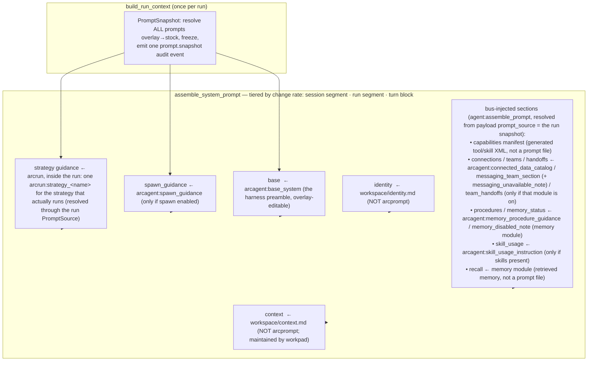

# Arc Prompts & Context — Master Compilation Reference

> **Reference**  ·  Look up  ·  page 5 of 8  
> **For** Anyone looking something up  
> [← Tiers and presets](tiers-and-presets.md)  ·  [Docs home](../README.md)  ·  [Security →](security.md)

## 1. The mental model

There are **two independent context mechanisms** in Arc. Don't confuse them:

| | Managed prompts (arcprompt) | Workspace files |
|---|---|---|
| **What** | The 49 harness/system prompts that drive model behavior | The agent's own `identity.md` and `context.md` |
| **Where (stock)** | `packages/<pkg>/src/<pkg>/context/<name>.md` (ships in the wheel) | authored per agent |
| **Where (live)** | overlay `<agent_root>/context/<package>/<name>.md` (signed) | `<agent_root>/workspace/identity.md`, `.../context.md` |
| **Edited via** | repo (stock) · arcui Prompts tab / `arc prompt` CLI (overlay) | repo/arcui file editor (identity.md); auto-written by workpad (context.md) |
| **Signed?** | overlays are Ed25519-signed with the operator key, verified before use | identity.md is *not* signed (a known gap, tracked separately) |
| **Owner** | `arcprompt` (resolution, signing, snapshot, provenance) | `arcagent` session/workspace |

This doc is mostly about the first column. The second column matters only in §4 (they stack together in the agent's system prompt).

## 2. How a managed prompt resolves (every access)

```
resolve(package, name):
  1. validate package/name are safe path components   (SEC-04 guard, else refuse)
  2. overlay  <agent_root>/context/<package>/<name>.md exists?
        yes → verify its .arcsig against the pinned OPERATOR key
                valid   → USE overlay        (source = "overlay")
                invalid → RAISE (never silently fall back to stock)
        no  → USE stock  <pkg>/context/<name>.md   (source = "stock")
  3. identity of the resolved bytes = sha256(raw file)
```

- **Two layers, first match wins.** Overlay over stock. No third layer.
- **Fail-loud.** A present-but-broken overlay (bad frontmatter, empty body, missing/invalid/wrong-key signature) raises — it is never silently replaced by stock, so a deliberate override can't vanish unnoticed.
- **Overlays are signed with the deployment operator key** (arcui / `arc prompt` sign with it; the agent's resolver pins the operator public key). Editing stock in the repo needs no signature — the file *is* the trusted baseline.
- **Frozen per run.** At run start the agent resolves the *whole set* once into an immutable `PromptSnapshot`; every turn of that run sees identical bytes, and one `prompt.snapshot` audit event records package/name/source/sha256/signer for each. The next run picks up any change. The snapshot travels as the run's `PromptSource` (`arcprompt.ResolverPromptSource(snapshot)`): to arcrun (strategy guidance, selection, code/dynamic prompts), on the `agent:assemble_prompt` payload (`prompt_source`) so every module section resolves from it, and to every `spawn_task` child. An override written mid-run therefore changes nothing in that run. A prompt missing from the snapshot raises `arcprompt.PromptMissing`, the same as a missing stock file.

## 3. Stock vs overlay — where you edit

- **Change the default for the whole fleet** → edit the stock `.md` in `packages/<pkg>/src/<pkg>/context/`, commit, redeploy (`uv sync`). Keep the `---` frontmatter; the body is the prompt.
- **Override one deployed agent, no redeploy** → write an overlay:
 - arcui: the agent's **Prompts** tab → drawer (edit / save / reset); the rubric has a dedicated form editor.
 - CLI: `arc prompt edit <package> <name> --agent <dir> --file body.md` · `arc prompt reset <package> <name> --agent <dir>`.
 - Inspect: `arc prompt list --agent <dir>` · `arc prompt show <pkg> <name> [--stock|--effective]` · `arc prompt diff <pkg> <name> --agent <dir>`.

## 4. What stacks into the LIVE AGENT TURN

Only **some** prompts compose into the system prompt the model sees each turn. That
assembly happens in `arcagent.core.session_internal.context.assemble_system_prompt`,
fed by `arcagent.core.agent_dispatch.build_run_context` at run start.


```mermaid
flowchart TB
    subgraph RUNSTART["build_run_context (once per run)"]
      SNAP["PromptSnapshot: resolve ALL prompts overlay→stock, freeze,<br/>emit one prompt.snapshot audit event"]
    end
    subgraph ASSEMBLE["assemble_system_prompt — tiered by change rate: session segment · run segment · turn block"]
      BASE["base  ← arcagent:base_system (the harness preamble, overlay-editable)"]
      ID["identity  ← workspace/identity.md (NOT arcprompt)"]
      BUS["bus-injected sections (agent:assemble_prompt, resolved from payload prompt_source = the run snapshot):<br/>• capabilities manifest (generated tool/skill XML, not a prompt file)<br/>• connections / teams / handoffs ← arcagent:connected_data_catalog / messaging_team_section (+ messaging_unavailable_note) / team_handoffs (only if that module is on)<br/>• procedures / memory_status ← arcagent:memory_procedure_guidance / memory_disabled_note (memory module)<br/>• skill_usage ← arcagent:skill_usage_instruction (only if skills present)<br/>• recall ← memory module (retrieved memory, not a prompt file)"]
      STRAT["strategy guidance ← arcrun, inside the run: one arcrun:strategy_&lt;name&gt; for the strategy that actually runs (resolved through the run PromptSource)"]
      SPAWN["spawn_guidance ← arcagent:spawn_guidance (only if spawn enabled)"]
      CTX["context  ← workspace/context.md (NOT arcprompt; maintained by workpad)"]
    end
    SNAP --> STRAT --> ASSEMBLE
    SNAP --> SPAWN --> ASSEMBLE
    SNAP --> BASE --> ASSEMBLE
    ID --> ASSEMBLE
    BUS --> ASSEMBLE
    CTX --> ASSEMBLE
```

**Ordering rule: tiered by change rate, most stable first.** A provider caches the
longest stable prefix, and the conversation sits behind the whole system prompt — so
one volatile byte in the system prompt re-bills the entire history every turn. The
assembly therefore returns three parts:

| Tier | Contents | Changes when | Cached as |
|------|----------|--------------|-----------|
| **session** | `base`, `identity`, capabilities manifest, `skill_usage`, `policy`, spawn guidance | a tool/skill is added, or identity.md is edited | segment 1 |
| **run** | `context` (workspace/context.md), plus any section the assembler does not recognize | the workpad rewrites context.md | segment 2 |
| **turn** | `recall`, `planning`, `teams` | every turn | not in the system prompt at all — see below |

So the model sees, top to bottom:

```
# cache segment 1 — session-stable
<base>                      (harness preamble)                        [arcagent:base_system]
<identity>                  (workspace/identity.md)
<capabilities>              (generated tool/skill manifest XML)
<policy>                    (if the policy module is on)
<skill_usage>               (if the agent has skills)                 [arcagent:skill_usage_instruction]
<spawn_guidance>            (if spawn enabled)                        [arcagent:spawn_guidance]

# cache segment 2 — run-stable
<context>                   (workspace/context.md)

# added by arcrun after the host's system segments
strategy guidance           (the ONE strategy that runs)              [arcrun:strategy_<name>]
```

Strategy guidance is not an assembled section. arcrun adds the guidance of the
strategy that actually runs, as its own system message after the host's segments,
so the cached prefix above is untouched. On an un-pinned turn the run first makes
one **selection call**: its system text is `arcrun:strategy_select` plus one
`arcrun:strategy_<name>_description` line per allowed strategy, and the model picks
`react`, `code`, or `dynamic` (see
[Steering and strategies](../walkthrough/05-steering-and-strategies.md)).

Within a tier: fixed head (`base`, then `identity`), then alphabetical, then fixed
tail (`context`).

**Per-turn material rides with the user's message, not the system prompt.** Memory
recall, the plan frontier, and the team inbox are attached to the user turn inside an
`<agent-context>` tag. `base_system` tells the model to read that block as reference
material, never as instruction.

It is stored, but **beside** the message rather than inside it. The session record is
`{"role": "user", "content": <what the person typed>, "turn_context": <retrieved
material>}`. So:

- The session stays the conversation. A chat view, a session tool, and memory
 capture read `content` and see only what was actually said — retrieved text never
 contaminates what gets distilled back into memory.
- The retrieved material is still durable, still auditable, and still on the record
 for that exact turn.
- `wire_messages()` re-attaches it verbatim when rebuilding history, so a replayed
 turn is byte-identical to the turn as first sent. `AssembledPrompt.session_record()`
 and `wire_messages()` are the two halves of one contract: if they ever disagreed by
 a byte, the cached prefix would stop matching and every turn would re-bill the whole
 conversation.

An unrecognized section falls back to the **run** tier: a module the assembler cannot
vouch for must never sit in front of the session-stable segment.

Section keys are stable identifiers, not the prompt names 1:1 — e.g. the `capabilities`
section is generated XML (no prompt file), and `teams` is `messaging_team_section`
plus `messaging_unavailable_note` when a configured fleet is not connected.

**Strategy-owned prompts are not sections either.** The code strategy prepends
`arcrun:code_exec_prefix` to the run's first system message (`strategies/code.py`). The
dynamic strategy adds `arcrun:dynamic_authoring` (the script language) to its own
authoring call, and every child a dynamic script starts gets the parent's system text,
the react guidance, and `arcrun:dynamic_child_framing`.

## 5. The other five execution contexts (NOT the turn stack)

Most prompts are used in their own subsystems — standalone LLM calls or operations, each
resolving through the same stock/overlay rails at its own call site:

| Context | Prompts | Consumer |
|---|---|---|
| **Memory consolidation** (sleep pass) | `arcmemory:consolidate_agent` (the consolidation agent's system prompt) + `distill_fact` / `distill_insight` / `distill_procedure` / `distill_event` / `distill_day` / `distill_disambiguate` / `distill_merge_confirm` / `distill_find_contradictions` / `consolidate_steps` (per-extraction system prompts) | `arcmemory/agent_consolidate.py`, `arcmemory/arcllm_seam.py` |
| **Memory promotion** (nightly sweep) | `arcmemory:promotion_classify` (the classifier question sent to the Jev classifier) | `arcmemory/promotion/question.py` |
| **Skill improver** | `arcskill:judge_prompt` + `judge_rubric` (structured YAML) · `curated_judge_prompt` · `reflection_prompt` · `code_repair_prompt` · `merge_prompt` · `suitegen_prompt` | `arcskill/improver/{evaluator,goldencase,mutate,suitegen}.py` |
| **Skill outcome labels** (turn end) | `arcagent:skill_outcome_classifier` | `arcagent/modules/skills/outcome.py` |
| **Planning** | `arcagent:planner_system` | `arcagent/modules/planning/decomposer.py` |
| **Channel router** (shared-channel tiebreak) | `arcagent:messaging_channel_router` | `arcagent/modules/messaging/activation.py` |
| **Policy reflection** | `arcagent:reflection_prompt` + `reflection_grounding_header` | `arcagent/modules/policy/{policy_engine,reflection}.py` |
| **Workpad** (rewrites `context.md`) | `arcagent:context_maintainer_system` | `arcagent/modules/workpad/capabilities.py` |
| **Compaction / summary** | `arcagent:summary_template` | `arcagent/core/session_internal/manager.py` |
| **Dynamic tool authoring** | `arcagent:authoring_guidance` | `arcagent/tools/_dynamic_loader.py` |

> ⚠️ **Name collision:** `reflection_prompt` exists in BOTH `arcagent` (policy reflection) and
> `arcskill` (improver mutation). They are different prompts — always namespace by package.

## 6. Full inventory (49 prompts)

The live list is always `arc prompt list --agent <dir>`; every entry below is also
proven end to end (ArcUI edit reaches the model wire) by
`tests/integration/test_prompt_edit_conformance.py`.

### arcrun (14) — loop/strategy guidance; resolved through the run's PromptSource
| name | where it reaches the model | purpose |
|---|---|---|
| `strategy_select` | selection call (un-pinned turn) | how to choose react / code / dynamic for this task |
| `strategy_react` | system message (react runs) | Reason-Act-Observe loop guidance |
| `strategy_code` | system message (code runs) | code-exec loop guidance |
| `strategy_dynamic` | system message (dynamic runs) | model-authored orchestration guidance |
| `strategy_plan_execute` | system message (pinned plan_execute) | plan-then-execute guidance |
| `strategy_oneshot` | system message (pinned oneshot) | single bounded call, no tools |
| `strategy_<name>_description` (×5) | selection call | one-line description per strategy |
| `code_exec_prefix` | prepended to the first system message | how to run code in the code strategy |
| `dynamic_authoring` | dynamic authoring call | the restricted script language |
| `dynamic_child_framing` | every dynamic child's system message | framing for a child started by `agent()` |

### arcagent (17)
| name | where it reaches the model | purpose |
|---|---|---|
| `base_system` | section `base` | the harness preamble |
| `spawn_guidance` | section (if spawn on) | how/when to spawn sub-agent tasks |
| `skill_usage_instruction` | section (if skills) | read a skill's SKILL.md before using it |
| `connected_data_catalog` | section `connections` (if connected_data on + sources) | nudge to search connected sources |
| `messaging_team_section` | section `teams` (if messaging on) | team messaging behaviour (`str.format`: `{entity_name}`, `{entity_id}`) |
| `messaging_unavailable_note` | appended to `teams` | fleet configured but messaging not connected |
| `team_handoffs` | section `handoffs` (if tasks on) | hand work to the owning teammate |
| `memory_procedure_guidance` | section `procedures` (memory live) | consult recorded procedures |
| `memory_disabled_note` | section `memory_status` (brain inactive) | durable memory is off |
| `messaging_channel_router` | channel router call | pick the one teammate to answer (`str.format`: `{channel}`, `{candidates}`) |
| `planner_system` | planning decomposer call | emit a DAG of concrete steps |
| `context_maintainer_system` | workpad call | rewrite `context.md` as an open-loops cockpit |
| `summary_template` | compaction call | session-summary format |
| `reflection_prompt` | policy call | policy self-reflection |
| `reflection_grounding_header` | policy call | grounding header for reflection |
| `skill_outcome_classifier` | turn-end classifier call | label a skill use success/failure/partial |
| `authoring_guidance` | tool result | guidance appended to tool-authoring rejections |

### arcmemory (11) — consolidation/sleep pass and promotion
`consolidate_agent`, `consolidate_steps`, `distill_fact`, `distill_insight`, `distill_procedure`, `distill_event`, `distill_day`, `distill_disambiguate`, `distill_find_contradictions`, `distill_merge_confirm`, `promotion_classify` (the memory-promotion classifier question).

### arcskill (7) — all in the improver
`judge_prompt`, `judge_rubric` (structured YAML: per-dimension checklist + calibration), `curated_judge_prompt` (strict PASS/FAIL for a curated golden case), `reflection_prompt`, `code_repair_prompt`, `merge_prompt`, `suitegen_prompt`.
> arcskill never imports arcprompt's manager — it is *handed* the agent's `PromptSource`
> by arcagent when present and reads its own stock files otherwise, so its prompts are
> still editable/overridable/effective.

## 7. File format

```
---
name: <name>              # must equal the filename stem
description: <one line>   # shown in listings
tunable: true             # inert metadata (reserved for the v2 optimizer)
---
<the prompt body — verbatim; loader strips exactly one trailing newline>
```

Overlays add a detached `<name>.md.arcsig` sidecar (the Ed25519 signature manifest).
`judge_rubric.md`'s body is YAML instead of prose — same rails, structured parse + form editor.

## 8. Quick pointers

- Package: `packages/arcprompt/` (`resolver.py`, `catalog.py`, `document.py`, `verifier.py`, `snapshot.py`).
- Turn assembly: `arcagent/core/agent_dispatch.py::build_run_context` → `session_internal/context.py::assemble_system_prompt`.
- Resolver construction + provenance: `arcagent/core/prompt_context.py`.
- arcui API/UI: `arcui/routes/agent_detail/prompts.py`, `arcui/prompt_signing.py`, `arcui/web/src/components/{prompt-drawer,rubric-editor}.tsx`.
- CLI: `arccli/src/arccli/commands/prompt.py`.
