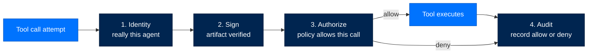
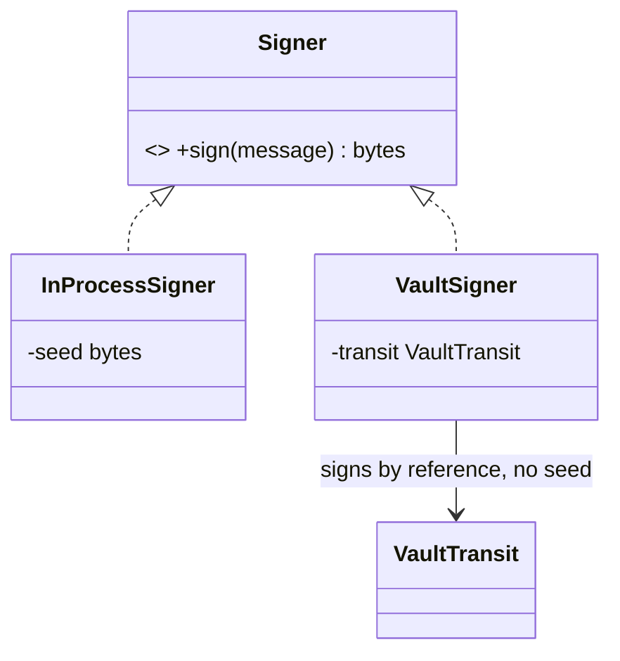
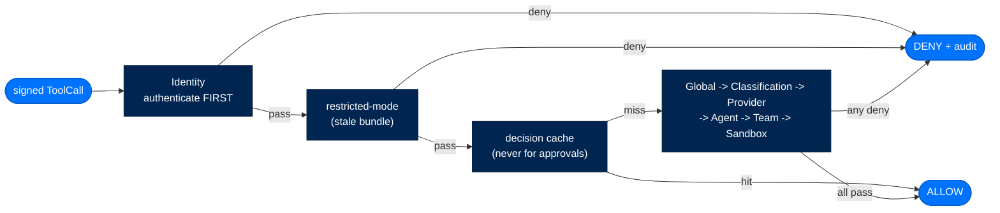
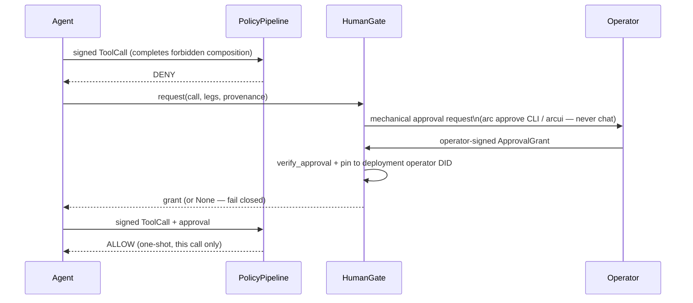
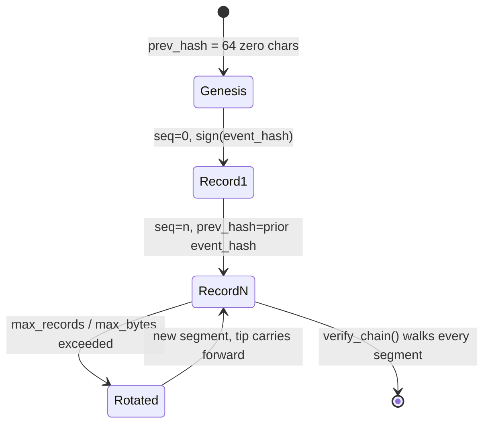

# Arc Security Reference

> **Reference**  ·  Look up  ·  page 6 of 8  
> **For** Anyone looking something up  
> [← Prompts](prompts.md)  ·  [Docs home](../README.md)  ·  [Troubleshooting →](troubleshooting.md)

---

## In One Breath

Every Arc agent carries a cryptographic ID card it cannot forge (**Identity**). Every piece of code it loads — a skill, a tool, a sandbox backend — carries a signature checked again at the moment it's used, not just at install time (**Sign**). Every action it tries to take passes through a guard that can say no, and the guard's default answer to "something went wrong while deciding" is no, never yes (**Authorize**). Everything that happens — allowed or denied — is written to a logbook nobody, not even the machine's owner, can quietly edit after the fact (**Audit**).

These four guarantees are not a "federal mode" you switch on; a hobbyist's laptop agent gets them exactly like a national-lab deployment does. What changes between the two is only how strict the settings are. The floor itself never moves.

---

## The Four Pillars Are Universal

The most commonly misunderstood thing about Arc: **Identity, Sign, Authorize, and Audit are non-optional defaults at every tier**. Earlier code drifted toward gating these behind `tier == "federal"` — `UnsafeNoOp` bypasses, `skip_sandbox=True`, `require_manifest = (tier == "federal")`, empty allowlists treated as allow-all. These bypasses were removed. Security no longer depends on a config flag left in the wrong position.

**Tier is stringency metadata, not a gate.** A personal-tier agent still has a DID, still signs its artifacts, still runs a policy pipeline, still emits audit events.

| Knob | Personal | Enterprise | Federal |
|---|---|---|---|
| Trusted signers | self-signed OK + audit warn | operator-chain | operator-chain (FIPS) |
| Policy layers | Identity + Global (2) | + Classification/Provider/Agent/Sandbox (6) | + Team (7, all layers) |
| Dynamic tool creation | allowed | approval gate | denied |
| Signing algorithm | Ed25519 | Ed25519 | ECDSA-P256 (FIPS floor) |
| Approval-required tools | opt-in only | every plain tool | every tool and skill |



---

## Pillar 1 — Identity

Every agent has a DID minted from an Ed25519 keypair; `ArcAgent.__init__` requires one. Primitives live in `packages/arctrust/src/arctrust/identity.py` and `keypair.py`. Format: `did:arc:{org}:{type}/{hash}`, where `hash` is the first 8 hex chars of `sha256(public_key)` — deterministic, so `did_matches_pubkey` can check a presented key against a claimed DID.

Key files must be `0600`; `AgentIdentity.load_keys` rejects group/other-readable files outright.

### Child Identities

Child identities (spawned sub-agents) are *derived*, not independent: `derive_child_identity` runs HKDF-SHA256 over the parent's seed and a per-spawn nonce — unpredictable without the parent's private key. Clearance narrows monotonically (`child_clearance = min(requested, parent_clearance)`), so a child can never out-clear its parent.

### TOFU (Trust On First Use)

`arctrust.tofu.TofuLayer` answers "should this artifact be allowed to run," a different question from "is it authentically signed."

| Tier | Rule |
|---|---|
| Personal | Signed by the agent's own pinned key → allow. Unsigned → gated by `auto_run_agent_code`. |
| Enterprise | Unknown name → `NEW_SIGHTING` (human approves). Known + matching hash → allow. Known + drifted hash → deny (tamper). |
| Federal | Unsigned → deny outright. Signed → same human-approval gate as enterprise; self-signing attributes, never authorizes. |

---

## Pillar 2 — Sign

Every loaded artifact — skill, extension, sandbox backend, pairing, agent-authored capability — is verified **at load**, independent of any install-time check.

### Signer Protocol



**`InProcessSigner`** holds the seed in memory (Ed25519 or ECDSA-P256; personal/enterprise default).  
**`VaultSigner`** signs *by reference* through a `VaultTransit` boundary (Vault Transit, a PKCS#11 HSM, cloud KMS, or the reference `FileNotaryTransit`) — the seed never enters this process.

### Detached Artifact Signatures

`.arcsig` sidecar files contain: content SHA-256 digest, signer DID, public key, and Ed25519 signature. `verify_artifact` re-checks digest + signature + (when pinned) key identity at load.

### FIPS Floor

At federal (`require_fips=true`), refuses to run a protected crypto function unless the loaded OpenSSL is itself FIPS-140-3-validated *and* the algorithm is FIPS-approved. Only `ecdsa-p256` and `aes-256-gcm` qualify — Arc's Ed25519 (PyNaCl/libsodium) has no CMVP path, so federal forces ECDSA-P256 for signing.

---

## Pillar 3 — Authorize

`arctrust.policy.PolicyPipeline` evaluates every tool call. **First-DENY-wins. Fail-closed on exceptions** — a raising layer becomes a DENY, never a skip.



| Tier | Layer order | Layer count |
|---|---|---|
| Personal | Identity, Global | 2 |
| Enterprise | Identity, Global, Classification, Provider, Agent, Sandbox | 6 |
| Federal | Identity, Global, Classification, Provider, Agent, Team, Sandbox | 7 |

### Policy Layers

- **Identity** — SSH-key invariant (signed by the DID's own key holder); ent/fed also require pre-registration. Runs first and unconditionally.
- **Global** — tenant-wide denylist + the forbidden-composition check (lethal trifecta).
- **Classification** — Bell-LaPadula no-read-up via `classification.dominates`.
- **Provider** — LLM token/cost/rate budget ceiling.
- **Agent** — per-agent tool allowlist.
- **Team** (federal only) — delegation scope never exceeds its grant.
- **Sandbox** — required vs. available isolation (`host < container < vm`).

### The Lethal Trifecta Gate

Private data + external comms + untrusted input, together, is an exfiltration primitive. Arc models it as a context-resolved three-leg accumulator:

| Leg | Resolution |
|---|---|
| `private_data` | Any on-machine read — `file_read`, `memory`, `recall`, `user_profile`. |
| `external_comms` | Pushing agent-chosen content to an agent-chosen sink — `network_egress`, messaging, notify. |
| `untrusted_input` | Unvetted ingested content this session — `web`, `browser`, `browser_task`, `extract`, `subprocess`. |



---

## Pillar 4 — Audit

Every security-relevant action emits an `AuditEvent` through one function: `arctrust.audit.emit(event, sink)`.

### WormSink

The compliance system of record: each `write()` appends `{seq, event, prev_hash, event_hash, algorithm, signature}` to an append-only `0600` file.



- **Restart-safe** — tip/seq recovered from the file tail
- **Tamper-evident** — `verify_chain` checks hash links, signatures, seq contiguity
- **Single-writer** — exclusive `flock`; second writer raises
- **Crash-recoverable** — torn final line truncated, recovery record appended

### External Witnessing

`WitnessAnchor` submits the operator-signed checkpoint head to a second, separately-custodied medium (offline medium or Rekor-style online log). A forger with the operator key cannot retroactively remove a head from a log they don't own.

---

## Isolation & Execution Safety

Arc's ASI05 answer is a tier-routed isolation ladder:

| Rung | Backend | Class |
|---|---|---|
| `host` | `arcrun/backends/local.py` | Stripped local subprocess — dev/personal default |
| `container` | `arcrun/backends/docker.py` | Shared-kernel container |
| `vm` | `arcrun/backends/vm.py` | Firecracker microVM — hardware isolation |

The tool set is frozen for the run, not just policy-gated per call. `arcrun.registry.ToolRegistry.freeze()` seals the set before turn 0 of every run — no mutable window mid-run for injection.

---

## Cross-Agent Isolation

Arc is shared-nothing per agent. Memory state is keyed by every agent's DID, with a `contextvars.ContextVar` bound at `configure()` and rebound at every turn-dispatch entry. Fail-closed mismatch checks prevent cross-agent bleed.

---


## Compliance and threat mappings

Framework mappings live with the security runbooks so each has exactly one home:

- [NIST 800-53 control mapping](../runbooks/security/compliance-nist-800-53.md)
- [OWASP Top 10 for LLM Applications](../runbooks/security/compliance-owasp-llm.md)
- [OWASP Top 10 for Agentic Applications](../runbooks/security/compliance-owasp-agentic.md)
- [Threat model](../runbooks/security/threat-model.md)


## ArcLLM Security Features

ArcLLM provides additional security layers for LLM communication:

### API Key Isolation

Keys are resolved at runtime from environment variables or vault backends, never stored in config files.

```toml
[provider]
api_key_env = "ANTHROPIC_API_KEY"
vault_path = "secret/data/llm/anthropic"  # Optional vault path
```

### PII Redaction

Automatically detects and redacts SSN, credit cards, emails, phone numbers, and IP addresses.

```toml
[modules.security]
enabled = true
pii_enabled = true
pii_custom_patterns = [
    { name = "EMPLOYEE_ID", pattern = "EMP-\\d{6}" },
]
```

### Request Signing

HMAC-SHA256 or ECDSA-P256 signing of request payloads for tamper detection.

```toml
[modules.security]
signing_enabled = true
signing_algorithm = "hmac-sha256"
signing_key_env = "ARCLLM_SIGNING_KEY"
```

### Audit Trail

Structured logging of every LLM interaction (metadata only by default).

```toml
[modules.audit]
enabled = true
include_messages = false  # Never log raw content in production
include_response = false
```

### Rate Limiting

Token-bucket rate limiting prevents API quota exhaustion.

```toml
[modules.rate_limit]
enabled = true
requests_per_minute = 60
burst_capacity = 60
```

---

## Contributor Security Checklist

A PR should be rejected in review if it:

- **Bypasses the policy pipeline** — any tool dispatch not routed through `PolicyPipeline.evaluate`
- **Adds an audit channel outside `emit()`** — raw `logging.info()` instead of audit record
- **Adds an unsigned load path** for backend, skill, or plugin
- **Swallows a policy error into an ALLOW** — any fallback on layer exception other than DENY
- **Puts secrets in a prompt, log, or error message**
- **Tier-gates a pillar itself** — only stringency may vary by tier
- **Introduces a state change with no audit event**

---

## Runnable References

- [Identity & DID](https://github.com/joshuamschultz/Arc/blob/main/walkthroughs/arctrust/01-identity-did.ipynb)
- [Signing & Artifacts](https://github.com/joshuamschultz/Arc/blob/main/walkthroughs/arctrust/02-keypairs-signing.ipynb)
- [Policy Pipeline](https://github.com/joshuamschultz/Arc/blob/main/walkthroughs/arctrust/03-policy-pipeline.ipynb)
- [Audit Sinks](https://github.com/joshuamschultz/Arc/blob/main/walkthroughs/arctrust/04-audit-sinks.ipynb)

---

## Where to Look in the Code

| Path | What Lives There |
|---|---|
| `packages/arctrust/src/arctrust/identity.py` | DID derivation, `AgentIdentity`, child identity |
| `packages/arctrust/src/arctrust/keypair.py` | Raw Ed25519 sign/verify/generate |
| `packages/arctrust/src/arctrust/signer.py` | `Signer` Protocol — in-process and vault-transit |
| `packages/arctrust/src/arctrust/artifact.py` | Detached `.arcsig` artifact signatures |
| `packages/arctrust/src/arctrust/operator.py` | `OperatorKey` — the audit-signing authority |
| `packages/arctrust/src/arctrust/fips.py` | Federal FIPS-140-3 startup floor |
| `packages/arctrust/src/arctrust/tofu.py` | Trust-On-First-Use source-approval gate |
| `packages/arctrust/src/arctrust/policy.py` | `PolicyPipeline`, layers, `ToolCall`, approval grants |
| `packages/arcagent/src/arcagent/tools/human_gate.py` | Trifecta human-approval pause |
| `packages/arcrun/src/arcrun/backends/` | The `host`/`container`/`vm` isolation ladder |

---

## Deployment Security Checklist

- [ ] API keys set via environment variables or vault — not in config files
- [ ] `ARCLLM_SIGNING_KEY` set if request signing is enabled
- [ ] PII redaction enabled for workflows handling user data
- [ ] Audit module enabled for compliance-required environments
- [ ] Rate limits configured per provider
- [ ] Provider TOML `base_url` values use `https://`
- [ ] `include_messages` and `include_response` left `false` in production
- [ ] Log level set to `INFO` or higher (not `DEBUG`)
- [ ] Vault TTL configured for key freshness
- [ ] Trace store directory permissions `0o700`
- [ ] JSONL trace files permissions `0o600`
- [ ] `verify_chain()` run after any suspected tampering

---

## Next Steps

- [DATA_FLOW.md](../walkthrough/data-flows.md) — Data flow pathways
- [DEPLOYMENT.md](../runbooks/deploy/overview.md) — Deployment guides
- [IMPLEMENTATION_GUIDES.md](../building/implementation-guides.md) — Extension points

---

## How a capability becomes allowed or blocked

This is the trust model: the path every capability takes from disk to
execution, and every gate that can stop it.

This documents the post-refactor trust/capability pipeline: the exact gates a
capability (an agent-authored tool `.py` or a skill `SKILL.md`) passes through
before it can run, and how the three deployment tiers change those gates.

It is written for an engineer or operator who needs to reason about *why* a
given capability loaded or was refused. Every claim here is grounded in current
source; symbols are named so you can jump to them.

- Trust primitives (signing, TOFU, approval store, tiers): `arctrust`
- The load pipeline that consults them: `arcagent.capabilities.capability_loader`
- The AST import gate: `arcagent.tools._dynamic_loader`
- Operator surfaces: `arccli.commands.trust`, `arcui.routes.trust`

> **One sentence:** an artifact loads only if it survives the AST import gate,
> then (above personal tier) carries a valid signature, then is approved by the
> per-tier TOFU gate. A signature proves *who wrote it and that it is unchanged*
> — never that it is *authorized*. Authorization is a human operator's decision,
> recorded as a pinned hash.

---

### The three tiers

Tier is **stringency metadata, not a separate code path** (ADR-019). The same
gates run at every tier; the tier only tightens each one. The tier enum lives in
`arcagent.core.tier.Tier` (`personal` / `enterprise` / `federal`); `arctrust`
takes the tier as a plain string so the trust foundation stays independent of
arcagent's enum.

Two independent knobs are tier-resolved:

1. **Which imports** an agent-authored tool may use (`ImportPolicy`, the AST
 gate).
2. **What source approval** is required to load it (`TofuLayer`, plus the
 `require_signature` floor).

### Import policy per tier

Resolved by `resolve_workspace_import_policy(tier, allow_all_imports, allow_imports)`
in `_dynamic_loader.py`. Three modes (`ImportMode`):

| Tier | Mode | What passes | Operator override |
|---|---|---|---|
| **personal** | `ALLOW_ALL` | every import | — |
| **enterprise** | `BLOCKLIST` | everything *except* four privileged groups | `allow_imports` subtracts exceptions; `allow_all_imports=True` is a blanket opt-out to allow-all |
| **federal** | `ALLOWLIST` | deny-by-default: only the seed set + `allow_imports` | `allow_all_imports` is **ignored** — no blanket relaxation |

The enterprise blocklist (`_ENTERPRISE_BLOCKED_GROUPS`), grouped for
self-documenting errors:

- **filesystem** — `os`, `shutil`, `pathlib`, `tempfile`, `glob`
- **process/exec** — `subprocess`, `multiprocessing`
- **interpreter** — `sys`, `ctypes`, `importlib`, `pickle`, `marshal`, `shelve`
- **network** — `socket`, `urllib`, `http`, `requests`, `httpx`

The federal seed (`_FEDERAL_SEED_IMPORTS`) is `{"__future__", "arcagent"}` —
just enough that the `@tool` decorator import and `from __future__ import
annotations` always validate, so a tool *can* be authored at federal at all.
Any unknown tier falls toward the stricter enterprise blocklist (fail-closed).

### What stays unconditionally blocked — every tier

`ImportPolicy` only relaxes **module imports**. The sandbox-escape checks in
`AstValidator` are enforced at *all* tiers, including personal, and cannot be
configured off:

- **Dynamic code execution** — calls to `eval`, `exec`, `compile`, `__import__`
 (`_BLOCKED_CALLS`).
- **Frame / interpreter traversal** — `f_back`, `f_globals`, `f_locals`,
 `f_builtins`, `gi_frame`, `tb_frame`, and the class-graph escape hatches
 `__class__`, `__bases__`, `__subclasses__`, `__mro__`, `__dict__`,
 `__reduce__`, `__init_subclass__`, `modules`, … (`_BLOCKED_ATTRIBUTES`).
- **Assignment to interpreter internals** — `__builtins__`, `__loader__`,
 `__spec__` (`_BLOCKED_ASSIGN_TARGETS`), and starred unpacking of them.
- **Non-UTF-8 source** — a PEP 263 coding declaration other than utf-8 is
 rejected *before* the AST is parsed (codec-stage attacks run before parsing).
- **`AttributeError.obj`/`.name` leaks**, `__init_subclass__` definitions, and
 metaclasses defining `__getitem__` — narrower CVE-class bypasses.

This is deliberately narrow-by-design: reject anything not understood. Even at
personal tier where all imports pass, an agent-authored tool still cannot
`eval`, reach a frame, or mutate builtins.

### What an agent may do re: creating tools, per tier

Authoring (`create_tool` / `update_tool`) validates against the **same**
tier-resolved `ImportPolicy` the loader will later enforce (`_runtime.import_policy()`),
so a tool accepted at authoring is never one the loader would reject for imports,
and vice-versa. But authoring is not authorization:

- **personal** — an agent can author, sign (automatically), and load its own
 tools with any imports, no operator step. This is what makes the default
 experience work: the scaffolded `calculator.py` (signed at `arc agent create`)
 and an agent's own self-authored tools load without the operator flipping any
 global switch.
- **enterprise / federal** — an agent can still *write* a tool, but it will not
 *load* until an operator approves it (see TOFU below). Federal additionally
 restricts which imports the tool may even contain.

---

### Where capabilities load from — and their trust level

`CapabilityLoader.scan_and_register` walks four scan roots in precedence order
(a later root shadows an earlier one by name). Each capabilities root also
contributes a `*-skills` sub-root (its `skills/` subdir, where `create_skill`
writes):

| # | Root | Path | Trust |
|---|---|---|---|
| 1 | `builtins` / `builtins-skills` | `arcagent/builtins/capabilities/` | **trusted** |
| 2 | `global` / `global-skills` | `~/.arc/state/capabilities/` | **untrusted** |
| 3 | `agent` / `agent-skills` | `<agent_root>/capabilities/` | **untrusted** |
| 4 | `workspace` / `workspace-skills` | `<agent_root>/workspace/capabilities/` | **untrusted** |

Trusted vs untrusted is the set `_UNTRUSTED_ROOTS` in `capability_loader.py`.
Only the harness's own shipped package code (`builtins*`, and `module:*` module
capabilities) is trusted.

**What "untrusted" changes:** any root an agent can write to is untrusted —
including `global` and `agent`, because a compromised agent can plant a `.py`
there via bash and reload it, not just in its own workspace. Untrusted sources go
through the full gate: **AST validation → restricted builtins → signature verify
→ TOFU**. Trusted roots skip that gate and load directly (they are the harness
itself).

The load body for an untrusted `.py` (`_register_python_file`): AST-validate
(cached by `AstValidationCache` on md5+mtime), run the trust gate, then execute
the module with a hardened `__builtins__` from `build_restricted_builtins(policy)`
— no `open`/`eval`/`exec`, and an `__import__` that mirrors the AST import policy
at runtime. A skill folder (`_register_skill_folder`) is gated the same way,
keyed on its `SKILL.md`, because `SKILL.md` is injected into the agent prompt
(LLM01 / ASI06) and so is as trust-sensitive as executable code.

> Note: `build_restricted_builtins` is defense-in-depth / a fast-fail linter in
> front of the real OS execution sandbox — the object graph is
> escapable; genuine isolation is the sandbox's job, not this dict's.

---

### Signing — what a signature proves, and what it does not

Signing primitives live in `arctrust.artifact`. An agent-authored artifact `X`
gets a **detached** signature written to an `X.arcsig` sidecar (the on-disk
convention is owned by `arcagent.capabilities.artifact_signing`):

```
workspace/capabilities/greet.py          # the artifact
workspace/capabilities/greet.py.arcsig   # ArtifactSignature JSON sidecar
```

The sidecar (`ArtifactSignature`, a frozen Pydantic model) carries everything a
verifier needs with no external lookup: the `sha256:` content digest, the signer
DID, the signer's Ed25519 public key, and the signature.

**Who signs.** `create_tool` / `update_tool` sign on write, using the agent's
**own DID key** via `_runtime.sign_artifact_file` → `artifact_signing.write_signature`
→ `arctrust.sign_artifact`. A plain `write` or `edit` does **not** sign (though
`resign_if_previously_signed` refreshes an *already-signed* file's sidecar so a
hand-edit of a signed artifact doesn't silently strip its signature).

**What a valid signature PROVES** (`verify_artifact`, re-run at load, fail-closed):

1. **Integrity** — the artifact bytes are unmodified since the signer wrote them
 (the content digest matches).
2. **Authorship / attribution** — the bytes are attributed to the signer's DID
 key; when a `trusted_public_key` is pinned, the signature must be that exact
 key.

**What it does NOT prove: authorization.** A compromised agent produces a
perfectly valid signature over malicious bytes with its own key. So a signature
is an *attribution boundary*, not a *permission*. Safety belongs to the TOFU gate
and the execution sandbox — never to the signature primitive.

The loader always pins `trusted_public_key = agent._identity.public_key`
regardless of tier (`agent_lifecycle.py`), so a self-signature is a real
attribution boundary: an attacker who can write into the workspace cannot forge
it without the agent's private key.

**Signed vs unsigned outcome, by tier:**

- A file written by `create_tool` is signed → at personal it loads; above
 personal it still needs TOFU approval.
- A file written by plain `write` is unsigned → above personal the
 `require_signature` floor denies it outright (`status: "unsigned"`) before TOFU
 is even consulted. At personal it needs the `auto_run_agent_code` toggle.

When signing fails or the agent has no signing identity, the authoring tool does
**not** pretend success — it appends a visible `WARNING: … is UNSIGNED and will
be denied at next load` (`_runtime.audit_unsigned_artifact`).

---

### TOFU — Trust-On-First-Use source approval

`arctrust.tofu.TofuLayer` is the per-tier source-approval gate. It evaluates a
`CapabilitySource(name, source, signed)` and returns a `TofuDecision`:

| Decision | Meaning |
|---|---|
| `ALLOW` | source is approved (or the tier permits it) — load it |
| `DENY` | refuse — tamper/drift, or unsigned at a tier that requires signing |
| `NEW_SIGHTING` | first sight of this name — an operator must approve before it loads |

### Per-tier evaluation (`TofuLayer.evaluate`)

- **personal** — `signed → ALLOW`. Otherwise `ALLOW` only if the
 `auto_run_agent_code` toggle is on, else `DENY`. (An agent's own signed tools
 load; unsigned code needs the explicit opt-in.)
- **enterprise** — match by **name** against the approved pins:
 - unknown name → `NEW_SIGHTING`
 - known name + matching source hash → `ALLOW`
 - known name + **different** hash → `DENY` (drift = tamper = hard stop)
- **federal** — a valid signature is the **floor** (`unsigned → DENY`), then the
 *same* human-approval gate as enterprise applies. Federal = signed **AND**
 operator-approved: strictly stronger than enterprise. A self-signature
 attributes the code; it does not authorize it, so first-sight signed code
 still routes to `NEW_SIGHTING` → operator approval.

### The approval store — `[security.validators]`

Approvals persist in the agent's `arcagent.toml`, in the `[security.validators]`
block (`arctrust.validators`). This is the **sole persistence surface**, it lives
at agent root (never inside the workspace), and **the agent has no write access
— only a human operator mutates it.**

```toml
[security.validators]
auto_run_agent_code = false          # personal-only escape hatch; enterprise/federal keep false

[[security.validators.approved]]
name = "greet"                        # the loader's PIN KEY: a tool's file stem
hash = "sha256:9f2b…"                 # sha256 of the approved source bytes
approver = "did:arc:acme:operator/1a2b…"
timestamp = "2026-07-15T14:03:00Z"

[[security.validators.approved]]
name = "summarize-thread"             # for a skill, the FOLDER name (SKILL.md's parent)
hash = "sha256:04c7…"
approver = "did:arc:acme:operator/1a2b…"
timestamp = "2026-07-15T14:05:12Z"
```

The default is federal-safe: `auto_run_agent_code = false`, zero approved
entries. `hash_source(source)` produces the canonical `sha256:<hex>` that both
the loader (matching a pin) and the `arc trust` surfaces (recording one) agree
on. `approve_source` supersedes any prior pin for the same name, so re-approving
after drift replaces the stale hash. Writes are atomic (tempfile + `os.replace`)
and round-trip the rest of the file (comments, key order) via tomlkit.

### The operator flow

The agent discovers *which* capabilities are gated; the operator *approves*
them. This split is the layering (see §6): `arcagent.capabilities.inventory`
lists gated items, and `arcagent.sign_capability` /
`arcagent.revoke_capability` (SPEC-066 COMP-010) mutate the trust, driving
`arctrust`'s `approve` / `disapprove` / `pin_key` / `unpin_key` primitives.

**CLI** (`arc trust`, in `arccli.commands.trust`):

```
arc trust list [--agent <id>] [--all]        # show gated (non-loaded) capabilities
arc trust approve <name> [--agent <id>]      # sign, pin the key, pin the hash
arc trust disapprove <name> [--agent <id>]   # the exact inverse (drift / revoke)
```

`approve` is **one action with three effects**, because passing the load gate
needs all three and any one alone leaves the capability gated: a detached
`.arcsig` signature over the artifact bytes (clears the signature floor), the
signer's verify key pinned into `[security.validators] trusted_keys` (makes that
signature verifiable), and the source-hash pin under
`[[security.validators.approved]]` (records the operator's approval of these
exact bytes). A hash pin on its own never reaches the enterprise/federal
signature floor, which is why approval is signing.

The signer is always the on-box deployment operator key (`~/.arc/state/operator`);
there is no flag to supply an identity. The pin name is the loader's
(`pin_name_for` — a tool's file stem, a skill's folder name). After signing, the
command re-scans and reports the post-approval verdict:

```
Approved greet on acme-analyst — signed, key pinned, hash pinned; status now: loaded (approver did:arc:acme:operator/1a2b…).
```

`disapprove` removes all three. The verify key is unpinned only once no other
artifact under that agent root is still signed by it, so revoking one capability
never silently gates every other one the same operator signed.

**Custody limit:** capability signing needs the operator seed in-process to
derive the verify key it pins. Under `custody = "vault_transit"` (the
enterprise default, forced at federal) the seed never enters the process, so
both surfaces refuse and sign nothing rather than reach for another key.

**arcui** (`arcui.routes.trust`) is the same operation over HTTP —
`GET /api/trust/gated`, `GET /api/trust/source`, `POST /api/trust/approve`,
`POST /api/trust/disapprove` — calling the same `arcagent.sign_capability`
seam. Mutations are gated on the `operator` role, record the same operator DID
as approver, and audit every mutation. The approve control is unavailable until
the artifact source has been displayed (REQ-322).

Operator procedure, including how to read each denial verdict:
[Signing a Gated Capability](../runbooks/signing-capabilities.md).

---

### End-to-end pipeline

```
AUTHOR                     LOAD-GATE (per file, untrusted roots only)              REGISTER + INVOKE
──────                     ───────────────────────────────────────               ─────────────────
create_tool/update_tool
  │  AST-validate vs
  │  tier ImportPolicy
  │  (authoring mirror)
  ▼
 write <name>.py
  │
  ▼
 sign_artifact_file  ──►  <name>.py.arcsig   (agent DID key; plain write = no sidecar)


CapabilityLoader.scan_and_register
  │
  ├─ trusted root (builtins*)?  ──────────────────────────────────►  load directly
  │
  └─ untrusted root (workspace/global/agent[+-skills]):
        │
        1. AstValidationCache.validate          # imports (per tier) + always-on
        │      fail → status "invalid"          # eval/exec/frame escapes
        ▼
        2. _passes_trust_gate:
             a. require_signature (ent/fed)?     # floor
                  verify .arcsig vs pinned key
                  missing/invalid → status "unsigned"  ──► DENY
             b. TofuLayer.evaluate(name, source, signed):
                  ALLOW         ──────────────────────────►  proceed
                  NEW_SIGHTING  ──► status "new_sighting"    (operator must approve)
                  DENY          ──► status "deny"            (drift / unsigned-at-federal)
        ▼
        3. exec module under build_restricted_builtins(policy)
        ▼
   register into CapabilityRegistry  ──►  status "loaded"  ──►  tool invocable
                                                                (subject to arctrust.policy
                                                                 PolicyPipeline at CALL time)
```

**Where the tiers differ in this flow:**

| Stage | personal | enterprise | federal |
|---|---|---|---|
| AST imports | allow-all | blocklist (4 groups) | allowlist (deny-by-default) |
| AST escapes (eval/exec/frame) | blocked | blocked | blocked |
| signature floor | not required | **required** | **required** |
| TOFU | signed → ALLOW; else `auto_run_agent_code` | name+hash pin; new → `NEW_SIGHTING` | signed floor **then** name+hash pin |

Every gate is **fail-closed**: an AST error, an unreadable/forged sidecar, a
required signature with no pinned key, or any exception inside the trust gate all
DENY. Nothing unsigned or un-adjudicated registers.

Load approval (`TofuDecision`) is a distinct concern from **invocation** policy:
even after a capability loads, every tool *call* is separately evaluated by
`arctrust.policy.PolicyPipeline` (first-DENY-wins, fail-closed). TOFU gates
*load*; the policy pipeline gates *use*. They intentionally have separate
decision types (`TofuDecision` vs `Decision`).

---

### Why the split: arcagent → arctrust

The trust boundary was recently corrected so that layering is clean:

- **`arctrust` owns trust.** Signing (`artifact`, `signer`), the TOFU gate
 (`tofu`), the approval store and its mutations (`validators.approve` /
 `disapprove`), operator-key custody (`operator`, `paths`), and the invocation
 policy pipeline (`policy`) all live here. `arctrust` is the leaf of the Arc
 dependency graph — it imports nothing from other Arc packages.
- **`arcagent` consults it at load.** The `CapabilityLoader` owns *discovery*
 (which artifacts exist across the scan roots, which did/didn't load) and calls
 into `arctrust` for every trust decision. It never re-implements a hash, a
 signature check, or an approval — it imports `CapabilitySource`, `TofuLayer`,
 `hash_source`, `verify_artifact` from `arctrust`.
- **`arccli` / `arcui` are thin operator surfaces.** They *list* gated items via
 `arcagent.capabilities.inventory` (discovery = arcagent) and *mutate* the store
 via `arctrust.approve` / `disapprove` (approval = arctrust). No trust logic of
 their own.

The rule of thumb: **discovery is arcagent, approval is arctrust.** A caller
lists what's gated (arcagent), then pins a hash (arctrust). This keeps the
security-critical trust logic in one auditable, sibling-free leaf package.
