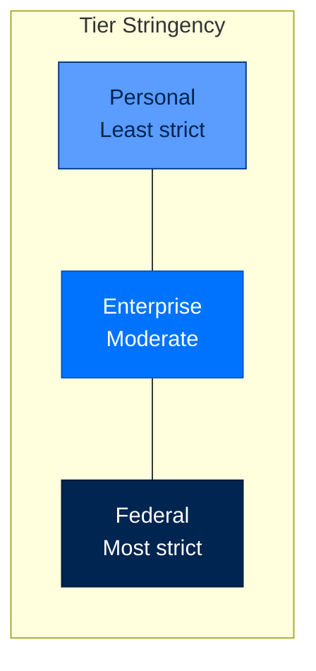
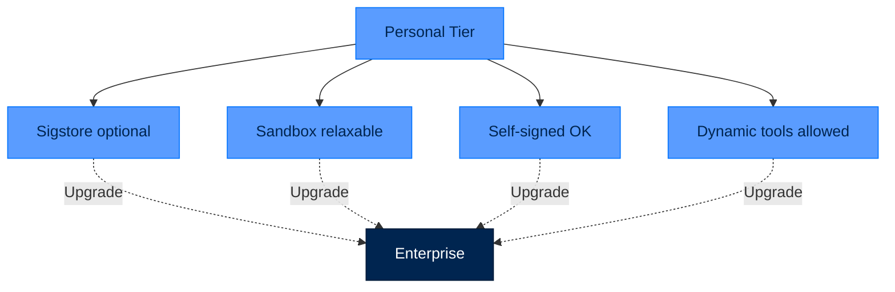
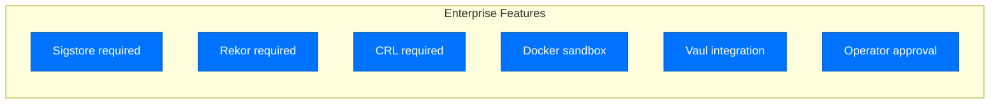
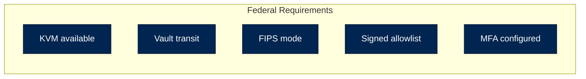
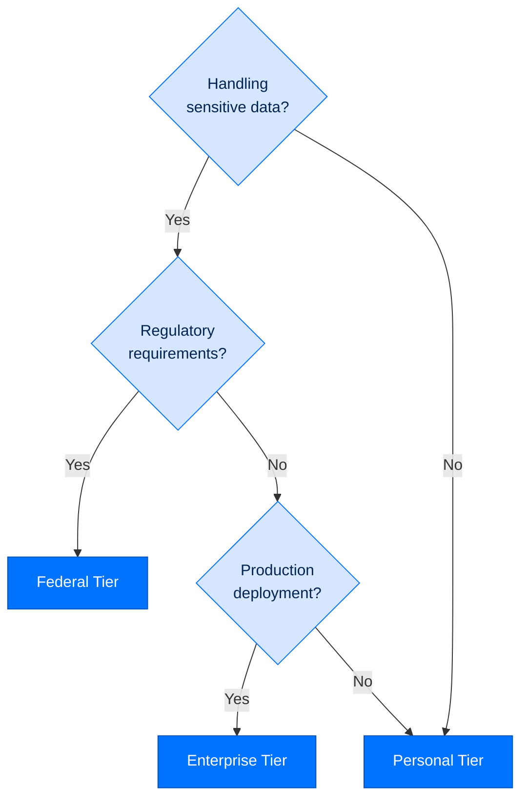

# Tiers and Presets

> **Reference**  ·  Look up  ·  page 4 of 8  
> **For** Anyone looking something up  
> [← Configuration keys](config.md)  ·  [Docs home](../README.md)  ·  [Prompts →](prompts.md)

---

## Understanding Tiers

Tiers are **stringency levels**, not feature gates. All tiers enforce the Four Pillars described in [SECURITY.md](security.md):
- **Identity** (Ed25519 DID)
- **Sign** (artifact verification)
- **Authorize** (5-layer policy pipeline)
- **Audit** (dual hash-chained trail)

Tiers differ in **strictness**, not **features**.



---

## Tier Comparison Matrix

| Feature | Personal | Enterprise | Federal |
|---------|----------|------------|---------|
| **Sigstore** | Optional (warn on self-signed) | Required | Required + FIPS |
| **Rekor** | Optional | Required | Required |
| **CRL Check** | Best-effort | Required | Required (hard fail) |
| **Sandbox** | Docker (can relax to local) | Docker required | Firecracker VM |
| **Dynamic Tools** | Allowed with `auto_run_agent_code` | Requires approval | Requires approval + MFA |
| **Telemetry** | Off | On | On (OpenTelemetry) |
| **PII Redaction** | Off | Off | On |
| **Key Storage** | Local files | Vault recommended | Vault required |
| **Cryptography** | Ed25519 | Ed25519 | ECDSA-P256 (FIPS) |
| **Approval Required** | No | On-demand | Always |

---

## Personal Tier

### Configuration

```toml
[security]
tier = "personal"

[security.validators]
auto_run_agent_code = true
require_operator_approval = false

[capabilities]
# Personal-only: run agent-authored tools in a bare host subprocess instead of
# a Docker container, for hosts without Docker (demos, slim VMs). Enterprise and
# federal fail closed if set below their container/VM floor. See the
# signing-capabilities runbook, section 10.
isolation_relax = "off"
```

### Use Cases

- Individual developers
- Local prototyping
- Learning/experimentation
- Non-sensitive data processing

### Relaxations



---

## Enterprise Tier

### Configuration

```toml
[security]
tier = "enterprise"

[security.validators]
auto_run_agent_code = false
require_operator_approval = true

[security.sandbox]
backend = "docker"
memory_limit = "1g"
timeout_seconds = 120

[vault]
backend = "https://vault.example.com"
token_path = "secret/arc/token"
```

### Use Cases

- Production deployments
- Team collaboration
- Customer-facing agents
- Business data processing

### Security Features



---

## Federal Tier

### Configuration

```toml
[security]
tier = "federal"
require_fips = true

[security.validators]
auto_run_agent_code = false
require_operator_approval = true
require_mfa = true

[security.sandbox]
backend = "firecracker"
vcpu_count = 2
mem_size_mib = 1024

[vault]
backend = "https://vault.example.com"
transit_key = "federal-signing-key"
mfa_method = "totp"
```

### Use Cases

- Government systems
- Regulated industries (finance, healthcare)
- High-security environments
- Compliance-critical deployments

### Requirements



---

## Tier Configuration Reference

### Security Section

```toml
[security]
tier = "personal" | "enterprise" | "federal"
require_fips = false  # Only for federal

[security.validators]
auto_run_agent_code = true    # Personal: true, Enterprise/Federal: false
require_operator_approval = false  # Personal: false, others: true
max_file_size_mb = 100
allowed_file_extensions = [".py", ".md", ".txt", ".json"]
```

### Sandbox Section

```toml
[security.sandbox]
backend = "docker" | "firecracker"
memory_limit = "512m"
cpus = 1.0
timeout_seconds = 60
network_enabled = false
```

### Telemetry Section

```toml
[telemetry]
enabled = false  # Personal
enabled = true   # Enterprise/Federal

[telemetry.opentelemetry]
endpoint = "http://localhost:4317"
service_name = "arc-agent"
```

---

## Preset Configurations

### Development Preset

```toml
# ~/.arc/presets/development.toml
[security]
tier = "personal"

[security.validators]
auto_run_agent_code = true
require_operator_approval = false

[capabilities]
isolation_relax = "off"  # personal-only: host subprocess instead of Docker

[llm]
model = "anthropic/claude-sonnet-4-5-20250929"
temperature = 0.7
```

### Production Preset

```toml
# ~/.arc/presets/production.toml
[security]
tier = "enterprise"

[security.validators]
auto_run_agent_code = false
require_operator_approval = true

[security.sandbox]
backend = "docker"
memory_limit = "1g"
timeout_seconds = 120

[vault]
backend = "https://vault.example.com"

[telemetry]
enabled = true
```

### High-Security Preset

```toml
# ~/.arc/presets/federal.toml
[security]
tier = "federal"
require_fips = true

[security.validators]
auto_run_agent_code = false
require_operator_approval = true
require_mfa = true

[security.sandbox]
backend = "firecracker"
vcpu_count = 2
mem_size_mib = 1024

[vault]
backend = "https://vault.example.com"
transit_key = "federal-signing-key"
mfa_method = "totp"

[telemetry]
enabled = true
pii_redaction = true
```

---

## Tier Migration

### Personal → Enterprise

```bash
# Update config
arc init --tier enterprise

# Re-validate capabilities
arc agent build my-agent --check

# Enable vault
export VAULT_ADDR=https://vault.example.com
```

### Enterprise → Federal

```bash
# Verify KVM available
ls -la /dev/kvm

# Update config
arc init --tier federal

# Configure Vault transit
vault write transit/keys/federal-signing-key

# Enable FIPS mode
export FIPSMODE=1
```

---

## Compliance Presets

### NIST 800-53

```toml
# ~/.arc/presets/nist.toml
[security]
tier = "enterprise"

[security.validators]
require_operator_approval = true

[audit]
retention_days = 365
format = "json"

[telemetry]
enabled = true
export_compliance_events = true
```

### FedRAMP

```toml
# ~/.arc/presets/fedramp.toml
[security]
tier = "federal"
require_fips = true

[security.sandbox]
backend = "firecracker"

[audit]
retention_days = 730
immutable = true

[vault]
backend = "https://vault.example.com"
audit_seal = true
```

### SOC 2

```toml
# ~/.arc/presets/soc2.toml
[security]
tier = "enterprise"

[audit]
retention_days = 365
export_audit_logs = true

[telemetry]
enabled = true
log_level = "info"
```

---

## Tier Decision Tree



---

## Override Mechanisms

### Per-Agent Overrides

```toml
# my-agent/arcagent.toml
[security]
tier = "enterprise"

[security.validators]
# Override: allow dynamic tools for this agent
auto_run_agent_code = true
```

### Per-Skill Overrides

```toml
# In blueprint or config
[skills.my-skill]
tier_override = "enterprise"  # Run at higher tier
```

### Environment Variables

```bash
# Force tier for session
export ARC_TIER=enterprise

# Override specific settings
export ARC_SANDBOX_BACKEND=docker
export ARC_REQUIRE_APPROVAL=true
```

---

## Monitoring Tier Compliance

### Check Current Tier

```bash
arc security status
```

Output:
```
Tier: enterprise
Sigstore: enabled ✓
Rekor: enabled ✓
CRL: enabled ✓
Sandbox: docker ✓
Vault: configured ✓
Approval: required ✓
```

### Validate Tier Requirements

```bash
arc security validate
```

Checks:
- ✓ All required security features enabled
- ✓ Vault connectivity
- ✓ Sandbox availability
- ✓ Key permissions (0600)
- ✓ Audit log integrity

---

## Next Steps

- [Package Index](../building/package-index.md) - Package-specific tier features
- [Security Features](security.md) - Detailed security mechanisms