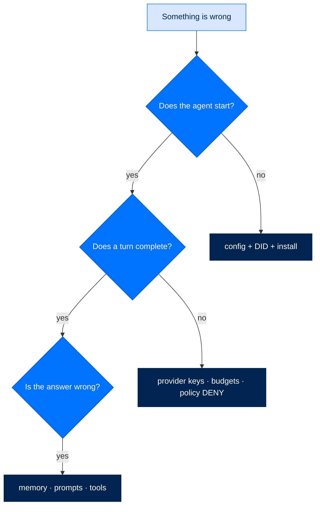

# Troubleshooting Guide

> **Reference**  ·  Look up  ·  page 7 of 8  
> **For** Anyone looking something up  
> [← Security](security.md)  ·  [Docs home](../README.md)  ·  [Glossary →](glossary.md)



---

## Quick Diagnosis

```bash
# Run diagnostics
arc doctor

# Check specific components
arc llm validate
arc security validate
arc agent build my-agent --check
```

---

## Common Issues

### Installation Problems

#### `ModuleNotFoundError`

```bash
# Symptom
ModuleNotFoundError: No module named 'arcagent'

# Solution
pip install arcmas  # Full stack
# OR
uv sync --all-packages  # From source
```

#### `Permission denied` on key files

```bash
# Symptom
PermissionError: [Errno 13] Permission denied: '/Users/.../.arc/keys/agent_did.key'

# Solution
chmod 600 ~/.arc/keys/agent_did.key
chmod 600 ~/.arc/keys/operator.key
```

### API Key Issues

#### API Key Not Found

```bash
# Symptom
LLMError: ANTHROPIC_API_KEY not found

# Solution
echo 'ANTHROPIC_API_KEY=sk-ant-...' >> .env
# OR
export ANTHROPIC_API_KEY=sk-ant-...
```

#### Invalid API Key

```bash
# Symptom
AuthenticationError: Invalid API key

# Solution
# Check key format
arc llm validate

# Verify key in .env
cat .env | grep ANTHROPIC_API_KEY
```

### Docker Issues

#### Docker Not Available

```bash
# Symptom
SandboxError: Docker not available

# Solution
# Start Docker
open -a Docker  # macOS
systemctl start docker  # Linux

# Or relax to local (personal tier only)
# In arcagent.toml
[security.sandbox]
backend = "local"  # Only for personal tier
```

#### Docker Permission Denied

```bash
# Symptom
PermissionError: Unable to connect to Docker daemon

# Solution
# Add user to docker group
sudo usermod -aG docker $USER
newgrp docker
```

### KVM Issues (Federal Tier)

#### KVM Not Available

```bash
# Symptom
FirecrackerError: /dev/kvm not available

# Solution
# Check KVM
ls -la /dev/kvm

# Enable nested virtualization (cloud)
# Or use Docker sandbox instead
# In arcagent.toml
[security.sandbox]
backend = "docker"  # Instead of firecracker
```

---

## Security Issues

### Signature Verification Failed

```bash
# Symptom
SignatureInvalid: Sigstore verification failed

# Solution
# Check blueprint/skill signature
arc blueprint verify my-agent/arcagent.toml

# Ensure hub is enabled
[skills.hub]
enabled = true
```

### CRL Unreachable

```bash
# Symptom
CRLUnreachable: CRL fetch failed

# Solution
# For enterprise tier, CRL is required
# Check network connectivity
curl https://crl.example.com

# Or use personal tier (best-effort CRL)
# In arcagent.toml
[security]
tier = "personal"
```

### Lethal Trifecta Blocked

```bash
# Symptom
SecurityError: Lethal trifecta detected

# Solution
# This is intentional - private data + external comms + untrusted input
# Options:
# 1. Remove one element
# 2. Get operator approval
# 3. Use enterprise tier with explicit approval
```

---

## Agent Issues

### Agent Won't Start

```bash
# Symptom
arc agent chat my-agent hangs or fails

# Debug steps
arc agent build my-agent --check --verbose

# Check logs
tail -f workspace/sessions/latest.jsonl

# Verify DID
cat my-agent/identity.md
```

### Capabilities Not Loading

```bash
# Symptom
Tool not found error

# Debug steps
arc agent tools my-agent

# Check capability sources
ls -la my-agent/capabilities/
ls -la ~/.arc/state/capabilities/
ls -la workspace/.capabilities/

# Verify tool decorator
@tool(name="my_tool", ...)  # Must have name
```

### Skills Not Activating

```bash
# Symptom
Skill not listed in arc agent skills

# Debug steps
arc skill validate my-skill/

# Check hub config
[skills.hub]
enabled = true

# Verify skill structure
cat my-skill/SKILL.md
```

---

## LLM Issues

### Rate Limited

```bash
# Symptom
RateLimitError: 429 Too Many Requests

# Solution
# Wait for rate limit reset
sleep 60

# Or use different provider
arc agent run my-agent "task" --model groq/llama-3.1-70b

# Configure rate limits
[llm]
rate_limit_rpm = 10
rate_limit_tpm = 10000
```

### Context Window Exceeded

```bash
# Symptom
ContextWindowError: Tokens exceed limit

# Solution
# Reduce context
arc agent run my-agent "task" --max-tokens 4000

# Or use larger model
arc agent run my-agent "task" --model anthropic/claude-opus-4-20250929
```

### Tool Calls Not Working

```bash
# Symptom
LLM returns text instead of tool calls

# Solution
# Check model supports tools
arc llm models --tools

# Verify tool schema
@tool(
    name="my_tool",
    parameters={...}  # Must be valid JSON schema
)

# Check classification
classification="read_only"  # Not "network" if no network access
```

---

## Team Issues

### Team Init Fails

```bash
# Symptom
arc team init fails

# Solution
# Check directory permissions
mkdir -p ~/arc/team
chmod 700 ~/arc/team

# Or specify custom root
arc team init --root ./team-data
```

### Messages Not Delivered

```bash
# Symptom
arc team send doesn't reach recipient

# Debug steps
arc team status  # Check connectivity

# Verify entity registration
arc team entities

# Check NATS connection
nats-server --version
```

---

## Memory Issues

### Memory Not Persisting

```bash
# Symptom
Previous conversations not remembered

# Solution
# Check memory directory
ls workspace/memory/

# Verify memory service enabled
[modules.memory]
enabled = true
```

### Embeddings Fail

```bash
# Symptom
Memory search returns no results

# Solution
# Check embedding provider
arc llm validate

# Or disable embeddings
[memory.embedding]
enabled = false
```

---

## Gateway Issues

### Telegram Webhook Not Working

```bash
# Symptom
Bot doesn't respond to messages

# Debug steps
# Check webhook URL
curl "https://api.telegram.org/bot$BOT_TOKEN/getWebhookInfo"

# Set webhook
curl "https://api.telegram.org/bot$BOT_TOKEN/setWebhook" \
     -d "url=https://your-domain.com/webhook/telegram"

# Check allowed chat IDs
[gateway.telegram]
allowed_chat_ids = ["YOUR_CHAT_ID"]
```

### Slack Events Not Received

```bash
# Symptom
Bot doesn't respond in Slack

# Debug steps
# Check event subscriptions
# https://api.slack.com/apps/YOUR_APP/events

# Verify signing secret
[gateway.slack]
signing_secret_env = "SLACK_SIGNING_SECRET"
```

---

## Debug Mode

### Enable Debug Logging

```bash
# Environment variable
export ARC_DEBUG=1

# Or in config
[logging]
level = "debug"
```

### Verbose Output

```bash
# Most commands support --verbose
arc agent build my-agent --check --verbose
arc agent run my-agent "task" --verbose
```

### Trace Execution

```bash
# Enable tracing
export ARC_TRACE=1

# View trace
arc agent run my-agent "task" --trace
```

---

## Getting Help

### Diagnostic Commands

```bash
# Full diagnostics
arc doctor

# Component checks
arc llm validate
arc security validate
arc team status

# Version info
arc version
pip show arcmas
```

### Log Locations

```
workspace/
├── sessions/*.jsonl      # Session transcripts
└── audit/
    ├── actions.jsonl     # Tool executions
    └── security.jsonl    # Security events

~/.arc/
├── logs/
│   ├── arc.log           # Main log
│   └── gateway.log       # Gateway log
└── keys/                 # Key files (check permissions)
```

---

## Next Steps

- [Deployment](../runbooks/deploy/overview.md) - Production deployment
- [Security](security.md) - Security troubleshooting