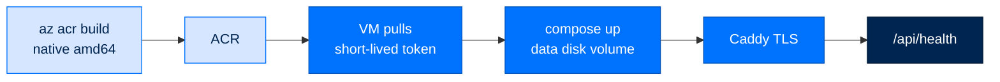

# Azure Deployment

> **Runbooks**  ·  Operate  ·  page 5 of 20  
> **For** Operators running Arc on an Azure VM  
> [← Docker](docker.md)  ·  [Docs home](../../README.md)  ·  [Firecracker →](firecracker.md)



The [Docker runbook](docker.md) covers the image itself. This page covers the
Azure specifics: where the image is built, how the VM authenticates to pull it,
where state lives, and how to redeploy and reset.

A redeploy is a build, a push, a pull on the VM, and a health check. The
[Redeploy](#redeploy) section below gives the concrete `az acr build` and
`docker` commands for each step; wrap them in your own deploy script once they
work.

Validated on: Ubuntu 22.04 LTS, Standard_D4s_v5, ACR Basic, personal tier, four
agents from four blueprints.

## Why the image is built in ACR

`az acr build` builds on Azure, natively on `linux/amd64`. The alternative —
building locally on an arm64 laptop and pushing — cross-compiles torch for a
byte-identical result, trading minutes for seconds.

It also removes the registry credential problem. The build never leaves the
subscription, and the VM's pull is authorized by a short-lived token minted from
the operator's own `az` session (see [Registry auth](#registry-auth)).

> **`--build-arg TARGETARCH=amd64` is required.** `TARGETARCH` is a buildx
> variable. ACR Tasks uses the classic builder, which does not populate it, so
> the `nats-server` download in the Dockerfile fails on an unset parameter.
> Every `az acr build` invocation must pass it (see [Redeploy](#redeploy)). The
> Dockerfile is deliberately left correct for the multi-arch buildx path it
> documents rather than weakened to paper over this.

## Sizing

| | Minimum | Why |
|---|---|---|
| vCPU | 4 | agent loop + embedder + NATS broker |
| Memory | 16 GB | the embedder alone is ~2 GB resident; each agent adds |
| OS disk | 64 GB | image layers do **not** live here — see below |
| Data disk | 128 GB | Docker data-root: image + all agent state |

`Standard_D4s_v5` is the tested size. A 2-vCPU / 4 GB burstable VM (`B2s`) will
scaffold the agents and then be killed for memory once all four load.

Resizing across VM families needs a deallocate → resize → start cycle. A
**Static** public IP survives it; a Dynamic one does not, and the DNS record
then points at someone else's VM.

## Storage

Docker's entire data-root sits on the attached managed disk:

```json
/* /etc/docker/daemon.json */
{
  "data-root": "/mnt/arc-data/docker",
  "log-driver": "json-file",
  "log-opts": { "max-size": "50m", "max-file": "3" }
}
```

That single choice puts the ~3 GB image **and** the `arc-data` named volume
holding every byte of agent state on the same disk. Two consequences worth
knowing:

- A **disk snapshot is a complete backup** — config, agent workspaces, memory,
  identity keys, the store DB, and the pinned access tokens.
- The 64 GB OS disk cannot fill up with image layers, which is the usual way a
  long-lived deploy box dies.

Mount it with `nofail` in `/etc/fstab`. Without it, a detached or renamed disk
turns a reboot into an unbootable VM rather than a degraded one.

## Registry auth

The VM stores **no** registry credential. Each deploy mints an ACR refresh token
(~3 h) from the operator's `az` session and pipes it to the VM's `docker login`
over **stdin**, so it never reaches `argv` and never appears in `ps`:

```bash
TOKEN="$(az acr login --name "$ACR" --expose-token --output tsv --query accessToken)"
printf '%s' "$TOKEN" | ssh "$HOST" \
  "sudo docker login '$ACR.azurecr.io' -u 00000000-0000-0000-0000-000000000000 --password-stdin"
```

Between deploys the VM needs no registry access at all — `restart:
unless-stopped` restarts from the local image.

> A pipe and a heredoc cannot both own stdin. `docker login` and the compose
> orchestration are therefore two separate `ssh` calls; merging them silently
> feeds the script to `docker login` instead of the token.

## Networking

| Port | Source | Purpose |
|---|---|---|
| 22 | operator IPs only | SSH |
| 80 | `*` | ACME HTTP-01 challenge, redirect to 443 |
| 443 | `*` | the dashboard, over TLS |

Port 80 must be open to the internet or certificate issuance fails — Let's
Encrypt validates from its own infrastructure, not from your address.

Arc publishes no host port of its own: Caddy is the only ingress, so the
dashboard cannot be reached in plaintext. Opening `8420` directly is a
**temporary** measure for before DNS is live; it sends the access token over the
wire in the clear. Close it as soon as TLS works.

`ARC_DOMAIN` must already resolve to the VM's public IP before the first start,
or Caddy requests a certificate it cannot validate and burns Let's Encrypt rate
limit retrying.

## First-time provisioning

Assumes an Ubuntu VM, a resource group, and an ACR.

```bash
# 1. Firewall
az network nsg rule create -g "$RG" --nsg-name "$NSG" --name AllowHTTP \
  --priority 200 --direction Inbound --access Allow --protocol Tcp \
  --source-address-prefixes '*' --destination-port-ranges 80
az network nsg rule create -g "$RG" --nsg-name "$NSG" --name AllowHTTPS \
  --priority 210 --direction Inbound --access Allow --protocol Tcp \
  --source-address-prefixes '*' --destination-port-ranges 443

# 2. Data disk
az disk create -g "$RG" -n disk-arc-data --size-gb 128 --sku Premium_LRS
az vm disk attach -g "$RG" --vm-name "$VM" --name disk-arc-data --lun 0
```

On the VM: format and mount the disk, point Docker's data-root at it, then write
`/opt/arc/.env` (mode `0600`). The env file is the one file **not** synced from
the repo, because it holds the provider key:

```bash
ANTHROPIC_API_KEY=sk-ant-...
ARC_PROVIDER=anthropic
ARC_AGENT_MODEL=anthropic/claude-sonnet-5
ARC_TIER=personal

# Each entry is "<agent_name>:<blueprint>"; the first is the primary agent
# for remote-platform DMs.
ARC_AGENTS=personal_assistant:personal-assistant bdr:sales-exec-assistant ceo:strategic-ceo coo:business-ops

ARC_DOMAIN=arc.example.com
ARC_ACME_EMAIL=you@example.com
ARC_IMAGE=            # pinned to the SHA-tagged image on every redeploy
ARC_ENABLE_TELEGRAM=0
```

Then build, push, and deploy — see [Redeploy](#redeploy).

## Redeploy

A redeploy is four steps: build the image in ACR, have the VM pull it, recreate
the container, and health-check. Build and push, tagging with the **commit SHA**
so a restart cannot drift onto a newer `:latest` pushed in the meantime:

```bash
TAG="$(git rev-parse --short HEAD)"
az acr build --registry "$ACR" --image "arc:$TAG" \
  --build-arg TARGETARCH=amd64 .
```

Pin that exact tag into `/opt/arc/.env` (`ARC_IMAGE=$ACR.azurecr.io/arc:$TAG`),
then recreate the container on the VM (see [Registry auth](#registry-auth) for
the `docker login` that authorizes the pull):

```bash
ssh "$HOST" 'cd /opt/arc && sudo docker compose pull && sudo docker compose up -d'
curl -fsS "https://$ARC_DOMAIN/api/health"   # 200 once serving
```

Pinning the SHA tag rather than `:latest` lets `docker image ls` on the box
answer "what is actually running" without trusting a deploy log. To redeploy a
tag already in ACR, skip the build and reuse the pinned `ARC_IMAGE`.

The build context is the **working tree**, not the commit. Uncommitted changes
ship; check `git status` before building.

Agent state survives every redeploy: the container is recreated, the named
volume is not.

## Reset

Four levels, least to most destructive. Only the last destroys the agents.

**Restart the process** — picks up nothing new; use after a transient fault:

```bash
ssh "$HOST" 'cd /opt/arc && sudo docker compose restart arc'
```

**Reload configuration** — `restart` does **not** re-read `env_file`. After
editing `/opt/arc/.env` you must recreate:

```bash
ssh "$HOST" 'cd /opt/arc && sudo docker compose up -d --force-recreate arc'
```

**Rebuild the container, keep all state** — the normal repair. Config, agent
workspaces, memory, identity keys, and access tokens all persist:

```bash
ssh "$HOST" 'cd /opt/arc && sudo docker compose down && sudo docker compose up -d'
```

**Destroy the agents and start clean** — irreversible:

```bash
ssh "$HOST" 'cd /opt/arc && sudo docker compose down -v'
# then rebuild and redeploy — see Redeploy above
```

`down -v` removes the `arc-data` volume: every agent's memory, its minted DID
and identity keys, its sessions, and the pinned viewer/operator tokens. The
agents are rebuilt from their blueprints on next boot as **new** agents with new
DIDs — not the same agents restored. Snapshot the data disk first if the history
matters.

To re-run onboarding without destroying memory, delete only the scaffolding
markers rather than the whole volume:

```bash
# Forces `arc init` and agent creation to run again on next boot.
ssh "$HOST" 'sudo docker run --rm -v arc_arc-data:/data alpine \
  sh -c "rm -f /data/.arc/gateway.toml && rm -rf /data/team/<agent>"'
```

Leaving `/data/.arc/arc.env` in place keeps the viewer and operator tokens
pinned. Regenerating them strands every prior conversation, because the UI
derives its `(agent, user)` chat-session id from the viewer token.

## Retrieving the dashboard token

Minted once and pinned for the life of the volume:

```bash
ssh "$HOST" "cd /opt/arc && sudo docker compose exec -T arc \
  sh -c 'grep VIEWER_TOKEN \$HOME/.arc/arc.env'"
```

Open `https://$ARC_DOMAIN/#auth=<token>`.

## Troubleshooting

**`No module named 'arcui'` after the agents log `Ready`** — the image was built
without `arcui`. A workspace member is only installed if something depends on
it; `arcui` is now pinned in the root `[project].dependencies` and guarded by
`tests/architecture/test_deployment_closure.py`.

The failure reads like an agent fault because `arc ui start` is the **last**
step of the entrypoint: all agents scaffold, log `Ready`, and print a dashboard
URL before the process dies. Do **not** fix this by switching a deployment to
`uv sync --all-packages` — that hides the missing edge, and it does not install
extras such as `arcmemory[local]`, which is how semantic recall silently
degraded before. Add the dependency edge and re-run `uv lock`.

**Container restart-loops with `<PROVIDER>_API_KEY is not set`** — working as
designed. The entrypoint fails closed before writing anything, naming the exact
variable. Check that `/opt/arc/.env` has the key **and** that you recreated
rather than restarted.

**Nothing listening on the dashboard port** — the port only opens after the app
boots. Check `docker compose logs arc` before suspecting the firewall; a
restart-loop and a closed NSG rule look identical from outside.

**`az acr build` fails at the `nats-server` step with `TARGETARCH: parameter not
set`** — see [Why the image is built in ACR](#why-the-image-is-built-in-acr).

**Certificate issuance fails** — confirm `ARC_DOMAIN` resolves to the VM's
public IP and that port 80 is open to `*`. Caddy's certificates live in the
`caddy-data` volume; keep it across redeploys or every deploy re-requests and
burns rate limit.

**VM unreachable after a resize** — a Dynamic public IP changes on deallocate.
Confirm the IP is Static, then re-check the DNS record.
