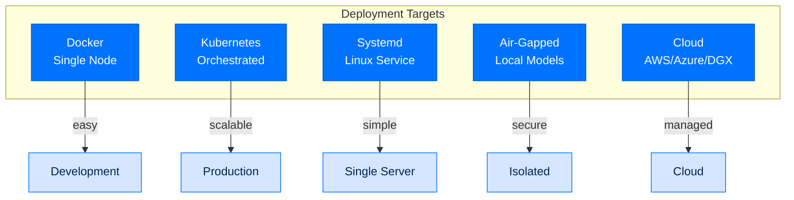
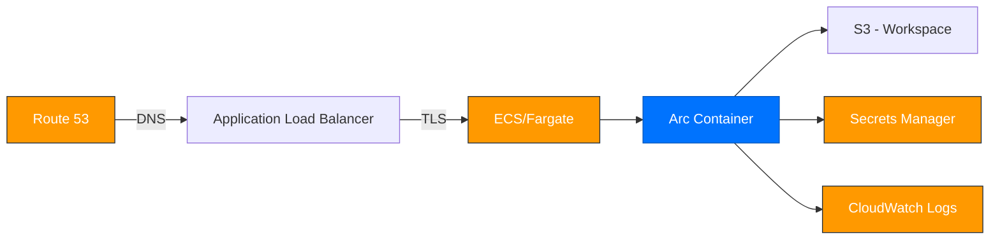
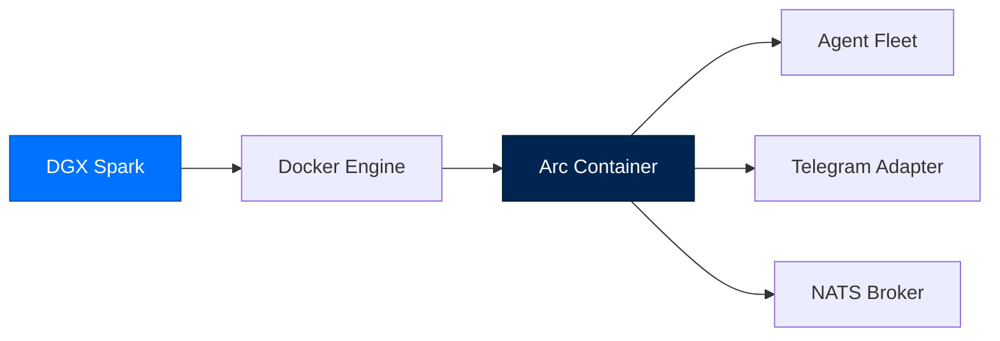
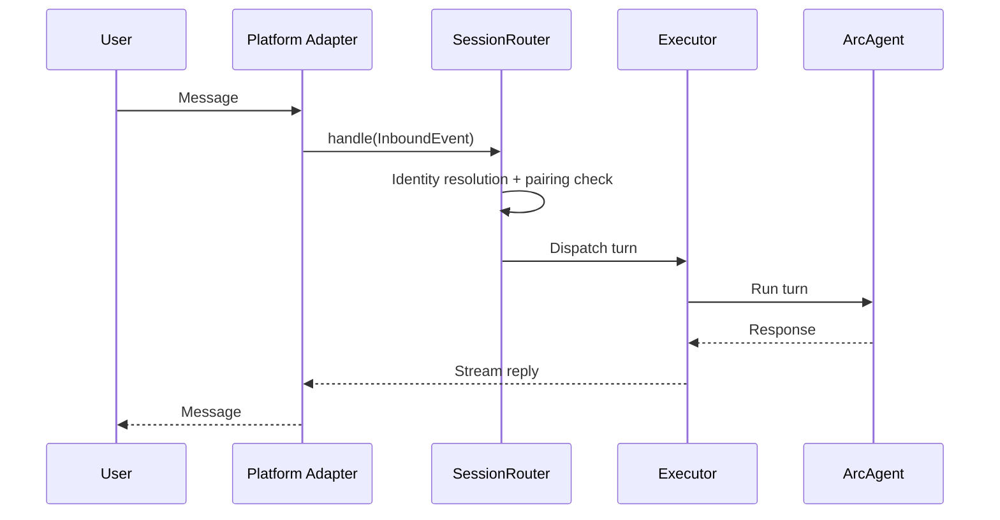
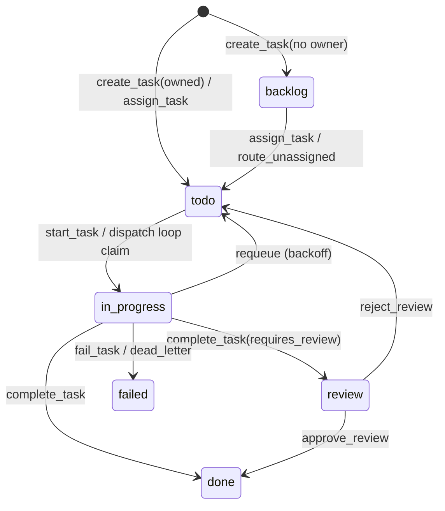
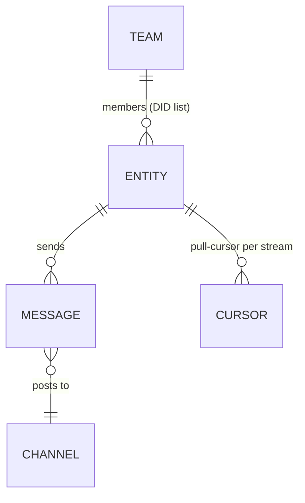
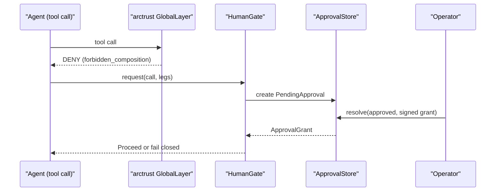

# Deployment and Operations

> **Runbooks**  ·  Operate  ·  page 1 of 20  
> **For** Operators deploying and running Arc  
> [Docs home](../../README.md)  ·  [Bring-up →](up.md)

---

## Golden rule: deploy from `main`

Production nodes (DGX, Azure) always run an `origin/main` commit. **Merge every
change to `main` before deploying** — `scripts/deploy-vm.sh dgx` hard-resets the
node's source to `origin/main` and installs it as a new runtime. Deploying a
feature branch (`--branch`) is only for throwaway testing on a scratch node,
never for a real change: it puts code in production that is not on `main`, so
`main` stops being the source of truth for what the fleet runs.

Standard flow: feature branch → merge to `main` → push → `scripts/deploy-vm.sh dgx`.

---

## Deployment Options



---

## Docker Deployment

### Quick Start (Local)

```bash
cp .env.example .env      # Add your API keys
docker compose up -d
docker compose logs -f arc
```

The startup log prints the dashboard URL with the viewer token appended as a fragment:
```
Dashboard: http://<host>:8420/#auth=<VIEWER_TOKEN>
```

### docker-compose.yml

```yaml
version: "3.8"
services:
  arc-agent:
    build: .
    volumes:
      - ./data:/data
      - ./.env:/app/.env:ro
      - ./workspace:/app/workspace
    environment:
      - ANTHROPIC_API_KEY
      - OPENAI_API_KEY
    ports:
      - "8420:8420"  # Dashboard
    restart: unless-stopped

  nats:
    image: nats:2.10
    ports:
      - "4222:4222"
    volumes:
      - ./nats.conf:/nats.conf
    command: ["-c", "/nats.conf"]
```

### Production Docker

```yaml
version: "3.8"
services:
  arc-agent:
    image: arc:latest
    volumes:
      - arc-data:/data
      - arc-workspace:/app/workspace
    env_file: .env
    secrets:
      - anthropic_api_key
      - openai_api_key
    deploy:
      resources:
        limits:
          memory: 2G
          cpus: '1.0'
    healthcheck:
      test: ["CMD", "arc", "agent", "status", "my-agent"]
      interval: 30s
      timeout: 10s

volumes:
  arc-data:
  arc-workspace:

secrets:
  anthropic_api_key:
    file: ./secrets/anthropic.key
  openai_api_key:
    file: ./secrets/openai.key
```

### Container Image Contents

| Component | Why It's Baked In |
|-----------|-------------------|
| The uv workspace + venv | `uv sync --frozen` at build time |
| `nats-server` | Required for arcteam; auto-spawned by arc ui start |
| `sentence-transformers` + `all-MiniLM-L6-v2` | Default embed backend for arcmemory |
| The arcui static bundle | No Node toolchain needed at runtime |

---

## Kubernetes Deployment

### Deployment YAML

```yaml
apiVersion: apps/v1
kind: Deployment
metadata:
  name: arc-agent
spec:
  replicas: 1
  selector:
    matchLabels:
      app: arc-agent
  template:
    metadata:
      labels:
        app: arc-agent
    spec:
      containers:
      - name: arc
        image: arc:latest
        env:
        - name: ANTHROPIC_API_KEY
          valueFrom:
            secretKeyRef:
              name: arc-secrets
              key: anthropic-api-key
        - name: ARC_TIER
          value: "enterprise"
        volumeMounts:
        - name: workspace
          mountPath: /app/workspace
        - name: data
          mountPath: /data
        resources:
          requests:
            memory: "512Mi"
            cpu: "500m"
          limits:
            memory: "2Gi"
            cpu: "1"
        livenessProbe:
          exec:
            command: ["arc", "agent", "status", "my-agent"]
          initialDelaySeconds: 30
          periodSeconds: 60
      volumes:
      - name: workspace
        persistentVolumeClaim:
          claimName: arc-workspace-pvc
      - name: data
        persistentVolumeClaim:
          claimName: arc-data-pvc
---
apiVersion: v1
kind: Service
metadata:
  name: arc-agent-service
spec:
  selector:
    app: arc-agent
  ports:
  - port: 8420
    targetPort: 8420
```

### Secret Configuration

```yaml
apiVersion: v1
kind: Secret
metadata:
  name: arc-secrets
type: Opaque
stringData:
  anthropic-api-key: "sk-ant-..."
  openai-api-key: "sk-..."
  telegram-bot-token: "123456:..."
  viewer-token: "..."
  operator-token: "..."
```

---

## Systemd Service

### Service File

```ini
# /etc/systemd/system/arc-agent.service
[Unit]
Description=Arc Agent
After=network.target docker.service
Wants=docker.service

[Service]
Type=simple
User=arc
WorkingDirectory=/opt/arc
ExecStart=/usr/local/bin/arc agent serve my-agent
Restart=always
RestartSec=10

# Environment
EnvironmentFile=/opt/arc/.env

# Security
NoNewPrivileges=true
PrivateTmp=true

[Install]
WantedBy=multi-user.target
```

### Setup

```bash
# Install
sudo cp deploy/arc-agent.service /etc/systemd/system/
sudo systemctl daemon-reload
sudo systemctl enable arc-agent
sudo systemctl start arc-agent

# Check status
sudo systemctl status arc-agent

# View logs
journalctl -u arc-agent -f
```

---

## Cloud Deployments

### AWS Deployment



#### EC2 Deployment

```bash
# Launch EC2 instance (Ubuntu 24.04, t3.medium recommended)
aws ec2 run-instances \
  --image-id ami-0abcdef1234567890 \
  --instance-type t3.medium \
  --key-name my-key \
  --security-groups arc-sg

# Install Docker
ssh ubuntu@<instance-ip>
sudo apt update && sudo apt install -y docker.io docker-compose

# Deploy
git clone https://github.com/joshuamschultz/Arc.git
cd Arc
cp .env.example .env
# Edit .env with keys
docker compose up -d
```

#### ECS/Fargate Deployment

```yaml
# ecs-task-definition.json
{
  "family": "arc-agent",
  "containerDefinitions": [
    {
      "name": "arc",
      "image": "public.ecr.aws/arc/arc:latest",
      "portMappings": [{"containerPort": 8420}],
      "environment": [
        {"name": "ARC_TIER", "value": "enterprise"},
        {"name": "ARC_ENABLE_TELEGRAM", "value": "true"}
      ],
      "secrets": [
        {
          "name": "ANTHROPIC_API_KEY",
          "valueFrom": "arn:aws:secretsmanager:region:account:secret:arc/anthropic"
        }
      ],
      "logConfiguration": {
        "logDriver": "awslogs",
        "options": {
          "awslogs-group": "/ecs/arc-agent",
          "awslogs-region": "us-east-1"
        }
      }
    }
  ]
}
```

#### AWS Secrets Manager Integration

```bash
# Store secrets
aws secretsmanager create-secret \
  --name arc/anthropic \
  --secret-string '{"ANTHROPIC_API_KEY":"sk-ant-..."}'

# Retrieve in container
aws secretsmanager get-secret-value --secret-id arc/anthropic
```

### Azure Deployment

#### Azure VM Deployment

```bash
# Create resource group
az group create --name arc-group --location eastus

# Create VM
az vm create \
  --resource-group arc-group \
  --name arc-vm \
  --image Ubuntu2204 \
  --size Standard_B2ms \
  --admin-username azureuser \
  --ssh-key-values ~/.ssh/id_rsa.pub

# Open ports
az network nsg rule create \
  --resource-group arc-group \
  --nsg-name arc-vmNSG \
  --name arc-dashboard \
  --protocol tcp \
  --destination-port-range 8420

# Deploy
az vm run-command invoke \
  --resource-group arc-group \
  --name arc-vm \
  --command-id RunShellScript \
  --scripts "curl -LsSf https://astral.sh/uv/install.sh | sh"
```

#### Azure Container Apps

```bash
# Create container app
az containerapp create \
  --name arc-agent \
  --resource-group arc-group \
  --image arc:latest \
  --environment arc-env \
  --secrets-file secrets.json \
  --environment-variables tier=enterprise \
  --ingress external \
  --target-port 8420
```

#### Azure Key Vault Integration

```bash
# Store secrets
az keyvault secret set \
  --vault-name arc-kv \
  --name anthropic-api-key \
  --value "sk-ant-..."

# Configure Arc to use Azure Key Vault
[modules.vault]
backend = "azure"
vault_url = "https://arc-kv.vault.azure.net/"
```

### DGX Spark Deployment

DGX Spark is a validated single-node deployment target. The image works directly on the system without modification.



#### Prerequisites

- NVIDIA DGX Spark with Docker installed
- Network access for platform APIs
- SSH access for initial setup

#### Deployment

```bash
# Copy the SOURCE to the DGX. This is a tarball, not the install: the runtime is
# built from it under ~/.arc/runtime/<version>/ and nothing ever runs from here.
rsync -az --exclude .venv --exclude __pycache__ --exclude team /local/arc/ dgx:/home/user/arc/

# Install the runtime, create agents, and wire the systemd unit — every step of
# it, idempotently. See docs/runbooks/deploy/local.md for what it does and why.
ssh dgx '~/arc/scripts/deploy-node.sh researcher'
```

---

## Air-Gapped Deployment

### Ollama Setup

```bash
# Install Ollama (offline capable)
curl -fsSL https://ollama.com/install.sh | sh

# Pull models (requires initial internet)
ollama pull llama3.2:latest
ollama pull codellama:latest

# Configure Arc
[provider]
name = "ollama"
base_url = "http://localhost:11434"
```

### vLLM Setup

```bash
# Start vLLM server
python -m vllm.entrypoints.openai.api_server \
  --model meta-llama/Llama-3.1-8B-Instruct \
  --port 8000 \
  --host 0.0.0.0

# Configure Arc
[provider]
name = "vllm"
base_url = "http://localhost:8000/v1"
```

### HuggingFace TGI

```bash
# Start TGI
docker run -p 8080:80 ghcr.io/huggingface/text-generation-inference:2.0 \
  --model-id meta-llama/Meta-Llama-3.1-8B-Instruct

# Configure Arc
[provider]
name = "huggingface"
base_url = "http://localhost:8080"
```

---

## Workflows

### Gateway Chat

**Trigger:** Inbound message on Telegram, Slack, Mattermost, or web console.



### Tasks (Mission Control)

**Trigger:** `create_task`/`assign_task` tool calls or arcui task board.



### Scheduled Work

Three independent timer engines:

| Engine | Module | Purpose |
|--------|--------|---------|
| Scheduler | `modules/scheduler` | Cron/interval/one-time entries |
| Proactive | `modules/proactive` | Leader-elected tick loop |
| Pulse | `modules/pulse` | Checks from `pulse.md` |

### Memory Consolidation

**Trigger:** Event count, idle time, or interval threshold.

```mermaid
sequenceDiagram
    participant Loop as "memory_consolidate_loop"
    participant Brain as "Brain.consolidate()"
    participant ReAct as "Bounded ReAct agent"
    participant Stores as "Episodic/Semantic/Procedural/Entity"

    loop every poll interval
        Loop->>Loop: Check triggers
    end
    Loop->>Brain: Trigger fired
    Brain->>ReAct: Run (max_turns capped)
    ReAct->>Stores: Write consolidated memories
```

### Team Messaging



### Operator Approval



---

## Monitoring

### Health Checks

```bash
# Agent health
arc agent status my-agent

# LLM connectivity
arc llm validate

# Team connectivity
arc team status
```

### Metrics

```toml
# Enable metrics
[telemetry]
enabled = true
endpoint = "http://localhost:4317"

# Prometheus metrics
arc metrics --format prometheus
```

### Log Aggregation

```bash
# JSON logs for ingestion
arc agent chat my-agent --json-logs

# Log format
{
  "timestamp": "2026-07-31T10:30:00Z",
  "level": "info",
  "component": "arcagent",
  "message": "Turn completed",
  "metadata": {...}
}
```

---

## Backup and Recovery

### Backup Script

```bash
#!/bin/bash
# backup-arc.sh

# Backup workspace
tar -czf workspace-backup-$(date +%Y%m%d).tar.gz workspace/

# Backup the irreplaceable state: operator signing key, identities, trust
# store, arcstore DB, broker state. This is the one directory whose loss
# cannot be undone — without the operator key, every WORM audit chain it
# signed becomes unverifiable.
tar -czf state-backup-$(date +%Y%m%d).tar.gz ~/arc/state/

# Backup audit
tar -czf audit-backup-$(date +%Y%m%d).tar.gz workspace/audit/
```

### Recovery

```bash
# Restore workspace
tar -xzf workspace-backup-20260731.tar.gz

# Restore keys
tar -xzf keys-backup-20260731.tar.gz -C ~/

# Verify integrity
arc security audit --verify
```

---

## Scaling

### Single Agent

```bash
# One agent per task type
arc agent create researcher --blueprint researcher
arc agent create coder --blueprint coder
arc agent create analyst --blueprint analyst
```

### Team Scaling

```bash
# Multiple agents with NATS backend
arc team init --root /shared/team-data

# Register agents
for role in researcher coder analyst reviewer; do
    arc team register "$role-1" --type agent --roles "$role"
done
```

### Multi-Instance Considerations

| Subsystem | Problem | Mitigation |
|-----------|---------|------------|
| Telegram polling | One process per bot token | Webhook mode + consistent hash |
| SessionRouter state | In-memory dict diverges | Sticky routing OR shared SessionIndex |
| PairingStore | SQLite local disk | Postgres backend (M3) |
| Typing indicators | Double-fire without sticky | Sticky routing |

---

## Security Operations

### Key Rotation

```bash
# Rotate agent key
arc agent rotate-key my-agent

# Rotate operator key
arc security rotate-operator-key

# Backup before rotation
cp -a ~/arc/state/operator ~/arc/state/operator.backup
```

### Audit Review

```bash
# Review audit trail
arc security audit --last 24h

# Export for compliance
arc security audit --export --format json > audit.json
```

### CRL Updates

```bash
# Check for revocations
arc security check-crl

# Update CRL cache
arc security update-crl
```

---

## CI/CD Integration

### GitHub Actions

```yaml
name: Deploy Arc Agent
on:
  push:
    branches: [main]

jobs:
  deploy:
    runs-on: ubuntu-latest
    steps:
    - uses: actions/checkout@v4
    - run: docker buildx build --platform linux/amd64,linux/arm64 -t registry/arc:${{ github.sha }} --push .
    - run: kubectl set image deployment/arc arc=registry/arc:${{ github.sha }}
```

### GitLab CI

```yaml
deploy:
  stage: deploy
  script:
    - docker build -t $CI_REGISTRY_IMAGE:$CI_COMMIT_SHA .
    - docker push $CI_REGISTRY_IMAGE:$CI_COMMIT_SHA
    - kubectl apply -f k8s/
```

---

## Next Steps

- [CONTRIBUTING](../../building/contributing.md) - Development workflow
- [Security](../../reference/security.md) - Security operations
- [PERFORMANCE.md](../../building/performance.md) - Scaling guide