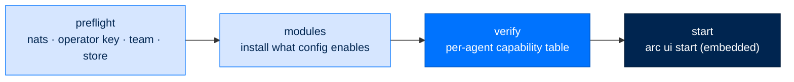

# Supervised Bring-Up (`arc up`)

> **Runbooks**  ·  Operate  ·  page 2 of 20  
> **For** Operators deploying and running Arc  
> [← Overview](overview.md)  ·  [Docs home](../../README.md)  ·  [Local →](local.md)



`arc up` is one command that brings the whole stack up and **proves** it came up
whole: the agents, their modules, NATS, the gateway, and the dashboard.

## Why it exists

Modules do not ship inside the `arc-agent` wheel. Each one is a separately
signed bundle. So the ordinary update sequence —

```bash
git pull && uv sync --all-packages && systemctl --user restart arc.service
```

— leaves every agent with **zero** modules. And the agent still boots. It still
answers chat. The dashboard still looks green. Meanwhile its scheduler never
fires, its tasks never dispatch, and its memory never consolidates, because
`[modules.NAME] enabled = true` in its config names a folder that is not on
disk. Nothing crashed, so nothing was noticed.

`arc up` closes that gap in two places: it **installs** what each config asks
for, and it **refuses to start** a deployment that would still be missing
something afterwards.

## Usage

```bash
arc up                              # the whole thing: preflight → modules → verify → start
arc up --check                      # validate only; start nothing; exit non-zero on a problem
arc up --team-root ~/arc/team       # a team directory somewhere other than ./team
arc up --port 8420 --host 0.0.0.0   # passed straight through to `arc ui start`
arc up --no-install                 # inspect first; never writes a module
arc up --no-browser                 # headless box
```

| Flag | Meaning |
|------|---------|
| `--team-root <dir>` | Directory of `<name>/arcagent.toml` agents. Default `./team`. |
| `--port` / `--host` | Dashboard bind. Passed through unchanged. |
| `--gateway-config <file>` | `gateway.toml` for Slack/Telegram or a non-personal tier. |
| `--no-browser` | Do not auto-open a browser tab on a loopback start. |
| `--no-install` | Skip the module stage; report state without changing it. |
| `--check` | Preflight + verify only. Starts nothing. Non-zero on any problem. |

`--check` is what you run **before** a deploy and what CI runs against a node.
It never writes and never starts.

## The four stages

### 1. Preflight — check, never fix

| Check | Why it stops the bring-up |
|-------|---------------------------|
| `nats-server` on PATH | arcteam spawns the broker itself but cannot install it. Without the binary, team messaging and task dispatch are dead while the process stays healthy. |
| Operator key present | The trust anchor bundles, blueprints, and prompt overlays are pinned to, and the signer of the audit chain. **Never minted here** — an unpinned operator is no operator. Create one with `arc init`. |
| Team root | Must resolve and hold at least one agent. |
| Data dir | `arcstore`'s data directory must exist and be writable. |

Every failure stops the bring-up, because every one of them produces a
*silently* degraded agent rather than a crash.

### 2. Modules — install what the config enables

For each agent, `arc up` compares `[modules.NAME] enabled = true` against what
is actually materialized under `${ARC_CONFIG_DIR:-~/.arc}/modules/` and installs
the difference through the same verify → materialize → copy → enable path
[`arc module install`](../staging-module-bundles.md) runs. Nothing about
verification is bypassed.

The source is whatever the deployment permits — never a flag:

* a **staged bundle** in `${ARC_CONFIG_DIR:-~/.arc}/bundles/`, when one exists;
* otherwise the **development inner loop**, which is dev-signed and which
  `arcbundle` accepts at **personal tier only**.

On enterprise or federal the second path is refused, and the refusal names the
alternative:

```
Agent  Module   Action   Detail
josh   memory   REFUSED  no staged bundle for 'memory' in /home/arc/.arc/bundles, and a
                         federal deployment does not accept a development signature. Build
                         one on the low side with `arc module bundle memory` and stage it
                         here with `arc module install --from <bundle>`.
```

That is a *message*; the gate is `arcbundle`'s verifier, which refuses the
development issuer above personal tier however it was called.

Skip this stage with `--no-install` when you want to look before anything is
written.

### 3. Verify — before the start, not after

```
Agent  Module     State
-----  ---------  -------
josh   memory     present
josh   scheduler  present
josh   tasks      present
brad   memory     present
brad   tasks      MISSING

Service           State  Detail
----------------  -----  ---------------------------------------------
NATS              down   nothing listening at nats://127.0.0.1:4222
dashboard health  down   http://127.0.0.1:8420/api/health: Connection refused
  (services are reported as observed; before a start they are down by design)
```

Service rows are **observations, not verdicts**: before a start, NATS and the
dashboard are legitimately down — the bring-up is what starts them, and the
preflight already proved it can.

A `MISSING` module is the opposite. It is repeated on stderr with its remedy,
and it fails the command:

```
DEGRADED: brad enables module 'tasks' but it is not installed — the agent would
run without that capability and say nothing. Install it with:
arc module install tasks --agent brad

arc up: this deployment would come up degraded — nothing was started.
```

Exit code `1`, and **the server is never started**. Verify runs before the start
on purpose: refusing to start beats starting and complaining, because a started
process is what makes a degraded deployment look healthy.

A whole deployment looks like this and proceeds:

```
Agent  Module     State
-----  ---------  -------
josh   memory     present
josh   scheduler  present
josh   tasks      present
```

### 4. Start

`arc up` invokes `arc ui start` in-process — the same embedded-gateway path
[Local](local.md) documents: one process serving the dashboard, the web chat
WebSocket, the always-on fleet, and every enabled remote platform. It is not a
second launcher and it does not shell out.

`--port`, `--host`, `--team-root`, `--gateway-config`, `--no-browser`, and
`--verbose` pass straight through.

Once the server answers, the one check that cannot precede it is printed:

```
  Verified: http://127.0.0.1:8420/api/health responded 200
```

## Relationship to the other paths

| Path | Use it for |
|------|-----------|
| `arc up` | **Bringing a node up**, every time. Provisioning is already done. |
| [`scripts/deploy-node.sh`](local.md) | **First-time provisioning** — uv sync, installing `nats-server`, `arc init`, agent creation, the systemd unit. Run once. |
| `arc ui start` | The server itself. `arc up` calls it. Use directly when you have already verified the node. |
| `scripts/arc-stack.sh` | Local-dev only, explicitly non-canonical. Not a deployment path. |

For a systemd unit, keep `ExecStart` on `arc ui start` and add `arc up --check`
as an `ExecStartPre`, so a node that lost its modules fails the unit instead of
serving a hollow agent.

## Troubleshooting

| Symptom | Cause | Fix |
|---------|-------|-----|
| `nats-server on PATH ... FAIL` | Broker binary absent. | Install from the [nats-server releases](https://github.com/nats-io/nats-server/releases) onto PATH, or re-run `scripts/deploy-node.sh`. |
| `operator key ... FAIL` | No key under `${ARC_CONFIG_DIR:-~/.arc}`. | `arc init`. `arc up` will not mint one for you. |
| `team root ... FAIL` | No `<name>/arcagent.toml` under the team root. | `arc agent create <name> --dir team`, or pass `--team-root`. |
| `REFUSED ... does not accept a development signature` | Enterprise/federal box, no staged bundle. | `arc module bundle <name>` on the low side; stage it and `arc module install --from <bundle>`. |
| `MISSING` after a successful install stage | The config enables a module name that does not exist in any catalog. | Fix the typo in `[modules.NAME]`, or `arc module list` to see the real names. |
| `HEALTH FAILED after 60s` | Server started but never answered `/api/health`. | Check the port is free and read the uvicorn output above the line. |

---

> [← Overview](overview.md)  ·  [Docs home](../../README.md)  ·  [Local →](local.md)
