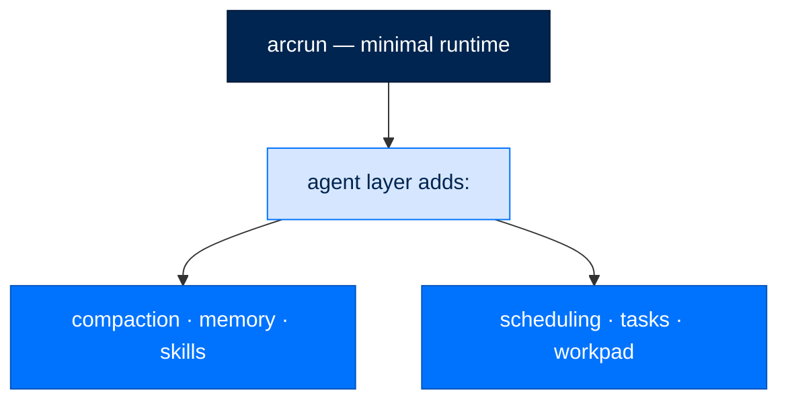

# Agent-Level Features

> **Runbooks**  ·  Operate  ·  page 11 of 20  
> **For** Operators deploying and running Arc  
> [← Tasks](tasks.md)  ·  [Docs home](../../README.md)  ·  [Policy and proactive engine →](policy-and-proactive.md)

Capabilities that belong with the agent layer above arcrun (e.g., a "coding agent" built on top of arcrun), NOT in the runtime itself.

This matches the architecture of pi-mono: pi-agent-core (runtime) is minimal, coding-agent (agent) adds all of these.

---

## 1. Context Compaction / Summarization

Compress conversation history to stay within context limits.

- pi-agent-core provides only `transformContext` callback (already adopted in arcrun as `transform_context`)
- coding-agent implements full compaction logic in `compaction/` directory
- arcrun already has the hook — the agent layer implements the strategy

## 2. Hooks / Middleware Pipeline

Lifecycle hooks for extensibility (before/after tool calls, turn boundaries, etc.).

- pi-agent-core has NO hooks — only event emissions (read-only) and 5 config callbacks
- coding-agent adds 25+ lifecycle hooks via `ExtensionRunner`
- arcrun provides events via `EventBus` (same pattern) — agent layer adds hooks on top
- Telemetry is handled by arcllm modules, not runtime hooks

## 3. Checkpoints and Progress Tracking

Save/restore agent state for long-running tasks, resumability.

- This is application-level concern — what to checkpoint, when, and how depends on the agent's domain
- Runtime provides the events to know *when* things happen; agent decides what to persist
- Includes: task lists, file change tracking, intermediate results caching

## 4. Auto-Retry with Backoff (Transient Errors)

Retry failed tool calls with exponential backoff for transient failures.

- pi-agent-core has NO retry/backoff/circuit-breaker at runtime level
- coding-agent adds auto-retry (max 5 attempts, exponential backoff, 60s cap) for specific transient error patterns
- arcllm already handles LLM-level retries — agent layer handles tool-level retries
- Agent knows which errors are transient vs. permanent; runtime doesn't

## 5. Human-in-the-Loop / Approval Gates

Pause execution for human approval on sensitive operations.

- Runtime provides sandbox checks (allow/deny) — that's the boundary
- Agent layer decides approval UX: CLI prompts, web UI, Slack notifications, auto-approve rules
- Coding-agent implements permission modes (ask, auto, deny) per tool category

## 6. Output Formatting / Streaming

Format final output for the end user (markdown rendering, streaming chunks, progress indicators).

- Runtime returns `LoopResult` with raw content — that's its job
- Agent layer decides how to present: stream tokens, render markdown, show progress bars
- Includes: syntax highlighting, diff formatting, file tree display

## 7. Tool Discovery / Dynamic Loading

Load tools from plugins, directories, or remote registries at agent startup.

- Runtime provides `ToolRegistry.add()` / `ToolRegistry.remove()` — the API is there
- Agent layer decides *which* tools to load, from where, and when
- Includes: plugin systems, tool manifests, conditional tool loading based on task type
