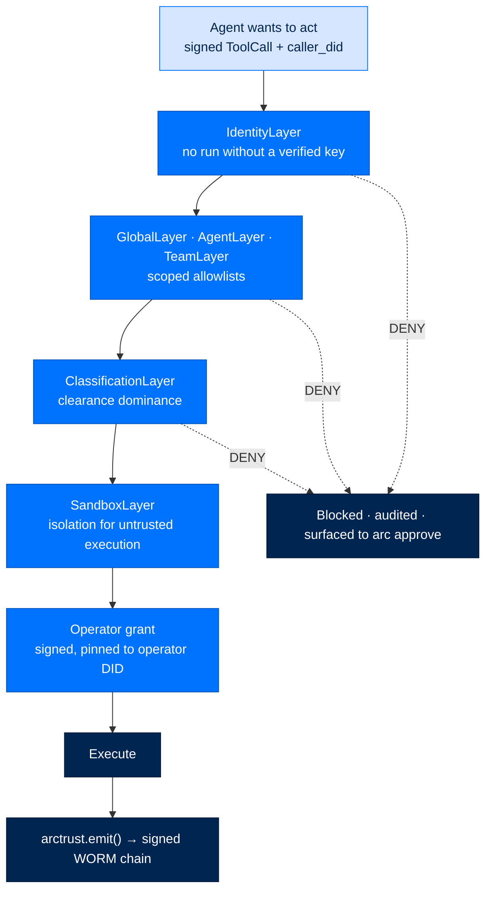

# OWASP Top 10 for Agentic Applications — control mapping

> **Runbooks**  ·  Operate  ·  page 17 of 17  
> **For** Operators deploying and running Arc  
> [← OWASP LLM mapping](compliance-owasp-llm.md)  ·  [Docs home](../../README.md)

Arc's controls for the OWASP Top 10 for Agentic Applications (2026). Agentic
risks are about an agent that *acts*, so most controls here sit on the tool
dispatch path rather than the prompt path.

---

## The mapping

| ID | Risk | Control in Arc | Where it lives | Verify |
|---|---|---|---|---|
| **ASI01** | Agent goal hijack | The goal charter (`identity.md`) is read-only to the agent and written only by direct workspace I/O, never through the LLM's file tools. Policy bounds behaviour independently of the prompt. Operator kill switch stops a live run. | `arcagent` workspace I/O, `arctrust/policy.py`, `arc stop` | `arc stop list` |
| **ASI02** | Tool misuse and exploitation | Per-agent allowlists and denylists; every tool call is schema-validated and individually signed; every invocation is audited. | `arctrust/policy.py` `AgentLayer`, `arcrun/registry.py` | `pytest packages/arctrust/tests -k policy` |
| **ASI03** | Identity and privilege abuse | Every entity has a DID. `ArcAgent.__init__` requires one — there is no anonymous agent. Permissions are scoped `domain:path:permission`; no shared credentials, no implicit privilege inheritance. | `arctrust/identity.py`, `IdentityLayer` | `pytest packages/arctrust/tests -k identity` |
| **ASI04** | Agentic supply chain | Runtime-loaded skills, extensions and backends must be signed and are verified before load. Installs are AST-scanned and secret-scanned; sandboxed install is available and required at federal. | `arctrust/artifact.py`, `arcskill/hub/_ast_scanner.py`, `arcskill/hub/_secret_patterns.py` | `pytest tests/architecture/test_no_unsigned_backends_at_federal.py` |
| **ASI05** | Unexpected code execution | Agent-generated code is never executed unsandboxed. Firecracker microVM isolation is available; no `eval()`; no dynamic import from untrusted sources. | `arcrun/sandbox.py`, `arcskill/hub/_firecracker.py` | [Firecracker runbook](../deploy/firecracker.md) |
| **ASI06** | Memory and context poisoning | Memory writes are validated and attributed to a DID. Cross-agent reads are refused fail-closed. Consolidation reads a card before rewriting it, and omission never deletes a step. | `arcmemory/acl.py`, `arcmemory/stores/procedural.py` | `pytest packages/arcmemory/tests -k acl` |
| **ASI07** | Insecure inter-agent communication | Messages are signed with Ed25519 and addressed by DID; mTLS on NATS channels; replay protection via nonce and timestamp. | `arcteam/crypto.py`, `arcteam/messenger.py` | `pytest packages/arcteam/tests -k signing` |
| **ASI08** | Cascading failures | Shared-nothing per agent. Circuit breakers, timeouts and retry ceilings on everything external; failure domains do not share state. | `arcllm/modules/circuit_breaker.py`, `arcrun` timeouts | `pytest packages/arcllm/tests -k circuit` |
| **ASI09** | Human-agent trust exploitation | Agents never impersonate humans. Consequential actions require a **signed operator grant** obtained through the CLI — approval never happens in chat, so a compromised conversation cannot self-approve. | `arc approve`, `OperatorApprovalAuthority` | `arc approve list` |
| **ASI10** | Rogue agents | Every action is an audited event on a tamper-evident chain; policy violations are visible; an agent can be revoked at the identity layer and stopped mid-run. | `arctrust/audit.py` `WormSink`, `arc stop`, `arc trust` | `arc store verify` |

---

## The load-bearing pattern

Three of these — ASI01, ASI09 and ASI10 — depend on the same structural choice:

> **Operator authority lives outside the conversation.**

An approval is a signed grant, pinned to the operator's DID, created with
`arc approve` at a terminal. A compromised or injected conversation has no path
to produce one. The same holds for the kill switch and for trust decisions.

---

## See also

- [OWASP LLM mapping](compliance-owasp-llm.md)
- [NIST 800-53 mapping](compliance-nist-800-53.md)
- [Threat model](threat-model.md) · [Adversarial tests](adversarial-tests.md)
- [Security reference](../../reference/security.md)
