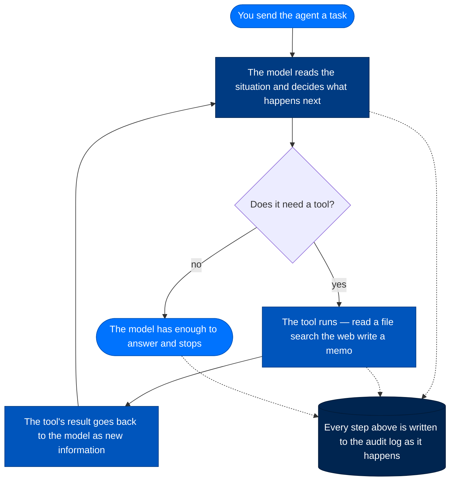
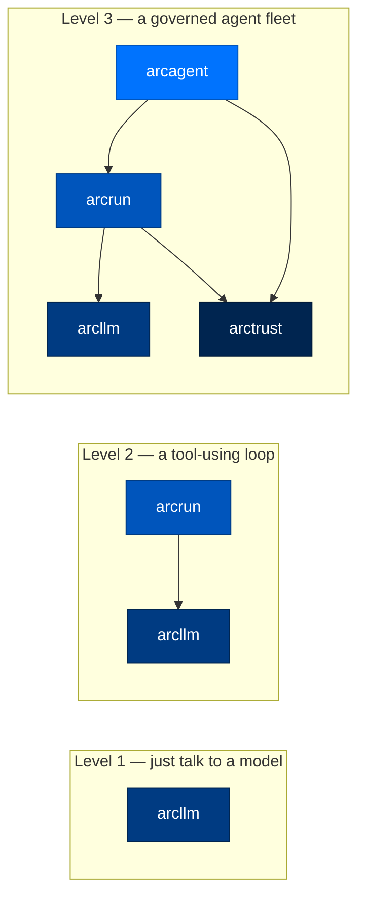

# 1. What Arc Is (and Why It Exists)

> **Walkthrough**  ·  Understand  ·  page 1 of 14  
> **For** Anyone who needs to understand how Arc works  
> [Docs home](../README.md)  ·  [2. Architecture →](02-architecture.md)

---

## In one breath

Arc is a toolkit for building AI agents — programs that can read information,
decide what to do, and take actions like a junior employee would — for places
that cannot just take an AI vendor's word that everything is fine. A bank, a
hospital, a national lab. Every agent gets its own cryptographic ID card, every
tool it uses has to be explicitly permitted, and every action it takes is
written to a tamper-evident logbook, the same way an accountant's ledger is
built so that nobody — including the accountant — can quietly erase an entry.
You do not have to take Arc's word for what an agent did; you can read the
receipts. That is the entire pitch, and everything else in this repository is
in service of it.

---

## What Arc actually is

Arc is a stack of small Python packages (`packages/arcllm`, `packages/arcrun`,
`packages/arcagent`, `packages/arctrust`, and others) that compose into
whatever you need: a plain LLM client, a tool-using agent loop, or a whole
fleet of agents talking to each other under one identity-and-audit system.
Nobody ships Arc as a hosted product you sign up for — you install the
packages you need, into your own infrastructure, and you own everything it
writes.

The "audit trail" analogy is worth sitting with, because it explains most of
the design decisions elsewhere in this doc set: a bank doesn't just trust that
a teller did the right thing, it keeps a signed transaction log so an auditor
can reconstruct exactly what happened, when, and who authorized it, without
needing to trust the teller's memory. Arc treats an AI agent the same way. The
agent is not asked to self-report what it did — every tool call, every model
call, every file it read is written to a durable, append-only, cryptographically
signed record (packages/arctrust) *as it happens*, independent of whether
anyone is watching. If the agent tries to lie about what it did, or something
tries to tamper with the log after the fact, the record doesn't add up.

---

## What an "agent" actually is here

"Agent" gets used loosely across the industry. In Arc it is a concrete,
five-part thing, built by `arc agent create` (packages/arccli):

| Part | What it is | Where it lives |
|---|---|---|
| Identity | An Ed25519 keypair and a DID string (`did:arc:{org}:{type}/{hash}`) — the agent's ID card | `packages/arctrust/src/arctrust/identity.py` |
| System prompt | An `identity.md` file describing who the agent is and what it's for — read-only to the agent itself | `<agent>/identity.md` |
| Tools | Functions the agent is explicitly allowed to call (read a file, run a search, send a message) | `<agent>/capabilities/`, `packages/arcagent/src/arcagent/core/tool_registry.py` |
| Skills | Bundled how-to instructions the agent loads when a task matches | `<agent>/capabilities/`, `packages/arcskill/` |
| Memory | What the agent remembers between conversations | `<agent>/workspace/memory/`, `packages/arcmemory/` (when configured as the agent's brain) |
| The loop | The thing that actually runs a turn — reads the situation, asks the model what to do next, carries out the answer | `packages/arcrun/` |

None of those five parts do anything by themselves. What makes an agent *run*
is the loop, and the loop is boring on purpose:



In plain words: the model looks at what you asked and everything that has
happened so far in the conversation, and decides either "I need to use a
tool" or "I'm done, here's my answer." If it needs a tool, the tool runs, the
result gets handed back to the model as new information, and the cycle
repeats. This is sometimes called a "ReAct loop" (Reason, Act) in the
literature; Arc's implementation of it is `packages/arcrun`. Nothing about
this loop is agent-specific — `arcrun` doesn't know what a "skill" or
"memory" is, it just calls the model and dispatches whatever tools it was
handed (see [`docs/02-architecture.md`](02-architecture.md) for the layering
rule this enforces).

---

## The thesis, and what breaks without each piece

> 🛡️ Every LLM call attributable. Every tool call authorized. Every action
> audited. Every byte traceable.

Four clauses, four separate guarantees, four separate failure modes if you
drop one:

| Guarantee | What it means | What goes wrong without it |
|---|---|---|
| **Every LLM call attributable** | Every request to a model carries the calling agent's identity and, optionally, a cryptographic signature | Without it, you can't tell *which* agent (or which compromised copy of an agent) made a given model call — every agent looks the same in the logs, so a rogue or hijacked agent is indistinguishable from a legitimate one |
| **Every tool call authorized** | A tool call is checked against a deny-by-default policy — not just "can this agent use this tool" but "with these exact arguments" | Without it, a prompt-injected agent that decides to "just call `delete_file`" simply... calls it. There's no gate between "the model wants to" and "it happens" |
| **Every action audited** | Every operation emits a structured, append-only event to a signed log, independent of whether the operation succeeded | Without it, you're relying on the agent (or its logs, which the agent could theoretically have touched) to accurately report its own behavior after the fact — exactly the "trust the teller's memory" problem the audit trail exists to solve |
| **Every byte traceable** | Every message, tool result, and memory write can be traced back to the specific call that produced it | Without it, an incident response team can see *that* something bad happened but not reconstruct the exact sequence that caused it — the difference between "we got breached" and "we got breached, and here's the transcript" |

These four are not a federal-only feature set — see [Tiers](#tiers-personal-enterprise-federal-are-stringency-not-a-gate)
below. They are structural to every Arc agent, at every tier.

---

## Who Arc is for — and who it isn't for

Arc is for teams building agents that have to operate inside an environment
where "trust us" isn't an acceptable answer: regulated industries, government
work, or any org whose security team will eventually ask "prove it." If your
compliance team's first question is "where's the audit trail," Arc is built
around answering that question rather than bolting an answer on afterward.

Arc is **not** the fastest way to wire a chatbot into WhatsApp. Other
self-hosted agent projects — `README.md` names NanoClaw, Hermes Agent, and
OpenClaw as the closest comparisons — are lighter-weight personal assistants
built to get you talking to a model through a chat app quickly, with a much
smaller identity/authorization/audit surface (some have none of it). If what
you want is a personal assistant in your group chat by this evening, one of
those is the better tool for the job — see the full comparison table in
[`README.md`](https://github.com/joshuamschultz/Arc/blob/main/README.md#%EF%B8%8F-how-arc-compares) rather than
duplicated here. Arc's honest tradeoff is that the accountability machinery
that makes it fit for a regulated environment is also what makes it slower
to stand up a first "hello world" agent than a framework that skips all of
it.

---

## Tiers (personal / enterprise / federal) are stringency, not a gate

This is the single most common misreading of Arc, so it's worth being blunt:
**the tier is not a switch that turns security on.** It's a dial that decides
*how strict* security is. Every tier — personal included — identifies every
agent, verifies every loaded artifact, authorizes every tool call through a
policy pipeline, and audits every action. There is no tier where any of that
is skipped. This is a deliberate, documented decision (ADR-019)
made after an earlier version of Arc *did* gate real security behavior behind
`tier == "federal"` checks — accepting unsigned skill bundles, skipping
sandboxing, allowing empty tool allowlists to mean "allow everything," at
every tier below federal. That produced a framework where a personal
deployment was materially less safe than a federal one, which contradicted
the whole premise. ADR-019 tore those bypasses out.

What the tier *does* change is how much stringency is layered on top of that
same floor — how many policy layers run, whether dynamic tool creation is
allowed at all, what crypto is required, how hard the turn budget caps out
(`packages/arcagent/src/arcagent/core/tier.py` defines the `Tier` enum;
`packages/arcagent/src/arcagent/tiers.py` defines the per-knob relaxation
rules a tier is and isn't allowed to grant):

| Knob | Personal | Enterprise | Federal |
|---|---|---|---|
| Policy layers that run | Identity + Global (2) | + Classification, Provider, Agent, Sandbox (6) | + Team (7, all layers) |
| Dynamic tool creation | allowed | approval-gated | denied |
| Signed artifacts | self-signed OK (audited) | operator-chain | operator-chain, FIPS |
| Code execution sandbox | Docker (opt down to bare subprocess) | Docker container floor | Firecracker microVM |
| OpenTelemetry export | off | off | on (OTLP) |

Every row is a "how strict," never a "whether." A personal-tier agent still
has a DID, still has its tool calls checked against a policy, still writes an
audit trail — it just runs fewer policy layers and accepts a self-signed skill
bundle where federal would reject it outright.

---

## Pick how much you need

Each package is independently installable, and Arc is deliberately usable at
three different depths depending on what you're building:



| Level | Install | You get | You don't get |
|---|---|---|---|
| 1 | `pip install arcllm` | One interface to 16 LLM providers over direct HTTP, no vendor SDKs, PII redaction, request signing | No agent, no tools, no loop — you drive the calls yourself |
| 2 | `pip install arcrun` (pulls in `arcllm`) | A model-decides-then-acts loop that dispatches tools you hand it | No identity, no persistent skills/memory, no policy pipeline — `arcrun` doesn't know what an "agent" is |
| 3 | `pip install arc-agent` or `pip install arcmas` | The full agent — identity, tools, skills, memory, the deny-by-default policy pipeline, the audit trail | Nothing — this is the whole stack |

See the package table and dependency diagram in
[`README.md`](https://github.com/joshuamschultz/Arc/blob/main/README.md#-architecture) and the layering rules in
[`docs/02-architecture.md`](02-architecture.md) for the full picture; this is
the "which box do I even need" cut of the same stack.

---

## Your first 30 minutes

There are two supported starting points, and which one you want depends on
whether you're evaluating Arc or developing on it.

### Fastest path: Docker

Arc ships as a single container image that has already made the install
decisions for you — `uv`, the NATS broker, the local embedding model,
config wiring — baked in (`Dockerfile`, `deploy/entrypoint.sh`). This is the
canonical single-node install path:

```bash
cp .env.example .env      # fill in ANTHROPIC_API_KEY at minimum
docker compose up -d
docker compose logs -f arc   # prints the dashboard URL with a viewer token
```

That's it — no separate `arc init`, no separate `arc agent create`. The
container's entrypoint runs the wizard, scaffolds an agent, wires the
gateway, mints viewer/operator tokens, and starts the dashboard on
`:8420`, all against the persistent `/data` volume (`docker-compose.yml`).
Restarting the container reuses the same agent, memory, and tokens instead of
minting new ones.

### Developing on Arc: from source

```bash
git clone https://github.com/joshuamschultz/Arc.git
cd Arc
uv sync --all-packages          # installs every package in editable mode

arc init                        # tier wizard — pick personal/enterprise/federal
arc agent create my-agent --model anthropic/claude-sonnet-4-5-20250929
arc agent build my-agent --check   # validates config, workspace, DID, model reachability
arc agent chat my-agent            # talk to it
```

`arc agent build my-agent` (without `--check`) is destructive — it's the
interactive scaffold and will rewrite `arcagent.toml`. Always pass `--check`
to validate. To watch the agent run and message it from a browser instead of
the terminal:

```bash
arc ui start --team-root ./team --show-tokens
```

Full command reference: [`docs/cli.md`](../reference/cli.md). Full multi-node / production
deploy path (systemd, secrets, remote chat platforms): [`docs/deploy/`](../runbooks/deploy/docker.md).

### What "asking it something" actually does

```mermaid
sequenceDiagram
    participant You
    participant Loop as arcrun (loop)
    participant Model as arcllm (model)
    participant Tool as a tool
    participant Log as arctrust (audit log)

    You->>Loop: "Summarize workspace/reports/"
    Loop->>Model: turn 1 — here's the task
    Model-->>Loop: "I should read the files first"
    Loop->>Tool: read_file(...)
    Tool-->>Loop: file contents
    Loop->>Log: audit event — tool call + result
    Loop->>Model: turn 2 — here's what the tool returned
    Model-->>Loop: final answer
    Loop->>Log: audit event — turn complete
    Loop-->>You: answer
    Note over Log: every arrow above also left a durable,<br/>signed record — the "receipts"
```

Nothing about the answer you get back is special — it's the same
question-and-answer experience as any chat tool. What's different is that
every step that produced it left a receipt, on disk, the moment it happened,
independent of the answer you eventually saw.

---

## How to read the rest of these docs

This file is the front door. The full reading map — which order to read the
other 13 files in, and which path to take depending on whether you're
implementing, reviewing security, or just trying to understand one workflow —
lives in [`docs/README.md`](../README.md). The short version: if you write code
here, read [`docs/02-architecture.md`](02-architecture.md) next, then
[`docs/03-anatomy-of-a-turn.md`](03-anatomy-of-a-turn.md). If you're
evaluating Arc for a security review, skip ahead to
[`docs/10-security-model.md`](10-security-model.md).

---

## Where to look in the code

| Path | What lives there |
|---|---|
| `packages/arcagent/` | The agent itself — identity, tools, skills, memory wiring, the module bus |
| `packages/arcrun/` | The execution loop — the only runtime path to `arcllm` |
| `packages/arcllm/` | Direct-HTTP calls to all 16 LLM providers, zero vendor SDKs |
| `packages/arctrust/` | The security nucleus — DID identity, keypairs, the policy pipeline, the audit chain. Imports nothing else in Arc |
| `packages/arcstore/` | The durable operational record everything else writes to / reads from |
| `packages/arcui/` | The dashboard — reads the durable record, plus live chat |
| `packages/arccli/` | The `arc` command — `arc init`, `arc agent create`, `arc ui start`, etc. |
| `Dockerfile`, `docker-compose.yml`, `deploy/entrypoint.sh` | The single-image install path |
| ADR-019 | Why tiers are stringency, not a gate |

**If you're changing what "agent" means** — start in `packages/arcagent/src/arcagent/core/`.
**If you're changing the loop** — start in `packages/arcrun/`.
**If you're changing a security guarantee** — start in `packages/arctrust/`, and read ADR-019 first.
