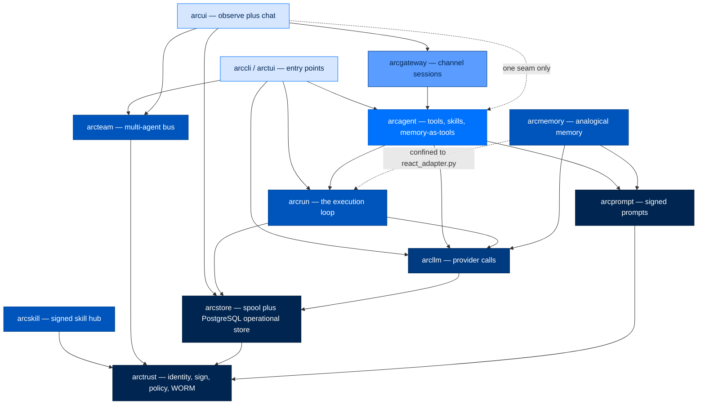
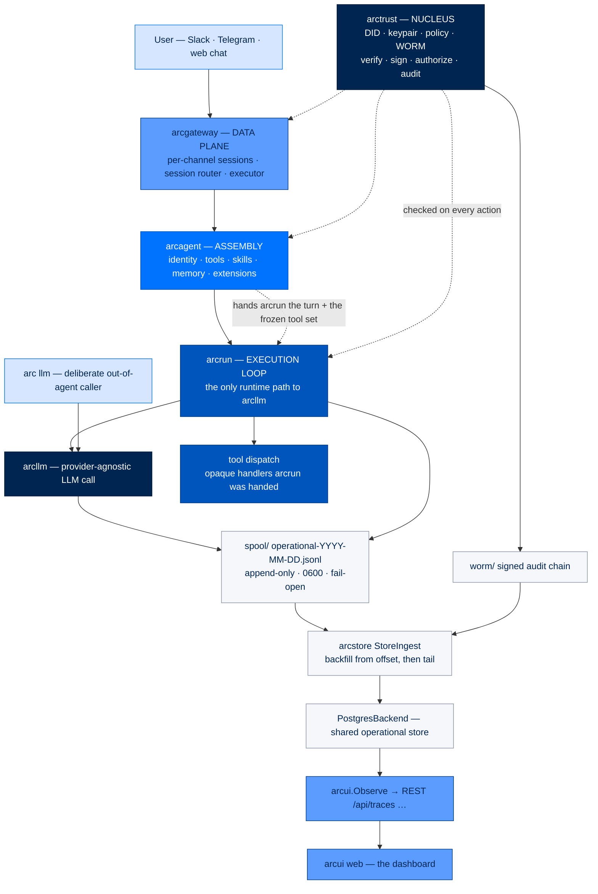
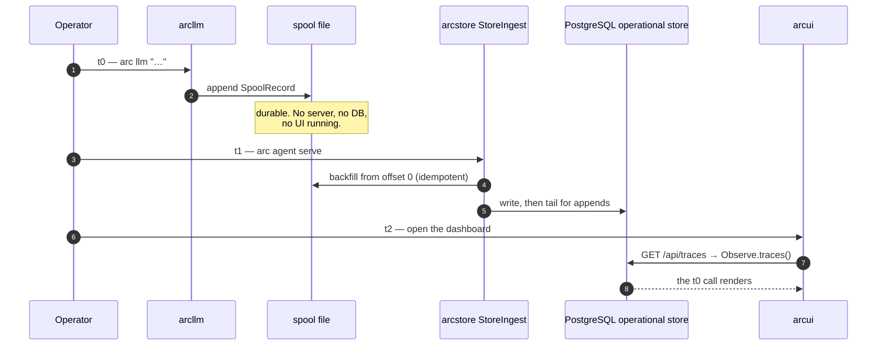
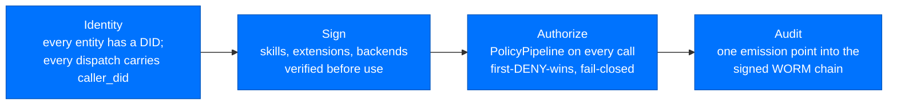
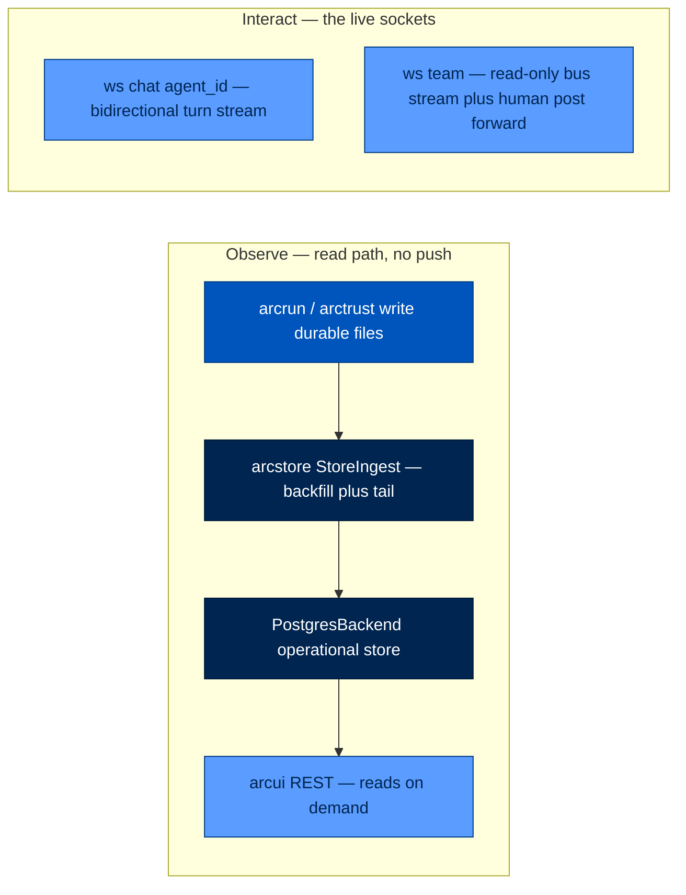
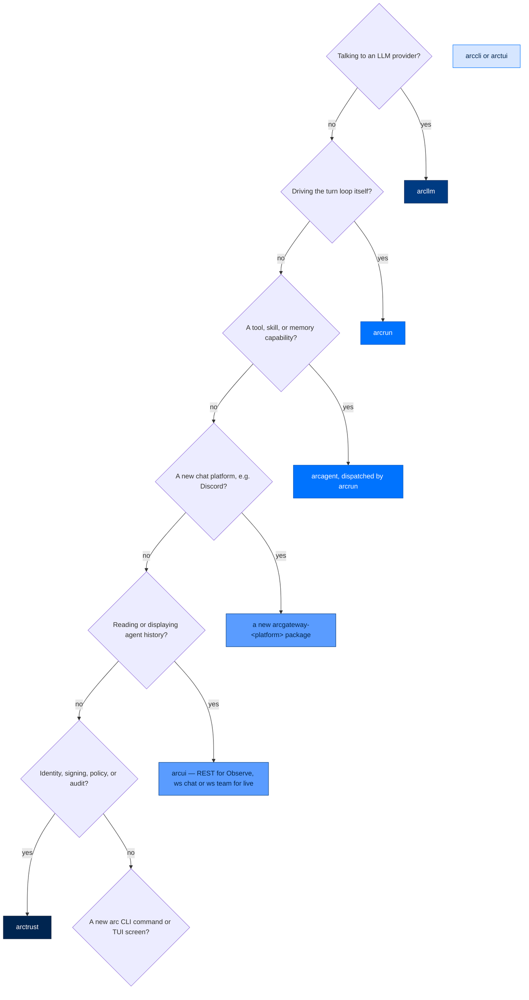

# 2. Architecture — The Layered Package Stack

> **Walkthrough**  ·  Understand  ·  page 2 of 14  
> **For** Anyone who needs to understand how Arc works  
> [← 1. What Arc Is](01-what-is-arc.md)  ·  [Docs home](../README.md)  ·  [3. Anatomy of a Turn →](03-anatomy-of-a-turn.md)

---

## In one breath

Arc is not one program — it's a stack of small, single-purpose packages, each
one only allowed to depend on the packages *below* it, never the ones beside
or above it. Think of it like a building: the foundation (identity, signing,
storage) can't lean on the walls, the walls can't lean on the roof, and the
roof can't reach down and rewire the foundation. If you're adding a feature,
90% of the work is deciding which floor of the building it belongs on —
everything else follows from that. This document is the floor plan: what each
package does, what it's allowed to talk to, and the automated tests that fail
your build if you break the floor plan.

---

## The package inventory

Eighteen directories live under `packages/`. Two are real, shipping code with
tests and architecture guards; two (`arcmas`, `arcmodel`) are near-empty
placeholders — flagged below, not glossed over.

| Package | Source root | One job | Depends on | Must never |
|---|---|---|---|---|
| **arctrust** | `packages/arctrust/src/arctrust/` | Security nucleus: DID identity, Ed25519 keypairs, `PolicyPipeline`, WORM audit chain | nothing in `arc*` (leaf — `pynacl`, `cryptography`, `pydantic` only) | Import any other Arc package |
| **arcllm** | `packages/arcllm/src/arcllm/` | Provider-agnostic LLM calls (16 providers), telemetry, budgets, circuit breakers | `arcstore` (spool) | Be called by anything except `arcrun` — the sole sanctioned exception is the deliberate out-of-agent `arc llm` CLI caller |
| **arcrun** | `packages/arcrun/src/arcrun/` | The execution loop — the *only* runtime path to `arcllm` | `arcllm`, `arctrust`, `arcstore` | Import `arcagent`; couple to ArcLLM's internal module layout; own tool/skill/memory logic; hold per-agent state in a module-level global |
| **arcagent** | `packages/arcagent/src/arcagent/` | The headless agent: identity + tools + skills + memory-as-tools + extensions. Uses `arcrun` to execute | `arcrun`, `arctrust`, `arcprompt`, `mcp` | Import `arcllm`, `arcgateway`, or `arcui`; make LLM calls or run a loop itself |
| **arcstore** | `packages/arcstore/src/arcstore/` | Operational/observability storage: always-on append-only spool + PostgreSQL `StorageBackend` query/mutation layer (local PostgreSQL or Supabase) | `arctrust` | Import `arcagent`, `arcui`, `arccli`, `arcrun`, or `arcgateway` |
| **arcgateway** | `packages/arcgateway/src/arcgateway/` | How you reach an agent from outside: channel sessions, the executor, the `web` adapter; owns the agent data-plane reads (`fs_reader`, `fs_watcher`) | `arcagent` (as `arc-agent`), transitively `arctrust` | Import `arcui`; import a platform extension package directly; ship a platform adapter module (`telegram.py`, `slack.py`, …) in its own core |
| **arcgateway-mattermost** | `packages/arcgateway-mattermost/src/arcgateway_mattermost/` | Mattermost platform adapter plugin (air-gapped DOE/lab chat surface) | `arcgateway` | Be imported by `arcgateway` core |
| **arcgateway-slack** | `packages/arcgateway-slack/src/arcgateway_slack/` | Slack (Socket Mode) platform adapter plugin | `arcgateway` | Be imported by `arcgateway` core |
| **arcgateway-telegram** | `packages/arcgateway-telegram/src/arcgateway_telegram/` | Telegram platform adapter plugin | `arcgateway` | Be imported by `arcgateway` core |
| **arcprompt** | `packages/arcprompt/src/arcprompt/` | Editable, signed, inspectable system-prompt store | `arctrust` only | Import anything above it — `arcrun`, `arcagent`, `arcmemory`, and `arcskill` all import *it* |
| **arcskill** | `packages/arcskill/src/arcskill/` | Verified skill hub: signed install, scan, lock, CRL lifecycle | `arctrust` | Let `arcskill.improver` import `arcagent`, `arcllm`, or `arcmemory` directly — those enter only through injected `Mutator`/`Judge`/`EvalRunner`/`Signer`/`AuditSink` seams |
| **arcmemory** | `packages/arcmemory/src/arcmemory/` | Dual-speed, four-store, analogical memory: markdown source of truth + disposable SQLite index + an agentic "sleep" consolidation pass | `arctrust`, `arcllm`, `arcprompt`; `arcrun` additively, confined to one `react_adapter.py` | Import `arcagent`, ever — the hard DAG boundary; reimplement its own classification comparator instead of reusing `arctrust`'s |
| **arcteam** | `packages/arcteam/src/arcteam/` | Alpha fleet coordination: signed agent mail, registry, audit, workflows, and the future composition point for standalone agents | Current wheel: `arctrust`, `arcstore`; agreed direction: `arcagent`, `arcmemory` via public seams | Reverse-import `arcteam` from `arcagent` or `arcmemory`; reach into agent/private-memory internals |
| **arcui** | `packages/arcui/src/arcui/` | **Observe** ArcAgent history + limited **Interact** (`/ws/chat`, `/ws/team`) | `arcagent`, `arcstore`, `arcgateway`, `arcteam`, `arctrust`, `arcskill` | Bypass ArcAgent to invoke `arcrun` or `arcllm`; make ArcAgent depend on the UI |
| **arccli** | `packages/arccli/src/arccli/` | The `arc …` command surface: create/serve/run agents, `arc ui`, `arc store`, `arc team` | `arcllm`, `arcrun`, `arcagent` (as `arc-agent[telegram]`), `arcteam` | Import `click` outside the allowlisted legacy files (see below) |
| **arctui** | `packages/arctui/src/arctui/` | Terminal UI for Arc (Textual) | `arccli` (as `arccmd`) | — (newest package; no dedicated architecture test yet) |
| **arcmas** | `packages/arcmas/src/arcmas/` | ⚠️ **Meta-package only.** `pip install arcmas` pulls in `arccmd` + `arcmemory` for a full-stack install. `src/arcmas/__init__.py` is a 14-line docstring; there is no logic | `arccmd`, `arcmemory` | — not a code package |
| **arcmodel** | `packages/arcmodel/src/arcmodel/` | ⚠️ **Placeholder.** `pyproject.toml` description reads "Arc model management — coming soon"; `Development Status :: 1 - Planning`. The entire source is a two-line `__init__.py` with a version string | nothing | — not a code package |

Verified: `arcmas` and `arcmodel` were read in full — neither has a second
source file. Everything else in this table is drawn from each package's
`pyproject.toml` `dependencies` list plus the architecture tests in the next
section, not from README prose.

---

## The layering law

Dependencies point straight down. **`arctrust` is the nucleus** — the one
package with no `arc*` imports at all; every other package either depends on
it directly or transitively depends on something that does.

### Fleet composition is a separate outer layer

`arcteam` is the removable fleet layer, not a dependency of an individual
agent. The agreed alpha direction is `arcteam → arcagent` and
`arcteam → arcmemory`, using public typed contracts only. It composes agent
instances, fleet mail/inboxes, shared-knowledge governance, and fleet tool/skill
grants; it does not absorb the agent loop, the agent's private workspace, or
generic knowledge mechanics.

That direction is not fully implemented at this commit: the ArcTeam package
metadata still lists no ArcAgent or ArcMemory dependency, while ArcAgent's
optional messaging integration lazily imports ArcTeam. Treat that as a tracked
alpha gap, not as a license to add more reverse imports. The architecture rule
and the operational split are documented in
[Fleet layering and removable composition](../concepts/fleet-layering.md).

### The one narrowed exception

`arcui` needs the Knowledge/Capabilities "Reality Mirror" views to show what an
agent *actually* loads — trust verdicts, discovered skills, provider status.
That requires reading `arcagent` internals. Rather than blow the boundary
open, the fix is narrowed to a single seam:

> `arcui` may import **only** `arcagent.capabilities.inventory` — every other
> `arcagent` import from `arcui` is a forbidden layering violation.

This is enforced by an AST-based architecture test, not a comment:

- **`test_arcui_imports_arcagent_only_via_inventory_seam`** in
 [`packages/arcgateway/tests/architecture/test_imports.py:61`](https://github.com/joshuamschultz/Arc/blob/main/packages/arcgateway/tests/architecture/test_imports.py)
 (it lives in the `arcgateway` package's test tree, not `arcui`'s, because it
 guards the cross-package boundary between the two). It walks every `.py`
 file under `packages/arcui/src/arcui/`, collects imported module prefixes,
 and fails if any of them is `arcagent` or `arcagent.*` other than
 `arcagent.capabilities.inventory`.

The import is done lazily (inside the request handler, not at module top) in
both `packages/arcui/src/arcui/routes/trust.py` and
`packages/arcui/src/arcui/routes/agent_detail/capabilities.py`. Both files
say why in a comment: `arcagent` already declares a package-level dependency
on `arcui` in its `pyproject.toml`, so a top-level `arcui → arcagent` import
would close an import cycle.

> **Note — the cycle no longer exists.** Those comments used to attribute the
> `arcagent → arcui` dependency to the old `UIBridgeSink` audit sink.
> `UIBridgeSink` is gone (`packages/arctrust/tests/test_layering.py` asserts
> it), there was never an `import arcui` in `packages/arcagent/src/`, and the
> stale `arcui>=0.1` line has been removed from
> `packages/arcagent/pyproject.toml`. The lazy import in `arcui`'s route
> handlers stays — not to dodge a cycle, but because
> `arcagent.capabilities.inventory` is the *one* approved arcagent import and
> importing it at call time keeps that surface from widening unnoticed.

### All the architecture tests that enforce layering

`find. -path '*/tests/architecture/*'` turns up every layering guard in the
repo. They are AST-based static checks — they parse source files and inspect
`import` statements without importing the modules, so a violation fails
cleanly at test time instead of surfacing as a runtime `ImportError` several
layers away.

| Test | Location | Guards |
|---|---|---|
| `test_no_arcagent_imports_arcgateway` | `tests/architecture/test_no_arcagent_imports_arcgateway.py` | `arcagent` has zero knowledge of `arcgateway` — one-way dependency |
| `test_no_arcrun_imports_arcagent` | `tests/architecture/test_no_arcrun_imports_arcagent.py` | `arcrun` has zero knowledge of `arcagent` |
| `test_no_arcrun_calls_load_model` | `tests/architecture/test_no_arcrun_calls_load_model.py` | `arcrun` never calls `arcllm.registry.load_model()` directly — model lifecycle stays in `arcllm` |
| `test_no_arcprompt_imports_upward` | `tests/architecture/test_no_arcprompt_imports_upward.py` | `arcprompt` is a leaf — imports only `arctrust` |
| `test_no_arcstore_arcteam_upward_imports` | `tests/architecture/test_no_arcstore_arcteam_upward_imports.py` | `arcstore`/`arcteam` never import `arcagent`, `arcui`, `arccli`, `arcrun`, or `arcgateway` |
| `test_no_click_in_arccli` | `tests/architecture/test_no_click_in_arccli.py` | No `import click` in `arccli` outside an explicit, shrinking allowlist (below) |
| `test_no_global_tool_name_mutation` | `tests/architecture/test_no_global_tool_name_mutation.py` | `arcrun` never mutates process-global tool-name state — the Hermes-PR-#4926 race-condition class |
| `test_no_unsigned_backends_at_federal` | `tests/architecture/test_no_unsigned_backends_at_federal.py` | `arcrun.backends.loader.load_backend` calls signature verification before loading any non-builtin backend |
| `test_module_bus_priority_assignments` | `tests/architecture/test_module_bus_priority_assignments.py` | Module-bus subscription priorities for key modules (`10`=policy/security, `50`=security, `100`=default, `200`=logging); same-priority handlers run concurrently via `asyncio.gather` |
| `test_backend_protocol_duck_typing` | `tests/architecture/test_backend_protocol_duck_typing.py` | Third-party `ExecutorBackend`s (ssh, modal, daytona) satisfy the Protocol structurally — no forced inheritance |
| `test_arccli_command_registry_minimal_surface` | `tests/architecture/test_arccli_command_registry_minimal_surface.py` | `arccli.commands` exports only `CommandDef`, `COMMAND_REGISTRY`, `resolve_command`, `commands_by_category` |
| `test_prompt_markdown_ships_in_wheels` | `tests/architecture/test_prompt_markdown_ships_in_wheels.py` | Every package with a `context/` prompt directory declares it under `artifacts` so Hatchling ships it in the wheel |
| `test_workspace_install` | `tests/architecture/test_workspace_install.py` | The canonical `uv pip install -e` sequence across all packages stays valid — guards against venv-drift from piecemeal installs |
| `test_no_module_global_agent_state` | `packages/arcagent/tests/architecture/test_no_module_global_agent_state.py` | No `_runtime.py` module holds per-agent state as a module-level global — many `ArcAgent` instances run concurrently, one `asyncio.Task` per session, on the same event loop |
| `test_arcui_imports_arcagent_only_via_inventory_seam` (+ 5 more) | `packages/arcgateway/tests/architecture/test_imports.py` | The inventory seam (above); `arcgateway` never imports `arcui`; adapters never import `arcui`/`arcagent`; the `web` adapter never imports `arcgateway.bootstrap`; the gateway core never imports a platform extension package; the gateway core ships no `telegram.py`/`slack.py`/`mattermost.py` |
| `test_send_with_id_in_protocol` | `packages/arcgateway/tests/architecture/test_send_with_id_in_protocol.py` | The `send_with_id` Protocol method and its default behavior on `BasePlatformAdapter` |
| `test_no_arcagent_import` | `packages/arcmemory/tests/architecture/test_no_arcagent_import.py` | `arcmemory` never imports `arcagent` — the hard DAG boundary. `arcrun` is allowed but confined to `react_adapter.py` |
| `test_reuses_arctrust_comparator` | `packages/arcmemory/tests/architecture/test_reuses_arctrust_comparator.py` | `arcmemory` imports `arctrust`'s `dominates`/`parse_classification` — no second classification ladder |
| `test_improver_no_provider_import` | `packages/arcskill/tests/architecture/test_improver_no_provider_import.py` | `arcskill.improver` imports no `arcagent`, `arcllm`, or `arcmemory` — only injected Protocol seams |

The `test_no_click_in_arccli` allowlist (`agent.py`, `ext.py`,
`formatting.py`, `init_wizard.py`, `llm.py`, `module_walkthrough.py`,
`run.py`, `skill.py`, `team.py`, `telegram_setup.py`, `ui.py`,
`main_legacy.py`) is a live migration ratchet, not a closed list — the test's
own docstring says it's meant to shrink as each handler moves off Click, and
`main_legacy.py` is the one permanent exception. This is a partial migration,
not a finished one — say so if you touch any of those files.

---

## Don't-mix-concerns rules

`CLAUDE.md` states this as a project-wide rule; the architecture tests above
are how it's enforced instead of merely asserted:

- **All LLM calls are `arcllm`.**
- **Loop execution is `arcrun`.**
- **Agent-with-tools/skills/memory is `arcagent`.**
- `arcrun` owns the loop, **not the capabilities** — tools, skills, and memory
 arrive as opaque handlers *passed into* `arcrun` by whoever drives it
 (normally `arcagent`). `arcrun` dispatches them; it never imports or owns
 memory/skill/eval logic.
- `arcrun` is the **only** runtime path to `arcllm`. The lone sanctioned
 exception is `arc llm "…"` — a deliberate out-of-agent caller that proves
 the "call now, see later" durability guarantee (`docs/architecture/ARCH-OVERVIEW.md`
 §"What happens on `arc llm`").

### "Smells wrong" — symptom → violated rule → correct home

| Symptom | Violates | Belongs in |
|---|---|---|
| A tool handler calls an LLM provider directly instead of going through a turn | "`arcrun` is the only runtime path to `arcllm`" | `arcllm`, invoked via `arcrun` |
| New tool/skill/memory-dispatch logic added inside `arcrun` | "`arcrun` owns the loop, not the capabilities" | `arcagent` — pass the handler *into* `arcrun` instead |
| `arcgateway` or `arcui` code reads `team/<agent>/…` files directly with `pathlib`/`open()` | ADR-020's "arcgateway is the single source of truth for the agent data plane" | `arcgateway.fs_reader.read_file()` / `list_tree()` |
| A route or module imports `arcagent` for anything beyond capability inventory | The one narrowed seam (above) | `arcagent.capabilities.inventory`, lazily, or don't import it at all |
| A `_runtime.py` module keeps a dict/list of per-agent state at module scope | `test_no_module_global_agent_state` — many agents run concurrently in one process | Per-`ArcAgent`-instance state, or `RunState`/session-scoped storage |
| A new remote chat platform's code lands inside `packages/arcgateway/src/arcgateway/adapters/` | "gateway core ships no platform adapter modules" | A new `packages/arcgateway-<platform>/` package, entry-point discovered |
| `arcmemory` imports `arcagent` to reach a capability | The hard DAG boundary (`test_no_arcagent_import`) | Expose the capability as a Protocol seam that `arcagent` injects into `arcmemory` |
| A backend or skill loads without a signature check | `test_no_unsigned_backends_at_federal` / the Sign pillar | Route it through `arctrust`'s `verify_allowed_backends_signature` |

---

## LOC budgets

`CLAUDE.md` sets the headline number — core under 3,500 LOC — but "core" here
means `packages/arcagent/src/arcagent/core/`, not the whole repo. The rule
behind the number matters more than the number: **a budget overage signals
code living in the wrong package, not a ceiling to negotiate upward.** Move
the code; don't raise the limit.

The check is real and runs today: `scripts/check_loc_budgets.py`, wired to
`make loc-budgets` (and `make m1-gates`, which also runs
`architecture-tests` and `race-stress`). It counts NCLOC — non-blank,
non-comment-only lines; docstrings and inline comments still count as code.

| Budget | Scope | Ceiling | Current (last run) |
|---|---|---|---|
| G1.5 — arcagent core | `packages/arcagent/src/arcagent/core/*.py` | 3,500 | **3,485 — OK**, 15 lines of headroom |
| G1.6 — arcgateway core | `runner.py` + `session.py` + `executor.py` + `adapters/base.py` | 1,200 | **1,297 — OVER by 97** |
| G1.7 foundation — arctrust | `packages/arctrust/src/` (whole package) | 3,600 | **3,780 — OVER by 180** |
| G1.7 foundation — arcllm | `packages/arcllm/src/` | 7,900 | 7,396 — OK |
| G1.7 foundation — arcrun | `packages/arcrun/src/` | 5,400 | 5,065 — OK |
| G1.7 foundation — arcprompt | `packages/arcprompt/src/` | 700 | 490 — OK |
| arccli (advisory only — never fails the gate) | `packages/arccli/src/` | 8,400 | **9,043 — OVER by 643** |

Three budgets are over as of this run. This is real, current state, not a
hypothetical — anyone running `make loc-budgets` today sees the same three
`FAIL` lines. The remaining packages (`arcmemory`, `arcskill`, `arcstore`,
`arcteam`, `arcui`, …) are extension modules with no ceiling in this script —
budgeted as needed, not tracked here.

---

---

## The big picture — one request, all the way down

This is the whole stack on one page. `arctrust` sits beside everything rather
than above it: every action below checks in there, and it imports no sibling.

### Call-flow rule (don't mix concerns)

- **arcrun is the only runtime path to arcllm.** Chat from any channel lands in
 the gateway, the executor invokes the agent, and the agent runs *through*
 arcrun — which is where the LLM gets called and where tools may fire. The lone
 exception is a deliberate out-of-agent caller (`arc llm`), which exists to
 prove the "call now, see later" guarantee.
- **arcrun owns the loop, not the capabilities.** Tools, skills and memory are
 passed *into* arcrun as handlers by whoever drives it (normally arcagent).
 arcrun dispatches them; it never imports or owns memory, skill or eval logic.

---

## "Call now, see later" — `arc llm` then `arc ui`

The durable record does not depend on anything listening at the time.

The `t0` record is independent of `t1` and `t2`. That independence is the point:
recording cannot be dropped by a UI that was not listening yet.

---

## The Four Pillars (every tier, always on)

Tier is **stringency metadata, not a gate**. Federal requires FIPS-validated
crypto, signed allowlists and all five policy layers; personal allows
self-signed bundles and the Global-only layer. Every tier still verifies,
authorizes, audits and identifies — which is why hardening to federal is
configuration, not re-architecture.

---

## The two planes

Post (the arcstore operational-storage cutover and the arcui push
teardown), Arc keeps exactly two live surfaces, deliberately kept apart.

**Observe.** Every write lands in durable files the instant it happens:
`arcllm.record()` and `arcrun` run-events go to the append-only spool
(`<data_dir>/spool/`, `0600`, single `os.write`, fail-open); `arctrust.emit()`
goes to the signed WORM chain (`<data_dir>/worm/`). `arcstore`'s
`StoreIngest` backfills those files into the PostgreSQL operational store on
startup, then tails for new appends. `arcui` reads that store through REST endpoints —
`/api/traces`, `/api/stats`, `/api/cost-efficiency`, … — on demand, no
polling, no subscription. Killing and restarting `arcui` loses no history: it
just re-reads the durable files. There is no `EventBuffer`, no broadcaster, no
push wire left in this path — `packages/arcui/tests/test_no_push_pipeline.py`
makes that structural, not just documented:

> "arcui is a read-only consumer of the durable arcstore record. These checks
> make the teardown structural: a future re-introduction of a push wire (an
> event buffer, a subscription broadcaster, an audit-sink bridge, a `/ws`
> telemetry feed) trips here instead of silently resurrecting the
> miss/no-update bug class this spec exists to kill."

**Interact.** Two genuinely bidirectional WebSockets exist today, and both are
Interact-plane, not Observe:

- **`/ws/chat/{agent_id}`** — the turn stream. Handled by
 `arcgateway`'s `WebPlatformAdapter`; the browser is just one channel among
 several (a Slack thread and a UI thread with the same agent are distinct
 sessions).
- **`/ws/team`** — a read-only window onto the `arcteam` bus for the
 browser (frames carry handles, never DIDs), plus a one-way forward for
 human group posts. Defined in
 `packages/arcui/src/arcui/routes/team_ws.py`. Auth mirrors `/ws/chat`:
 first-message token, `viewer`/`operator` only — `agent` tokens are
 rejected (ASI03 mitigation).

`docs/architecture/ARCH-OVERVIEW.md` describes `/ws/chat` as "the one
remaining WebSocket" — that was accurate at and is now one socket
short: `/ws/team` shipped afterward under. Both sockets carry live,
two-way traffic a human is actively driving; neither is agent-run telemetry,
so the Observe/Interact split still holds — it's just two sockets on the
Interact side now, not one.

> ⚠️ **Unverified vs. superseded:** ADR-020 (arcgateway owns the data plane,
> 2026-04-29) describes `arcgateway.fs_watcher` emitting `FileChangeEvent`
> through a `FileEventBus` — a push mechanism for file-change notifications.
> Those files (`fs_reader.py`, `fs_watcher.py`, `file_events.py`) still exist
> under `packages/arcgateway/src/arcgateway/`, and the *read* half (`fs_reader`)
> is exactly what backs the data-plane-ownership rule in this document. Whether
> the *watch/push* half is still wired into a live consumer, or was subsumed
> by the push-pipeline teardown, was not verified for this document — treat
> `fs_watcher`'s current wiring as unconfirmed rather than assume either way.

---

## Architecture Decision Records

ADRs live with the repository's other system files rather than in this published
set — they are project history, not guides. Most are one file per decision under
`.claude/architecture/decisions/`; some are recorded inline in the spec that
produced them, and a few sit in `.claude/adrs/`.

**For the full inventory — every ADR, where it lives, its status, and the next
free number — see
[`.claude/architecture/decisions/README.md`](https://github.com/joshuamschultz/Arc/blob/main/.claude/architecture/decisions/README.md).**
That index is the authority. The table below is a **selection**, not a census:
the decisions that shape the architecture described in this chapter, with a note
on why each one bites.

| ADR | Status | One line |
|---|---|---|
| [ADR-018](https://github.com/joshuamschultz/Arc/blob/main/.claude/architecture/decisions/ADR-018-no-mcp-no-migration-no-acp.md) — No MCP client, migration tooling, or ACP adapter | **Partly superseded** | Scoped all three out of SPEC-018. The migration-tooling and ACP exclusions still stand; **the MCP-client exclusion was reversed by ADR-030** — read the two together or you will conclude Arc cannot speak MCP |
| [ADR-019](https://github.com/joshuamschultz/Arc/blob/main/.claude/architecture/decisions/ADR-019-four-pillars-universal.md) — Four Pillars are universal defaults | Accepted | Identity, Sign, Authorize, Audit apply at every tier, not just federal — load-bearing for the whole security model |
| [ADR-020](https://github.com/joshuamschultz/Arc/blob/main/.claude/architecture/decisions/ADR-020-arcgateway-as-data-plane.md) — arcgateway owns the data plane, arcui is a pure consumer | Accepted | Every `team/<agent>/…` read goes through `arcgateway.fs_reader`, never direct filesystem access from `arcui` — see caveat above on `fs_watcher`'s current status |
| [ADR-021](https://github.com/joshuamschultz/Arc/blob/main/.claude/architecture/decisions/ADR-021-agent-self-description-via-toml-ui-section.md) — Agent self-description via `[ui]` in `arcagent.toml` | Accepted | UI display hints (name, color, role) live in the same TOML the agent already owns, not a sidecar file |
| [ADR-022](https://github.com/joshuamschultz/Arc/blob/main/.claude/architecture/decisions/ADR-022-storage-split-arctrust-worm-arcstore-operational.md) — Storage split: arctrust owns WORM, arcstore owns operational data | Proposed | The only ADR in this set still `Proposed`, not `Accepted` |
| [ADR-023](https://github.com/joshuamschultz/Arc/blob/main/.claude/architecture/decisions/ADR-023-capability-resolution-and-arcrun-provider.md) — Capability resolution: unified `CapabilityProvider`, layered roots, signed-to-load trust | Accepted | Defines the `scan_roots` layering (builtins, global, agent, workspace, module) and last-wins precedence for tools/skills/memory |
| [ADR-024](https://github.com/joshuamschultz/Arc/blob/main/.claude/architecture/decisions/ADR-024-unified-streaming-run-entry.md) — One streaming, session-bound `agent.run` — every surface goes through arcrun | Accepted | Closes off parallel run entry points; reinforces "arcrun is the only runtime path to arcllm" |
| [ADR-025](https://github.com/joshuamschultz/Arc/blob/main/.claude/architecture/decisions/ADR-025-cache-control-confined-to-anthropic-adapter.md) — Provider cache directives confined to the Anthropic adapter | Accepted | Prompt-caching `cache_control` logic lives only in `arcllm`'s `anthropic.py`, not spread across providers |
| [ADR-026](https://github.com/joshuamschultz/Arc/blob/main/.claude/architecture/decisions/ADR-026-transform-context-append-only-with-emergency-valve.md) — `transform_context` is append-only; compaction is a between-run boundary event | Accepted | Supersedes the old per-turn graduated-prune model in `ContextManager` |
| [ADR-027](https://github.com/joshuamschultz/Arc/blob/main/.claude/architecture/decisions/ADR-027-per-run-tool-set-freeze-security-invariant.md) — Per-run tool-set freeze as a structural security invariant | Accepted | The tool set is frozen for the lifetime of one run — no mid-run tool substitution |
| [ADR-028](https://github.com/joshuamschultz/Arc/blob/main/.claude/architecture/decisions/ADR-028-append-only-prefix-contract-debug-gated.md) — Append-only prefix contract enforced only under a debug flag | Accepted | The strict version of the append-only contract is opt-in via a debug flag, not always-on |
| [ADR-029](https://github.com/joshuamschultz/Arc/blob/main/.claude/architecture/decisions/ADR-029-workspace-vs-working-dir-and-state-persistence.md) — Agent home (workspace) vs working directory | Accepted | Agent state — memory, sessions, `context.md`, identity, the audit chain — is written with direct filesystem I/O to the workspace, **never** through the LLM-facing `write`/`edit`/`bash` tools. Moving the tools into a project must not drag the agent's brain in with them |
| [ADR-030](https://github.com/joshuamschultz/Arc/blob/main/.claude/architecture/decisions/ADR-030-mcp-capability-and-extension-placement.md) — Agents get MCP capability; extensions plug in from outside | Accepted | Reverses ADR-018's MCP-client exclusion. Also sets the placement rule: machine-level installs are the host's business, agent-facing skills and tools go in the capability folder, implementation stays inside the extension. The governing test is that the eleventh connector must be addable without touching core |
| [ADR-031](https://github.com/joshuamschultz/Arc/blob/main/.claude/architecture/decisions/ADR-031-dynamic-script-not-declared-graph.md) — Ad-hoc model-authored orchestration is a restricted script, not a declared graph | Accepted | Constrains what the model may author at runtime; a script runs under existing sandbox and policy, a declared graph would be a second execution model to secure |
| [ADR-032](https://github.com/joshuamschultz/Arc/blob/main/.claude/architecture/decisions/ADR-032-channel-responder-selection-routes-on-published-indexes.md) — A channel responder is chosen by routing over published indexes | Accepted | Who answers an un-addressed channel post is decided by routing over published digests, not by polling each agent about its own fitness |

`ADR-019` (Four Pillars) and `ADR-020`/`ADR-023` (data plane + capability
resolution) are the three most load-bearing for day-to-day contribution — they
define, respectively, what every package must do, how `arcui`/`arcgateway` are
allowed to touch agent state, and how tools/skills/memory get discovered at
all. See also the [policy module pattern](../building/policy-modules.md).

---

## Decision tree: "I want to add X — which package?"

---

## Where to look in the code

| Path | What lives there | Start here if you're changing |
|---|---|---|
| `packages/arctrust/src/arctrust/` | DID identity, Ed25519 keypairs, `PolicyPipeline`, WORM chain, `classification.py`'s Bell-LaPadula comparator | Auth, signing, audit, tiers |
| `packages/arcllm/src/arcllm/` | Provider adapters (`anthropic.py`, …), `registry.py::load_model`, budgets, circuit breakers | Adding/fixing an LLM provider |
| `packages/arcrun/src/arcrun/` | The turn loop, `backends/loader.py`, `run_events` emission | Loop mechanics, streaming, backend sandboxing |
| `packages/arcagent/src/arcagent/core/` | `agent.py` (orchestrator), `tool_registry.py`, `module_bus.py`, `session_internal/` | The agent nucleus — budget-tracked, keep it lean |
| `packages/arcagent/src/arcagent/capabilities/` | `capability_loader.py`, `capability_registry.py`, `inventory.py` (the one seam `arcui` may import) | How tools/skills/memory get discovered and trusted |
| `packages/arcagent/src/arcagent/modules/` | `tasks/`, `runcontrol/`, `session/`, `browser/`, … | A new opt-in agent module |
| `packages/arcstore/src/arcstore/` | Spool writer, `StoreIngest`, `PostgresBackend` | Durable-record format, ingest, the operational-store schema |
| `packages/arcgateway/src/arcgateway/` | `runner.py`, `session.py`, `executor.py`, `fs_reader.py`, `adapters/base.py`, `adapters/web.py` | Session handling, the data-plane read API, the built-in web adapter |
| `packages/arcgateway-{telegram,slack,mattermost}/` | One platform adapter each | A new remote chat surface — copy one of these, don't touch `arcgateway/adapters/` |
| `packages/arcui/src/arcui/routes/` | REST endpoints, `chat_ws.py`, `team_ws.py` | Dashboard API surface, either live socket |
| `packages/arcui/web/` | React + React Query frontend | The dashboard UI itself |
| `packages/arccli/src/arccli/commands/` | `COMMAND_REGISTRY`, `resolve_command` | A new `arc` subcommand |
| `packages/arctui/src/arctui/` | Textual screens | The terminal UI |
| `packages/arcmemory/src/arcmemory/` | Four memory stores, `react_adapter.py` (the only `arcrun` touchpoint) | Memory capture, consolidation, retrieval |
| `packages/arcskill/src/arcskill/` | Signed install/scan/lock, `improver/` (provider-free) | Skill packaging, verification, the improver loop |
| `packages/arcteam/src/arcteam/` | NATS bus, mailbox registry | Inter-agent messaging |
| `packages/arcprompt/src/arcprompt/` | Prompt storage/resolution, overlay signing | System-prompt content and overlays |
| `scripts/check_loc_budgets.py` | The LOC budget checker itself | Adjusting what's measured (not the ceilings — those signal "move the code") |
| `tests/architecture/`, `packages/*/tests/architecture/` | Every layering guard in the table above | Any cross-package boundary change — run these first |

See also: `docs/architecture/ARCH-OVERVIEW.md` (the seed document this file
expands), `docs/architecture/policy-modules.md`, `docs/cli.md`,
`docs/config-reference.md`.
