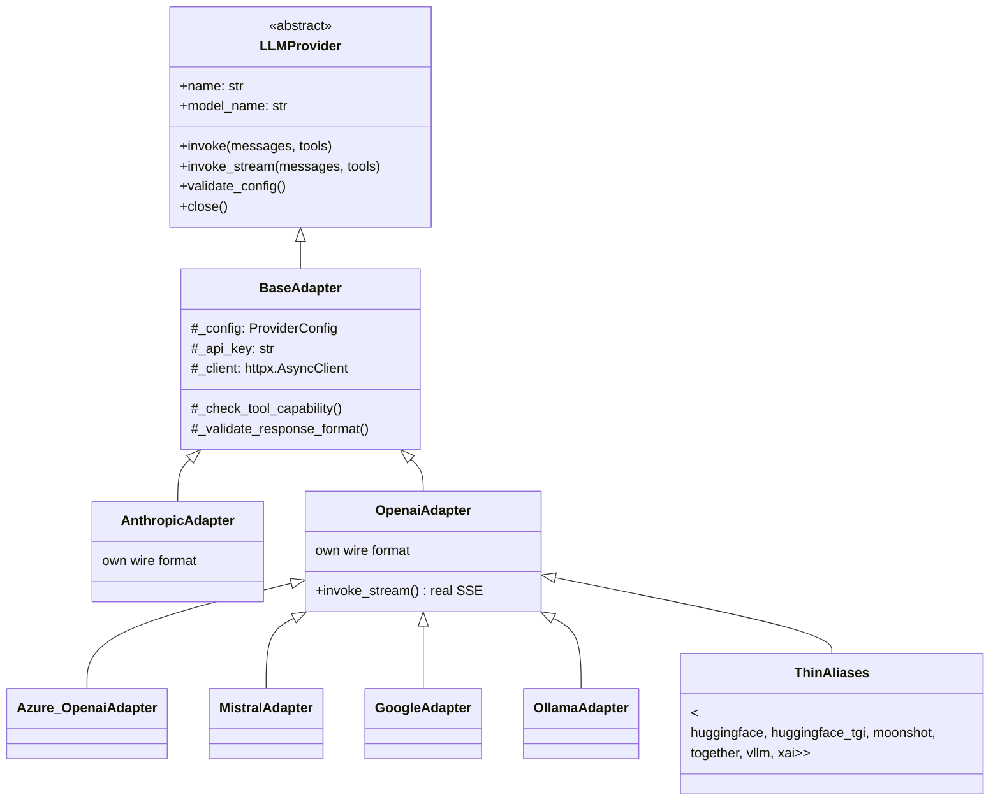
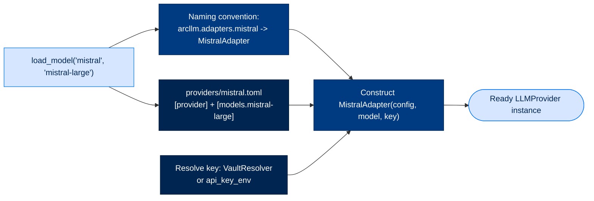
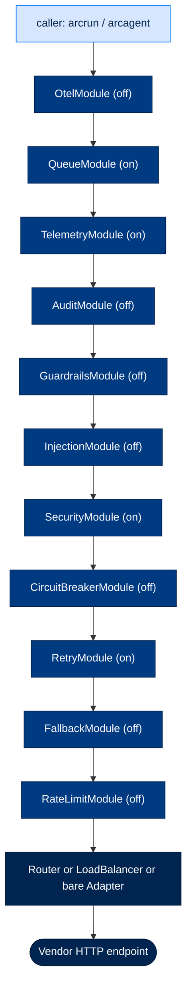
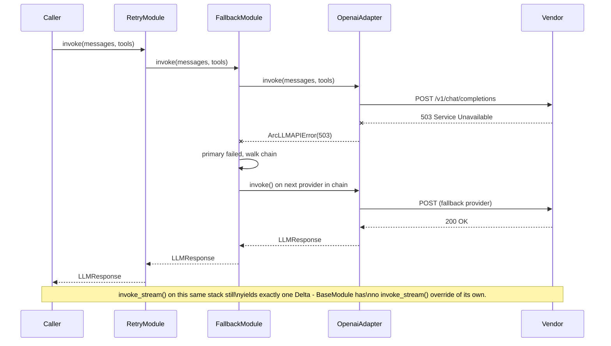

# 4. The Unified Adapter — One Interface, Every Provider, Zero SDKs

> **Walkthrough**  ·  Understand  ·  page 4 of 14  
> **For** Anyone who needs to understand how Arc works  
> [← 3. Anatomy of a Turn](03-anatomy-of-a-turn.md)  ·  [Docs home](../README.md)  ·  [5. Steering and Strategies →](05-steering-and-strategies.md)

---

## In one breath

Every LLM vendor speaks a different HTTP dialect — Anthropic wants `system` as
a top-level field, OpenAI wants it as a `developer` message on reasoning
models, Azure wants an `api-key` header instead of `Authorization: Bearer`.
`arcllm` is the one place in Arc that knows all of these dialects, so nothing
else in the codebase has to. You hand it a plain list of messages and get back
a plain response, regardless of which of the 16 supported vendors answered.
Nobody imports a vendor's Python SDK anywhere in this package — every call is
built as a plain HTTP request over `httpx` — so the exact bytes going over the
wire are always readable, auditable, and free of a vendor SDK's own
transitive dependency risk (OWASP LLM03, supply chain).

---

## How it actually works

### The unified contract

`packages/arcllm/src/arcllm/types.py` defines the shapes every layer above
`arcllm` builds against. Nothing provider-specific ever appears in these
types — that's the whole point.

| Type | What it is |
|---|---|
| `Message` | `role` (`system`\|`user`\|`assistant`\|`tool`) + `content` (a string or a list of `ContentBlock`) |
| `ContentBlock` | Discriminated union: `TextBlock`, `ImageBlock`, `ToolUseBlock`, `ToolResultBlock` |
| `Tool` | `name`, `description`, `parameters` (JSON Schema) — what you offer the model |
| `ToolCall` | `id`, `name`, `arguments` — what the model asked to run |
| `Usage` | `input_tokens`, `output_tokens`, `total_tokens`, plus optional `cache_read_tokens`/`cache_write_tokens`/`reasoning_tokens` |
| `LLMResponse` | `content`, `tool_calls`, `usage`, `model`, `stop_reason`, `thinking`, `metadata`, `cost_usd`, `parsed_content` |
| `StopReason` | `Literal["end_turn", "tool_use", "max_tokens", "stop_sequence", "content_filter"]` — every adapter maps its vendor's finish reason onto this one set |
| `Delta` / `ToolCallDelta` | One incremental frame of a streamed response |
| `ResponseFormat` | `TypedDict` — structured-output hint (`"text"` \| `"json_object"` \| `"json_schema"`) |
| `LLMProvider` | The `ABC` every adapter and every module implements: `invoke()`, `invoke_stream()`, `validate_config()`, `close()` |

All of it is re-exported from `packages/arcllm/src/arcllm/__init__.py` — a
caller writes `from arcllm import Message, Tool, load_model` and never reaches
into `arcllm.types` or `arcllm.adapters.*` directly. Adapter and module
classes are lazily imported (`__getattr__` in `__init__.py`) so `import
arcllm` never pulls in `httpx` or a specific vendor path until you actually
touch it. Walkthrough: `walkthroughs/arcllm/01-core-types.ipynb`.

#### Wire-control types: who owns `tool_choice` and `response_format`

`ResponseFormat` is the model of how this is supposed to work: it's a typed
`TypedDict` defined once in `arcllm/types.py`, exported from `arcllm`, and
accepted as a typed keyword-only parameter on `LLMProvider.invoke`. Every
layer above `arcllm` imports it rather than redefining it.

`tool_choice` does **not** get this treatment today — it rides as an untyped
value inside `**kwargs` at the adapter boundary
(`packages/arcllm/src/arcllm/adapters/anthropic.py:183`,
`packages/arcllm/src/arcllm/adapters/openai.py:255`,
`packages/arcllm/src/arcllm/adapters/mistral.py:39-44`). Because `arcllm`
never declared a canonical type for it, `arcrun` and `arcagent` each
hand-rolled their own as the too-narrow `dict[str, Any] | None`
(`packages/arcrun/src/arcrun/loop.py:37`,
`packages/arcagent/src/arcagent/core/agent.py:609`) — excluding the string
forms (`"auto"`, `"none"`, `"required"`) OpenAI and Mistral actually accept
and `arcllm`'s own adapters translate (`MistralAdapter` maps `"required"` to
Mistral's `"any"`). That mismatch has broken `mypy --strict` at the agent
surface for a legitimate string caller. This is a known, tracked gap, not a
design decision — `tool_choice` should follow the owned-and-exported pattern
`ResponseFormat` already uses.

### The adapter contract

Every adapter implements `LLMProvider`. `BaseAdapter`
(`packages/arcllm/src/arcllm/adapters/base.py`) is the concrete base every
real adapter extends — it owns config storage, API-key resolution (vault key
wins over the env var), a shared `httpx.AsyncClient` with a 180s send-side
timeout, `validate_config()`, and `close()`. It also owns two safety checks
every adapter reuses:

- `_check_tool_capability()` — raises `ArcLLMConfigError` at invoke time if
 the caller passes `tools=` to a model the provider TOML marks
 `supports_tools = false`. Without this, the failure is silent: the model
 ignores the tool schema and returns JSON-as-text, which is the single most
 expensive class of bug to debug in this codebase.
- `_validate_response_format()` — validates the `response_format` shape
 (`{"type": "text"|"json_object"|"json_schema",...}`) before any adapter
 touches it.

The 16 providers are **not** 16 independent implementations. Only two
adapters build a request body from scratch:

- **`AnthropicAdapter`** — the Messages API wire format (`system` as a
 top-level field, `content_blocks` with `tool_use`/`tool_result`,
 `cache_control` breakpoints).
- **`OpenaiAdapter`** — the Chat Completions wire format (`messages` array,
 `tool_calls`, SSE streaming). This is also the OpenAI-*compatible* format
 that every other cloud and self-hosted provider in this list speaks.

The other 14 adapters all subclass `OpenaiAdapter` and override only what
differs — URL construction, headers, or a finish-reason quirk. Most override
nothing but the `name` property ("thin alias").

| Provider | Adapter file | Extends | Hosted / on-prem | Key required | Notable override |
|---|---|---|---|---|---|
| anthropic | `adapters/anthropic.py` | `BaseAdapter` | Hosted | Yes | Own wire format; `cache_control` breakpoints |
| openai | `adapters/openai.py` | `BaseAdapter` | Hosted | Yes | Own wire format; real SSE `invoke_stream`; `developer` role on reasoning models |
| azure_openai | `adapters/azure_openai.py` | `OpenaiAdapter` | Hosted (Azure/GCC) | Yes | `api-key` header, not Bearer; `{base}/openai/v1/chat/completions`, no `?api-version` |
| cohere | `adapters/cohere.py` | `OpenaiAdapter` | Hosted | Yes | Thin alias |
| deepseek | `adapters/deepseek.py` | `OpenaiAdapter` | Hosted | Yes | Thin alias |
| fireworks | `adapters/fireworks.py` | `OpenaiAdapter` | Hosted | Yes | Thin alias |
| google | `adapters/google.py` | `OpenaiAdapter` | Hosted | Yes | URL path `{base}/chat/completions` (no `/v1/`) |
| groq | `adapters/groq.py` | `OpenaiAdapter` | Hosted | Yes | Thin alias |
| huggingface | `adapters/huggingface.py` | `OpenaiAdapter` | Hosted | Yes | Thin alias |
| huggingface_tgi | `adapters/huggingface_tgi.py` | `OpenaiAdapter` | **On-prem** | No | Thin alias; self-hosted TGI server |
| mistral | `adapters/mistral.py` | `OpenaiAdapter` | Hosted | Yes | `tool_choice: "required"` → `"any"`; `"model_length"` stop reason |
| moonshot | `adapters/moonshot.py` | `OpenaiAdapter` | Hosted | Yes | Thin alias (Kimi models) |
| ollama | `adapters/ollama.py` | `OpenaiAdapter` | **On-prem** | No | Thin alias; KV-cache warmth is server-side (`OLLAMA_KEEP_ALIVE`), not adapter-controlled |
| together | `adapters/together.py` | `OpenaiAdapter` | Hosted | Yes | Thin alias |
| vllm | `adapters/vllm.py` | `OpenaiAdapter` | **On-prem** | No | Thin alias; self-hosted high-performance server |
| xai | `adapters/xai.py` | `OpenaiAdapter` | Hosted | Yes | Thin alias |

The on-prem trio — **ollama, vllm, huggingface_tgi** — is the air-gap story:
`api_key_required = false` in their provider TOML, `base_url` defaults to
`localhost`, and `ProviderSettings` enforces HTTPS on every *remote* host
while explicitly allowing plain HTTP for `localhost`/`127.0.0.1`/`[::1]`
(`packages/arcllm/src/arcllm/config.py:54-66`). A federal deployment with no
outbound internet can run any of these three entirely on-box.



Walkthroughs: `walkthroughs/arcllm/03-anthropic-adapter.ipynb`,
`walkthroughs/arcllm/05-openai-adapter.ipynb`,
`walkthroughs/arcllm/13-open-providers.ipynb`.

### Provider descriptors

Every provider pairs a Python adapter with a TOML descriptor in
`packages/arcllm/src/arcllm/providers/*.toml`. The split is deliberate: the
**adapter** knows *how* to talk to a wire format; the **descriptor** knows
*which* model, at what price, with what limits — pure data, hand-edited, no
code change needed to add a model to an existing provider.

A provider TOML has two sections:

```toml
[provider]
api_format = "anthropic-messages"       # informational label
base_url = "https://api.anthropic.com"
api_key_env = "ANTHROPIC_API_KEY"
api_key_required = true
default_model = "claude-sonnet-5"
default_temperature = 0.7
vault_path = ""

[models.claude-sonnet-5]
context_window = 1000000
max_output_tokens = 128000
supports_tools = true
supports_vision = true
supports_thinking = true
input_modalities = ["text", "image"]
cost_input_per_1m = 3.00
cost_output_per_1m = 15.00
cost_cache_read_per_1m = 0.30
cost_cache_write_per_1m = 3.75
```

`config.py` (`ProviderConfig`, `ProviderSettings`, `ModelMetadata`,
`EndpointConfig`) is the Pydantic schema that validates every field on load —
an invalid TOML fails at `load_provider_config()`, not at the first request.

`registry.py` resolves `load_model(provider, model)` down to a live adapter:

1. Load and cache the provider's `ProviderConfig` (`_provider_config_cache`).
2. Resolve `model_name` — the caller's argument, or `provider.default_model`.
3. Resolve the API key — vault-backed (`VaultResolver`) if a vault backend is
 configured, else the `api_key_env` variable.
4. Look up the adapter class by **naming convention**:
 `arcllm.adapters.{provider}` → class `{Provider.title()}Adapter`
 (`_get_adapter_class` in `registry.py:59-93`). This convention is *why*
 adding a provider needs no registry edit — the module and class name
 alone are the registration.
5. Construct `AdapterClass(provider_config, resolved_model, resolved_api_key)`.

`capabilities.py` answers "can this model carry tool calls?" *before* you
build an agent on top of it: `supports_tools(provider, model)` reads the
TOML's `supports_tools` flag and fails closed (unknown provider or unknown
model → `False`); `tool_capable_models(provider)` enumerates the safe set for
a picker UI. This is a pre-check — the loud runtime failure for the same
mistake is `BaseAdapter._check_tool_capability()`.



Walkthroughs: `walkthroughs/arcllm/02-config-loading.ipynb`,
`walkthroughs/arcllm/06-provider-registry.ipynb`.

### The module pipeline

`load_model()` wraps the adapter in a fixed, load-bearing stack of optional
modules — each one an `LLMProvider` implementation that wraps another
`LLMProvider` (`BaseModule` in `modules/base.py`) and delegates. Every module
is off by default except the four marked below; a caller enables or disables
any of them per `load_model()` call, or via `config.toml` / `~/arc/config/arcllm.toml`.

Stacking order is fixed in `registry.py:421-427` and documented as
load-bearing — reordering it changes security guarantees, not just behavior:

```
Otel → Queue → Telemetry → Audit → Guardrails → Injection →
Security → CircuitBreaker → Retry → Fallback → RateLimit →
[Router | LoadBalancer | Adapter]
```

Two orderings are deliberate, not incidental: Injection sits above Security
so it scans the *original* inbound text before PII/secret redaction can
obscure an encoded attack signal; Guardrails sits just inside Audit so it
validates the same final response the audit trail records.

| Module | Default | What it protects against | Key config keys |
|---|---|---|---|
| `RoutingModule` | off | Sends a call to a different provider/model by `classification` kwarg — replaces the adapter, not a wrapper | `enforcement`, `default_classification`, `rules.<class>.{provider,model}` |
| `LoadBalancerModule` | off | Single-endpoint chokepoint (NIST SC-5(2)) — spreads calls across a provider's `[[endpoints]]` pool | `strategy` (`weighted_round_robin`\|`health_aware`\|`sticky`), `sticky_key`, `failure_threshold`, `cooldown_seconds` |
| `RateLimitModule` | off | LLM10 unbounded consumption — token-bucket cap per provider | `requests_per_minute`, `burst_capacity` |
| `FallbackModule` | off | ASI08 cascading failure — walks a provider chain on any exception | `chain` (max 10 providers) |
| `RetryModule` | **on** | Transient failures (429/500/502/503/529, connect/timeout) — exponential backoff + jitter, uncapped patience on 429 | `max_retries` (3), `rate_limit_max_retries` (6), `backoff_base_seconds`, `max_wait_seconds` |
| `CircuitBreakerModule` | off | ASI08 — stops calling a provider that's already failing (CLOSED→OPEN→HALF_OPEN state machine) | `failure_threshold` (5), `cooldown_seconds` (30) |
| `SecurityModule` | **on** | LLM02 sensitive info disclosure — PII/secret redaction both directions; AU-10 non-repudiation — Ed25519/ECDSA-P256 request signing | `pii_enabled`, `pii_detector_class`, `signing_enabled`, `signing_algorithm` |
| `InjectionModule` | off | LLM01 prompt injection, ASI06 memory/context poisoning — scans inbound user + tool-result text pre-redaction | `enforcement`, `tier` (`pattern`\|`semantic`), `scan_user`, `scan_tool_results` |
| `GuardrailsModule` | off | LLM05 improper output handling — structural-only validation of the final response (JSON schema, regex allow/deny, max length, banned phrases) | `enforcement`, `json_schema`, `allow_patterns`/`deny_patterns`, `max_length`, `banned_content` |
| `AuditModule` | off | AU-2 audit trail — PII-safe metadata logging (provider, model, counts) | `include_messages`, `include_response`, `log_level` |
| `TelemetryModule` | **on** | AU-9 attribution, LLM10 budget — timing/tokens/cost per call, budget pre-check + post-deduct, `TraceRecord` emission | `budget_scope`, `monthly_limit_usd`/`daily_limit_usd`, `enforcement` |
| `QueueModule` | **on** | LLM10 unbounded consumption — bounded concurrency + backpressure, send-time-only timeout | `max_concurrent` (2), `call_timeout` (180s), `max_queued` (10) |
| `OtelModule` | off | Observability — OpenTelemetry distributed tracing root span with GenAI attributes | `exporter`, `endpoint`, `protocol`, `sample_rate` |

`RoutingModule` and `LoadBalancerModule` are special: both compete for the
*innermost* slot (they replace the single adapter, not wrap it).
`RoutingModule` wins if both are configured — provider/model selection is a
strictly outer concern to endpoint selection within one already-chosen
provider.



Walkthroughs: `walkthroughs/arcllm/07-module-system.ipynb`,
`walkthroughs/arcllm/08-rate-limiter.ipynb`,
`walkthroughs/arcllm/09-telemetry-module.ipynb`,
`walkthroughs/arcllm/10-audit-trail.ipynb`,
`walkthroughs/arcllm/11-otel-export.ipynb`,
`walkthroughs/arcllm/12-security-layer.ipynb`,
`walkthroughs/arcllm/15-queue-circuit-breaker.ipynb`,
`walkthroughs/arcllm/17-routing-module.ipynb`.

### Streaming — verified, and honestly reported

`LLMProvider.invoke_stream()` has a default implementation
(`types.py:211-233`) that calls `invoke()` once and yields a **single**
`Delta` carrying the whole response. Real, incremental, per-token streaming
requires an adapter to override `invoke_stream()`.

Checking every adapter file directly: **only `OpenaiAdapter` overrides it**
(`adapters/openai.py:359-387`, a genuine `stream: true` SSE parser reading
`data:` lines off the wire as they arrive). `Azure_OpenaiAdapter` inherits
it because it subclasses `OpenaiAdapter`, so it streams for real too. Every
other adapter — including **`AnthropicAdapter`** — does not override
`invoke_stream()` and falls back to the single-Delta default. The codebase's
own test suite documents this: the fallback test in
`packages/arcllm/tests/test_types.py:280-283` is named for "adapters that
don't implement real streaming (anthropic and friends)."

A second, easy-to-miss layer: **`BaseModule` does not override
`invoke_stream()` either.** Its `invoke()` delegates to `self._inner.invoke()`
(not `invoke_stream()`), so any module wrapper — even one sitting directly on
top of `OpenaiAdapter` — inherits the same single-Delta `LLMProvider` default
when a caller calls `invoke_stream()` on the wrapped result. Real incremental
streaming today only happens when a caller calls `invoke_stream()` on a
**bare, unwrapped** `OpenaiAdapter`/`Azure_OpenaiAdapter` instance. Any
provider run through `load_model()`'s module stack — how `arcrun` normally
obtains a model — gets one Delta per call regardless of provider. This is a
verified gap, not a documented design choice; treat it as current behavior,
not aspiration.



Walkthrough: `walkthroughs/arcllm/04-agentic-loop.ipynb`.

### Cache control is confined to the Anthropic adapter

`ProviderSettings.enable_prompt_caching` (default on) and `cache_ttl`
(`"5m"` or `"1h"`) are read by every provider's config, but only
`AnthropicAdapter` acts on them — it places up to three `cache_control`
breakpoints (last tool, system block, rolling tail message) per
[ADR-025](https://github.com/joshuamschultz/Arc/blob/main/.claude/architecture/decisions/ADR-025-cache-control-confined-to-anthropic-adapter.md).
`cache_control` is never added to a shared `arcllm` type, and `arcrun` and
`arcagent` never see the concept. Anthropic's cache-breakpoint model is a
vendor-specific wire concept — a `cache: bool` field on the shared
`Message`/`Tool` types would leak it into every OpenAI-wire adapter (which
would have to ignore a field it can't use) and into two packages that have
no business knowing a provider's caching mechanics. Keeping it inside one
adapter file makes enabling or tuning caching a one-file change with zero
cross-package ripple — the same "don't mix concerns" boundary enforced
everywhere else in this repo. `Usage.cache_read_tokens`/`cache_write_tokens`
are the one thing every adapter *is* allowed to populate — telemetry (what
happened), not a directive (what to do), so they leak the outcome, not the
concept.

### Security at the boundary

Five small, single-purpose modules do the actual security work; `SecurityModule`
(`modules/security.py`) wires them into the `invoke()` path:

| File | Responsibility |
|---|---|
| `_pii.py` | `PiiDetector` protocol + `RegexPiiDetector` — checksum-gated (Luhn, IBAN, ABA) entity detection, `redact_text()`. Bidirectional: `SecurityModule` calls it on outbound messages *and* inbound responses/tool-call arguments. |
| `_secrets.py` | The `SECRETS` PII category — structured-prefix patterns only (AWS keys, GitHub tokens, JWTs, PEM blocks, DB connection URLs, Anthropic/OpenAI/Google API keys, Slack tokens). Deliberately no entropy-based generic-secret detection — a documented scope boundary, not an oversight. |
| `_signing.py` | `canonical_payload()` — deterministic canonical JSON of the request; hands off to `arctrust.signer.Signer` (Ed25519 default, ECDSA-P256 for FIPS) for non-repudiable attestation. `arcllm` decides *what* to sign; `arctrust` owns the signing primitive. |
| `_trace_crypto.py` | AES-256-GCM envelope encryption for trace bodies at rest, with AES Key Wrap (RFC 3394) protecting a per-record data key under a vault-resolved wrapping key. Lazily imports `cryptography` so the encryption-off path costs nothing. |
| `_scan_limits.py` | `MAX_REGEX_SCAN_LENGTH = 4000` — the one shared cap that `GuardrailsModule`, `RegexPiiDetector`, and `InjectionModule` all scan against, bounding worst-case regex cost on a single oversized message (LLM10). |

`SecurityModule` itself runs four phases per `invoke()`: redact outbound PII
→ call the inner provider → redact inbound PII from the response and any
tool-call arguments → sign the canonical request payload and attach the
signature (with the public key) to `response.metadata`. A custom PII
detector can be loaded via `pii_detector_class = "module:Class"`, but only
from an allowlisted module prefix (`arcllm.`, `arcagent.`, `arcpii.`) checked
*before* import — import executes top-level code, so the gate has to run
first (ASI04/ASI05).

### The durable record

Every `invoke()` behind `TelemetryModule` can produce a `TraceRecord` —
timing, tokens, cost, and (by default) the full request/response bodies,
hash-chained (SHA-256) so in-place tampering of records on disk is
detectable. `trace_store.py` owns the schema and the write path
(`JSONLTraceStore`, daily rotation); `trace_query.py` owns the read path
(filtered query, cursor pagination, a reverse-line streaming reader);
`trace_retention.py` owns purge of whole rotated files by age/size, and the
external-anchor checkpoint mechanism that makes purge distinguishable from
malicious truncation. The exact on-disk format, directory layout, and who
else reads these files is covered in
[`docs/08-data-and-storage.md`](08-data-and-storage.md) — this document
only establishes that `arcllm` is the sole writer of LLM-call traces.
Walkthrough: `walkthroughs/arcllm/14-trace-store.ipynb`.

### Config

Two layers, later wins: the packaged `packages/arcllm/src/arcllm/config.toml`
is the base; `${ARC_CONFIG_DIR:-~/.arc}/config/arcllm.toml` deep-merges over it if
present (dicts merge, lists/scalars replace). `config.py` defines the typed
Pydantic schema (`GlobalConfig`, `ModuleConfig` with `extra="allow"` so
module-specific keys pass through untyped-but-preserved) and validates on
every load — a bad TOML fails loudly at `load_global_config()`/
`load_provider_config()`, never silently at the first request.
`config_controller.py`'s `ConfigController` is a separate, smaller thing: a
thread-safe, in-memory runtime patch surface (`ConfigSnapshot`, immutable,
atomic swap) for the handful of values worth changing without a restart
(`model`, `temperature`, `max_tokens`, budget limits, `failover_chain`) —
every patch emits a `TraceRecord` so the change itself is audited.
`embeddings.py` is a separate capability: `arcllm` owns embedding
*inference* only (`embed()`, three backends — local `all-MiniLM-L6-v2` via
the `arcllm[local]` extra, an OpenAI-wire provider endpoint, or a `none`
sentinel) and persists/indexes nothing; every `embed()` call rides the same
budget plumbing as a completion call. Walkthroughs:
`walkthroughs/arcllm/02-config-loading.ipynb`,
`walkthroughs/arcllm/16-config-controller.ipynb`.

---

## Adding a provider

Verified against the actual registry convention and test suite layout:

1. **Write the descriptor** — `packages/arcllm/src/arcllm/providers/<name>.toml`
 with `[provider]` (`api_format`, `base_url`, `api_key_env`,
 `api_key_required`, `default_model`, `default_temperature`) and one
 `[models.<model_id>]` block per model (`context_window`,
 `max_output_tokens`, `supports_tools`, `supports_vision`,
 `supports_thinking`, `input_modalities`, four `cost_*_per_1m` fields).
 `ProviderConfig`/`ModelMetadata` in `config.py` reject anything malformed
 at load time.
2. **Write the adapter** — `packages/arcllm/src/arcllm/adapters/<name>.py`.
 Module name and class name (`{Name.title()}Adapter`) must match the
 descriptor's filename exactly — `_get_adapter_class` in `registry.py`
 resolves purely by this convention, so there is no separate registration
 list and **no step 3 registry edit is needed**. If the provider speaks
 the OpenAI Chat Completions wire format (true for almost everything that
 isn't Anthropic), subclass `OpenaiAdapter` and override only what
 differs — URL path, headers, or a finish-reason quirk. Otherwise
 subclass `BaseAdapter` directly and implement `invoke()` from scratch.
3. **Update `arcllm/__init__.py`** — add the class to `_LAZY_IMPORTS` and
 `__all__` so `from arcllm import <Name>Adapter` works at the top level,
 matching every existing adapter.
4. **Add tests** — a `test_<name>.py` under `packages/arcllm/tests/`
 following an existing thin-alias adapter's test file (request-body
 shape, response parsing, error mapping).
5. **Add a walkthrough notebook** for anything with real quirks — see
 `13-open-providers.ipynb` for the on-prem trio's pattern.
6. **Verify** — `load_model("<name>")` builds without error, and
 `supports_tools("<name>", "<model>")` reflects the TOML you wrote.

---

## Where to look in the code

| Path | What lives there |
|---|---|
| `packages/arcllm/src/arcllm/types.py` | The cross-provider contract: `Message`, `Tool`, `LLMResponse`, `LLMProvider` |
| `packages/arcllm/src/arcllm/__init__.py` | Public surface, lazy imports — always import from here |
| `packages/arcllm/src/arcllm/adapters/base.py` | `BaseAdapter` — shared plumbing every adapter inherits |
| `packages/arcllm/src/arcllm/adapters/openai.py` | The OpenAI-wire implementation 14 of 16 adapters subclass |
| `packages/arcllm/src/arcllm/adapters/anthropic.py` | The Anthropic Messages API implementation, plus prompt-caching logic |
| `packages/arcllm/src/arcllm/adapters/*.py` | The other 14 providers — start here if adding a new one |
| `packages/arcllm/src/arcllm/providers/*.toml` | Per-provider connection settings + per-model metadata |
| `packages/arcllm/src/arcllm/registry.py` | `load_model()` — resolves provider name → adapter → wrapped module stack |
| `packages/arcllm/src/arcllm/capabilities.py` | `supports_tools()`, `tool_capable_models()` — pre-flight tool-capability checks |
| `packages/arcllm/src/arcllm/modules/*.py` | The 13 optional modules — start here if adding cross-cutting behavior |
| `packages/arcllm/src/arcllm/_pii.py`, `_secrets.py`, `_signing.py`, `_trace_crypto.py`, `_scan_limits.py` | Security primitives `SecurityModule` composes |
| `packages/arcllm/src/arcllm/trace_store.py`, `trace_query.py`, `trace_retention.py` | The durable audit record — write, read, and retention paths |
| `packages/arcllm/src/arcllm/config.py`, `config.toml`, `config_controller.py` | Config schema, packaged defaults, runtime patch surface |
| `packages/arcllm/src/arcllm/embeddings.py` | Embedding inference |
| `packages/arcllm/tests/` | Per-adapter and per-module test files — the reference for "what does correct look like" |
| `walkthroughs/arcllm/*.ipynb` | 17 runnable notebooks, one per major concept in this document |
