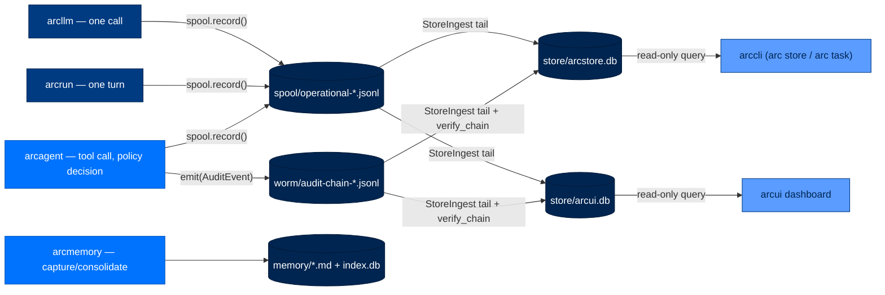
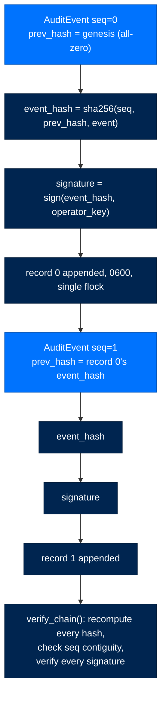
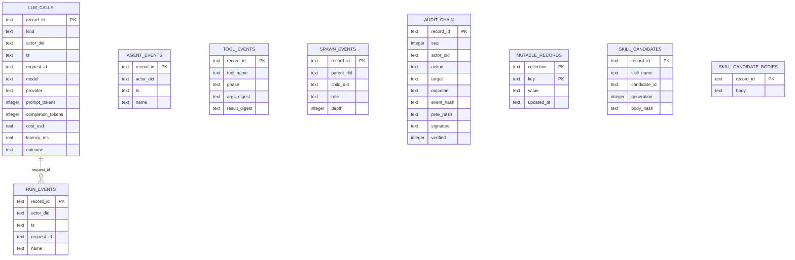
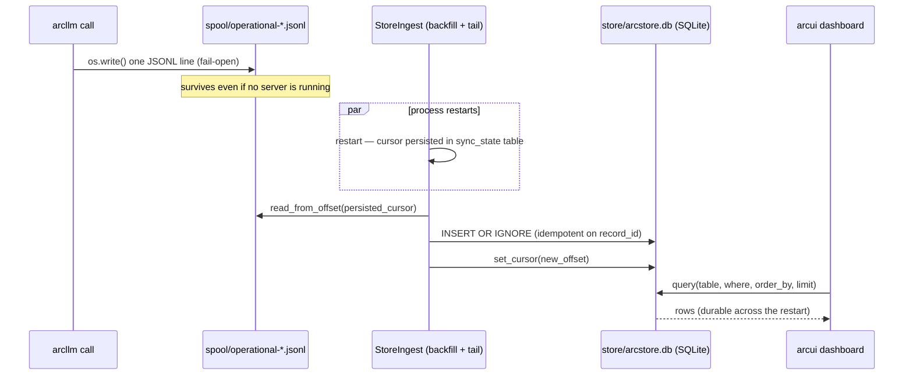

# 8. Where Data Lives — Every Byte Arc Writes

> **Walkthrough**  ·  Understand  ·  page 8 of 14  
> **For** Anyone who needs to understand how Arc works  
> [← 7. The Memory Lifecycle](07-memory-lifecycle.md)  ·  [Docs home](../README.md)  ·  [9. The Workflows →](09-workflows.md)

---

## In one breath

Arc keeps three kinds of records, and each has exactly one home. Anything
that must hold up as legal/compliance evidence — "who did what, signed and
chained so nobody can quietly edit history" — goes into a **WORM audit
chain** owned by `arctrust`. Anything that is routine telemetry — token
counts, run timing, tool calls — goes into an always-on **spool** file that
gets mirrored into a queryable **SQLite database** for the dashboard.
Anything the agent needs to remember about the world — people, facts,
procedures — goes into **markdown files plus a small SQLite index** owned by
`arcmemory`. Every one of these is a plain file on disk under `~/.arc` (or
`/data/.arc` in the Docker image); nothing is hidden in a database only Arc
can read, and nothing requires a running server to be written.

## How it actually works

### The layout on disk

Two independent path roots exist. Both funnel through single resolver
functions so every entry point (arcagent, arcui, arctui, arccli) computes
the same path.

- **`arc_home()`** (`packages/arctrust/src/arctrust/paths.py:16`) — the
 user-wide *config* root: `${ARC_CONFIG_DIR:-~/.arc}`. Holds the operator
 key, the trust store, the default team root, and the shared `arcllm.toml` /
 `arcagent.toml` / `gateway.toml` layer.
- **`resolve_data_dir()`** (`packages/arcstore/src/arcstore/config.py:26`) —
 the arcstore *data* root: `${ARCSTORE_DATA_DIR:-<[arcstore].data_dir>:-~/.arc/store}`.
 Holds the spool, the WORM mirror source, and the SQLite mirrors. Its
 default literally lands one level inside `arc_home()`, at `~/.arc/state/store` —
 and the SQLite mirrors then nest one further `store/` segment inside that
 (`store_db_path()`, `packages/arcstore/src/arcstore/config.py:42`), so the
 fully-resolved default for a mirror DB is `~/.arc/state/store/store/arcui.db`.
 This is a real, verified path shape (three independent call sites agree:
 `arcstore/config.py`, `arcui/observe.py:158`, `arcagent/core/agent.py:203`),
 not a typo in this document.

```text
~/.arc/                                  # arc_home() — user-wide config root
├── arcllm.toml                          # provider/model defaults (shared layer)
├── arcagent.toml                        # agent-runtime defaults (shared layer)
├── gateway.toml                         # embedded gateway: platforms, agent_did
├── arc.env                              # 0600 — viewer/operator tokens, secrets
├── operator/
│   ├── operator.key                     # 0600 — Ed25519 seed, the audit authority
│   └── operator.key.pub                 # 0644 — anti-erasure/anti-swap sentinel
├── trust/
│   ├── operators.toml                   # 0600 — pairing-approver pubkeys
│   └── issuers.toml                     # 0600 — manifest-signer pubkeys
├── team/                                # default team root (arctui/arcui fleet discovery)
│   └── <agent>/                         # one dir per agent — see agent-root tree below
└── store/                               # resolve_data_dir() default — arcstore's data root
    ├── spool/
    │   └── operational-YYYY-MM-DD.jsonl # 0600 — always-on telemetry, daily rotation
    ├── worm/
    │   ├── audit-chain-<agent>.jsonl    # per-agent WORM chain (WormSink, single-writer flock)
    │   └── audit-chain-<agent>.<seq>.jsonl  # rotated segments (100k records / 50MB)
    └── store/
        ├── arcui.db                     # arcui's own SQLite mirror (WAL)
        └── arcstore.db                  # the agent process's own SQLite mirror (WAL)

<agent-root>/                            # e.g. ~/arc/team/<agent>/ or <team-root>/<agent>/
├── arcagent.toml                        # per-agent config (merges over the shared layer)
├── .audit/
│   └── skills.worm                      # skill-improver's own WORM chain
└── workspace/                           # the sandbox the agent's tools actually touch
    ├── identity.md                      # read-only goal charter — agent cannot write it
    ├── context.md                       # sole writer: the workpad module
    ├── policy.md                        # protected — not agent-writable
    ├── capabilities/                    # workspace-scoped tools/skills the agent authored
    ├── skill_traces/<skill>/candidates/ # <id>.md + manifest.json (arcskill improver)
    └── memory/                          # arcmemory's per-agent store (see below)
        ├── index.db                     # SQLite: episodic stream + derived indices
        ├── entities/*.md                # semantic store — one file per entity
        ├── procedures/*.md              # procedural store — one file per skill/routine
        ├── insights/*.md                # insight store — durable lessons
        ├── events/*.md                  # event store — what happened in the user's life
        └── daily-log/*.md               # curated daily summaries (workpad-adjacent)
```

`~/.arcagent/keys/` (config default `identity.key_dir`,
`packages/arcagent/src/arcagent/core/config.py:118`) is a third, separate
root: one `0700` directory holding every agent's DID keypair
(`<did-as-filename>.key` / `.pub`), shared across the box rather than nested
under `team/<agent>/`.

**Deployed (Docker) layout.** `HOME=/data` is load-bearing
(`Dockerfile:8`, `docs/deploy/docker.md`): every default above resolves
under `/data` instead of `~/`, so `arc_home()` → `/data/.arc`,
`resolve_data_dir()` → `/data/.arc/store`, and the agent-root default →
`/data/team/<agent>` (single-node/Docker commonly pass an explicit
`--team-root`, e.g. `/data/team`, rather than relying on `~/arc/team`). The
whole tree lives on one named volume (`arc-data`) — `docker compose down`
keeps it, `docker compose down -v` destroys the agent's identity and memory
permanently (`docker-compose.yml:8-9`).



### The spool — always-on operational telemetry

`packages/arcstore/src/arcstore/spool.py` is the one write path every
arcllm call, arcrun turn, and arcagent action goes through, whether or not
any store, server, or UI is running. Design points, verified against the
code:

- **Filename** — `spool/operational-YYYY-MM-DD.jsonl` (`spool.py:70`), daily
 rotation by UTC date.
- **Append-only, single syscall** — one `os.write()` of a newline-terminated
 line per record (`spool.py:88-95`). `file.write()` is deliberately avoided
 because CPython can split large writes into 4KB chunks, breaking the
 atomicity that makes concurrent appenders safe on a local filesystem.
- **Mode `0600`** — set on open and re-asserted with `os.fchmod` regardless
 of umask or a pre-existing file (`spool.py:38,93-94`).
- **No per-record `fsync`** — the durability contract is explicitly "survives
 a process crash", not "survives an OS crash" (`spool.py:14-15`). Hard
 durability against an OS-level failure is the WORM's job, not the spool's.
- **Fail-open** — a write error is logged and swallowed; telemetry must
 never break the call it is recording (AU-5) (`spool.py:98-99`).
- **`request_id`** — a correlation id bound via `request_context()` for the
 duration of one run (a `contextvars.ContextVar`, so concurrent runs never
 bleed into each other's records); a record that doesn't set its own
 `request_id` inherits the active one (`spool.py:46-63`). arcrun binds it
 exactly once per run, around the loop task's creation — `create_task`
 snapshots the current context, so the id propagates to the loop task and
 any spawned children even after the binding scope exits
 (`packages/arcrun/src/arcrun/loop.py:252-255`).

`SpoolRecord` (`packages/arcstore/src/arcstore/records.py:20`) is one flat,
frozen Pydantic model — metadata only, no prompt/response text by default —
covering five `kind`s: `llm_call`, `run_event`, `agent_event`, `tool_event`,
`spawn_event`. A real `llm_call` line looks like:

```jsonl
{"kind":"llm_call","actor_did":"did:arc:org:josh_agent/ab12cd34","ts":"2026-07-26T14:02:11.503201+00:00","request_id":"c1a5e0f2-...","model":"claude-sonnet-5","provider":"anthropic","agent_label":"josh_agent","prompt_tokens":1820,"completion_tokens":214,"cache_read_tokens":1600,"cache_write_tokens":0,"cost_usd":0.00891,"latency_ms":1342.7,"outcome":"ok","extra":{}}
```

and a `tool_event` line (`records.py:66-79`) carries `tool_name`, a lifecycle
`phase` (`start`/`end`/`error`), and sha256 `args_digest`/`result_digest` —
never the raw arguments or result body, unless `store_raw_bodies` is
explicitly opted in upstream in arcllm. `record_id`
(`records.py:98-108`) is a content-derived sha256 over
`kind|actor_did|ts|request_id|phase|name`, never a byte offset — that is
what makes ingest idempotent (`INSERT OR IGNORE`) safe to replay.

**Where each `kind` actually gets written**, verified at the producer:
`run_event`/`tool_event` come from arcrun's event bus
(`packages/arcrun/src/arcrun/events.py:179-212` `_record_run_event()` —
lifecycle markers are always recorded, routine tool start/end may be
sampled out, but tool **errors are never sampled**); `llm_call` comes from
arcllm's telemetry wrapper (`packages/arcllm/src/arcllm/modules/telemetry.py:924-974`
`_record_spool()`, on by default via `arcstore_enabled`, raw request/response
bodies only when `store_raw_bodies` is set — metadata-only is the
federal/CUI default) and from embedding calls
(`packages/arcllm/src/arcllm/embeddings.py:345-374` `_emit_telemetry()`,
same `llm_call` kind, `completion_tokens=0`).

`request_id` is arcrun's per-run correlation id; arcui's `Observe.timeline()`
(`packages/arcui/src/arcui/observe.py:307-321`) is the concrete place this
join happens — it queries `run_events`/`tool_events`/`llm_calls` separately
by `request_id == run_id` and merges the three streams by timestamp **in
Python**, not a SQL `UNION` (`observe.py:310-311`). `Observe.runs()`
(`observe.py:289-305`) folds the same three tables into one row per
`request_id` for the run list.

`request_id` is arcrun's per-run correlation id; `arcstore.tasks.Task.run_id`
(`packages/arcstore/src/arcstore/tasks.py:120`) is the same value, threaded
through task dispatch so a Mission Control task can be joined to its run's
spool/WORM rows and its `arc stop`/cancellation record
(`packages/arcstore/src/arcstore/cancellations.py:39-49` — a `CancelRequest`
names the target run by `run_id` and/or `session_key`).

### The WORM audit chain — the compliance system of record

`packages/arctrust/src/arctrust/audit.py` owns the durable, tamper-evident
record. There are exactly two sinks today:

| Sink | Durable | Chained | Signed |
|---|---|---|---|
| `NullSink` | no | no | no — discards everything, tests/air-gapped eval only |
| `WormSink` | yes (append-only `0600` file) | yes | yes (Ed25519 or ECDSA-P256) |

`WormSink` is the only sink that matters in production. It replaced an
earlier two-sink split — an unchained `JsonlSink` and an in-memory-only
`SignedChainSink` — and there is **no live push sink** (`UIBridgeSink`) in
the current code: `arcui`'s own comments describe it only as historical
context, and ADR-022 records the decision to delete it (see
`docs/architecture/decisions/ADR-022-storage-split-arctrust-worm-arcstore-operational.md`).
The dashboard reads the durable SQLite mirror instead of receiving a push.

Each `write()` appends one JSON line:

```jsonl
{"seq":417,"event":{"actor_did":"did:arc:org:josh_agent/ab12cd34","action":"tool.call","target":"file_write","outcome":"allow","classification":null,"tier":"personal","request_id":"c1a5e0f2-...","payload_hash":"9f86d0...","ts":"2026-07-26T14:02:11.512Z","extra":{"layer":"tool","rule_id":"R-014"}},"prev_hash":"3b2c...e9","event_hash":"7a91...f0","algorithm":"ed25519","signature":"4e12...ab"}
```

- **`seq`** — monotonic, contiguous from 0 within one chain file.
- **`prev_hash` / `event_hash`** — `event_hash` is a deterministic SHA-256 of
 `(seq, prev_hash, event)` (`audit.py:158-173`), so it commits the link,
 the position, and the content all at once; the next record's `prev_hash`
 equals this record's `event_hash`. `canonical_json()`
 (`packages/arctrust/src/arctrust/canonical.py`) is the shared
 deterministic-serialization primitive (`sort_keys=True`, compact
 separators, ASCII-only) — the same contract signatures bind to everywhere
 in Arc, so a signer and a verifier in different packages never diverge on
 bytes.
- **`signature`** — Ed25519 (personal/enterprise default) or ECDSA-P256
 (FIPS/federal), produced by the deployment's **operator key**
 (`packages/arctrust/src/arctrust/operator.py`) — a notary seed that is
 deliberately *not* an agent identity (no `sign()`, no `did`), so the
 audited subject can never also be the audit authority. `AgentIdentity` and
 `OperatorKey` are different types on purpose.
- **Single-writer** — an exclusive `flock` is held for the sink's lifetime
 (`audit.py:242-253`); a fleet writes one chain file *per agent*
 (`audit-chain-<agent>.jsonl`, `agent.py:203`) rather than sharing one.
- **Crash recovery** — a torn final line from a mid-append crash is
 truncated and an explicit signed `audit.worm.recovery` record is appended
 (`audit.py:256-260`) — silent truncation would be indistinguishable from
 adversarial truncation.
- **Rotation** — at 100,000 records or 50MB, the active file becomes
 `<stem>.<NNN><suffix>` and a fresh active file opens (`audit.py:210-224`).

`verify_chain()` (`audit.py:417-461`) is the lock-free, read-only check: it
recomputes every `event_hash`, checks `prev_hash` linkage, checks `seq`
contiguity from 0, and verifies every signature against the operator public
key. `arc store verify` and `StoreIngest` both call it — `StoreIngest`
stamps each mirrored audit row's `verified` column with the segment's own
verdict (`packages/arcstore/src/arcstore/ingest.py:151-167`).
`read_verified_anchor()` (`audit.py:464-498`) closes the one gap
`verify_chain()` can't see on its own — that records were never *removed
from the head* — by returning the newest signed `trace.checkpoint`; an
optional external `WitnessAnchor`
(`packages/arctrust/src/arctrust/witness.py`) submits that checkpoint to a
second, separately-custodied medium so even a holder of the operator key
cannot retroactively erase the head undetected.



### The SQLite mirror — the queryable read plane

`arcstore` mirrors both durable files into SQLite; it owns no live wire and
is never itself an `emit()` sink (`ingest.py:1-13`). `SqliteBackend`
(`packages/arcstore/src/arcstore/backends/sqlite.py`) opens WAL mode,
`busy_timeout=5000`, and `journal_size_limit=64MB` per connection. Writes go
through `INSERT OR IGNORE` keyed on the content-derived `record_id`, so
at-least-once ingest (backfill from a persisted byte cursor, then tail) can
never duplicate a row.

**Each process instance owns its own DB file** (`sqlite.py:10-11` —
`SQLITE_BUSY` storms above ~2-3 concurrent writers on one file): the agent's
own `StoreIngest` writes `store/arcstore.db`
(`packages/arccli/src/arccli/commands/agent/_store_lifecycle.py:93`); arcui
runs a second, independent `StoreIngest` into its own `store/arcui.db`
(`packages/arcui/src/arcui/observe.py:158-166`). Both tail the *same*
spool + WORM files; neither reads the other's mirror.



`MUTABLE_RECORDS` (`mutable_records`,
`packages/arcstore/src/arcstore/backends/base.py:37`) is structurally
different from the five operational tables: those are insert-once (spool
replay), this one is overwritten in place — one JSON blob per
`(collection, key)`. It is the directory plane behind three domains that are
real mutable state, not logs:

- **Tasks** (`packages/arcstore/src/arcstore/tasks.py`) — Mission Control.
 `Task` (`tasks.py:102-150`) carries `id`, `title`, `status`
 (`backlog`/`todo`/`in_progress`/`review`/`done`/`failed`), `priority`,
 `owner_did`, `creator_did`, `parent_id` (DAG deps), `run_id`,
 `blocked_by`, `attempts`/`max_attempts`/`last_error` (reliability),
 `cancel_requested` (kill switch), `requires_review` (HITL gate), and
 `classification`. Free-text fields are sanitized against prompt-injection
 patterns and (tier-gated) URL/email patterns at construction
 (`tasks.py:79-99`).
- **Approvals** (`packages/arcstore/src/arcstore/approvals.py`) — the
 mechanical operator-approval directory. `PendingApproval`
 (`approvals.py:33-64`) records a blocked trifecta-completing call: `tool`,
 `legs`, `call_hash` (binds a later grant to exactly this call),
 redacted `arguments`/`provenance` for operator triage, and — once
 resolved — the operator-signed `grant` in wire form. Approval never
 travels over agent chat; a prompt-injected message can't forge it.
- **Cancellations** (`packages/arcstore/src/arcstore/cancellations.py`) —
 the operator kill switch. `CancelRequest` (`cancellations.py:35-66`)
 names a live run by `run_id` and/or `session_key`, carries
 `requested_by` for attribution, and requires at least one identifier at
 construction.

All three reuse `TaskStore`'s race-safe `update_if` claim pattern (an atomic
`UPDATE... WHERE` under `BEGIN IMMEDIATE`) so two concurrent operators or
watcher ticks can never both win a claim.



### Memory on disk — glass-box markdown + a disposable index

`arcmemory` owns a store separate from `arcstore` by design — `arcstore` is
a closed 5-kind operational spool with no full-text or vector search and no
per-scope store object (`packages/arcmemory/src/arcmemory/db.py:1-8`); it
cannot host recall. Each agent workspace gets its own
`<workspace>/memory/index.db` — hard shared-nothing isolation. Every table
in that DB is disposable and re-derivable from the glass-box markdown plus
the raw episodic stream (`index/rebuild.py`); the markdown is the durable
truth.

`sqlite-vec` is an optional extension (`db.py:20-48`): its absence is
detected and logged, and retrieval degrades to BM25 + graph rather than
raising — but degrades **silently** unless something is watching for it, a
known operational trap (see `docs/07-memory-lifecycle.md`).

Curated stores (`packages/arcmemory/src/arcmemory/mdfile.py`) are plain
YAML-frontmatter markdown, written with `atomic_write_text()` (temp file +
`os.replace`) so a reader never sees a half-written file. A real insight
card looks like:

```markdown
---
id: telegram-adapter-crashes-startup
trigger: telegram network blip during agent startup
cues:
  - lifespan aborts with status 000 despite adapter reporting active
instances:
  - '2026-06-14T09:12:00Z'
classification: unclassified
confidence: 0.8
salience: 0.6
status: active
hits: 3
---

# telegram-adapter-crashes-startup

## Statement
A Telegram network blip aborts the whole arcui lifespan; restart once the
network recovers rather than treating it as a regression.
```

(Fields verified against `hygiene.py`'s `_build_insight_doc` /
`_build_entity_doc` / `_build_procedure_doc` — the same shape the
consolidation and dedup passes write.) Entities add `name`, `entity_type`,
`links_to`; procedures add `slug`, `title`, `when_to_use`, `use_count`.

### The agent workspace — who owns which file

| File | Writer | Reader |
|---|---|---|
| `identity.md` | operator, at agent creation | agent (read-only — `session_internal/context.py:33`, `modules/planning/_runtime.py:178`); the tool-write guard blocks the agent from touching it (`tools/_validation.py:23`) |
| `context.md` | **only** the workpad module's background eval-model call (`modules/workpad/__init__.py:3-5`) | injected into every system prompt |
| `policy.md` | operator | policy pipeline, TOFU layer; agent-write blocked (`tools/_validation.py:23`) |
| `capabilities/` | agent (self-authored tools, TOFU-gated) | tool loader |
| `memory/` | `arcmemory` (capture/consolidate/hygiene) | `arcmemory` retrieval, arcui memory screen |
| `skill_traces/<skill>/candidates/` | arcskill improver | `StoreIngest` (mirrors to `skill_candidates`/`skill_candidate_bodies`) |

### Keys and secrets

| Credential | Location | Mode | Custody |
|---|---|---|---|
| Agent DID keypair | `~/.arcagent/keys/<did>.key` / `.pub` (`config.py:118`) | `0700` dir, key file secured on read | In-process seed by default; `vault_resolver` seam (`packages/arcagent/src/arcagent/core/vault_resolver.py`) resolves from Azure KV / file / env backends instead when `[vault].backend` is set |
| Operator key (audit authority) | `~/.arc/state/operator/operator.key` (+ `.pub` sentinel) | `0600`, `O_NOFOLLOW`, owner-uid checked, parent dir `0700` (`operator.py:228-254`) | In-process by default; `Signer` seam supports `VaultSigner`/`FileNotaryTransit` custody where the seed never enters the agent process (`packages/arctrust/src/arctrust/signer.py`) |
| Trust store (pairing/manifest pubkeys) | `~/.arc/state/trust/operators.toml`, `issuers.toml` | must be `0600` or `TrustStoreError` | Public keys only — no private material |
| Viewer/operator UI tokens | `~/.arc/config/arc.env` | `0600` | Minted once, pinned for the volume's life |

**Reconciling the "credentials never touch the filesystem" rule with the
code, honestly**: the on-disk `0600` operator key and agent key files are
the documented *interim* posture for personal/enterprise
(`operator.py:32-35` says so explicitly), not a violation nobody noticed.
The `VaultBackend` Protocol (`packages/arcagent/src/arcagent/core/vault/protocol.py`)
and the `Signer`/`VaultTransit` seam
(`packages/arctrust/src/arctrust/signer.py`) are the compliant path — file,
env, and Azure Key Vault backends exist today
(`packages/arcagent/src/arcagent/core/vault/backends/`); federal deployments
are expected to resolve every seed through one of those rather than the
`0600` file, but nothing in the code *forces* that choice below federal
tier. Document the gap, don't paper over it.

### Config files

The 3-file split (`arcllm.toml` / `arcrun.toml` / `arcagent.toml`) and their
merge precedence are covered in full in
[12-configuration.md](12-configuration.md); this section only locates them.
Each family exists at two possible layers, deep-merged
(`packages/arcagent/src/arcagent/core/config.py:675-688`): user-wide
(`arc_home()/<file>.toml`) and per-agent (`<agent_root>/<file>.toml`).
Provider descriptor tomls and blueprints are covered there too.

### Retention and deletion — no erasure in the compliance record

`packages/arcllm/src/arcllm/trace_retention.py` purges **whole rotated
files**, never individual lines: files older than `max_age_days` are
deleted outright, then the oldest remaining rotated files are deleted until
the directory is under `max_bytes`. Today's live file is always excluded
from purge (`trace_retention.py:56-67`). This is deliberately coarse — the
module's own docstring is explicit that a hash chain "cannot distinguish a
policy purge from a malicious truncation of the head," which is exactly why
`build_checkpoint()` / `verify_against_anchor()` exist: retention only ever
removes the *oldest* files, so the most recently anchored checkpoint always
survives a legitimate purge, and a rollback past the last anchor is what
gets flagged.

There is no crypto-shred or per-record right-to-erasure path for the WORM
audit chain or the operational spool/mirror — by design. GDPR/CCPA
right-to-erasure and NIST AU-9/10/11 (protection of audit information,
non-repudiation, retention) are in direct tension for a signed hash chain:
deleting or mutating one record breaks every subsequent link. The ruling is
retention-purge-only for that store.

This is distinct from — and should not be confused with —
`arcagent.modules.user_profile.tombstone`
(`packages/arcagent/src/arcagent/modules/user_profile/tombstone.py`), which
*does* implement a GDPR right-to-be-forgotten workflow, but scoped to a
different data class: it deletes the `user_profile/<did>.md` file, redacts
the literal DID string field-wise out of session JSONL transcripts, and
retains only a `sha256(user_did)` tombstone for compliance proof
(`tombstone.py:1-24`). It never touches the WORM chain or the arcstore
spool/mirror — those stay append-only and unredacted.

### Which store do I write to?

| Kind of fact | Store | Why |
|---|---|---|
| "This tool call happened, here's proof, don't argue with me later" | WORM (`arctrust.emit()`) | Signed, hash-chained, single system of record for compliance |
| "This LLM call cost $X and took Yms" | Spool (`arcstore.spool.record()`) | Routine telemetry; always-on, no server dependency |
| "Show me this in the dashboard, joined/filtered/sorted" | arcstore SQLite tables | Query surface over the two durable files, never a source of truth itself |
| "A task/approval/cancellation exists and its state changes" | `mutable_records` (Task/Approval/Cancel stores) | Overwritten-in-place directory state, not an append log |
| "The agent should recall this fact/procedure/lesson later" | `arcmemory` (markdown + `index.db`) | Per-agent, shared-nothing, degrades gracefully without an embedder |
| Anything else | **Never** a new parallel channel | Every producer routes through one of the above four; a fifth channel is exactly the bug ADR-022 closed |

## Where to look in the code

| Path | What lives there |
|---|---|
| `packages/arctrust/src/arctrust/paths.py` | `arc_home()` — the config-root resolver every package shares |
| `packages/arcstore/src/arcstore/config.py` | `resolve_data_dir()`, `store_db_path()`, `ArcStoreConfig` |
| `packages/arcstore/src/arcstore/spool.py` | The always-on JSONL recorder, `request_context()` correlation |
| `packages/arcstore/src/arcstore/records.py` | `SpoolRecord` — the five telemetry kinds, `record_id` derivation |
| `packages/arcstore/src/arcstore/ingest.py` | `StoreIngest` — backfill + tail spool/WORM/skill-candidates into SQLite |
| `packages/arcstore/src/arcstore/backends/sqlite.py` | `SqliteBackend` — WAL, idempotent upsert, mutable-plane primitives |
| `packages/arcstore/src/arcstore/backends/base.py` | `StorageBackend` Protocol, table name constants |
| `packages/arcstore/src/arcstore/query.py` | Read API arcui/arctui call — never a raw backend driver |
| `packages/arcstore/src/arcstore/tasks.py` | `Task` model + `TaskStore` (Mission Control) |
| `packages/arcstore/src/arcstore/approvals.py` | `PendingApproval` + `ApprovalStore` (mechanical HITL) |
| `packages/arcstore/src/arcstore/cancellations.py` | `CancelRequest` + `CancelStore` (kill switch) |
| `packages/arctrust/src/arctrust/audit.py` | `AuditEvent`, `WormSink`, `verify_chain()`, `emit()` |
| `packages/arctrust/src/arctrust/canonical.py` | The deterministic-JSON contract signatures bind to |
| `packages/arctrust/src/arctrust/witness.py` | External witnessing of the operator-signed head |
| `packages/arctrust/src/arctrust/operator.py` | `OperatorKey` — the audit-authority credential, fail-closed load |
| `packages/arctrust/src/arctrust/keypair.py` | Ed25519 primitives every identity op builds on |
| `packages/arctrust/src/arctrust/signer.py` | `Signer` seam — in-process vs. vault-transit custody |
| `packages/arctrust/src/arctrust/trust_store.py` | Operator/issuer pubkeys for pairing + manifest verification |
| `packages/arctrust/src/arctrust/classification.py` | The `Classification` ladder + `dominates()` |
| `packages/arcllm/src/arcllm/trace_retention.py` | Whole-file retention purge + checkpoint anchoring |
| `packages/arcmemory/src/arcmemory/db.py` | `MemoryDB` — per-agent `index.db`, optional `sqlite-vec` |
| `packages/arcmemory/src/arcmemory/mdfile.py` | Atomic frontmatter markdown read/write |
| `packages/arcmemory/src/arcmemory/hygiene.py` | Dedup/merge drivers — the real frontmatter shapes per store |
| `packages/arcagent/src/arcagent/core/vault_resolver.py` | Vault backend instantiation from config |
| `packages/arcagent/src/arcagent/core/vault/` | `VaultBackend` Protocol + file/env/Azure backends |
| `packages/arcagent/src/arcagent/modules/workpad/` | Sole writer of `context.md` |
| `packages/arcagent/src/arcagent/modules/user_profile/tombstone.py` | GDPR erasure for profile data (not the WORM chain) |
| `docs/architecture/decisions/ADR-022-storage-split-arctrust-worm-arcstore-operational.md` | The decision record for this whole split |

If you're adding a new kind of durable fact: decide compliance-evidence vs.
telemetry vs. directory-state vs. agent-knowledge first, using the table
above, then add a field to the matching existing model — do not open a
sixth storage concern.
