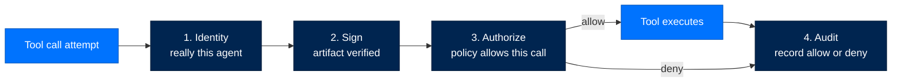
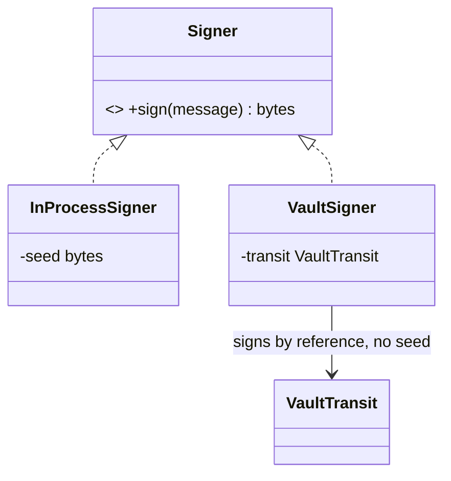
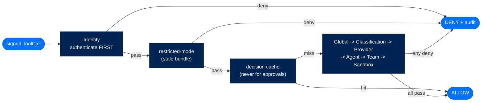
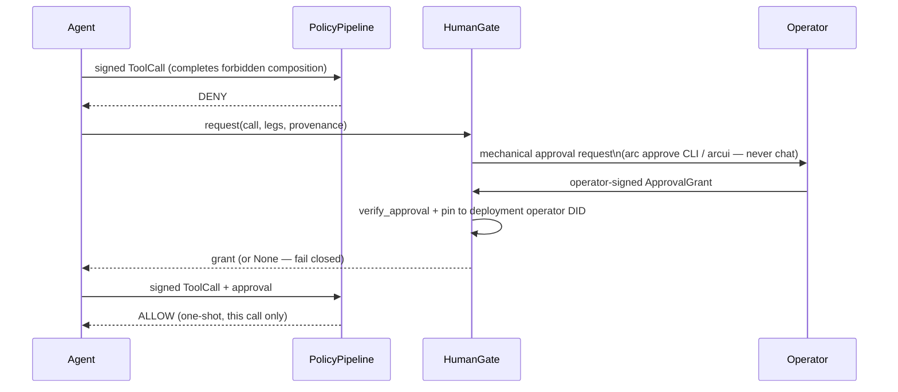
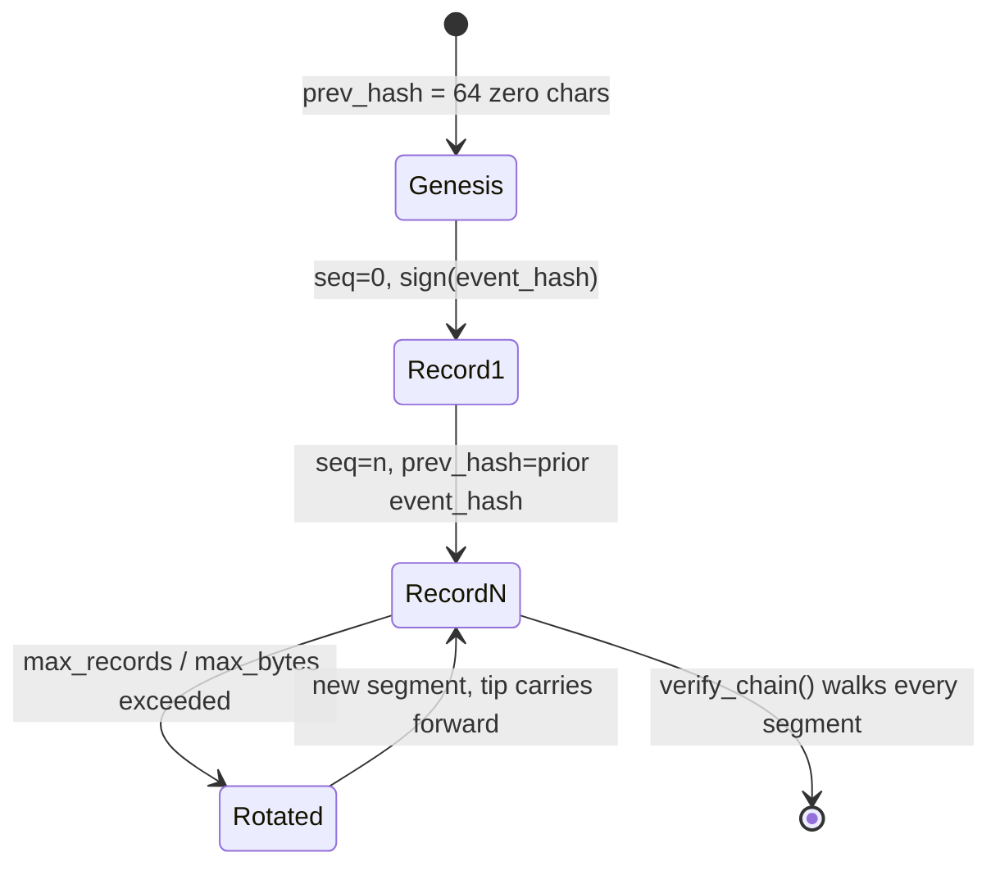

# 10. The Security Model — Identity, Signing, Authorization, Audit

> **Walkthrough**  ·  Understand  ·  page 10 of 14  
> **For** Anyone who needs to understand how Arc works  
> [← 9. The Workflows](09-workflows.md)  ·  [Docs home](../README.md)  ·  [11. Extension Points →](11-extension-points.md)

---

## In one breath

Every Arc agent carries a cryptographic ID card it cannot forge (**Identity**).
Every piece of code it loads — a skill, a tool, a sandbox backend — carries a
signature checked again at the moment it's used, not just at install time
(**Sign**). Every action it tries to take passes through a guard that can say
no, and the guard's default answer to "something went wrong while deciding"
is no, never yes (**Authorize**). Everything that happens — allowed or
denied — is written to a logbook nobody, not even the machine's owner, can
quietly edit after the fact (**Audit**). These four guarantees are not a
"federal mode" you switch on; a hobbyist's laptop agent gets them exactly like
a national-lab deployment does. What changes between the two is only how
strict the settings are. The floor itself never moves.

---

## The Four Pillars are universal, not federal-mode features

This is the most commonly misunderstood thing about Arc, stated first because
it governs everything below: [ADR-019](https://github.com/joshuamschultz/Arc/blob/main/.claude/architecture/decisions/ADR-019-four-pillars-universal.md)
declares Identity, Sign, Authorize, and Audit **non-optional defaults at every
tier**. Earlier code drifted toward gating these behind `tier == "federal"` —
`UnsafeNoOp` bypasses, `skip_sandbox=True`, `require_manifest =
(tier == "federal")`, empty allowlists treated as allow-all. ADR-019 named
and removed eight such bypasses. Security no longer depends on a config flag
left in the wrong position.

**Tier is stringency metadata, not a gate.** A personal-tier agent still has
a DID, still signs its artifacts, still runs a policy pipeline, still emits
audit events.

| Knob | Personal | Enterprise | Federal |
|---|---|---|---|
| Trusted signers | self-signed OK + audit warn | operator-chain | operator-chain (FIPS) |
| Policy layers | Identity + Global (2) | + Classification/Provider/Agent/Sandbox (6) | + Team (7, all layers) |
| Dynamic tool creation | allowed | approval gate | denied |
| Signing algorithm | Ed25519 | Ed25519 | ECDSA-P256 (FIPS floor) |
| Approval-required tools | opt-in only | every plain tool | every tool and skill |

---

## Pillar 1 — Identity

Every agent has a DID minted from an Ed25519 keypair; `ArcAgent.__init__`
requires one. Primitives live in `packages/arctrust/src/arctrust/identity.py`
and `keypair.py`. Format: `did:arc:{org}:{type}/{hash}`, where `hash` is the
first 8 hex chars of `sha256(public_key)` — deterministic, so
`did_matches_pubkey` can check a presented key against a claimed DID
(`identity.py:73`). Key files must be `0600`; `AgentIdentity.load_keys`
rejects group/other-readable files outright.

`AgentIdentity.from_config` (`identity.py:324`) is the boot path every agent
runs: an existing `did` in `arcagent.toml` loads the matching key from disk
or vault; an empty one generates a fresh keypair, saves it, and writes the
DID back into the config. Identity is never silently absent.

**Child identities** (spawned sub-agents) are *derived*, not independent:
`derive_child_identity` (`identity.py:443`) runs HKDF-SHA256 over the
parent's seed and a per-spawn nonce — unpredictable without the parent's
private key (ASI-03), and clearance narrows monotonically
(`child_clearance = min(requested, parent_clearance)`; a child can never
out-clear its parent).

**Signed tool calls.** Identity rides on every dispatch, not just at
construction. `arctrust.policy.ToolCall` (`policy.py:123`) carries
`agent_did`, `public_key`, `signature`; `verify_call` (`policy.py:372`)
requires all three, fail-closed: the pair is present, the key's fingerprint
matches the claimed DID, and the signature verifies over `signing_bytes()`.
`packages/arcagent/src/arcagent/core/tool_registry.py:491` signs every
dispatched call with the agent's own identity before it reaches the policy
pipeline — the "no run without a verified agent key" invariant is wired, not
aspirational.

> ⚠️ **Not yet unified:** `arcllm`'s `SecurityModule`
> (`packages/arcllm/src/arcllm/modules/security.py`) has its own
> request-signing path for provider calls, separate from the agent's
> tool-dispatch identity. CLI-issued `arc...` commands authenticate as the
> local OS user via file permissions, not a per-invocation signed `ToolCall`.

**TOFU (Trust On First Use)** answers "should this artifact be allowed to
run," a different question from "is it authentically signed."
`arctrust.tofu.TofuLayer` (`tofu.py`):

| Tier | Rule |
|---|---|
| Personal | Signed by the agent's own pinned key → allow. Unsigned → gated by `auto_run_agent_code`. |
| Enterprise | Unknown name → `NEW_SIGHTING` (human approves). Known + matching hash → allow. Known + drifted hash → deny (tamper). |
| Federal | Unsigned → deny outright. Signed → same human-approval gate as enterprise; self-signing attributes, never authorizes. |

Pins persist in `[security.validators]` in `arcagent.toml`
(`validators.py`) — write-only by a human via `arc trust approve`, never by
the agent. The **trust store** (`trust_store.py`) resolves DID → public key
against `0600` `~/.arc/trust/{operators,issuers}.toml`, backing operator
pairing signatures and backend-manifest issuer signatures.

---

## Pillar 2 — Sign

Every loaded artifact — skill, extension, sandbox backend, pairing, agent-
authored capability — is verified **at load**, independent of any
install-time check. No `UnsafeNoOp`, no `skip_sandbox`, no
`require_manifest = federal-only`.

`packages/arctrust/src/arctrust/signer.py` defines one `Signer` Protocol,
custody selected by config, never by tier: **`InProcessSigner`** holds the
seed in memory (Ed25519 or ECDSA-P256; personal/enterprise default);
**`VaultSigner`** signs *by reference* through a `VaultTransit` boundary
(Vault Transit, a PKCS#11 HSM, cloud KMS, or the reference
`FileNotaryTransit`) — the seed never enters this process. `build_signer`
fails closed: `vault_transit` custody with no transit client is a hard error,
never a silent in-process fallback.

**Detached artifact signatures** (`artifact.py`): a `.arcsig` sidecar over a
content SHA-256 digest, signer DID, public key, and Ed25519 signature.
`verify_artifact` re-checks digest + signature + (when pinned) key identity
at load. A valid signature proves the bytes are unmodified since the signer
wrote them — it proves nothing about *safety*, which is TOFU's and the
sandbox's job. `canonical.py`'s `canonical_json` (sorted keys, no whitespace,
ASCII-only) is the shared deterministic-serialization contract structured
payloads sign over — checkpoint signing (`arcagent/tools/checkpoint_signing.py`),
arcllm request signing (`arcllm/_signing.py`), and backend manifest
verification (`arcrun/backends/_verifier.py`) all import it directly — as does
the WORM chain's own `_canonical_event_hash` (`arctrust/audit.py:158`). One
serializer, one byte form, every signature in the stack.

**The operator key** (`operator.py`) is the deployment's audit-signing
authority — deliberately *not* an `AgentIdentity` (no `sign`, no `did`
exposed), so an actor holding an agent's DID seed cannot re-sign the audit
trail and have `verify_chain` still pass. Custody is hardened: **no silent
regeneration** (a missing key with a recorded `.pub` sentinel or existing
chain fails closed — `OperatorKeyIntegrityError` — rather than minting a
replacement that orphans every prior chain); **atomic, symlink-safe
bootstrap** (`O_CREAT|O_EXCL` + `O_NOFOLLOW`); **swap detection**
(`_verify_recorded_pubkey` fails closed on a fingerprint mismatch).

> ⚠️ The `0600` on-disk operator key is the *interim* posture for
> personal/enterprise (`CLAUDE.md` says credentials never touch the
> filesystem). The `vault_resolver` seam is the compliant path; federal
> should resolve the seed from a vault/HSM so it never materializes on disk.

**FIPS floor** (`fips.py`): at federal (`require_fips=true`), refuses to run
a protected crypto function unless the loaded OpenSSL is itself
FIPS-140-3-validated *and* the algorithm is FIPS-approved. Only `ecdsa-p256`
and `aes-256-gcm` qualify — Arc's Ed25519 (PyNaCl/libsodium) has no CMVP
path, so federal forces ECDSA-P256 for signing.

**No unsigned load paths, with one documented gap:** sandbox backends
(`packages/arcrun/src/arcrun/backends/loader.py`) — only built-in `local`/
`docker` are trusted without a manifest; anything else needs a signed
`allowed_backends` manifest at **every** tier, and third-party `setuptools`
entry points are permanently disabled at every tier (not just federal).
Skills from the hub go through a full pipeline, not just a signature check —
`packages/arcskill/src/arcskill/hub/installer.py`'s module docstring names it
explicitly: **quarantine → fetch → verify signature (Sigstore/cosign + Rekor
inclusion proof + SLSA attestation, `hub/verify.py`) → CRL check → scan
(regex + AST + semgrep + bandit) → dry-run sandbox (Firecracker/Docker) →
activate → lock → audit.** `verify.py` is fail-closed at federal (missing
`sigstore` package raises `SigstoreUnavailable`) and skip-with-warning below
federal. Before any agent-authored or hub-sourced Python reaches that scan
stage, `packages/arcskill/src/arcskill/hub/_ast_scanner.py` AST-walks for
`eval`, `exec`, `compile`, `__import__`, and dynamic `importlib` calls a
regex bank can't reliably distinguish from an innocuous string literal.
Prompt overlays are pinned to the operator key (see
[`docs/06-prompts-tools-skills.md`](06-prompts-tools-skills.md)).

> ⚠️ **Real, currently-scoped exception to "every artifact is verified":**
> gateway platform adapters (`packages/arcgateway/src/arcgateway/adapters/registry.py`)
> are trust-gated by an `OFFICIAL_ADAPTERS` name allowlist, not a signature.
> The module's own docstring names this as the future attach point for
> Sigstore/arctrust verification — not present today. A non-allowlisted
> adapter loads with an audit warning at personal/enterprise and is blocked
> outright at federal (`registry.py:232`), so the tier floor still holds, but
> the "Sign" pillar's cryptographic verification does not yet reach this
> loader. Document it as a known gap, not silently as covered.

---

## Pillar 3 — Authorize

`arctrust.policy.PolicyPipeline` (`policy.py:963`) evaluates every tool call.
**First-DENY-wins. Fail-closed on exceptions** — a raising layer becomes a
DENY, never a skip (`_eval_layer`, `policy.py:1076`).

| Tier | Layer order | Layer count |
|---|---|---|
| Personal | Identity, Global | 2 |
| Enterprise | Identity, Global, Classification, Provider, Agent, Sandbox | 6 |
| Federal | Identity, Global, Classification, Provider, Agent, Team, Sandbox | 7 |

> ⚠️ **Correction to `CLAUDE.md`:** it says "all 5 policy layers" at federal.
> There are **seven** layer classes in `policy.py` — `IdentityLayer` (:546),
> `GlobalLayer` (:600), `ClassificationLayer` (:651), `ProviderLayer` (:718),
> `AgentLayer` (:809), `TeamLayer` (:838), `SandboxLayer` (:913) — and
> `build_pipeline` (:1202) assembles all seven at federal, per the tier table
> above. `PolicyLayer` itself is a `Protocol` (:341): `name: str` plus
> `async def evaluate(call, ctx) -> Decision`. Use the per-tier count (2/6/7),
> not "5," when describing tier stringency.

- **Identity** — SSH-key invariant (signed by the DID's own key holder); ent/fed also require pre-registration. Runs first and unconditionally (`policy.py:1026`) — every other layer only evaluates after an authenticated call.
- **Global** — tenant-wide denylist + the forbidden-composition check (lethal trifecta, below).
- **Classification** — Bell-LaPadula no-read-up via `classification.dominates`.
- **Provider** — LLM token/cost/rate budget ceiling (LLM10).
- **Agent** — per-agent tool allowlist. **Team** (federal only) — delegation scope never exceeds its grant.
- **Sandbox** — required vs. available isolation (`host < container < vm`); denies an unverified/dynamic tool.

**Configured-gate fail-closed, not blanket fail-closed.** Classification,
Provider, and Sandbox share one pattern: **unconfigured → no-op allow**;
**configured but its runtime state is missing → deny**. Concrete evidence,
not just description — `ProviderLayer.evaluate` (`policy.py:743`): `if not
self._limits: return Decision.allow(...)` when no budget is configured, but
once limits *are* configured and `ctx.provider_usage` is `None`, it returns
`Decision.deny(..., rule_id="provider.state_missing",...)` (`policy.py:747`
-761). `ClassificationLayer` mirrors this at `policy.py:674`-691 (`ctx.clearance
is None` → allow unless `enforced`), and `SandboxLayer` at `policy.py:926`-932
(`ctx.tool_runtime is None` → allow). This is deliberate — a blanket "fail
closed on any missing state" rule once bricked enterprise and federal by
default, because several state producers ( usage telemetry, 
isolation status) aren't wired everywhere yet. An unconfigured deployment
behaves as if the layer didn't exist; a deployment that *does* turn on a real
budget gets a genuine floor the moment its meter goes blind.

> ⚠️ **Unverified:** whether `PolicyContext.provider_usage` is populated for
> every LLM call path today, or only some, was not independently re-checked
> for this document — confirm current wiring before treating `ProviderLayer`
> as a hard ceiling everywhere.

Authentication runs **before** the restricted-mode short-circuit and the
decision cache (`policy.py:1014`) — an unsigned call can never ride a
safe-set or cached ALLOW. The cache key binds to the signature fingerprint,
and an approval-bearing call is never cached (`_cache_key`, `policy.py:1121`).
`PolicyPipeline.evaluate` emits a `policy.evaluate` audit event
unconditionally, for an ALLOW exactly as for a DENY (`_emit_audit`,
`policy.py:1163`-1192, called from every exit path at :1028/:1034/:1046/:1064) —
audit coverage is not a deny-only afterthought.

**A DENY does not abort the agent's turn.** `PolicyDenied`
(`packages/arcagent/src/arcagent/core/tool_policy.py:59`) carries the full
`Decision` and is raised by tool dispatch on a non-trifecta deny
(`tool_registry.py:361`). `arcrun`'s generic per-tool exception handler
(`packages/arcrun/src/arcrun/executor.py:105`-117) catches it like any other
tool exception and converts it to a tool-result string —
`"Error: PolicyDenied:..."` — fed back to the model. The loop continues; the
model sees the denial and adapts or explains, rather than the run halting.

**Operator approval grants.** `ApprovalGrant` (`policy.py:100`) is a one-shot
token unlocking exactly one forbidden composition for exactly one call.
`verify_approval` (`policy.py:517`) requires, fail-closed: `approver_did` is
not the agent's own (ASI09); `call_hash` matches this exact call;
the presented key matches the claimed approver DID; the signature verifies.
`OperatorApprovalAuthority` derives the same `approver_did` from any `Signer`
regardless of which surface mints it (in-process gate, `arc approve` CLI,
arcui action) — what lets `HumanGate` pin a grant to the deployment operator.

---

## The Lethal Trifecta gate

Private data + external comms + untrusted input, together, is an
exfiltration primitive (Simon Willison). Arc models it as a **context-
resolved three-leg accumulator**:
`packages/arcagent/src/arcagent/core/session_internal/capability_ledger.py`.

| Leg | Resolution |
|---|---|
| `private_data` | Any on-machine read — `file_read`, `memory`, `recall`, `user_profile`. |
| `external_comms` | Pushing agent-chosen content to an agent-chosen sink — `network_egress`, messaging, notify. Reads (web/browser) do **not** count. |
| `untrusted_input` | Unvetted ingested content this session — `web`, `browser`, `browser_task`, `extract`, `subprocess`. |

`legs_for_call` (`capability_ledger.py:149`) applies one exemption: delivery
**only** to the operator's own paired channel (`user://operator`) drops the
`external_comms` leg — the operator's own inbox isn't exfiltration; any
non-owner or mixed recipient keeps it. `SessionCapabilityLedger` accumulates
legs per session (shared-nothing across sessions/agents) with a
`ProvenanceEntry` per contributing call, so a block is explainable leg-by-leg.

> ⚠️ **Shipped stopgap, by design:** web/browser reads tag `untrusted_input`
> only. `external_comms` is deliberately not re-added to them — a GET to a
> search provider isn't "push to an agent-chosen sink," and tagging it as
> egress would spuriously trip the gate on ordinary research. Do not naively
> re-add it without re-deriving why it was scoped out.

Personal tier trusts the web with a denylist; federal requires an explicit
allowlist (see [`docs/05-steering-and-strategies.md`](05-steering-and-strategies.md)).

When the accumulated union completes a configured `forbidden_compositions`
set, `GlobalLayer` (`policy.py:600`) denies with
`global.forbidden_composition` unless the call already carries a verified
grant. `tool_registry.py`'s `_resolve_forbidden_composition` (`:343`-382) is
the precise mechanism: on any deny whose `rule_id` is
`global.forbidden_composition` (any other deny raises `PolicyDenied`
immediately), it awaits `HumanGate.request`, and only re-raises `PolicyDenied`
if the gate returns `None` (denied/timeout) or the approved call, re-submitted
to the pipeline, still comes back denied. `packages/arcagent/src/arcagent/tools/human_gate.py`
is what turns the intervening pause into an operator round-trip:

- **Fail closed** on no channel, timeout, or channel error.
- **Never through chat** — the docstring is explicit: a mechanical,
 operator-authenticated surface only, because chat could be prompt-injected
 or forged.
- **Pinned to the deployment operator**, not just any non-agent key —
 `grant.approver_did == self._operator.did` is what makes the gate
 spoof-proof against a foreign keypair minting its own "valid" approval.
- Personal/enterprise may auto-approve **named, exact-match** compositions
 (a subset match is rejected — it could green-light a wider set than named);
 federal never auto-approves.

A second, independent gate covers proactive human-in-the-loop for named
tools regardless of trifecta state
(`packages/arcagent/src/arcagent/tools/approval_policy.py`): federal requires
approval for every tool and skill, enterprise for every plain tool, personal
for opt-ins only — both resolve through the same `HumanGate`.

---

## Pillar 4 — Audit

Every security-relevant action emits an `AuditEvent` through one function:
`arctrust.audit.emit(event, sink)` (`audit.py:506`), which swallows **all**
sink exceptions per NIST AU-5 — a broken sink must never break the audited
operation. This is a genuine design tension, not a rounding error: the audit
*chain* is tamper-evident once a record lands, but `emit()` guarantees
nothing about whether a given call's record lands at all if the sink itself
is failing. A reviewer should ask about this trade rather than assume it away.

`AuditSink` (`audit.py:122`) is a one-method `Protocol` —
`write(event: AuditEvent) -> None`. Exactly **two** implementors exist in the
tree today: `NullSink` (`audit.py:137`, discards everything — tests/air-gapped
eval) and `WormSink` (`audit.py:176`, the durable chain, below). "Single
emission point, sinks fan out" currently means "single emission point, one
durable sink" — there is no multi-sink fan-out in the code as written.

> ⚠️ **Correction to `CLAUDE.md` / ADR-019 wording:** they describe the sink
> fan-out as `JsonlSink` + `SignedChainSink` + `arcui.bridge.UIBridgeSink`.
> None of those classes exist in the current tree. `audit.py`'s own docstring
> confirms they were **replaced** by a single sink, `WormSink` ("replaces the
> old unchained JsonlSink and the in-memory-only SignedChainSink"). There is
> no `arcui.bridge` module. The live-observability path is
> `packages/arcui/src/arcui/audit.py`'s `UIAuditLogger` (log + OTel span,
> ephemeral) plus `MutationWormWriter` (a second, independent `WormSink`
> instance feeding the Security screen's ingest).

**`WormSink`** (`audit.py:176`) is the compliance system of record: each
`write()` appends `{seq, event, prev_hash, event_hash, algorithm, signature}`
to an append-only `0600` file. `event_hash = SHA-256(seq, prev_hash, event)`
(`_canonical_event_hash`, `audit.py:158`-173), and that hash is what gets
Ed25519/ECDSA-signed (`_append`, `audit.py:290`-291) — the signature commits
to the link and the position, not just the content.

- **Restart-safe** — tip/seq recovered from the file tail, not memory-only.
- **Tamper-evident** — `verify_chain` checks hash links, signatures, `seq`
 contiguity from zero, and the genesis anchor.
- **Single-writer** — an exclusive `flock`; a second writer on the same file
 raises rather than forking the chain.
- **Crash-recoverable** — a torn final line is truncated and an explicit
 signed `audit.worm.recovery` record appended.
- **Fail-open on write** (AU-5), **fail-closed on the signer's identity**
 (`OperatorKey.load`, above).

`verify_chain(path, public_key,...)` (`audit.py:417`) is the lock-free read
path — no write lock needed — used by `arc store verify`
(`packages/arccli/src/arccli/commands/store.py`, `--pubkey`/`--did`, non-zero
exit on tamper). Tampering is also caught on a second, independent read path:
`packages/arcstore/src/arcstore/ingest.py` — a pure file-tailer that owns no
sink of its own — re-runs `arctrust.verify_chain` on every WORM ingest and
stamps each mirrored row with the `verified` result (`ingest.py:12`-13), so a
tampered chain is flagged the moment arcstore mirrors it, independent of
anyone running `arc store verify` by hand. `read_verified_anchor`
(`audit.py:464`) closes a residual gap: `verify_chain` proves internal
consistency of records *present*, not that none were removed from the head;
it returns the newest `trace.checkpoint` payload for a caller to compare
against a live store, proving no rollback past the last anchor.

**External witnessing.** Whoever can read the operator seed can still re-sign
a *local* chain. `witness.py`'s `WitnessAnchor` submits the operator-signed
checkpoint head to a second, separately-custodied medium
(`AppendOnlyMediumWitness` offline, `TransparencyLogWitness` Rekor-style
online) — a forger with the operator key cannot retroactively remove a head
from a log they don't own. `verify_local_head_witnessed` raises
`WitnessDivergenceError` (fail-closed) at federal on divergence; below
federal it warns.

**Retention — no crypto-shred right-to-erasure.** A federal audit store is
append-only and retained by NIST AU-9/10/11; GDPR/CCPA-style erasure
conflicts directly — shredding one record invalidates every record after it
in the chain. Arc supports retention-driven purge of whole aged segments; it
does **not** support crypto-shredding an individual record on request. See
[`docs/08-data-and-storage.md`](08-data-and-storage.md) for formats.

`worm_policy_sink` (`audit.py:533`) adapts the policy pipeline's
`(event_type, payload)` callback into an `AuditEvent` — raw tool `arguments`
never travel into the record, only the precomputed `input_hash` (AU-9
minimization).

---

## Isolation & execution safety

Arc's ASI05 answer is a tier-routed isolation ladder, not one sandbox:

| Rung | Backend | Class |
|---|---|---|
| `host` | `arcrun/backends/local.py` | Stripped local subprocess — dev/personal default |
| `container` | `arcrun/backends/docker.py` | Shared-kernel container |
| `vm` | `arcrun/backends/vm.py` | Firecracker microVM — hardware isolation behind KVM |

`SandboxLayer` compares `required_isolation` against `available_isolation` on
this exact ladder (`_ISOLATION_LADDER`, `policy.py:897`) and denies what a
deployment can't satisfy. `VmBackend`'s docstring is explicit this is the
concrete ASI05 surface: agent code runs in a microVM with its own guest
kernel, launched via the jailer (namespaces, chroot, cgroups, dropped
privileges, seccomp level 2) — never bare Firecracker. `gVisor`/`runsc`
satisfies the same `VmEngine` Protocol but is userspace-kernel isolation, not
hardware-VM class — a break-glass engine, never an automatic fallback, and it
does not meet the federal hardware-isolation floor (SC-39(1)). No `/dev/kvm`
or a non-Linux host fails closed rather than downgrading silently.

Backend loading is signed (Pillar 2); skill code is AST-scanned before TOFU
evaluation (Pillar 1). See
[`docs/05-steering-and-strategies.md`](05-steering-and-strategies.md) for
backend selection and
[`docs/06-prompts-tools-skills.md`](06-prompts-tools-skills.md) for the skill
load pipeline.

**The tool set is frozen for the run, not just policy-gated per call.**
`arcrun.registry.ToolRegistry.freeze()` (`packages/arcrun/src/arcrun/registry.py:31`-34)
seals the set; `add()`/`remove()` raise `RuntimeError` once frozen
(`registry.py:36`-50). `_build_state()` (`packages/arcrun/src/arcrun/loop.py:66`-69)
builds a fresh registry and freezes it before turn 0 of every run — there is
no mutable window mid-run for a tool to be injected or swapped (ASI04/ASI08).
Note the naming collision: `arcagent.core.tool_registry.ToolRegistry`
(startup-built, wraps policy + audit) and `arcrun.registry.ToolRegistry`
(per-run, freeze-on-construct) are two distinct classes sharing one name.

---

## Cross-agent isolation

Arc is shared-nothing per agent, but one real regression proved the boundary
crossable when state sits in a process-global slot: a confirmed bleed let one
agent's private memory reach another agent's prompt. The fix, present today
in both `packages/arcagent/src/arcagent/modules/memory/_runtime.py` and
`.../workpad/_runtime.py`: a registry keyed by **every** agent's DID, plus a
`contextvars.ContextVar` bound at `configure()` and rebound at every
turn-dispatch entry so concurrent `asyncio` tasks each see their own agent's
DID. `state()` (`memory/_runtime.py:151`) resolves by that bound DID and
raises `MemoryIsolationError` — fail-closed, not a guess — on: no DID bound,
no state registered for it, or (the direct anti-bleed check) the resolved
state's own `agent_did` disagreeing with the bound DID. Registry-keyed-by-DID
plus context-bound "whose turn" plus a fail-closed mismatch check is the
general shape any new per-agent runtime state should follow.

---

## Threat mapping

### OWASP Top 10 for LLM Applications (2025)

| Code | Threat | Arc mechanism | File |
|---|---|---|---|
| LLM01 | Prompt Injection | Untrusted content tagged as the `untrusted_input` leg, never treated as instructions | `capability_ledger.py` |
| LLM02 | Sensitive Info Disclosure | PII/secret redaction + length caps before any approval surface or audit log | `human_gate.py` (`redact_arguments`), `arcui/audit.py` |
| LLM03 | Supply Chain | Signed backend manifests; entry-points disabled at every tier; TOFU pinning | `arcrun/backends/loader.py`, `arctrust/tofu.py` |
| LLM04 | Data Poisoning | ⚠️ Unverified — no dataset/fine-tuning checksum pipeline found in `arctrust` | — |
| LLM05 | Improper Output Handling | Pre-load AST scan; no `eval()` of agent output; sandbox ladder | `arcskill/hub/_ast_scanner.py`, `arcrun/backends/vm.py` |
| LLM06 | Excessive Agency | `AgentLayer` allowlists; proactive per-tier approval gate | `arctrust/policy.py`, `approval_policy.py` |
| LLM07 | System Prompt Leakage | Prompt overlays signed + pinned to the operator key | see `docs/06-prompts-tools-skills.md` |
| LLM08 | Vector/Embedding Weaknesses | ⚠️ Unverified — lives in `arcmemory`, not `arctrust` | see `docs/07-memory-lifecycle.md` |
| LLM09 | Misinformation | Out of `arctrust` scope — `arcagent`/`arcllm` concern | — |
| LLM10 | Unbounded Consumption | `ProviderLayer` budget/rate ceiling; federal `max_turns` hard cap | `arctrust/policy.py`, `approval_policy.py` |

### OWASP Top 10 for Agentic Applications (2026)

| Code | Threat | Arc mechanism | File |
|---|---|---|---|
| ASI01 | Agent Goal Hijack | Policy pipeline evaluates every call independent of agent reasoning | `arctrust/policy.py` |
| ASI02 | Tool Misuse | `AgentLayer` allowlists; `GlobalLayer` denylist + forbidden compositions | `arctrust/policy.py` |
| ASI03 | Identity & Privilege Abuse | Per-agent DID + unique keypair; child clearance narrows, never widens | `arctrust/identity.py` |
| ASI04 | Agentic Supply Chain | Signed manifests; TOFU pinning; entry-points disabled at every tier | `arcrun/backends/loader.py`, `arctrust/tofu.py` |
| ASI05 | Unexpected Code Execution | Firecracker microVM ladder; jailer + seccomp; AST scan pre-load | `arcrun/backends/vm.py`, `arcskill/hub/_ast_scanner.py` |
| ASI06 | Memory & Context Poisoning | Fail-closed DID-scoped memory state (`MemoryIsolationError`) | `arcagent/modules/memory/_runtime.py` |
| ASI07 | Insecure Inter-Agent Comms | Ed25519/ECDSA signing, algorithm-dispatched verify | `arctrust/signer.py` |
| ASI08 | Cascading Failures | Shared-nothing per-agent state; per-run tool-set freeze (no mid-run injection); fail-closed layers isolate one bad decision | `arctrust/policy.py`, `arcrun/registry.py`, `memory/_runtime.py` |
| ASI09 | Human-Agent Trust Exploitation | `HumanGate` never asks via chat; grants pinned to operator DID | `arcagent/tools/human_gate.py` |
| ASI10 | Rogue Agents | Tamper-evident `WormSink`; external witnessing at federal | `arctrust/audit.py`, `arctrust/witness.py` |

---

## Compliance mapping

| Pillar | NIST 800-53 | Where enforced |
|---|---|---|
| Identity | IA-2, IA-5, IA-8 | `arctrust.identity`, `ArcAgent.__init__` |
| Sign | SI-7, CM-5, CM-8 | `arctrust.keypair`, `arctrust.artifact`, `arcrun.backends.loader` |
| Authorize | AC-3, AC-6, AC-4 (no read-up) | `arctrust.policy.PolicyPipeline`, `arctrust.classification` |
| Audit | AU-2, AU-3, AU-5, AU-9, AU-10, AU-11 | `arctrust.audit.WormSink`, `arctrust.witness` |
| FIPS floor | SC-13, IA-7 | `arctrust.fips` |

Federal-only controls (FIPS crypto, hard `max_turns`, all seven policy
layers) build **on top of** this floor — stringency, never the presence of a
pillar. Anything marked ⚠️ Unverified above is a real gap to close or
explicitly scope out before citing full FedRAMP/CMMC coverage.

---

## A contributor security checklist

A PR should be rejected in review if it:

- **Bypasses the policy pipeline** — any tool dispatch not routed through
 `PolicyPipeline.evaluate`, including a test helper reusable in production.
- **Adds an audit channel outside `emit()`** — a `print()`, a raw
 `logging.info()` standing in for an audit record, or a second ad hoc sink.
- **Adds an unsigned load path** for a backend, skill, or plugin instead of
 going through the signed-manifest + TOFU seam.
- **Swallows a policy error into an ALLOW** — any fallback on a layer
 exception other than DENY violates R-012 directly.
- **Puts secrets in a prompt, log, or error message.**
- **Tier-gates a pillar itself** (`if tier == "federal": verify_signature(...)`) —
 only stringency may vary by tier, never the pillar's existence.
- **Introduces a state change or decision with no audit event.**

---

## Runnable references

- [`walkthroughs/arctrust/01-identity-did.ipynb`](https://github.com/joshuamschultz/Arc/blob/main/walkthroughs/arctrust/01-identity-did.ipynb) — DID derivation, keypairs, child identity
- [`walkthroughs/arctrust/02-keypairs-signing.ipynb`](https://github.com/joshuamschultz/Arc/blob/main/walkthroughs/arctrust/02-keypairs-signing.ipynb) — signing, artifact signatures, the `Signer` seam
- [`walkthroughs/arctrust/03-policy-pipeline.ipynb`](https://github.com/joshuamschultz/Arc/blob/main/walkthroughs/arctrust/03-policy-pipeline.ipynb) — building a tier pipeline, first-DENY-wins
- [`walkthroughs/arctrust/04-audit-sinks.ipynb`](https://github.com/joshuamschultz/Arc/blob/main/walkthroughs/arctrust/04-audit-sinks.ipynb) — `WormSink` write/verify, tamper detection

## Where to look in the code

| Path | What lives there |
|---|---|
| `packages/arctrust/src/arctrust/identity.py` | DID derivation, `AgentIdentity`, child identity |
| `packages/arctrust/src/arctrust/keypair.py` | Raw Ed25519 sign/verify/generate |
| `packages/arctrust/src/arctrust/signer.py` | `Signer` Protocol — in-process and vault-transit custody |
| `packages/arctrust/src/arctrust/artifact.py` | Detached `.arcsig` artifact signatures |
| `packages/arctrust/src/arctrust/operator.py` | `OperatorKey` — the audit-signing authority |
| `packages/arctrust/src/arctrust/fips.py` | Federal FIPS-140-3 startup floor |
| `packages/arctrust/src/arctrust/tofu.py` | Trust-On-First-Use source-approval gate |
| `packages/arctrust/src/arctrust/validators.py` | TOFU approval persistence |
| `packages/arctrust/src/arctrust/trust_store.py` | DID → public key resolution |
| `packages/arctrust/src/arctrust/policy.py` | `PolicyPipeline`, layers, `ToolCall`, approval grants |
| `packages/arctrust/src/arctrust/classification.py` | Classification ladder + `dominates` |
| `packages/arctrust/src/arctrust/audit.py` | `AuditEvent`, `WormSink`, `verify_chain`, `emit` |
| `packages/arctrust/src/arctrust/witness.py` | External witnessing of the chain head |
| `packages/arcagent/src/arcagent/tools/human_gate.py` | Trifecta human-approval pause |
| `packages/arcagent/src/arcagent/core/session_internal/capability_ledger.py` | Trifecta leg resolution |
| `packages/arcrun/src/arcrun/backends/` | The `host`/`container`/`vm` isolation ladder |
| `packages/arcskill/src/arcskill/hub/_ast_scanner.py` | Pre-load AST scan |
| `packages/arcagent/src/arcagent/modules/memory/_runtime.py` | DID-scoped, fail-closed per-agent state |
| `packages/arcui/src/arcui/audit.py` | Live UI audit log + the arcui mutation `WormSink` |

**If you're changing anything under `packages/arctrust/`**, start with
`arctrust/__init__.py` — its docstring maps the public surface, and its
export list is what other packages are allowed to depend on. arctrust is the
leaf of the Arc dependency graph: everything imports it; it imports nothing
else in the Arc tree.
