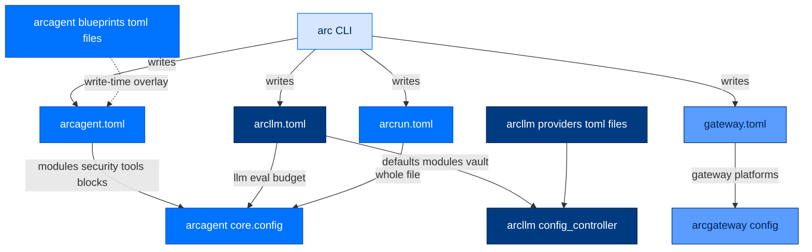
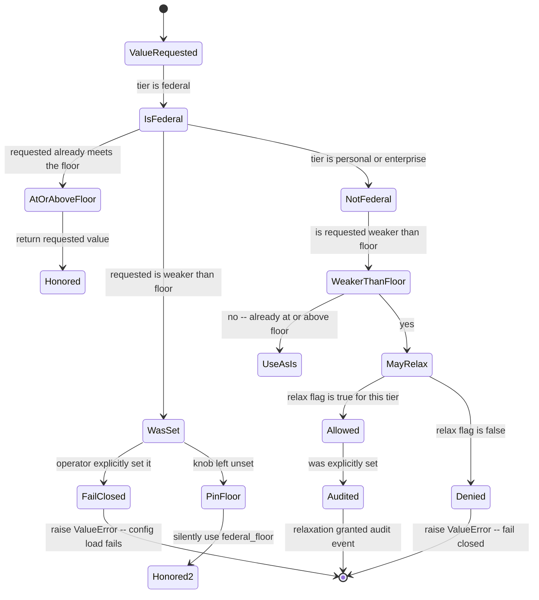
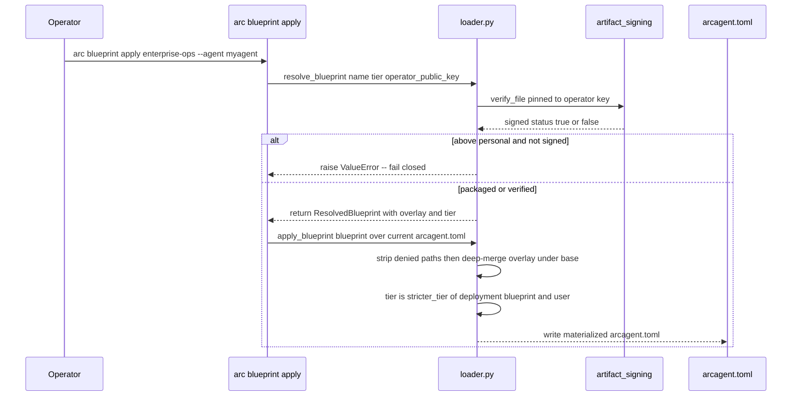

# 12. Configuration — The Whole Surface, and How It Resolves

> **Walkthrough**  ·  Understand  ·  page 12 of 14  
> **For** Anyone who needs to understand how Arc works  
> [← 11. Extension Points](11-extension-points.md)  ·  [Docs home](../README.md)  ·  [Data flows →](data-flows.md)

---

## In one breath

Arc's configuration is TOML files that get merged, in a fixed order, into one
validated object before an agent ever starts. Nothing is read lazily at
runtime — if a value is wrong, the agent refuses to boot rather than fail
halfway through a task with a confusing error. A "tier" (personal, enterprise,
federal) is not a different code path; it's a stringency floor that some
settings are allowed to relax below and others (mostly crypto) are not,
enforced by one shared table rather than scattered `if tier == "federal"`
checks. The single most common way a feature "doesn't work" in Arc is that its
module was built correctly but never turned on in the agent's config file —
Arc's docs call this "producers unwired," and this document exists partly to
stop you from losing an afternoon to it.

---

## The file set

An agent's configuration is split across **three sibling TOML files in the
same directory**, one per concern boundary (`CLAUDE.md`: "don't mix
concerns"):

| File | Owns | Declares |
|---|---|---|
| `arcagent.toml` | arcagent | `[agent]`, `[identity]`, `[vault]`, `[tools]`, `[security]`, `[capabilities]`, `[spawn]`, `[ui]`, `[team]`, `[telemetry]`, `[context]`, `[session]`, `[arcstore]`, every `[modules.<name>]` table |
| `arcllm.toml` | arcllm | `[llm]` (+ `[llm.modules.*]`), `[eval]`, `[budget]` — read by arcagent. The **same file** also carries arcllm's own global provider routing at `[defaults]`/`[modules]`/`[vault]`, read by arcllm itself, never by arcagent |
| `arcrun.toml` | arcrun (via arcagent) | The whole file is `ArcRunConfig`: `max_turns`, `tool_timeout`, `allowed_strategies`, `[sandbox]`, `approval_opt_in` |

Two more file kinds sit alongside these:

| File | Owns | Purpose |
|---|---|---|
| `arcllm/providers/*.toml` (packaged) | arcllm | One file per provider: `[provider]` connection settings + `[models.*]` metadata (context window, pricing, tool/vision support) + optional `[[endpoints]]` load-balancing pool. Never user-edited in place — override via the per-agent `arcllm.toml` |
| `arcagent/blueprints/*.toml` (packaged) + `~/.arc/state/blueprints/*.toml` (user) | arcagent | A `[blueprint]`-headed config **overlay** applied at `arc blueprint apply` / `arc init --blueprint` time — write-time, not a runtime layer (see below) |

And two config roots that are read directly by their own package, referenced
(never redefined) by everyone else:

- `arcllm/config.toml` (packaged) + `${ARC_CONFIG_DIR:-~/.arc}/config/arcllm.toml`
 (user) — arcllm's own `[defaults]`/`[modules]`/`[vault]`, loaded by
 `arcllm.config.load_global_config()`. This is the *other* reading of the
 file named `arcllm.toml` — see the precedence section for why that's safe.
- `[arcstore]` — one `ArcStoreConfig` Pydantic model, defined once in
 `packages/arcstore/src/arcstore/config.py`, imported by arcagent, arcllm,
 arcrun, and arccli rather than redeclared. `resolve_data_dir()` is the
 single function every entry point calls to find the shared operational
 store, so a direct `arc llm` call and a later `arc agent serve` agree on
 where history lives.

Three more packages carry their own narrow config, consumed where they're
used rather than folded into `arcagent.toml`:

- **arcteam** — `TeamConfig` (`root`, `max_body_bytes`, `default_poll_limit`),
 root defaults to `${ARC_CONFIG_DIR:-~/.arc}/team`.
- **arcmemory** — `MemoryConfig`, the Brain's own tiered dynamics constants
 (write/decay/confidence rates, entity-merge thresholds, consolidation
 cadence). `MemoryConfig.for_tier(tier)` returns the tier variant; the
 arcagent `[modules.memory.config]` block only *selects and bounds* the
 Brain (see below) — the dynamics live here, not in arcagent.
- **arcgateway** — `GatewayConfig`, loaded from
 `${ARC_CONFIG_DIR:-~/.arc}/config/gateway.toml`: `[gateway]` (tier, agent DID,
 runtime dir), `[security]` (`require_pairing`), `[platforms.*]` (the `web`
 adapter is schema'd in-core; every other platform block is captured
 generically via `extra="allow"` and handed as a raw dict to its adapter
 plugin), `[pairing]`. `arcgateway/agent_config.py` is a *different* thing —
 it reads the optional `[ui]` block back out of an *agent's* `arcagent.toml`
 so arcui can render fleet display hints.



---

## Precedence and merge order

Precedence is a **file-family merge**, not a single global stack. Each family
merges independently, then the three merged families compose into one
`ArcAgentConfig`; env vars override the composed result last; some CLI
commands then mutate the loaded object directly, after validation, before the
agent starts.

For `arcagent.toml` and `arcrun.toml` (`packages/arcagent/src/arcagent/core/config.py:665-745`):

1. **Packaged defaults** — in-code only. The single field with no Pydantic
 default is `[llm].model`, back-filled to
 `anthropic/claude-sonnet-4-5-20250929`.
2. **User-wide** — `${ARC_CONFIG_DIR:-~/.arc}/<file>.toml`.
3. **Per-agent** — `<agent-dir>/<file>.toml`. Deep-merges over layer 2 (dicts
 merge key-by-key; lists and scalars replace, they never concatenate).
4. **Env vars** — `ARCAGENT_<SECTION>__<KEY>` (double underscore = nesting),
 applied to the fully-composed raw dict just before Pydantic validation. A
 fixed denylist (`vault.backend`, `tools.process`, `tools.preamble`,
 `identity.key_dir`) is blocked from env override — those are trusted-admin
 paths that must come from a file a trusted operator wrote.
5. **CLI flag** (some commands only) — e.g. `arc agent run --model` sets
 `config.llm.model` directly on the already-validated `ArcAgentConfig`
 instance, after `load_config()` returns
 (`packages/arccli/src/arccli/commands/agent/run.py:47-48`). This is the
 true last word for the handful of flags that support it; it bypasses the
 env denylist entirely because it never touches TOML or `os.environ`.

`[llm]`/`[eval]`/`[budget]` are a special case: they are stripped out of
whatever `arcagent.toml` says (if anything — the template doesn't put them
there) and grafted on from the **separate** `arcllm.toml` sibling chain,
which runs the same packaged-default → user-wide → per-agent merge
independently. `arcllm.toml` is one file read by two different loaders for
two different key sets — arcagent reads `[llm]`/`[eval]`/`[budget]`;
arcllm's own `config_controller` / `config.load_global_config()` reads
`[defaults]`/`[modules]`/`[vault]` from the same file. Neither loader looks
at the other's sections, so they don't collide.

**Blueprints are not a runtime layer.** A blueprint overlay is deep-merged
*under* the target's existing values (`overlay` base, `base` override — the
user's explicit keys always win) and **written to the concrete
`arcagent.toml` file on disk** at `arc blueprint apply` / `arc init
--blueprint` time (`packages/arcagent/src/arcagent/blueprints/loader.py:12-19`,
`apply_blueprint`). There is no runtime merge hook a blueprint could live in
— `arcagent/__main__.py` flat-reads the per-agent file. So by the time
`load_config()` runs, a blueprint's effect is already baked into layer 3
above; it never shows up as a distinct layer at load time.

### Worked example: `[llm].model`


Any layer that doesn't set the key is a no-op; the last layer that *does* set
it wins. In practice almost every agent's model comes from layer 3 (the
per-agent `arcllm.toml` `arc agent create` scaffolds), with layer 5 used only
for one-off overrides on `arc agent run`/`arc agent chat`.

---

## Everything is Pydantic-validated at the boundary

`load_config()` does two-phase error handling
(`packages/arcagent/src/arcagent/core/config.py:747-773`):

1. **TOML syntax errors** — caught at parse time, reported with the
 `tomllib`-supplied line/column, wrapped as `ConfigError(code="CONFIG_SYNTAX")`.
2. **Pydantic validation errors** — the composed raw dict is fed into
 `ArcAgentConfig(**raw_data)` in one shot. Any failure (missing required
 field, wrong type, a `model_validator` raising) is caught and re-raised as
 `ConfigError(code="CONFIG_VALIDATION", message=f"Config validation failed: {exc}", details={...})`.

`ConfigError` (`packages/arcagent/src/arcagent/core/errors.py:16-45`) is
structured, not a bare string:

```text
ConfigError.__str__() -> "[CONFIG_VALIDATION] config: Config validation failed: 1 validation error for ArcAgentConfig
security
  Value error, federal tier requires custody='vault_transit' (SC-5/SC-13/IA-7) — refusing a looser/disabled value [type=value_error, ...]"
```

That message is what an explicit, weaker-than-floor value at federal tier
produces (see the tier section below) — a `model_validator` on `SecurityConfig`
raises `ValueError`, Pydantic wraps it into its own `ValidationError`, and
`load_config` wraps *that* into the `ConfigError` the CLI prints.

This is deliberate fail-fast: an agent with a broken config **never starts**.
There is no code path where a bad `[modules.tasks.config]` value is silently
ignored and discovered three turns later — the failure happens at
`arc agent build --check` / `arc agent chat` / `arc agent serve` startup,
before any tool call or LLM request.

**Module config gets a second validation pass.** `[modules.<name>].config` is
a loose `dict[str, Any]` at the `ArcAgentConfig` level (`ModuleEntry.config`)
— it isn't typed there, because arcagent's core doesn't know every module's
shape. Each module defines its own `<Name>Config(ModuleConfig)` with
`model_config = ConfigDict(extra="forbid")`
(`packages/arcagent/src/arcagent/core/module_config.py`), and the module's own
runtime constructs it from the raw dict at build time — e.g.
`TasksConfig(**(config or {}))`
(`packages/arcagent/src/arcagent/modules/tasks/_runtime.py:122`). A typo like
`[modules.tasks.config] dispatach = true` passes the first (whole-file)
validation pass silently, then fails loudly the moment that module is built,
because `extra="forbid"` rejects the unknown key.

---

## Tiers as config constraints

**Tier is stringency metadata, not a gate.** Every tier still validates,
signs, authorizes, and audits — see
[10. Security Model](10-security-model.md) for the Four Pillars. What tier
controls is *how strict* a fixed set of knobs must be, via one shared table:
`RELAXABLE_KNOBS` in `packages/arcagent/src/arcagent/tiers.py`.

The model, precisely:

- Every relaxable knob has a **federal floor** (`RelaxableKnob.federal_floor`)
 and a **direction** (`stricter_is`): `exact` (federal forces one specific
 value), `smaller` (a smaller number is stricter; unset counts as weakest),
 or `larger` (a bigger set/number is stricter).
- **Personal/enterprise may relax** a knob below the floor only if
 `relax_personal`/`relax_enterprise` is `True` for that knob.
- An **explicit weaker value at a tier that forbids relaxation fails
 closed** — `resolve_tier_floor()` raises `ValueError` rather than silently
 clamping it.
- **Unset at federal pins the floor** — if the operator never set the knob,
 federal fills in `federal_floor` rather than erroring.
- **A granted relaxation is audited** — when personal/enterprise explicitly
 sets a value weaker than the floor and that's allowed, `resolve_tier_floor`
 fires a `tier.relaxation_granted` audit event (via `audit_tier_relaxations`,
 called on the blueprint-apply path, since a Pydantic validator can't do I/O
 itself).

`RELAXABLE_KNOBS` (`packages/arcagent/src/arcagent/tiers.py:67-79`):

| Knob | Federal floor | Relax @ personal | Relax @ enterprise | Stricter is | Enforced at |
|---|---|---|---|---|---|
| `require_fips` | `True` | yes | yes | exact | `SecurityConfig` validator |
| `custody` | `"vault_transit"` | yes | yes | exact | `SecurityConfig` validator |
| `signing_algorithm` | `"ecdsa-p256"` | yes | yes | exact | `SecurityConfig` validator |
| `runaway_max_repeat` | `8` | yes | yes | smaller | `SecurityConfig` validator |
| `error_cascade_max` | `5` | yes | yes | smaller | `SecurityConfig` validator |
| `budget.max_tokens` | `500_000` | yes | yes | smaller | dispatch (budget resolver) |
| `budget.max_cost_usd` | `10.0` | yes | yes | smaller | dispatch (budget resolver) |
| `budget.max_requests` | `500` | yes | yes | smaller | dispatch (budget resolver) |
| `allow_all_imports` | `False` | yes | yes | exact | dynamic loader (import policy) |

The first five rows are enforced by `SecurityConfig._enforce_tier_crypto_floor`,
a `model_validator(mode="after")` that runs every knob through
`resolve_tier_floor` at config-load time — this is the delegating hook the
module's docstring refers to. **The last four rows are declarative reference
rows**, not enforced in `tiers.py` itself: they document the same policy for
`arc ext verify` and audit tooling, but the actual gate lives at the
dispatch-time budget resolver and the workspace-capability dynamic loader,
respectively. Don't go looking for a `budget.max_tokens` check inside
`tiers.py` — it isn't there by design (WIRE-don't-rebuild).



### Blueprints and the stringency-max tier merge

Applying a blueprint resolves tier with the same "can only get stricter"
rule, one level up. `apply_blueprint()`
(`packages/arcagent/src/arcagent/blueprints/loader.py:137-151`):

```text
floor      = stricter_tier(deployment_tier, blueprint.tier)
user_tier  = merged["security"]["tier"]  (from the base config being merged into)
effective  = stricter_tier(floor, user_tier)
merged["security"]["tier"] = effective
```

A `personal-assistant` blueprint applied on top of a `federal` deployment
cannot demote it to personal — `effective` is always the max. The reverse
(a `federal-analyst` blueprint applied to a personal deployment) *raises* the
floor, which then lets `SecurityConfig`'s own validator pin every crypto knob
on the next `load_config()`. This is "true by construction, not a second
check": the blueprint loader only ever *raises* the tier field; the existing
`SecurityConfig` validator then does the real enforcement it was already
going to do.

Two more things a blueprint cannot do, enforced at merge time regardless of
tier: it can never overwrite a **trusted-admin-only path**
(`vault.backend`, `tools.process`, `tools.preamble`, `identity.key_dir`,
`security.operator_key_dir`, `security.operator_vault_path`,
`security.notary_keystore`, `security.witness_medium_path` —
`_DENIED_OVERLAY_PATHS`), and above the personal tier its `.arcsig` signature
must verify **pinned to the deployment operator's key**, not just be
self-consistent — an unpinned signature check would let an attacker self-sign
a malicious preset with a throwaway keypair ( HIGH-1). When the
operator key can't be resolved above personal, resolution denies fail-closed.



---

## Activating a module

A module's code can be fully built, tested, and merged, and still do
**nothing at runtime** — this is Arc's most common bug class, documented
across multiple specs as "producers unwired." The `[modules.<name>]` table is
the on/off switch:

```toml
[modules.tasks]
enabled = true
priority = 100

[modules.tasks.config]
dispatch = false   # tools work; nothing self-runs until this is also true
```

Without `[modules.tasks]` present and `enabled = true`, the tasks module's
tools are never registered, its background dispatch loop never starts, and
none of its (working, tested) code ever executes for that agent. The memory
system has the same shape one level deeper: `[modules.memory] enabled = true`
turns capture on, but `distill_provider = ""` (empty) makes consolidation a
silent no-op — an agent can run for weeks writing to the raw episodic index
while never producing a single curated entity card, because nobody set the
distiller.

**Checklist for shipping a module-backed feature:**

1. **Declare it in the scaffold.** `arc agent create` renders every
 `[modules.*]` table via `render_agent_config()` /
 `_DEFAULT_CONFIG`
 (`packages/arccli/src/arccli/commands/agent/_common.py:96-569`) — a new
 module needs a block added there or it never appears in a fresh agent's
 `arcagent.toml` at all. As of this file, the scaffold ships 17 module
 blocks (`memory`, `workpad`, `user_profile`, `policy`,
 `skills`, `planning`, `pulse`, `proactive`, `scheduler`, `messaging`,
 `tasks`, `runcontrol`, `slack`, `telegram`, `web`, `voice`, `browser`),
 eight `enabled = true` by default (`memory`, `workpad`,
 `policy`, `skills`, `scheduler`, `messaging`, `tasks`, `runcontrol`) and
 nine `enabled = false` (`user_profile`, `planning`, `pulse`, `proactive`,
 `slack`, `telegram`, `web`, `voice`, `browser`) because they need external
 setup or an explicit opt-in.
2. **Declare it in already-deployed agents' tomls.** A scaffold change does
 not retroactively edit agents that already exist on disk (personal
 machines, DGX fleet, CI fixtures) — each deployed `arcagent.toml` needs
 the block added by hand or via `arc blueprint apply`.
3. **Restart.** `[modules.*]` is read once at `ArcAgent` construction; a
 running `arc agent serve` process does not hot-reload config changes.
4. **Verify, don't assume.** `arc agent build --check` lists loaded tools and
 strategies but does not currently assert "module X's feature actually
 fired" — the only real verification is exercising the feature end-to-end
 (a task assigned and watched through to completion, a memory file
 appearing on disk) or reading the module's own runtime logs.

---

## Secrets and vault resolution

**Credentials never touch the filesystem in plaintext by design intent** —
`SecurityConfig.tier` drives which sources are even permitted, per
`packages/arcagent/src/arcagent/core/vault/resolver.py:1-25`:

| Tier | Resolution order | On failure |
|---|---|---|
| `federal` | Vault only. No env, no file. | Hard error (`VaultUnreachable` propagates) |
| `enterprise` | Vault, then env var fallback | Warn + audit event, then fallback; error if both fail |
| `personal` | Vault (if configured), then env var, then `~/.arc/secrets/{name}` (0600-enforced file) | Error only if all three fail |

There are **two separate vault resolvers**, at two different layers, and both
implement this same three-tier policy independently:

- **`arcagent.core.vault`** (`resolver.py` + `protocol.py` + `cache.py` +
 `backends/`) resolves *arbitrary named secrets* for the agent's own use.
 `vault_resolver.py`'s `create_vault_resolver()` reads `[vault].backend`
 (a `"module.path:ClassName"` string, format-validated before import to
 block injection), instantiates it, and wraps it in a `CachedVaultBackend`
 keyed by `[vault].cache_ttl_seconds`.
- **`arcllm.vault.VaultResolver`** resolves *provider API keys* specifically,
 via `resolve_api_key(api_key_env, vault_path)`. Backend class references
 are restricted to an allowlist of module prefixes (`arcllm.`, `arcagent.`,
 `arcvault.`) so a TOML-supplied backend string can't import arbitrary code.
 The reference syntax for pulling a provider key from vault is the
 provider's `[provider].vault_path` field (or `[endpoints[].vault_path]` for
 a load-balanced pool endpoint) in a provider TOML — an empty `vault_path`
 skips vault and goes straight to `api_key_env`.

Both resolvers are TTL-cached (`cache_ttl_seconds`, default 300s) so a live
vault isn't hit on every single secret read — a real availability concern
given federal treats the vault as mandatory.

---

## The CLI surface for config

| Command | Effect |
|---|---|
| `arc agent create <name> [--tier T] [--model M]` | Scaffolds all three sibling files + workspace + a signed calculator capability + mints the agent's DID + best-effort registers with arcteam |
| `arc agent build [path]` | Renders the full config surface. If `arcagent.toml` **doesn't exist yet**, writes it (nothing to lose). If it **already exists**, refuses and exits 1 unless `--force` is given |
| `arc agent build [path] --force` | ⚠️ **Regenerates `arcagent.toml` from the current template.** DID and agent name are preserved; every other hand-edited value (custom module tuning, a temperature override you set outside `arcllm.toml`, anything) is replaced with the template default. `arcllm.toml`/`arcrun.toml` are never touched either way |
| `arc agent build [path] --check` | **Validate only — writes nothing.** Confirms `arcagent.toml` parses, checks for an API key matching the configured provider, lists discovered tools and available strategies |

> **Always reach for `--check` first.** The safe way to "run build" on an
> agent you care about is `arc agent build <path> --check`. Only add
> `--force` when you deliberately want the full config surface regenerated
> from defaults — treat it the same as you would `git reset --hard`: a
> destructive operation you confirm, not one you run out of habit.

`arc agent create --tier` sets the tier for **every subsystem at once** —
`[security]`, memory, policy, skills, web, voice, and browser all
render from the same `tier` template variable
(`render_agent_config(..., tier=tier)`,
`packages/arccli/src/arccli/commands/agent/_common.py:575-589`). A config
that's federal in `[security]` but personal in `[modules.web]` is treated as
a hole, not a preference — the renderer refuses an unknown tier string
outright (`ValueError`) rather than partially applying one.

---

## Troubleshooting table

| Symptom | Likely cause | Check |
|---|---|---|
| Feature does nothing; no errors | Module not declared or `enabled = false` | `[modules.<name>].enabled` in the agent's `arcagent.toml` |
| Agent won't start at federal tier | An explicit config value is weaker than the federal floor | The `RELAXABLE_KNOBS` row for the failing knob (`[security]` or `[budget]`); the `ConfigError` message names the exact field |
| No memory files appearing on disk | `brain` is set but consolidation never fires | `[modules.memory.config].distill_provider` — empty string means consolidation is a permanent no-op |
| Agent missing from the arcui dashboard | Never registered with arcteam, or arcui hasn't re-scanned | `arc team register <name>` (or check `_try_auto_register` didn't fail silently at `create` time), then restart arcui |
| Provider auth failure at startup | API key not resolvable via any configured source | `[llm].model`'s provider prefix → matching `<PROVIDER>_API_KEY` env var, or the provider's `vault_path` in its provider TOML |
| Dedup / entity-merge silently doing nothing | Embedder not installed — falls back to no-op | `embed_backend` in `[modules.memory.config]`; confirm `sentence-transformers` is actually installed in the venv, not just configured |
| Typo'd module config key doesn't error at `--check` but breaks at runtime | Module config is validated in two passes — first pass is a loose dict | Re-check spelling against the module's own `<Name>Config` model (`extra="forbid"` catches it the moment the module builds) |
| `arc agent build` wiped my hand edits | Ran with `--force` (or an older interactive-mode build, pre-dating the current guard) on an agent whose config you'd customized | There's no undo short of version control — always `--check` first, `--force` only when a full reset is intended |

---

## Where to look in the code

| Path | What lives there |
|---|---|
| `packages/arcagent/src/arcagent/core/config.py` | `ArcAgentConfig` + all nested section models; the 3-file merge/compose/env-override pipeline |
| `packages/arcagent/src/arcagent/tiers.py` | `RELAXABLE_KNOBS`, `resolve_tier_floor`, `tier_rank`, `stricter_tier` |
| `packages/arcagent/src/arcagent/core/tier.py` | The `Tier` enum + `PolicyContext` shared vocabulary |
| `packages/arcagent/src/arcagent/core/module_config.py` | Base `ModuleConfig` (`extra="forbid"`) every module's own config extends |
| `packages/arcagent/src/arcagent/blueprints/loader.py` | Blueprint discovery, signature verification, stringency-max merge, TOML serialization |
| `packages/arcagent/src/arcagent/core/vault_resolver.py` + `core/vault/` | Arbitrary-secret vault resolver + tier-policy resolver + cache |
| `packages/arcllm/src/arcllm/config.py` | arcllm's own global config + provider TOML loaders |
| `packages/arcllm/src/arcllm/config_controller.py` | Runtime-patchable `ConfigSnapshot` (model/temperature/budgets), audited on change |
| `packages/arcllm/src/arcllm/vault.py` | Provider API-key vault resolver |
| `packages/arcstore/src/arcstore/config.py` | The one canonical `[arcstore]` schema + `resolve_data_dir()` |
| `packages/arcteam/src/arcteam/config.py` | `TeamConfig` |
| `packages/arcmemory/src/arcmemory/config.py` | `MemoryConfig` tiered dynamics constants |
| `packages/arcgateway/src/arcgateway/config.py` | `GatewayConfig` (`gateway.toml`) |
| `packages/arcgateway/src/arcgateway/agent_config.py` | Reads `[ui]` back out of an agent's `arcagent.toml` for arcui |
| `packages/arccli/src/arccli/commands/agent/_common.py` | The rendered `arcagent.toml`/`arcllm.toml`/`arcrun.toml` templates (`_DEFAULT_CONFIG` etc.) |
| `packages/arccli/src/arccli/commands/agent/create.py`, `build.py` | `arc agent create` / `arc agent build` implementations |
| `docs/config-reference.md` | Key-by-key reference for recently shipped module config (tasks, memory, policy, eval) — **do not duplicate here; link to it** |

If you're adding a new config knob: add the field to the right Pydantic model
above (not a new ad hoc dict), add it — commented, at its default — to the
`_DEFAULT_CONFIG` template in `_common.py` so new agents document it, and if
it's tier-sensitive, add a row to `RELAXABLE_KNOBS` rather than hand-rolling
an `if tier == "federal"` check.
